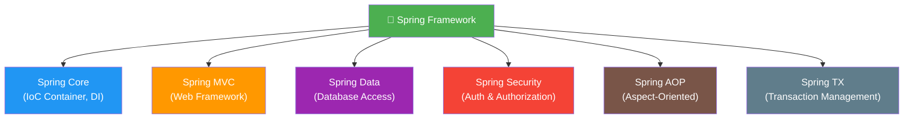
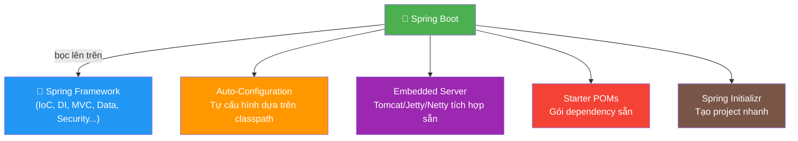
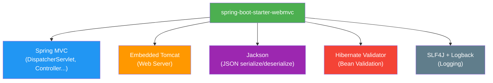
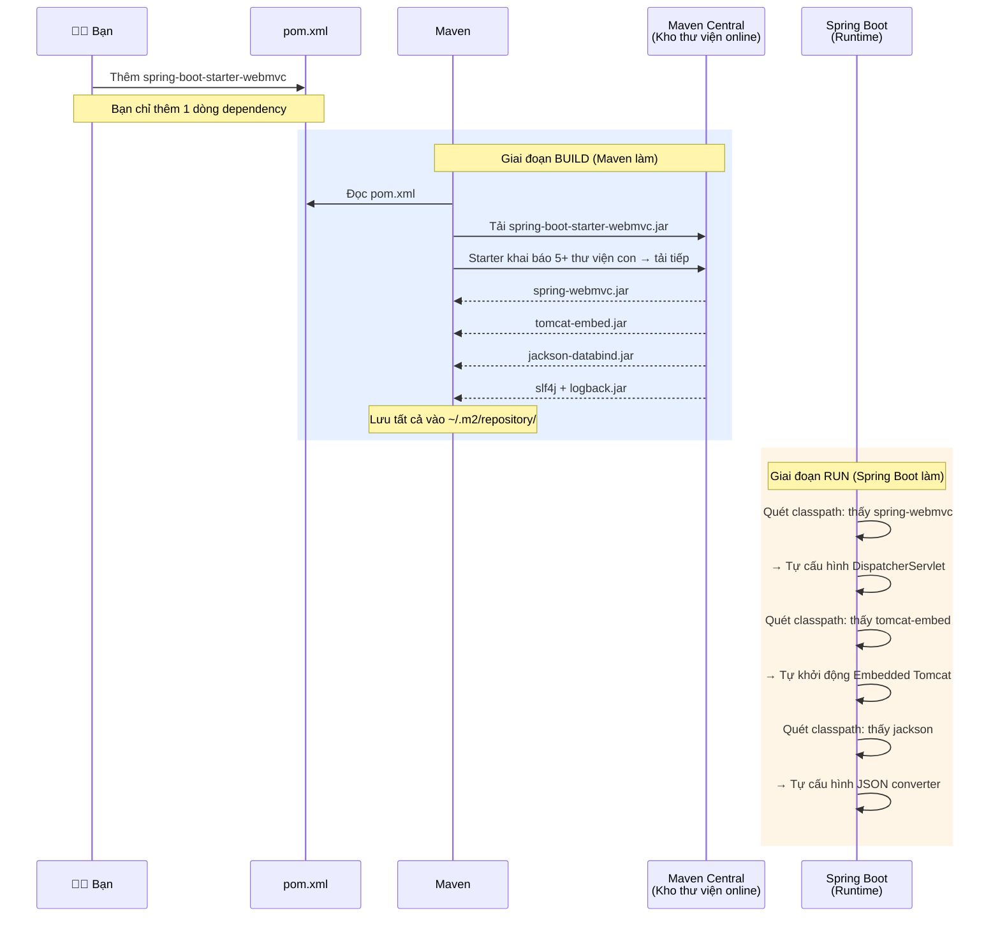
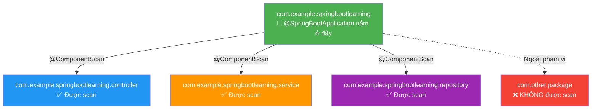
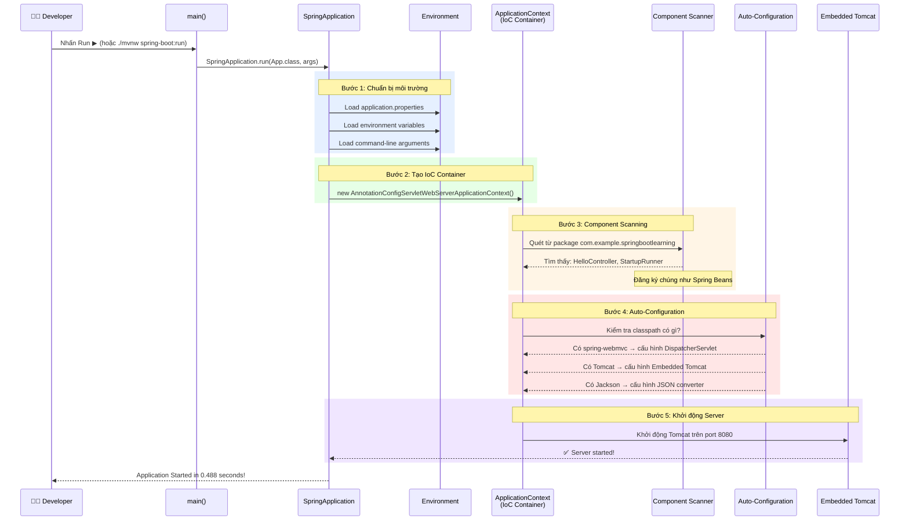
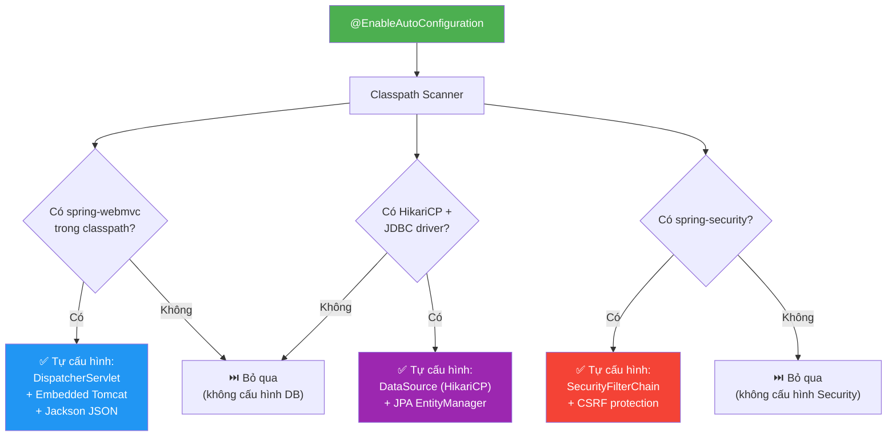
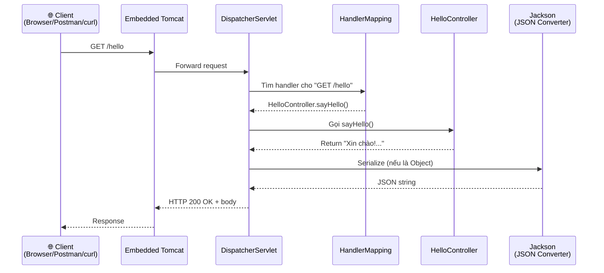

# 📘 BÀI 1: Cài Đặt Môi Trường, Tạo Dự Án & Khám Phá Cấu Trúc

> **Giai đoạn:** 🟢 GĐ 1 — Nền Tảng & Khởi Động
> **Thời lượng ước tính:** 2-3 giờ
> **Yêu cầu tiên quyết:** Java Core cơ bản

---

## 🎯 Mục tiêu bài học

Sau khi hoàn thành bài này, bạn sẽ:

- [x] Kiểm tra và xác nhận môi trường phát triển (JDK, Maven, IDE)
- [ ] Hiểu mối quan hệ giữa Spring Framework và Spring Boot
- [ ] Phân biệt Module, Thư viện (Library), và Dependency
- [ ] Tạo project Spring Boot đầu tiên bằng Spring Initializr
- [ ] Hiểu cơ chế Starter POM và Transitive Dependencies (Maven)
- [ ] Hiểu cấu trúc thư mục chuẩn của một dự án Spring Boot
- [ ] Hiểu luồng khởi động (Bootstrap Flow) của ứng dụng
- [ ] Hiểu annotation `@SpringBootApplication` và cơ chế Auto-Configuration
- [ ] Chạy thành công ứng dụng và truy cập API đầu tiên

---

## PHẦN 1: KIỂM TRA MÔI TRƯỜNG

### ✅ Kết quả kiểm tra môi trường của bạn

| Công cụ | Phiên bản cài đặt | Yêu cầu tối thiểu | Trạng thái |
|:---|:---|:---|:---:|
| **JDK** | OpenJDK **21.0.10** (Homebrew) | JDK 17+ | ✅ |
| **Maven** | Apache Maven **3.9.11** | Maven 3.9+ | ✅ |
| **IntelliJ IDEA** | Đã cài | Community/Ultimate | ✅ |
| **Postman** | Đã cài | Bất kỳ | ✅ |
| **Git** | Đã cài | Bất kỳ | ✅ |
| **Docker Desktop** | Đã cài | Bất kỳ (dùng từ GĐ 3) | ✅ |

> [!TIP]
> **Tại sao JDK 21 là lựa chọn tốt?** JDK 21 là phiên bản **LTS (Long-Term Support)** mới nhất, bổ sung nhiều tính năng mạnh mẽ: Virtual Threads, Pattern Matching for `switch`, Record Patterns, Sequenced Collections. Spring Boot 4.x yêu cầu tối thiểu JDK 17, nhưng JDK 21 sẽ giúp bạn tận dụng các tính năng Java mới nhất.

---

## PHẦN 2: SPRING FRAMEWORK vs SPRING BOOT — HIỂU ĐÚNG MỐI QUAN HỆ

Trước khi bắt đầu code, hãy hiểu rõ **Spring Boot là gì** và **nó khác Spring Framework thế nào**.

### 2.1. Spring Framework là gì?

**Spring Framework** là một framework Java toàn diện, cung cấp cơ sở hạ tầng cho phát triển ứng dụng enterprise. Nó ra đời năm 2003 bởi Rod Johnson, với triết lý **"làm cho Java Enterprise đơn giản hơn"**.

Các thành phần cốt lõi:



### 2.2. Spring Boot là gì?

**Spring Boot** là một **lớp bọc (wrapper)** trên Spring Framework, giúp bạn **bắt đầu nhanh** mà không cần cấu hình phức tạp. Nó **KHÔNG phải** framework riêng biệt, mà là cách **dùng Spring Framework thuận tiện hơn**.

### 2.3. So sánh: Spring Framework vs Spring Boot

| Tiêu chí | Spring Framework (thuần) | Spring Boot |
|:---|:---|:---|
| **Cấu hình** | Nhiều XML hoặc Java Config phức tạp | Auto-Configuration — tự cấu hình dựa trên classpath |
| **Server** | Phải cài Tomcat/Jetty riêng, deploy file WAR | Embedded Tomcat — chạy bằng `java -jar` |
| **Dependencies** | Phải tự chọn từng thư viện, quản lý version | Starter POMs — gói sẵn các thư viện cần thiết |
| **Khởi tạo project** | Tạo thủ công, cấu hình nhiều file | Spring Initializr — tạo trong 30 giây |
| **Thời gian setup** | 30 phút – 1 giờ | 2-5 phút |
| **Sử dụng trong production** | Có (nhưng ít dùng thuần nữa) | ✅ Tiêu chuẩn hiện tại |



> [!IMPORTANT]
> **Kết luận:** Spring Boot **KHÔNG thay thế** Spring Framework. Spring Boot là **lớp tiện ích** giúp bạn dùng Spring Framework dễ hơn. Khi bạn viết `@Autowired`, `@Service`, `@Repository`... đó là Spring Framework. Khi Spring Boot tự cấu hình DataSource, tự nhúng Tomcat — đó là phần giá trị Spring Boot thêm vào.

### 2.4. Phân biệt: Module vs Thư viện (Library) vs Dependency

Các thành phần của Spring Framework (Spring Core, Spring MVC, Spring Data...) thường bị gọi nhầm là "thư viện". Hãy phân biệt chính xác:

| Thuật ngữ | Định nghĩa | Ví dụ |
|:---|:---|:---|
| **Module** | Một **phần/khối chức năng** trong một framework lớn. Có thể dùng riêng lẻ hoặc kết hợp | Spring Core, Spring MVC, Spring Data, Spring Security |
| **Thư viện (Library)** | Một **gói code** đã đóng gói sẵn (file `.jar`) mà bạn tải về dùng. Không áp đặt kiến trúc — bạn gọi nó khi cần | Jackson, Lombok, Guava, Apache Commons |
| **Framework** | Một **bộ khung** cung cấp kiến trúc + quy tắc. Framework gọi code của bạn ("Inversion of Control") | Spring Framework, .NET, Django |

> Mỗi module của Spring Framework khi đóng gói thành file `.jar` thì nó **cũng là** một thư viện. Nhưng gọi là **module** chính xác hơn vì nó là **một phần** của hệ sinh thái Spring lớn hơn.

**Tương tự thực tế:** Hãy nghĩ Spring Framework như một **chiếc xe hơi**:

| Module | Ví von | Giải thích |
|:---|:---|:---|
| **Spring Core** (IoC/DI) | 🔧 Động cơ | Bắt buộc — mọi thứ phụ thuộc vào nó |
| **Spring MVC** | 🚗 Hệ thống lái | Xử lý web request, điều hướng |
| **Spring Data** | ⛽ Hệ thống nhiên liệu | Truy cập database ("nhiên liệu" cho ứng dụng) |
| **Spring Security** | 🔒 Hệ thống khóa & airbag | Bảo mật, xác thực |

Bạn có thể lắp động cơ + hệ thống lái mà **không cần** airbag. Mỗi phần có thể dùng độc lập, nhưng chúng **đều thuộc cùng chiếc xe Spring**.

#### Dependency — Từ có 2 nghĩa

**"Dependency"** dịch nôm na là **"sự phụ thuộc"**. Trong lập trình, nó có **2 nghĩa khác nhau** tùy ngữ cảnh:

| Ngữ cảnh | Nghĩa | Ví dụ |
|:---|:---|:---|
| **Trong Maven/Gradle** (pom.xml) | Thư viện/module mà project **cần để chạy**. Maven tải file `.jar` về cho bạn | `spring-boot-starter-webmvc`, `jackson-databind` |
| **Trong Spring DI** (code Java) | Đối tượng (bean) mà một class **cần để hoạt động** | `UserService` cần `UserRepository` để truy cập DB |

```java
// === Nghĩa 1: Dependency trong pom.xml ===
// "Project của tôi CẦN (phụ thuộc vào) thư viện này để chạy"
<dependency>
    <groupId>org.springframework.boot</groupId>
    <artifactId>spring-boot-starter-webmvc</artifactId>
</dependency>

// === Nghĩa 2: Dependency trong Spring DI (sẽ học kỹ ở Bài 2) ===
// UserRepository là "dependency" của UserService
@Service
public class UserService {
    private final UserRepository userRepository; // ← dependency

    public UserService(UserRepository userRepository) { // ← inject dependency
        this.userRepository = userRepository;
    }
}
```

> [!TIP]
> **Mẹo ghi nhớ:** Bất cứ thứ gì mà code bạn **cần** để chạy được thì đều là dependency — dù đó là file `.jar` trong Maven hay một object trong Spring. Khi ai đó nói "thêm dependency" thì tuỳ ngữ cảnh để hiểu họ muốn nói nghĩa nào.

---

## PHẦN 3: TẠO PROJECT SPRING BOOT

### 3.1. Spring Initializr

Có 2 cách tạo project:

| Cách | Ưu điểm | Khi nào dùng |
|:---|:---|:---|
| **Web UI** ([start.spring.io](https://start.spring.io)) | Trực quan, dễ chọn dependency | Lần đầu, muốn xem danh sách dependency |
| **cURL / Command line** | Nhanh, tự động hóa được | Khi đã quen |

Project của bạn đã được tạo bằng Spring Initializr với các tham số sau:

| Tham số | Giá trị | Giải thích |
|:---|:---|:---|
| **Project** | Maven | Build tool quản lý dependency (Gradle là lựa chọn khác) |
| **Language** | Java | Ngôn ngữ lập trình |
| **Spring Boot** | 4.0.8 | Phiên bản ổn định mới nhất |
| **Group** | `com.example` | Tổ chức/công ty (đảo ngược domain) |
| **Artifact** | `springboot-learning` | Tên project |
| **Packaging** | Jar | Đóng gói thành file `.jar` (có embedded Tomcat) |
| **Java** | 21 | Phiên bản JDK |
| **Dependencies** | Spring Web | Starter cho web app (Spring MVC + Tomcat) |

> [!NOTE]
> **JAR vs WAR:**
> - **JAR** (Java Archive): Đóng gói app + embedded server → chạy bằng `java -jar app.jar`. ✅ **Dùng cho Spring Boot.**
> - **WAR** (Web Application Archive): Cần deploy lên server riêng (Tomcat, WildFly). ⚠️ Cách cũ, ít dùng.

### 3.2. Phân tích file `pom.xml`

File `pom.xml` là **"tim"** của Maven project — nơi khai báo dependencies, plugins, và cấu hình build.

Xem file project: [`pom.xml`](file:///Users/vovantu/HTML_CSS/JAVA%20/springboot-learning/pom.xml)

```xml
<!-- ① Parent POM — Kế thừa cấu hình từ Spring Boot -->
<parent>
    <groupId>org.springframework.boot</groupId>
    <artifactId>spring-boot-starter-parent</artifactId>
    <version>4.0.8</version>
</parent>
```

**Giải thích `spring-boot-starter-parent`:**

| Vai trò | Chi tiết |
|:---|:---|
| **Quản lý phiên bản** | Định nghĩa sẵn version cho hàng trăm thư viện (Jackson, Hibernate, Tomcat...) — bạn không cần chỉ định `<version>` cho từng dependency |
| **Plugin mặc định** | Cấu hình sẵn `maven-compiler-plugin`, `spring-boot-maven-plugin` |
| **Encoding** | Set UTF-8 mặc định |
| **Java version** | Đọc từ `<java.version>` property |

```xml
<!-- ② Properties — Cấu hình Java version -->
<properties>
    <java.version>21</java.version>
</properties>
```

```xml
<!-- ③ Dependencies — Thư viện cần dùng -->
<dependencies>
    <!-- spring-boot-starter-webmvc = Spring MVC + Embedded Tomcat + Jackson -->
    <dependency>
        <groupId>org.springframework.boot</groupId>
        <artifactId>spring-boot-starter-webmvc</artifactId>
    </dependency>
    <!-- Không cần <version> vì parent POM đã quản lý! -->
</dependencies>
```

**`spring-boot-starter-webmvc` bao gồm những gì?**



> [!TIP]
> **Starter POMs** là một trong những tính năng hay nhất của Spring Boot. Thay vì tự thêm 10+ thư viện riêng lẻ, bạn chỉ cần **1 starter** và Spring Boot lo phần còn lại. Mỗi starter đặt tên theo pattern: `spring-boot-starter-{tên module}`.

### 3.3. Starter POM hoạt động thế nào? — Phân biệt vai trò Maven vs Spring Boot

Một câu hỏi thường gặp: *"Spring Boot tải các thư viện con bên trong Starter à?"*

**Câu trả lời: Không phải Spring Boot tải — mà là Maven tải.** Đây là phân biệt quan trọng:



#### Vai trò của từng "người":

| Ai | Làm gì | Khi nào |
|:---|:---|:---|
| **Spring Boot team** | **Chọn sẵn** danh sách thư viện con trong Starter, đảm bảo chúng **tương thích version** với nhau | Lúc họ phát hành Spring Boot |
| **Maven** | **Tải** tất cả file `.jar` từ Maven Central về máy bạn (vào thư mục `~/.m2/repository/`) | Lúc bạn **build / chạy** project |
| **Spring Boot (runtime)** | **Tự cấu hình** các thư viện đó khi ứng dụng chạy (Auto-Configuration) | Lúc bạn **chạy** ứng dụng |

#### Starter POM = "Danh sách mua sắm"

**Starter POM bản thân KHÔNG chứa code.** Nó chỉ là một file `pom.xml` khai báo danh sách dependency con:

```
spring-boot-starter-webmvc    ← "Danh sách mua sắm" cho Web MVC
│                                (bản thân không có code)
│
├── spring-webmvc              ← Spring MVC framework
├── spring-web                 ← HTTP handling cơ bản
├── tomcat-embed-core          ← Embedded Tomcat server
├── jackson-databind           ← Chuyển Object ↔ JSON
├── hibernate-validator        ← Validation (@NotNull, @Email...)
└── logback + slf4j            ← Logging
```

#### Transitive Dependencies (Dependency bắc cầu)

Cơ chế Maven tự tải thư viện con gọi là **Transitive Dependencies**:

```
Bạn khai báo A  →  A khai báo cần B  →  B khai báo cần C
Maven sẽ tải: A + B + C (tự động, bạn không cần khai báo B và C)
```

Ví dụ cụ thể:

```
Bạn khai báo: spring-boot-starter-webmvc
  → starter khai báo cần: spring-webmvc
    → spring-webmvc khai báo cần: spring-core, spring-beans, spring-context
Maven tải TẤT CẢ về tự động!
```

> [!IMPORTANT]
> **Tóm lại:** Nếu không có Starter, bạn phải tự thêm từng thư viện một và tự kiểm tra version tương thích — rất mệt. Starter giúp bạn **thêm 1 dòng, được ~30 thư viện đã test tương thích sẵn**. Maven lo việc tải, Spring Boot lo việc cấu hình.

### 3.4. Maven Wrapper (`mvnw`)

Trong project có 2 file đặc biệt:
- `mvnw` (Linux/Mac) và `mvnw.cmd` (Windows)

| Câu hỏi | Trả lời |
|:---|:---|
| **Maven Wrapper là gì?** | Một script cho phép chạy Maven **mà không cần cài Maven trên máy** |
| **Tại sao cần?** | Đảm bảo team dùng cùng 1 version Maven, tránh lỗi "works on my machine" |
| **Cách dùng?** | `./mvnw clean install` thay vì `mvn clean install` |
| **Bạn có cần dùng?** | Bạn đã cài Maven 3.9.11 rồi, dùng `mvn` trực tiếp cũng được |

---

## PHẦN 4: CẤU TRÚC THƯ MỤC DỰ ÁN

### 4.1. Cây thư mục chuẩn

Project Spring Boot của bạn: [`springboot-learning/`](file:///Users/vovantu/HTML_CSS/JAVA%20/springboot-learning/)

```
springboot-learning/
├── .mvn/wrapper/                          ← Maven Wrapper config
├── src/
│   ├── main/
│   │   ├── java/
│   │   │   └── com/example/springbootlearning/
│   │   │       ├── SpringbootLearningApplication.java    ← 🔑 Entry point
│   │   │       ├── controller/
│   │   │       │   └── HelloController.java              ← 🌐 REST Controller
│   │   │       └── runner/
│   │   │           └── StartupRunner.java                ← 🏃 CommandLineRunner
│   │   └── resources/
│   │       ├── application.properties                    ← ⚙️ Cấu hình
│   │       ├── static/                                   ← 📁 File tĩnh (CSS, JS, images)
│   │       └── templates/                                ← 📄 HTML templates (Thymeleaf)
│   └── test/
│       └── java/
│           └── com/example/springbootlearning/
│               └── SpringbootLearningApplicationTests.java  ← 🧪 Test
├── pom.xml                                                ← 📦 Maven config
├── mvnw / mvnw.cmd                                        ← 🔧 Maven Wrapper
└── HELP.md                                                ← 📚 Tài liệu tham khảo
```

### 4.2. Quy tắc quan trọng về package



> [!CAUTION]
> **Quy tắc vàng:** Class `@SpringBootApplication` (entry point) phải nằm ở **package gốc** (root package). Spring Boot sẽ tự động scan **package đó và tất cả sub-packages**. Nếu bạn đặt Controller ở package bên ngoài → Spring Boot sẽ **KHÔNG tìm thấy** nó!

---

## PHẦN 5: LUỒNG KHỞI ĐỘNG (BOOTSTRAP FLOW)

Đây là phần quan trọng nhất của bài — hiểu **chuyện gì xảy ra** khi bạn nhấn nút Run.

### 5.1. Entry Point — `main()` method

Xem file: [`SpringbootLearningApplication.java`](file:///Users/vovantu/HTML_CSS/JAVA%20/springboot-learning/src/main/java/com/example/springbootlearning/SpringbootLearningApplication.java)

```java
@SpringBootApplication  // ← "3 trong 1" — giải thích bên dưới
public class SpringbootLearningApplication {

    public static void main(String[] args) {
        // Đây là dòng code khởi động TOÀN BỘ ứng dụng Spring Boot
        SpringApplication.run(SpringbootLearningApplication.class, args);
    }
}
```

`SpringApplication.run()` là method "phép thuật" — nó thực hiện **hàng chục bước** bên trong. Dưới đây là luồng chi tiết:

### 5.2. Sơ đồ Bootstrap Flow chi tiết



### 5.3. Giải thích từng bước

| Bước | Tên | Chuyện gì xảy ra | Kết quả |
|:---:|:---|:---|:---|
| 1 | **Chuẩn bị Environment** | Đọc `application.properties`, biến môi trường, args | Biết port=8080, app.name, log level... |
| 2 | **Tạo ApplicationContext** | Khởi tạo IoC Container — "bộ não" quản lý beans | Container rỗng, sẵn sàng nhận beans |
| 3 | **Component Scanning** | Quét package gốc + sub-packages, tìm `@Component`, `@RestController`, `@Service`... | Đăng ký `HelloController`, `StartupRunner` làm beans |
| 4 | **Auto-Configuration** | Kiểm tra classpath: thấy Tomcat jar → cấu hình server, thấy Jackson jar → cấu hình JSON | Tự động cấu hình **hàng chục** thành phần |
| 5 | **Khởi động Server** | Start Embedded Tomcat, bind port 8080, đăng ký `DispatcherServlet` | Ứng dụng sẵn sàng nhận HTTP request |

### 5.4. Minh chứng từ log khởi động

Log dưới đây là output thực tế khi bạn chạy project:

```
Starting SpringbootLearningApplication using Java 21.0.10    ← Bước 1: Bắt đầu
Running with Spring Boot v4.0.8, Spring v7.0.9               ← Thông tin version
No active profile set, falling back to default profile        ← Chưa set profile (Bài 21)
Tomcat initialized with port 8080 (http)                      ← Bước 5: Tomcat khởi động
Starting service [Tomcat]                                     ← Embedded Tomcat!
Root WebApplicationContext: initialization completed in 228ms ← Bước 2+3: IoC Container ready
Tomcat started on port 8080                                   ← ✅ Sẵn sàng!
Started SpringbootLearningApplication in 0.488 seconds        ← 🚀 Dưới 0.5 giây!
```

> [!NOTE]
> **0.488 giây** — Spring Boot khởi động cực nhanh. Thời gian này sẽ tăng lên khi bạn thêm nhiều dependencies (JPA, Security...) nhưng thường vẫn dưới 5 giây cho project trung bình.

---

## PHẦN 6: `@SpringBootApplication` — ANNOTATION "3 TRONG 1"

### 6.1. Phân tích chi tiết

`@SpringBootApplication` thực chất là **meta-annotation** — tổ hợp 3 annotation khác:

```java
// Đây là source code thực sự của @SpringBootApplication
@SpringBootConfiguration   // ① 
@EnableAutoConfiguration   // ②
@ComponentScan             // ③
public @interface SpringBootApplication { }
```

| # | Annotation | Vai trò | Ví dụ cụ thể |
|:---:|:---|:---|:---|
| ① | `@SpringBootConfiguration` | Đánh dấu class này là **nguồn cấu hình** (= `@Configuration`) | Cho phép khai báo `@Bean` methods trong class này |
| ② | `@EnableAutoConfiguration` | Kích hoạt **Auto-Configuration** — Spring Boot tự cấu hình dựa trên các JAR trong classpath | Thấy `spring-webmvc` → tự tạo `DispatcherServlet`; Thấy `tomcat-embed` → tự start Tomcat |
| ③ | `@ComponentScan` | Quét **package hiện tại + sub-packages** để tìm và đăng ký Beans | Tìm `@RestController`, `@Service`, `@Repository`, `@Component` |

### 6.2. Auto-Configuration hoạt động thế nào?

Đây là câu hỏi phỏng vấn rất phổ biến.



**Nguyên tắc:** Spring Boot kiểm tra **bạn đã thêm thư viện nào** vào `pom.xml`. Nếu có thư viện X → nó sẽ tự cấu hình các bean liên quan. Nếu không có → bỏ qua.

> **Hiện tại** bạn chỉ có `spring-boot-starter-webmvc` → Spring Boot chỉ cấu hình Web (Tomcat + MVC + Jackson). Khi bạn thêm `spring-boot-starter-data-jpa` ở Bài 9 → nó sẽ tự cấu hình thêm DataSource, EntityManager, Transaction Manager.

---

## PHẦN 7: CODE THỰC HÀNH

### 7.1. File `HelloController.java`

Xem file: [`HelloController.java`](file:///Users/vovantu/HTML_CSS/JAVA%20/springboot-learning/src/main/java/com/example/springbootlearning/controller/HelloController.java)

Controller này có **4 API endpoints** minh họa các khái niệm cơ bản:

| # | URL | Annotation | Kiểu return | Kiến thức |
|:---:|:---|:---|:---|:---|
| 1 | `GET /hello` | `@GetMapping` | `String` | Trả về text đơn giản |
| 2 | `GET /info` | `@GetMapping` | `Map<String, Object>` | Jackson tự chuyển Map → JSON |
| 3 | `GET /greet?name=X` | `@RequestParam` | `Map<String, String>` | Nhận query parameter |
| 4 | `GET /hello/{name}` | `@PathVariable` | `String` | Nhận path parameter |

### 7.2. Luồng xử lý Request

Khi bạn gọi `GET http://localhost:8080/hello`, đây là những gì xảy ra bên trong:



### 7.3. `@RequestParam` vs `@PathVariable`

Hai annotation này thường gây nhầm lẫn. Đây là so sánh chi tiết:

| Tiêu chí | `@RequestParam` | `@PathVariable` |
|:---|:---|:---|
| **Vị trí trong URL** | Sau dấu `?` (query string) | Trong đường dẫn URL |
| **Ví dụ URL** | `/greet?name=Nguyen&age=22` | `/users/123/orders/456` |
| **Có thể optional?** | ✅ Có (`defaultValue`, `required=false`) | ❌ Thường bắt buộc |
| **Khi nào dùng?** | Lọc, tìm kiếm, phân trang | Định danh tài nguyên (ID) |
| **Ví dụ thực tế** | `GET /products?category=phone&sort=price` | `GET /products/42` |

### 7.4. File `StartupRunner.java`

Xem file: [`StartupRunner.java`](file:///Users/vovantu/HTML_CSS/JAVA%20/springboot-learning/src/main/java/com/example/springbootlearning/runner/StartupRunner.java)

| Khái niệm | Giải thích |
|:---|:---|
| `CommandLineRunner` | Interface có 1 method `run()` — được gọi **sau khi** Spring Boot khởi động xong |
| `@Component` | Đánh dấu class là Spring Bean → Spring tự tạo instance và quản lý |
| **Use case** | Seed data, kiểm tra kết nối, log thông tin startup |

### 7.5. File `application.properties`

Xem file: [`application.properties`](file:///Users/vovantu/HTML_CSS/JAVA%20/springboot-learning/src/main/resources/application.properties)

```properties
spring.application.name=springboot-learning   # Tên ứng dụng
server.port=8080                              # Port (mặc định 8080)
logging.level.root=INFO                       # Log level cho toàn bộ
logging.level.com.example.springbootlearning=DEBUG  # Log chi tiết cho package
```

**Logging levels** (từ chi tiết → ít chi tiết):

| Level | Khi nào dùng | Ví dụ |
|:---|:---|:---|
| `TRACE` | Debug cực chi tiết | Framework internals |
| `DEBUG` | Thông tin debug | "Processing request to /hello" |
| `INFO` | Thông tin hoạt động bình thường | "Application started" |
| `WARN` | Cảnh báo (chưa lỗi) | "Connection pool running low" |
| `ERROR` | Lỗi xảy ra | "Failed to connect to database" |

---

## PHẦN 8: KẾT QUẢ CHẠY THỰC TẾ

Project đã được chạy và test thành công:

### Test 1: `GET /hello`
```
$ curl http://localhost:8080/hello

Xin chào! Đây là API đầu tiên của tôi với Spring Boot!
```

### Test 2: `GET /info` (JSON response)
```json
{
    "app": "Spring Boot Learning",
    "author": "Sinh viên IT năm 4",
    "javaVersion": "21.0.10",
    "springBootVersion": "4.0.8",
    "version": "1.0",
    "timestamp": "2026-09-22T22:38:15.221293"
}
```

### Test 3: `GET /greet?name=VoVanTu` (Query Parameter)
```json
{
    "tip": "Thử thay đổi ?name=TenCuaBan trên URL",
    "message": "Xin chào, VoVanTu!"
}
```

### Test 4: `GET /hello/VoVanTu` (Path Variable)
```
Xin chào, VoVanTu! Chào mừng bạn đến với Spring Boot!
```

---

## PHẦN 9: BÀI TẬP TỰ LUYỆN

### Bài tập 1: Thêm API mới ⭐
Thêm các endpoint sau vào `HelloController`:

| # | Method | URL | Mô tả | Gợi ý |
|:---|:---|:---|:---|:---|
| 1 | `GET` | `/time` | Trả về thời gian hiện tại | Dùng `LocalDateTime.now()` |
| 2 | `GET` | `/calculate?a=10&b=5&op=add` | Máy tính đơn giản (+, -, *, /) | Dùng `@RequestParam`, `switch` |
| 3 | `GET` | `/repeat/{word}/{times}` | Lặp lại từ N lần | 2 `@PathVariable` |

### Bài tập 2: Thay đổi port ⭐
Trong `application.properties`, đổi `server.port=9090`. Chạy lại app và test `http://localhost:9090/hello`.

### Bài tập 3: Tạo thêm Controller ⭐⭐
Tạo file `MathController.java` trong package `controller` với các API toán học. Xác nhận rằng Spring Boot tự tìm thấy controller mới nhờ `@ComponentScan`.

---

## PHẦN 10: CÂU HỎI ÔN TẬP (PHỎNG VẤN)

| # | Câu hỏi | Gợi ý trả lời |
|:---:|:---|:---|
| 1 | Spring Boot khác Spring Framework thế nào? | Spring Boot là **lớp tiện ích** bọc trên Spring Framework, thêm Auto-Config, Embedded Server, Starter POMs |
| 2 | `@SpringBootApplication` bao gồm những annotation nào? | `@SpringBootConfiguration` + `@EnableAutoConfiguration` + `@ComponentScan` |
| 3 | Auto-Configuration hoạt động thế nào? | Kiểm tra classpath có những JAR nào → tự cấu hình các bean tương ứng |
| 4 | Tại sao `HelloController` được Spring Boot tìm thấy? | Vì nó nằm trong sub-package của package chứa `@SpringBootApplication` → `@ComponentScan` quét được |
| 5 | Khi return `Map` từ Controller, JSON được tạo ra nhờ thư viện nào? | **Jackson** — đã được tích hợp sẵn trong `spring-boot-starter-webmvc` |
| 6 | `@RequestParam` khác `@PathVariable` thế nào? | `@RequestParam` lấy từ query string (`?key=value`), `@PathVariable` lấy từ đường dẫn URL (`/path/{id}`) |
| 7 | `CommandLineRunner` là gì? | Interface có method `run()` được gọi sau khi Spring Boot khởi động xong — dùng để seed data, log info |

---

## PHẦN 11: TỔNG HỢP ANNOTATIONS BÀI 1

| Annotation | Thuộc về | Ý nghĩa |
|:---|:---|:---|
| `@SpringBootApplication` | Spring Boot | Tổ hợp 3-trong-1 đánh dấu entry point |
| `@RestController` | Spring MVC | = `@Controller` + `@ResponseBody` — xử lý HTTP, return JSON |
| `@GetMapping("/url")` | Spring MVC | Map HTTP GET request vào method |
| `@RequestParam` | Spring MVC | Lấy giá trị từ query string |
| `@PathVariable` | Spring MVC | Lấy giá trị từ URL path |
| `@Component` | Spring Core | Đánh dấu class là Spring Bean (tổng quát) |

---

## ✅ CHECKLIST HOÀN THÀNH BÀI 1

- [x] JDK 21 đã cài đặt và xác nhận
- [x] Maven 3.9.11 đã cài đặt và xác nhận
- [x] Project Spring Boot đã tạo thành công (Spring Boot 4.0.8)
- [x] Hiểu cấu trúc thư mục dự án
- [x] Hiểu Bootstrap Flow (5 bước)
- [x] Hiểu `@SpringBootApplication` = 3 annotations
- [x] Chạy ứng dụng thành công (0.488s)
- [x] 4 API endpoints hoạt động: `/hello`, `/info`, `/greet`, `/hello/{name}`
- [ ] Hoàn thành bài tập tự luyện
- [ ] Trả lời được câu hỏi ôn tập

---

> **Tiếp theo:** 📘 **Bài 2: IoC Container & Dependency Injection — Trái Tim Của Spring**
> Bạn sẽ học về nguyên lý IoC/DI — nền tảng quan trọng nhất của Spring Framework. Hãy nói "Dạy Bài 2" khi bạn sẵn sàng!
