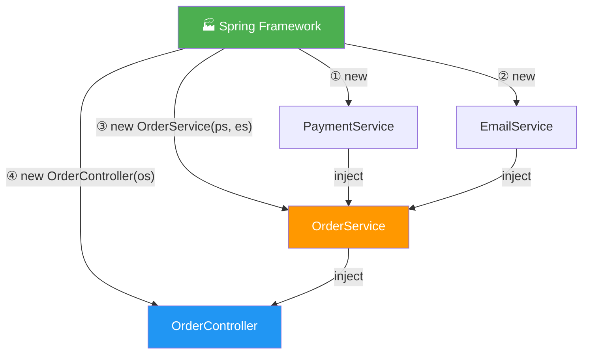
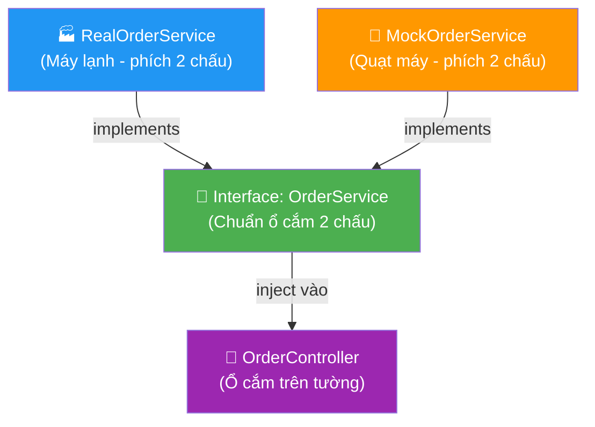
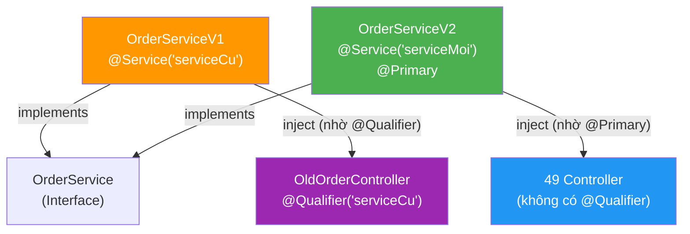
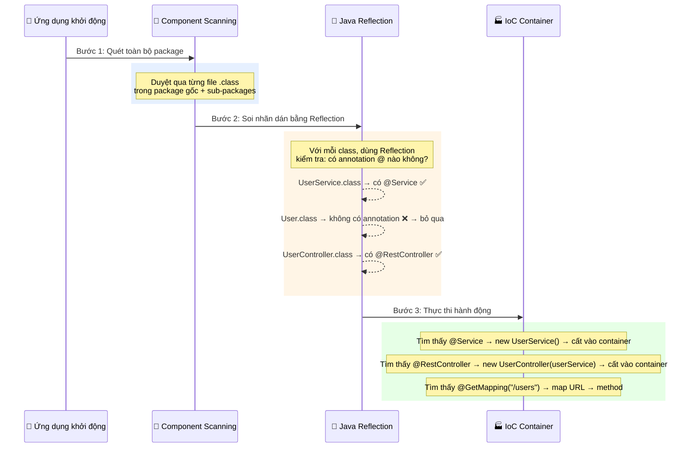
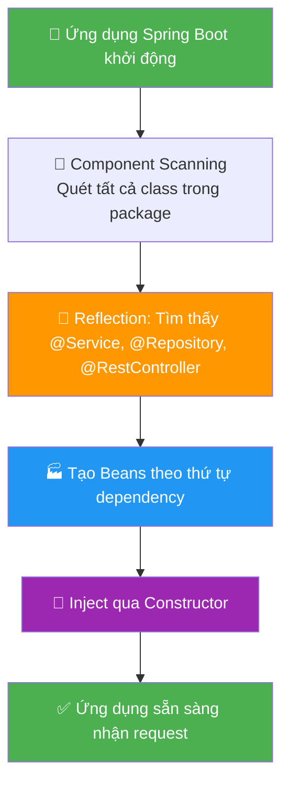
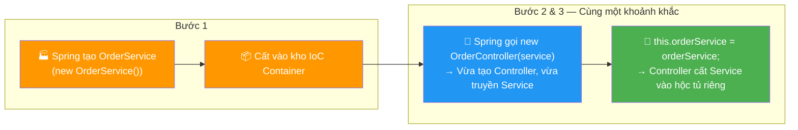
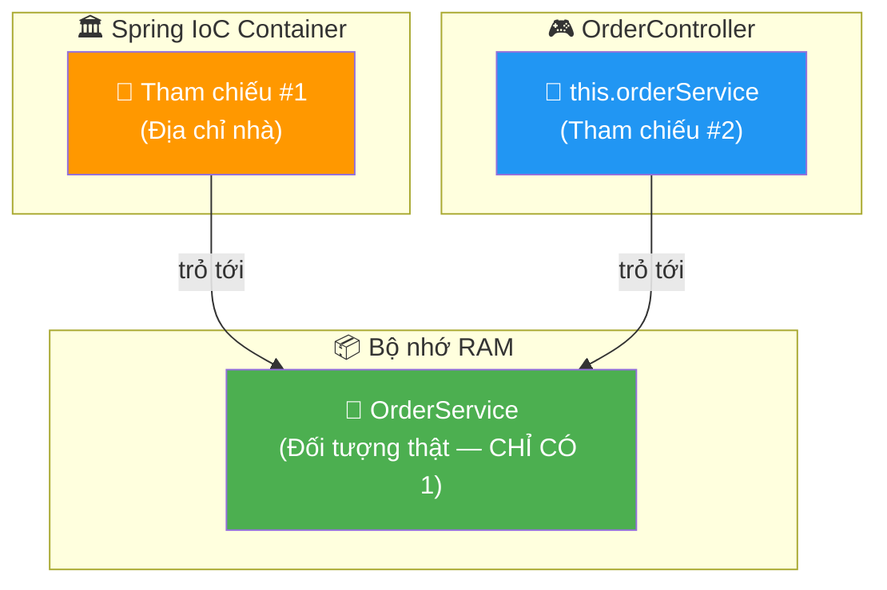
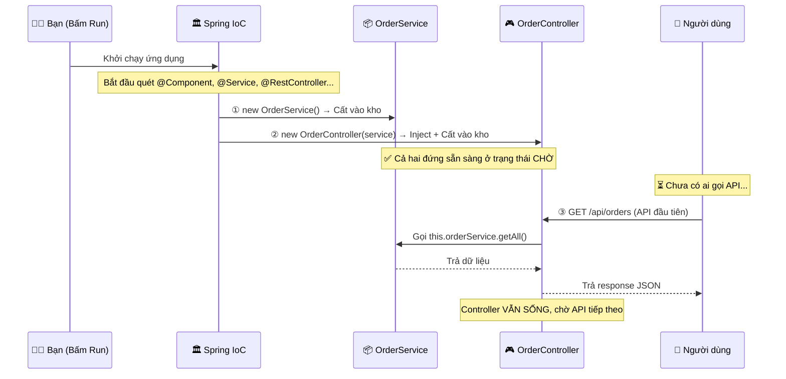
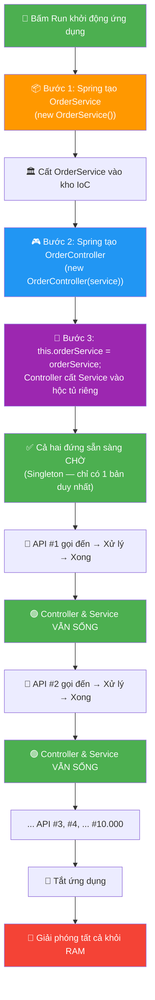

# 📘 BÀI 2 (Bổ sung): Hiểu Sâu Về Dependency Injection

> **Mục đích:** Biên soạn lại từ các câu hỏi thực tế trong quá trình học, sắp xếp theo thứ tự logic từ cơ bản đến nâng cao.
> **Đối tượng:** Người mới bắt đầu, chưa hiểu tại sao Constructor Injection khác việc `new` trực tiếp.
> **Tiên quyết:** Đã đọc qua Bài 2 (IoC & DI)

---

## Mục lục

| Chương | Nội dung | Câu hỏi được giải đáp |
|:---:|:---|:---|
| 1 | Constructor là gì? | Constructor hoạt động như thế nào? |
| 2 | `new` bên trong Controller vs Constructor Injection | Hai cách này có giống nhau không? |
| 3 | 3 lợi ích lớn của Constructor Injection | Truyền qua constructor thì được lợi gì? |
| 4 | Interface & Đa hình — Chìa khóa của DI | MockService truyền vào constructor được sao? |
| 5 | Khi có 2 Service cùng implement 1 Interface | Spring chọn cái nào? `@Primary` vs `@Qualifier` |
| 6 | Annotation là gì? Cơ chế hoạt động | Gắn `@` vào là Spring tự nhận diện? |
| 7 | Trình tự khởi tạo & Ai giữ Service? | Spring tạo Service hay Controller trước? Ai giữ? |
| 8 | Vòng đời Bean — Singleton & Lifecycle | Controller có bị hủy sau mỗi API không? |

---

## CHƯƠNG 1: CONSTRUCTOR LÀ GÌ?

### 1.1. Định nghĩa

**Constructor (Hàm tạo)** là một phương thức đặc biệt được **tự động gọi** ngay tại khoảnh khắc một đối tượng mới được tạo ra bằng từ khóa `new`. Nhiệm vụ cốt lõi: **chuẩn bị trạng thái ban đầu** để đối tượng sẵn sàng hoạt động.

### 1.2. Đặc điểm nhận dạng

| Đặc điểm | Giải thích |
|:---|:---|
| **Tên giống hệt Class** | `public UserService(...)` trong class `UserService` |
| **Không có kiểu trả về** | Không dùng `void`, `int`, `String` phía trước |
| **Chạy đúng 1 lần** | Chỉ chạy khi `new`, không thể gọi lại như method bình thường |

### 1.3. Hai loại Constructor phổ biến

#### Loại 1: Constructor mặc định (Không tham số)

Tạo đối tượng với giá trị mặc định hoặc để trống, điền dữ liệu sau.

```java
public class Student {
    String name;

    // Constructor không tham số
    public Student() {
        this.name = "Sinh viên chưa có tên";
    }
}

// Sử dụng:
Student sinhVienA = new Student();
// → sinhVienA.name = "Sinh viên chưa có tên" (mặc định)
```

#### Loại 2: Constructor có tham số (Parameterized)

**Bắt buộc** phải cung cấp đầy đủ thông tin khi tạo đối tượng.

```java
public class Student {
    String name;
    int age;

    // Constructor bắt buộc truyền 2 tham số
    public Student(String inputName, int inputAge) {
        this.name = inputName;
        this.age = inputAge;
    }
}

// Sử dụng:
Student sinhVienB = new Student("Tu", 21);  // ✅ Có đủ tham số → OK
// Student sinhVienC = new Student();        // ❌ BÁO LỖI: Thiếu tham số!
```

### 1.4. Ví dụ thực tế

Hãy tưởng tượng **Class** là bản vẽ thiết kế xe hơi, **Object** là chiếc xe thật được sản xuất ra:

| | Không có Constructor | Có Constructor |
|:---|:---|:---|
| **Xe xuất xưởng** | Chỉ là khung sắt trống | Đã sơn màu, lắp động cơ sẵn |
| **Phải làm thêm?** | Tự mua sơn, tự lắp động cơ | Sẵn sàng lăn bánh luôn |
| **Code tương ứng** | `xe.setMau("Đỏ"); xe.setDongCo("V8");` | `new XeHoi("Đỏ", "V8")` |

---

## CHƯƠNG 2: `NEW` BÊN TRONG CONTROLLER vs CONSTRUCTOR INJECTION

### 2.1. Câu hỏi: Hai cách này có giống nhau không?

> *"Việc `new` Service bên trong Controller thì nó cũng giống constructor trong controller, bởi vì constructor thì nó cũng phải khởi tạo Service mà?"*

**Trả lời: KHÔNG giống nhau.** Sự khác biệt cốt lõi nằm ở việc **ai là người gọi `new`** và **`new` được đặt ở đâu**.

### 2.2. So sánh hai cách viết

#### Cách 1 — Tự `new` bên trong Controller (❌ Tight Coupling)

```java
public class OrderController {
    private OrderService orderService;

    public OrderController() {
        // ❌ Controller TỰ TAY gọi new → Controller kiêm vai "nhà máy sản xuất"
        this.orderService = new OrderService();
    }
}
```

#### Cách 2 — Constructor Injection (✅ Loose Coupling)

```java
public class OrderController {
    private final OrderService orderService;

    // ✅ KHÔNG có từ khóa "new" nào ở đây!
    // Controller chỉ "mở cửa" để nhận đồ từ bên ngoài
    public OrderController(OrderService orderService) {
        this.orderService = orderService;
    }
}
```

> 🔍 **Giải thích chi tiết từng dòng code:**
> - `public OrderController(OrderService orderService)`: Đây là khai báo hàm tạo (constructor). Nó đưa ra một điều kiện bắt buộc: *"Bất cứ ai muốn tạo ra một `OrderController` thì đều phải truyền vào cho nó một đối tượng `OrderService` đã có sẵn"*.
> - `this.orderService`: Từ khóa `this` đại diện cho bản thân đối tượng Controller đang được tạo. `this.orderService` trỏ đến cái "hộc tủ" (thuộc tính `private final OrderService orderService;`) đã được khai báo bên trong class Controller.
> - `= orderService;`: Hành động lấy đối tượng Service được truyền từ tham số bên ngoài vào, cất vào cái "hộc tủ" của Controller để lưu giữ. Nhờ vậy, các hàm khác bên trong Controller sau này có thể lôi Service này ra để dùng.

### 2.3. Bảng so sánh

| Tiêu chí | Tự `new` bên trong | Constructor Injection |
|:---|:---|:---|
| **Ai gọi `new`?** | Controller tự gọi | Spring Framework gọi ở nơi khác |
| **Có từ khóa `new` trong constructor?** | ✅ Có: `new OrderService()` | ❌ Không có `new` |
| **Controller biết cách tạo Service?** | Phải biết | Không cần biết |
| **Thay thế được?** | ❌ Bị "dính chặt" vào đúng 1 class | ✅ Nhận bất kỳ ai được đưa vào |

### 2.4. Ví dụ thực tế — Bác sĩ phẫu thuật

Hãy tưởng tượng `OrderController` là **Bác sĩ phẫu thuật**, `OrderService` là **bộ dao mổ**:

| | Tự `new` (Tự rèn dao) | Constructor Injection (Bệnh viện cấp) |
|:---|:---|:---|
| **Trước ca mổ** | Bác sĩ phải tự chạy ra lò rèn, đúc dao | Bác sĩ chỉ đưa tay ra |
| **Ai chuẩn bị dao?** | Bác sĩ tự làm | Bệnh viện (Spring) chuẩn bị sẵn |
| **Đổi sang dao mới?** | Bác sĩ phải tự rèn lại | Bệnh viện mang dao mới đến tận tay |
| **Bác sĩ tập trung được không?** | ❌ Xao nhãng | ✅ Chỉ lo chuyên môn |

```java
// this.orderService = orderService;
// ↑ Bác sĩ nhận dao mổ từ bệnh viện → cất vào hộp đồ nghề (this) → sẵn sàng phẫu thuật
```

---

## CHƯƠNG 3: 3 LỢI ÍCH LỚN CỦA CONSTRUCTOR INJECTION

### Lợi ích 1: Dễ dàng viết Unit Test (Testability) 🧪

**Vấn đề:** Khi test `OrderController`, bạn **không muốn** Controller gọi xuống database thật (chậm, làm rác dữ liệu).

| | Tự `new` | Constructor Injection |
|:---|:---|:---|
| **Khi test** | Không thể ngăn Controller gọi DB, vì nó đã `new OrderService()` thật ở bên trong | Bạn tự tạo MockService rồi **truyền vào**: `new OrderController(mockService)` |
| **Kết quả** | Test chậm, phụ thuộc DB | Test nhanh, cô lập, an toàn |

```java
// Khi viết test — truyền Mock Service (giả) vào Constructor:
OrderService mockService = new MockOrderService_KhongGoiDatabase();
OrderController controller = new OrderController(mockService);

// → Controller dùng mock → KHÔNG đụng database → Test an toàn!
```

### Lợi ích 2: Không phải sửa code ở nhiều nơi (Maintainability) 🔧

**Vấn đề:** Công ty yêu cầu nâng cấp sang `OrderServiceV2` nhanh hơn. Có 50 Controller đang dùng `OrderService`.

| | Tự `new` | Constructor Injection |
|:---|:---|:---|
| **Phải sửa bao nhiêu file?** | Mở **50 file** Controller, tìm `new OrderService()` → sửa thành `new OrderServiceV2()` | Sửa cấu hình **ở 1 nơi duy nhất** trong Spring |
| **Rủi ro** | Dễ sót, dễ lỗi | An toàn, tập trung |

> Chi tiết cơ chế "sửa 1 nơi" sẽ được giải thích ở **Chương 4 & 5**.

### Lợi ích 3: Giải quyết chuỗi khởi tạo phức tạp (Dependency Resolution) 🔗

**Vấn đề:** Ban đầu `OrderService` đứng một mình. Tháng sau, nó cần thêm `PaymentService` và `EmailService`:

```java
// Trước: OrderService không cần gì
new OrderService()

// Sau: OrderService cần 2 dependency nữa
new OrderService(paymentService, emailService)
```

| | Tự `new` | Constructor Injection |
|:---|:---|:---|
| **Khi thay đổi** | Phải vào Controller, tìm cách tạo `PaymentService`, tạo `EmailService`, rồi nhét vào | Controller **giữ nguyên code** — Spring tự lo |
| **Controller phải biết** | Cách khởi tạo cả Payment lẫn Email | Chỉ cần biết "tôi cần OrderService" |

```java
// Spring tự tìm Payment, tự tìm Email, ráp thành OrderService hoàn chỉnh
// → Rồi mới đưa qua constructor cho Controller
// → Code Controller vẫn giữ nguyên:
public OrderController(OrderService orderService) {
    this.orderService = orderService;
}
// Controller KHÔNG quan tâm Service cần thêm bao nhiêu dependency khác!
```



> Controller không cần biết Spring đã phải tạo bao nhiêu bean phía sau — nó chỉ nhận sản phẩm hoàn chỉnh.

---

## CHƯƠNG 4: INTERFACE & ĐA HÌNH — TẠI SAO MockService TRUYỀN VÀO ĐƯỢC?

### 4.1. Câu hỏi

> *"`MockOrderService_KhongGoiDatabase()` phải có kiểu dữ liệu là `OrderService` thì code mới chạy được chứ?"*

**Trả lời: Đúng!** Và bí quyết nằm ở **Interface** và tính **Đa hình (Polymorphism)**.

### 4.2. Interface là gì?

**Interface** = **Bản hợp đồng** — chỉ vạch ra các chức năng cần có, **không chứa code thực thi**.

```java
// Bước 1: Khai báo "bản hợp đồng" chung
public interface OrderService {
    void taoDonHang();
    List<Order> layDanhSach();
}
// Interface chỉ nói: "Ai muốn làm OrderService thì PHẢI có 2 hàm này"
// Nó KHÔNG nói: "Làm hàm đó bằng cách nào"
```

### 4.3. Các class "ký hợp đồng" (implements)

```java
// Bước 2: Class thật — dùng khi chạy ứng dụng production
@Service
public class RealOrderService implements OrderService {
    @Override
    public void taoDonHang() {
        // Code phức tạp, kết nối database thật, gửi email...
    }

    @Override
    public List<Order> layDanhSach() {
        // SELECT * FROM orders...
    }
}

// Bước 3: Class giả (Mock) — dùng khi viết Unit Test
public class MockOrderService implements OrderService {
    @Override
    public void taoDonHang() {
        // Giả vờ xử lý thành công, trả về dữ liệu ảo
        // KHÔNG đụng database!
    }

    @Override
    public List<Order> layDanhSach() {
        return List.of(new Order(1L, "Fake Order"));
    }
}
```

### 4.4. Tại sao cả hai đều truyền vào Constructor được?

```java
// Constructor khai báo nhận Interface (bản hợp đồng chung)
public OrderController(OrderService orderService) {
    this.orderService = orderService;
}
```

Nhờ tính **Đa hình**, Java cho phép:

```java
// Cả hai đều hợp lệ — vì cả hai đều "ký hợp đồng" OrderService!
OrderService real = new RealOrderService();    // ✅ RealOrderService IS-A OrderService
OrderService mock = new MockOrderService();    // ✅ MockOrderService IS-A OrderService

// Khi chạy app thật:
new OrderController(new RealOrderService());   // ✅ Spring làm việc này

// Khi chạy test:
new OrderController(new MockOrderService());   // ✅ Bạn tự làm việc này trong test
```

### 4.5. Ví dụ thực tế — Ổ cắm điện

| Thành phần | Ví dụ |
|:---|:---|
| **Interface** (`OrderService`) | Chuẩn ổ cắm 2 chấu trên tường |
| **Constructor** | Cái ổ cắm — chỉ quan tâm "có đúng chuẩn 2 chấu không?" |
| **RealOrderService** | Máy lạnh (phích 2 chấu) ✅ |
| **MockOrderService** | Quạt máy (cũng phích 2 chấu) ✅ |
| **Kết quả** | Ổ cắm không kén chọn — cắm gì vào cũng chạy, miễn đúng chuẩn |



> [!IMPORTANT]
> **Trong dự án thực tế:** Kiểu dữ liệu trong Constructor luôn là **Interface** (bản hợp đồng chung), KHÔNG phải tên class cụ thể. Nhờ vậy, bạn có thể swap giữa `RealOrderService` và `MockOrderService` mà Controller không cần thay đổi bất kỳ dòng code nào.

---

## CHƯƠNG 5: KHI CÓ 2 SERVICE CÙNG IMPLEMENT 1 INTERFACE

### 5.1. Câu hỏi

> *"Nếu có 2 Service cùng `@Service` và cùng implement 1 Interface, Spring chọn cái nào?"*

### 5.2. Trường hợp 1: Chỉ có 1 class đánh `@Service`

Nếu bạn xóa `@Service` ở class cũ (V1) và chỉ đặt `@Service` ở class mới (V2):

```java
// V1: Đã xóa @Service → Spring KHÔNG quản lý class này
public class OrderServiceV1 implements OrderService { ... }

// V2: Được đánh dấu @Service → Spring quản lý
@Service
public class OrderServiceV2 implements OrderService { ... }
```

→ Spring chỉ thấy **1 bean** duy nhất đại diện cho `OrderService` → **tự động chọn V2** cho tất cả Controller. ✅

### 5.3. Trường hợp 2: CẢ HAI đều có `@Service` → 💥 LỖI!

```java
@Service
public class OrderServiceV1 implements OrderService { ... }

@Service
public class OrderServiceV2 implements OrderService { ... }
```

Khi Spring khởi động → tìm thấy **2 bean** cùng kiểu `OrderService` → **KHÔNG BIẾT CHỌN AI** → ứng dụng **sập ngay lập tức**!

```
❌ NoUniqueBeanDefinitionException:
   No qualifying bean of type 'OrderService':
   expected single matching bean but found 2: orderServiceV1, orderServiceV2
```

### 5.4. Giải pháp 1: `@Primary` — Ưu tiên mặc định

Gắn `@Primary` vào class bạn muốn Spring **mặc định chọn**:

```java
@Service
public class OrderServiceV1 implements OrderService { ... }

@Service
@Primary  // ← "Nếu ai đòi OrderService chung chung, hãy mặc định lấy tôi!"
public class OrderServiceV2 implements OrderService { ... }
```

→ Tất cả 50 Controller (đòi `OrderService` chung chung) sẽ đồng loạt nhận **V2**. ✅

### 5.5. Giải pháp 2: `@Qualifier` — Chỉ định đích danh

Khi 49 Controller dùng V2, nhưng **1 Controller đặc biệt** vẫn cần V1:

```java
// Đặt tên cho từng bean
@Service("serviceCu")
public class OrderServiceV1 implements OrderService { ... }

@Service("serviceMoi")
@Primary
public class OrderServiceV2 implements OrderService { ... }
```

```java
// 49 Controller bình thường → nhận V2 (nhờ @Primary)
public OrderController(OrderService orderService) {
    this.orderService = orderService;
}

// 1 Controller đặc biệt → chỉ định đích danh V1
public OldOrderController(@Qualifier("serviceCu") OrderService orderService) {
    this.orderService = orderService;
}
```

### 5.6. Tổng hợp



### 5.7. Ví dụ thực tế — Thay bóng đèn trong tòa nhà

| Thành phần | Ví dụ |
|:---|:---|
| **Interface** (`OrderService`) | Chuẩn đui đèn xoắn E27 |
| **50 trần nhà** (Controller) | Đã lắp sẵn ngàm E27, không cần đập trần thiết kế lại |
| **Bóng dây tóc** (V1) | Đui E27 — cắm vào được ✅ |
| **Bóng LED** (V2) | Đui E27 — cắm vào cũng được ✅ |
| **Thợ điện** (Spring) | Được lệnh đổi sang LED → tự đi 50 phòng vặn bóng mới |
| **Kết quả** | KHÔNG phải đập trần nhà (không sửa code Controller) |

---

## CHƯƠNG 6: ANNOTATION LÀ GÌ? CƠ CHẾ HOẠT ĐỘNG

### 6.1. Định nghĩa

**Annotation** (Chú thích) = **Metadata** (dữ liệu mô tả cho dữ liệu khác) được gắn trực tiếp vào code Java.

> **Điểm quan trọng nhất:** Bản thân Annotation **KHÔNG tự thực thi** bất kỳ đoạn code nào. Nó chỉ là chiếc **"nhãn dán"** để các công cụ bên ngoài (Spring Framework, trình biên dịch) nhìn vào và biết phải làm gì.

### 6.2. Ví dụ thực tế — Tem dán hành lý sân bay

| Thành phần | Ví dụ |
|:---|:---|
| **Code Java** | Chiếc vali ở sân bay |
| **Annotation** (`@Service`, `@RestController`...) | Chiếc tem dán "Hàng dễ vỡ" (Fragile) |
| **Spring Framework** | Nhân viên bốc xếp |
| **Khi có tem** | Nhân viên bê nhẹ nhàng, xếp lên trên cùng (Spring tạo bean, inject) |
| **Khi không có tem** | Nhân viên đối xử như hành lý thường (Spring lướt qua, coi như vô hình) |

### 6.3. Cơ chế hoạt động — 3 bước ngầm bên dưới

Khi bạn bấm nút Run ứng dụng Spring, 3 bước diễn ra tự động:



| Bước | Tên | Chuyện gì xảy ra |
|:---:|:---|:---|
| 1 | **Component Scanning** | Spring cử "con bọ" rà soát toàn bộ file code từ package gốc |
| 2 | **Java Reflection** | Spring "soi" vào cấu trúc từng class, kiểm tra có `@` nào không |
| 3 | **Thực thi hành động** | Có `@Service` → tạo bean; Có `@GetMapping` → map URL; Không có gì → bỏ qua |

> **Java Reflection** là tính năng cho phép chương trình Java "nhìn vào" cấu trúc bên trong của một class tại thời điểm chạy (runtime) — xem class có những method nào, annotation nào, field nào... mà không cần biết trước lúc compile.

### 6.4. Cú pháp — Luôn bắt đầu bằng `@`

Annotation luôn bắt đầu bằng ký hiệu `@` theo sau là tên. Đặt ngay **phía trên** (hoặc phía trước) thành phần cần đánh dấu.

### 6.5. Ba vị trí gắn Annotation

#### Vị trí 1: Trên đầu Class — Định danh vai trò

```java
@RestController  // → "Class này chuyên nhận HTTP request"
public class OrderController { ... }

@Service         // → "Class này chứa business logic"
public class OrderService { ... }

@Repository      // → "Class này truy cập database"
public class OrderRepository { ... }
```

#### Vị trí 2: Trên đầu Method — Cấu hình hành vi

```java
@RestController
public class OrderController {

    @GetMapping("/orders")     // → "Khi ai truy cập GET /orders → chạy hàm này"
    public String layDanhSach() {
        return "Danh sách đơn hàng";
    }

    @PostMapping("/orders")    // → "Khi ai gửi POST /orders → chạy hàm này"
    public String taoDonHang() {
        return "Đã tạo đơn hàng";
    }
}
```

#### Vị trí 3: Trên tham số hoặc biến — Chỉ định chi tiết

```java
// @PathVariable: Lấy giá trị từ URL
@GetMapping("/orders/{id}")
public Order layTheoId(@PathVariable Long id) { ... }

// @RequestBody: Chuyển JSON body → Java Object
@PostMapping("/orders")
public Order taoDonHang(@RequestBody Order order) { ... }

// @Qualifier: Chỉ định đích danh bean nào
public OrderController(@Qualifier("serviceMoi") OrderService orderService) { ... }
```

### 6.6. Bảng tổng hợp các Annotation đã học

| Annotation | Gắn ở đâu | Spring làm gì khi thấy |
|:---|:---|:---|
| `@RestController` | Class | Tạo bean + nhận HTTP request + trả JSON |
| `@Service` | Class | Tạo bean (business logic) |
| `@Repository` | Class | Tạo bean + auto-translate exception |
| `@Component` | Class | Tạo bean (tổng quát) |
| `@GetMapping("/url")` | Method | Map `GET /url` → method này |
| `@PostMapping("/url")` | Method | Map `POST /url` → method này |
| `@DeleteMapping("/url")` | Method | Map `DELETE /url` → method này |
| `@RequestMapping("/prefix")` | Class | Prefix URL cho tất cả endpoint |
| `@Autowired` | Constructor/Field/Setter | Đánh dấu nơi inject dependency |
| `@Primary` | Class | Bean mặc định khi có nhiều ứng viên |
| `@Qualifier("name")` | Parameter | Chỉ định đích danh bean theo tên |
| `@PathVariable` | Parameter | Lấy giá trị từ URL path |
| `@RequestBody` | Parameter | Deserialize JSON → Java Object |

---

## TỔNG KẾT: LUỒNG HOẠT ĐỘNG TOÀN BỘ



```
① Spring quét package → tìm annotation
② Tạo bean KHÔNG có dependency trước (Repository)
③ Tạo bean CÓ dependency → inject qua Constructor (Service cần Repository)
④ Tiếp tục inject (Controller cần Service)
⑤ Tất cả beans sẵn sàng → Tomcat khởi động → Nhận request!
```

> [!TIP]
> **Ghi nhớ chuỗi logic:**
> - **Annotation** = nhãn dán giúp Spring nhận diện
> - **Interface** = bản hợp đồng giúp swap implementation
> - **Constructor** = cửa nhận đồ, không tự sản xuất
> - **Spring** = thợ điện/bệnh viện — lo việc tạo và đưa đồ đến tận tay

---

## CHƯƠNG 7: TRÌNH TỰ KHỞI TẠO & AI GIỮ SERVICE?

> **Câu hỏi cốt lõi:** Spring IoC tạo Service hay Controller trước? Inject diễn ra lúc nào? Và sau khi inject xong, Controller giữ Service hay Spring IoC giữ?

### 7.1. Trình tự diễn ra thực tế: Cái nào có trước, cái nào có sau?

Bạn không thể "tiêm Service vào Controller trước" khi bản thân cái Controller đó chưa tồn tại. Ngược lại, bạn cũng không thể tạo Controller trước rồi mới truyền qua Constructor sau, vì **Constructor chỉ chạy đúng một lần ngay lúc đối tượng ra đời**.

Do đó, ngay khi bạn **bấm nút khởi chạy ứng dụng**, Spring IoC Container sẽ tự động thực hiện quy trình **3 bước** theo đúng thứ tự thời gian sau:



#### Bước 1 — Tạo Service trước

Spring quét code và thấy `OrderController` (được đánh dấu `@RestController`) đang **yêu cầu** một `OrderService` ở hàm tạo. Vì vậy, Spring phải tự đi khởi tạo `OrderService` trước, rồi cất vào kho của Spring.

```java
// Spring tự động thực hiện ở hậu trường:
OrderService service = new OrderService();
// → Cất vào kho IoC Container
```

#### Bước 2 — Vừa tạo Controller, vừa truyền Service (Cùng một lúc)

Sau khi đã có sẵn `service` trên tay, Spring mới tiến hành gọi lệnh `new` để tạo Controller và **nhét luôn** `service` đó vào ngoặc đơn:

```java
// Spring tự động thực hiện ở hậu trường:
OrderController controller = new OrderController(service);
//                                                ^^^^^^^
//                        ↑ service đã tạo ở Bước 1 được truyền vào đây
```

#### Bước 3 — Controller cất giữ để dùng

Ngay trong khoảnh khắc Bước 2 chạy, dòng code `this.orderService = orderService;` bên trong Constructor được kích hoạt để Controller **lưu lại** Service này.

```java
public OrderController(OrderService orderService) {
    this.orderService = orderService;
    // ↑ Bước 3 diễn ra NGAY BÊN TRONG Bước 2
    // Controller lưu Service vào "sổ tay riêng" để dùng sau này
}
```

> [!WARNING]
> **Lưu ý cực kỳ quan trọng:** Nếu trong code, bạn tự tay gõ lệnh `new OrderController(...)` thì Spring IoC sẽ **KHÔNG** tự động inject gì cả (bạn sẽ phải tự tìm Service mà truyền vào ngoặc đơn). Cơ chế tự động inject **chỉ xảy ra** khi bạn gắn nhãn `@RestController` và để cho Spring tự tay gọi lệnh `new` ở hậu trường.

#### Ví dụ thực tế — Lắp ráp điện thoại

Hãy tưởng tượng `OrderController` là một **chiếc điện thoại**, `OrderService` là **viên pin** bên trong:

| Bước | Nhà máy (Spring IoC) làm gì | Tương đương code |
|:---:|:---|:---|
| 1 | Sản xuất viên pin hoàn chỉnh trước | `new OrderService()` |
| 2 | Lắp vỏ máy + đặt pin vào khay **cùng lúc** trên dây chuyền | `new OrderController(service)` |
| 3 | Pin nằm chắc chắn trong khay chứa pin của điện thoại | `this.orderService = orderService;` |

### 7.2. Vậy Controller giữ hay Spring IoC giữ?

Câu trả lời là: **CẢ HAI CÙNG GIỮ**, nhưng chúng không giữ 2 bản sao khác nhau, mà cùng giữ **"sợi dây liên kết" (địa chỉ tham chiếu — Reference)** trỏ tới **đúng 1** đối tượng `OrderService` duy nhất nằm trong bộ nhớ máy tính (RAM).

> [!NOTE]
> Trong Java, các biến đối tượng **không chứa** toàn bộ cái xác của đối tượng đó, mà chỉ chứa **"địa chỉ nhà"** (giống như chiếc điều khiển từ xa).



#### Tại sao Spring IoC phải giữ?

Spring IoC giữ **địa chỉ gốc** của `OrderService` trong kho để:
- **Quản lý vòng đời** (lifecycle) của đối tượng đó
- **Chia sẻ** cho các Controller khác: Nếu sau này có thêm `UserController` hay `PaymentController` cũng cần dùng `OrderService`, Spring sẽ lấy chính **cùng một** `OrderService` đang giữ trong kho để tiêm tiếp → **tiết kiệm bộ nhớ tối đa**

#### Tại sao Controller cũng phải giữ?

Dòng code `private final OrderService orderService;` và phép gán `this.orderService = orderService;` giúp Controller **tự lưu lại** địa chỉ của Service vào "sổ tay riêng" của mình. Nhờ vậy:
- Mỗi khi có request tới (ví dụ bấm nút Đặt hàng), Controller chỉ việc gọi thẳng `this.orderService.taoDonHang()` **ngay lập tức**
- **Không cần** quay lại hỏi xin Spring IoC thêm bất kỳ lần nào nữa

#### Ví dụ thực tế — Máy in dùng chung qua mạng

Hãy tưởng tượng `OrderService` là một **chiếc máy in dùng chung** đặt ở góc văn phòng:

| Vai trò | Ai? | Làm gì? |
|:---|:---|:---|
| **Phòng IT** (Spring IoC) | Người mua + quản lý máy in | Giữ quyền quản lý trong danh sách thiết bị |
| **Nhân viên mới** (Controller) | Ngày đầu nhận việc (chạy Constructor) | Được Phòng IT cài IP máy in vào laptop (`this.orderService = orderService;`) |
| **Kết quả** | Cả hai cùng "giữ" kết nối | Nhân viên bấm Print trên laptop → máy in chạy, **không cần gọi Phòng IT** |

> [!TIP]
> **Tóm tắt đơn giản:** Khi chạy ứng dụng → Spring IoC khởi tạo Service trước rồi lưu trữ → Ngay lập tức tạo Controller và inject Service vào → Controller giữ Service đó cho đến khi tắt ứng dụng.

---

## CHƯƠNG 8: VÒNG ĐỜI BEAN — SINGLETON & LIFECYCLE

> **Câu hỏi cốt lõi:** Controller được tạo khi nào? Có bị hủy sau mỗi API không? Tại sao Spring không hủy đi tạo lại?

### 8.1. Khi nào Controller được tạo ra?

> [!IMPORTANT]
> Controller **KHÔNG** đợi đến khi có API gọi vào mới được khởi tạo.

Ngay tại khoảnh khắc bạn **bấm nút Run** (Khởi chạy ứng dụng / Mở Server), quy trình sau đã diễn ra hoàn tất **trước cả khi** có bất kỳ người dùng nào truy cập:



### 8.2. Xử lý xong API thì Controller và Service có bị hủy không?

Câu trả lời là: **KHÔNG BỊ HỦY.**

| Thời điểm | Controller | Service | Trạng thái |
|:---|:---:|:---:|:---|
| Bấm Run (Khởi động) | 🟢 Được tạo | 🟢 Được tạo | Chờ sẵn |
| API thứ 1 gọi đến | 🟢 Xử lý | 🟢 Xử lý | Đang chạy |
| API thứ 1 xong | 🟢 **Vẫn sống** | 🟢 **Vẫn sống** | Quay lại chờ |
| API thứ 2 gọi đến | 🟢 Xử lý tiếp | 🟢 Xử lý tiếp | Đang chạy |
| API thứ 10.000 xong | 🟢 **Vẫn sống** | 🟢 **Vẫn sống** | Quay lại chờ |
| **Tắt ứng dụng** | 🔴 **Bị hủy** | 🔴 **Bị hủy** | Giải phóng RAM |

#### Cơ chế Singleton (Độc bản)

Mặc định trong Spring, các class được đánh dấu `@RestController`, `@Service`, `@Repository`,... đều được quản lý theo mô hình **Singleton**:

> **Singleton = Trong suốt vòng đời ứng dụng, chỉ có đúng 1 đối tượng duy nhất tồn tại.**

```java
// Dù có 10.000 người dùng gọi API cùng lúc:
//
// Người dùng #1     ──┐
// Người dùng #2     ──┤
// Người dùng #3     ──┼──→ Cùng 1 OrderController ──→ Cùng 1 OrderService
// ...                 │
// Người dùng #10000 ──┘
//
// Spring KHÔNG tạo 10.000 cái Controller khác nhau!
```

### 8.3. Ví dụ thực tế — Quán Cà Phê

Hãy tưởng tượng ứng dụng Spring của bạn là một **Quán Cà Phê**:

| Vai trò thực tế | Tương đương Spring |
|:---|:---|
| Ông chủ quán | Spring IoC Container |
| Nhân viên pha chế | `OrderService` |
| Nhân viên thu ngân | `OrderController` |
| Một vị khách mua nước | Một lượt gọi API |

#### Quy trình diễn ra trong ngày:

**🕕 6h00 sáng — Mở cửa quán (Khởi động ứng dụng):**

Dù chưa có một bóng khách nào, ông chủ (Spring) đã:
1. Gọi Pha chế (`OrderService`) vào quầy trước
2. Gọi Thu ngân (`OrderController`) ra đứng quầy
3. Kết nối bộ đàm giữa hai người (Inject qua Constructor)

**🕖 7h00 sáng — Khách đầu tiên vào (API thứ 1):**

Khách gọi 1 ly bạc xỉu → Thu ngân **đã đứng sẵn** ở đó nhận đơn ngay lập tức → Báo qua bộ đàm cho Pha chế → Giao nước cho khách → ✅ Xong API thứ 1

**☕ Khi khách thứ 1 rời đi:**

Ông chủ **KHÔNG sa thải** Thu ngân và Pha chế! Nếu đuổi việc họ, chẳng lẽ 5 phút sau khách thứ 2 bước vào, ông chủ lại phải chạy đi đăng tin tuyển dụng, phỏng vấn từ đầu? → Khách phải chờ rất lâu!

**📅 Suốt cả ngày:**

Đúng **1 người Thu ngân** và **1 người Pha chế** đó vẫn đứng nguyên tại vị trí, phối hợp phục vụ khách thứ 2, thứ 3... đến khách thứ 10.000.

**🌙 22h00 đêm — Đóng cửa quán (Tắt ứng dụng):**

Lúc này Thu ngân và Pha chế mới chính thức **tan ca** và rời khỏi quán (Giải phóng khỏi bộ nhớ RAM).

### 8.4. Tại sao Spring giữ nguyên mà không hủy đi tạo lại?

Việc **khởi tạo sẵn** từ lúc mở ứng dụng và **giữ nguyên** cho đến lúc tắt mang lại 2 lợi ích sống còn:

| Lợi ích | Giải thích | Nếu không làm vậy |
|:---|:---|:---|
| **🚀 Tốc độ phản hồi cực nhanh** | Controller & Service đã nằm chờ sẵn trong RAM → bắt tay xử lý ngay lập tức | Mỗi request phải chạy lại `new` → người dùng phải chờ |
| **🛡️ Bảo vệ bộ nhớ (RAM)** | Dùng đi dùng lại đúng 1 đối tượng → hệ thống chạy cực kỳ nhẹ nhàng | 5.000 request/giây × tạo mới + hủy = quá tải CPU + tràn RAM |

```java
// ❌ Nếu Spring tạo mới + hủy sau mỗi API:
// Request #1 → new OrderController() → xử lý → HỦY
// Request #2 → new OrderController() → xử lý → HỦY  ← Lãng phí!
// Request #3 → new OrderController() → xử lý → HỦY  ← Lãng phí!

// ✅ Thực tế Spring làm (Singleton):
// Khởi động → new OrderController() → LƯU
// Request #1 → dùng Controller đó → xử lý xong → Controller VẪN SỐNG
// Request #2 → dùng Controller đó → xử lý xong → Controller VẪN SỐNG
// Request #3 → dùng Controller đó → xử lý xong → Controller VẪN SỐNG
// Tắt app  → HỦY
```

### 8.5. Tổng kết Chương 7 & 8



> [!TIP]
> **Ghi nhớ 3 điều quan trọng:**
> 1. **Trình tự:** Service được tạo **trước** → Controller được tạo **sau** (và inject Service vào ngay lúc tạo)
> 2. **Ai giữ:** Cả Spring IoC và Controller **cùng giữ** tham chiếu tới **đúng 1** đối tượng Service
> 3. **Vòng đời:** Controller & Service tồn tại **xuyên suốt** từ lúc bấm Run đến lúc tắt app (Singleton), **không** bị hủy sau mỗi API
