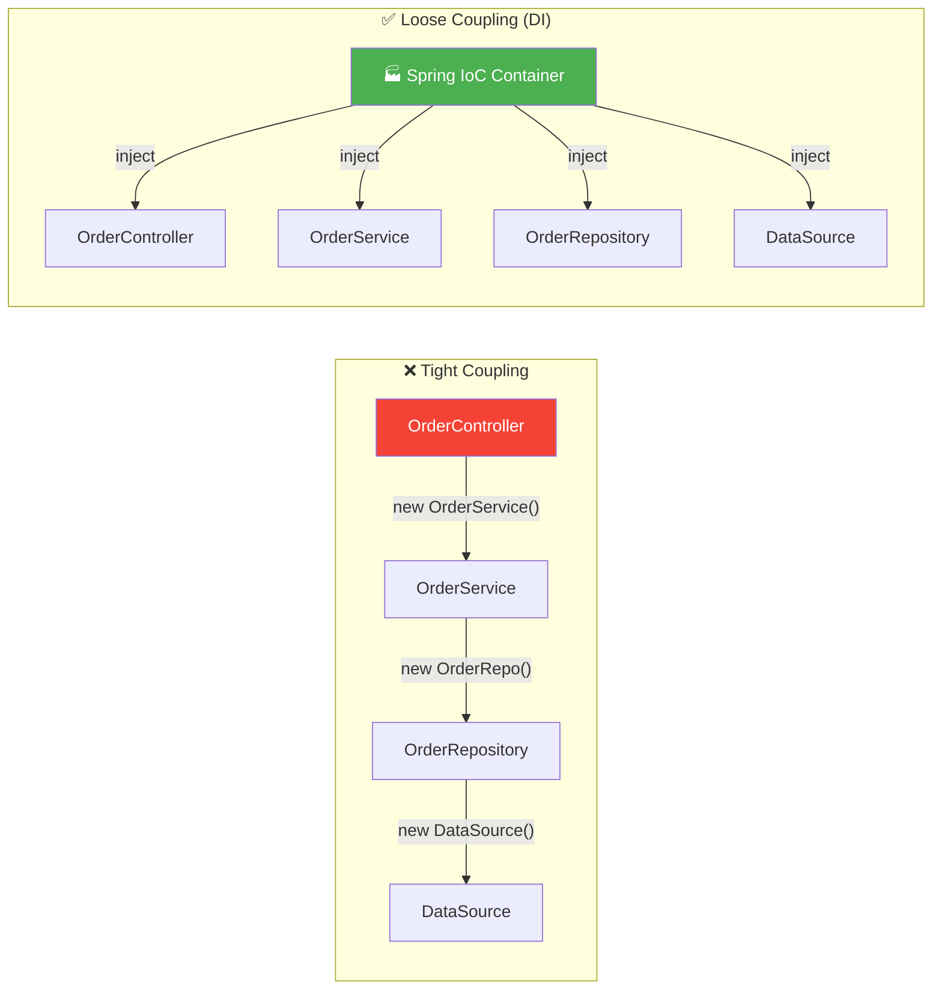
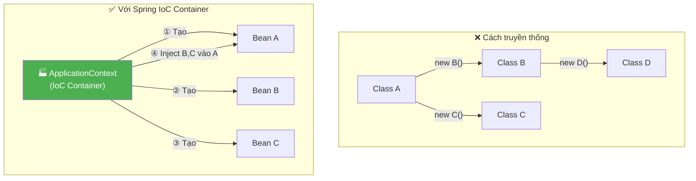
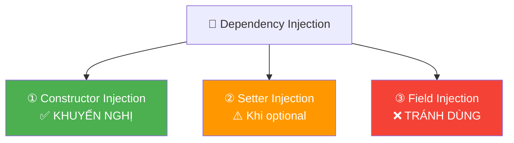
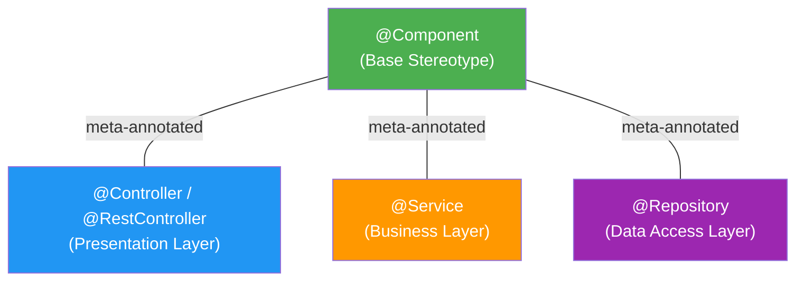
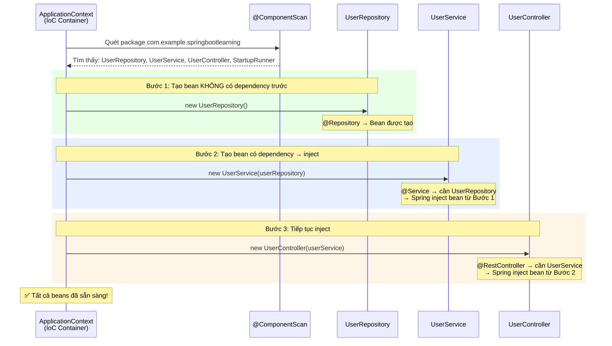
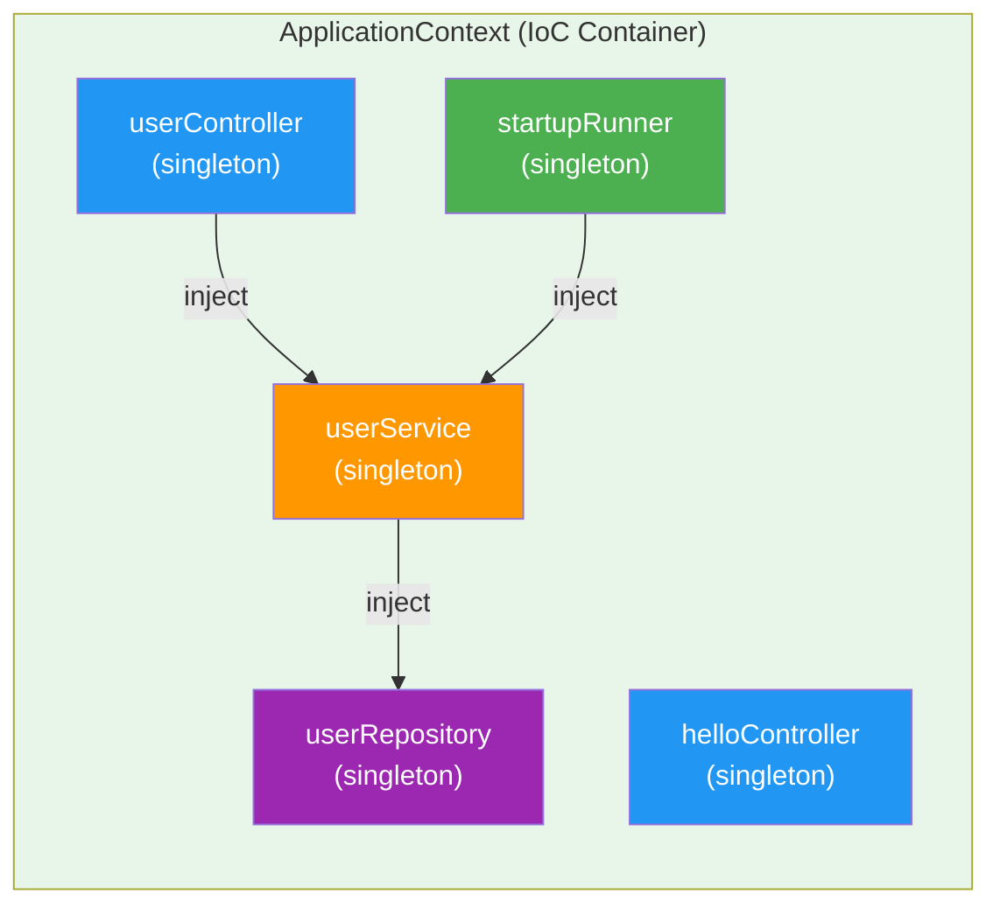
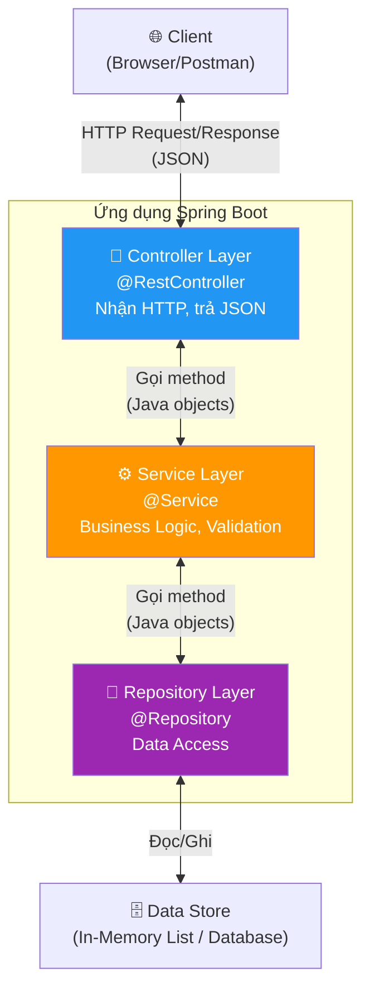
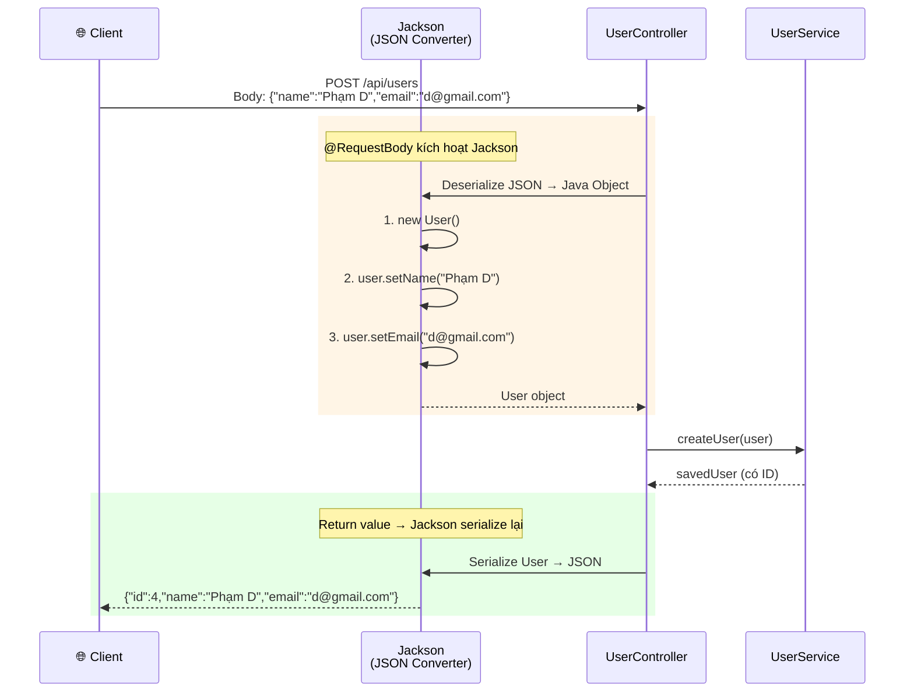

# 📘 BÀI 2: IoC Container & Dependency Injection — Trái Tim Của Spring

> **Giai đoạn:** 🟢 GĐ 1 — Nền Tảng & Khởi Động
> **Thời lượng ước tính:** 3-4 giờ
> **Yêu cầu tiên quyết:** Hoàn thành Bài 1

---

## 🎯 Mục tiêu bài học

Sau khi hoàn thành bài này, bạn sẽ:

- [ ] Hiểu vấn đề Tight Coupling và tại sao cần IoC/DI
- [ ] Hiểu bản chất Inversion of Control (IoC) — "Đừng gọi tôi, tôi sẽ gọi bạn"
- [ ] Hiểu Dependency Injection (DI) và phân biệt 3 cách inject
- [ ] Biết tại sao Constructor Injection là best practice
- [ ] Phân biệt `@Component`, `@Service`, `@Repository`, `@Controller` (Stereotype Annotations)
- [ ] Hiểu ApplicationContext — IoC Container của Spring
- [ ] Thực hành xây dựng ứng dụng CRUD với kiến trúc 3 tầng (Controller → Service → Repository)

---

## PHẦN 1: VẤN ĐỀ — TẠI SAO CẦN IoC/DI?

Trước khi học IoC/DI, hãy hiểu **vấn đề** mà nó giải quyết.

### 1.1. Tight Coupling — Khi class tự tạo dependency

```java
// ❌ CÁCH TRUYỀN THỐNG — Tight Coupling (phụ thuộc chặt)
public class OrderController {
    // Controller tự tạo Service bằng "new" → TIGHT COUPLING
    private OrderService orderService = new OrderService();
}
```

**Vấn đề phát sinh:**

| # | Vấn đề | Hậu quả |
|:---:|:---|:---|
| 1 | **Không thể thay thế** | Muốn đổi sang `OrderServiceV2` → phải sửa mọi nơi có `new OrderService()` |
| 2 | **Không thể test** | Muốn mock `OrderService` để unit test → không được vì đã `new` cứng |
| 3 | **Chuỗi phụ thuộc** | `OrderService` cần `OrderRepository`, `OrderRepository` cần `DataSource`... → phải `new` hết |
| 4 | **Vi phạm nguyên tắc OOP** | Vi phạm **Single Responsibility** — class phải lo cả việc tạo dependency |

### 1.2. Loose Coupling — Khi có ai đó "tiêm" dependency vào

```java
// ✅ VỚI DEPENDENCY INJECTION — Loose Coupling (phụ thuộc lỏng)
@RestController
public class OrderController {
    private final OrderService orderService;

    // Spring tự động inject OrderService → Controller KHÔNG CẦN BIẾT
    // OrderService được tạo như thế nào, ở đâu, cấu hình ra sao
    public OrderController(OrderService orderService) {
        this.orderService = orderService;
    }
}
```

### 1.3. So sánh trực quan



| | Tight Coupling | Loose Coupling (DI) |
|:---|:---|:---|
| **Ai tạo đối tượng?** | Lập trình viên (`new`) | Spring Container tạo |
| **Ai quyết định dependency?** | Class tự quyết | Container quyết định và inject |
| **Thay thế implementation?** | Phải sửa code | Chỉ cần cấu hình/đổi bean |
| **Unit test?** | Rất khó mock | Dễ dàng mock qua constructor |
| **Bảo trì?** | Sửa 1 chỗ → ảnh hưởng nhiều chỗ | Mỗi class độc lập |

---

## PHẦN 2: IoC — INVERSION OF CONTROL

### 2.1. Định nghĩa

**IoC (Inversion of Control) = Đảo ngược quyền kiểm soát.**

- **Bình thường:** Bạn (lập trình viên) kiểm soát việc tạo đối tượng → `new OrderService()`
- **Với IoC:** Bạn **nhường quyền** cho framework (Spring) → Spring tạo đối tượng và quản lý chúng

> **Hollywood Principle:** *"Don't call us, we'll call you"* (Đừng gọi chúng tôi, chúng tôi sẽ gọi bạn).
>
> Thay vì class A tự đi tìm và tạo class B, Spring Container sẽ tạo B rồi **"tiêm" (inject)** vào A.

### 2.2. IoC trong Spring



> [!NOTE]
> **Bean** là tên gọi của một đối tượng Java được Spring IoC Container tạo ra và quản lý. Khi bạn đánh dấu class bằng `@Component`, `@Service`, `@Repository`, hoặc `@Controller` — Spring sẽ tự tạo **một instance** (bean) của class đó và đưa vào container.

#### 📌 Bản chất của Bean: Bean là Class hay Function?

> ⚠️ **Khẳng định cốt lõi:**
> - **Bean KHÔNG PHẢI là Class, cũng KHÔNG PHẢI là Function.**
> - Bean là **ĐỐI TƯỢNG (Instance / Object cụ thể)** được sinh ra trong bộ nhớ RAM và nằm dưới sự quản lý của Spring IoC Container.
> - **CẢ Class LẪN Function ĐỀU CÓ THỂ TẠO RA BEAN**, chứ không chỉ riêng Class!

**1. Phân biệt: Class / Function vs Bean**

Hãy nhớ lại nguyên lý Lập trình hướng đối tượng (OOP):

| Khái niệm | Thực tế là gì? | Ví dụ đời thực |
|:---|:---|:---|
| **Class** | Khuôn đúc / Bản vẽ thiết kế | Bản vẽ thiết kế chiếc xe hơi |
| **Function** | Công thức / Dây chuyền sản xuất | Quy trình lắp ráp xe |
| **Bean** | **Cục Object thật sự** nằm trong RAM do Spring giữ | **Chiếc xe thật chạy trên đường** |

> 🔑 **Ghi nhớ:** Bản vẽ không phải là chiếc xe, công thức không phải là chiếc xe. **Chỉ khi Spring chạy lệnh tạo ra đối tượng thật (Object)**, đối tượng đó mới được gọi là **Bean**.

---

**2. Hai cách để Spring tạo ra Bean**

Spring cung cấp **2 cách chính** để đưa một đối tượng vào Container:

```
                  ┌── Cách 1: Đánh dấu CLASS (@Component, @Service, @Repository, @Controller)
                  │           Spring tự nhìn class và tự gọi constructor (new)
ĐỐI TƯỢNG (BEAN) ─┤
                  └── Cách 2: Đánh dấu FUNCTION (@Bean bên trong @Configuration)
                              Spring chạy hàm, lấy giá trị RETURN làm Bean
```

##### Cách 1: Đánh dấu ở cấp CLASS (`@Component`, `@Service`, `@Repository`, `@RestController`)

* **Cách làm:** Bạn dán nhãn annotation lên đầu một Class.
* **Cơ chế:** Khi khởi động, Spring quét (Component Scan) thấy nhãn này, Spring sẽ tự động gọi constructor để `new` ra một đối tượng từ class đó và cất vào kho IoC Container.

```java
// Spring nhìn thấy @Service trên CLASS -> Spring tự new OrderService() -> Tạo thành 1 Bean
@Service
public class OrderService {
    public void processOrder() {
        System.out.println("Đang xử lý đơn hàng...");
    }
}
```

* **Khi nào dùng?** Dùng cho **code do chính bạn viết** trong dự án (Controller, Service, Repository của bạn).

##### Cách 2: Đánh dấu ở cấp FUNCTION (`@Bean` bên trong `@Configuration`)

* **Cách làm:** Bạn viết một hàm trả về một đối tượng, và gắn `@Bean` lên trên hàm đó (nằm trong một class có `@Configuration`).
* **Cơ chế:** Spring sẽ gọi hàm này chạy, **hứng lấy đối tượng được `return` ra** và đưa đối tượng đó vào kho làm Bean.

```java
@Configuration // Đánh dấu đây là class chuyên dùng để cấu hình Bean
public class AppConfig {

    // Gắn @Bean trên FUNCTION:
    // Spring sẽ chạy hàm này -> lấy đối tượng RestTemplate được return -> biến nó thành 1 Bean trong Container
    @Bean
    public RestTemplate restTemplate() {
        return new RestTemplate();
    }
}
```

* **Khi nào dùng?** Cực kỳ quan trọng khi bạn dùng **thư viện bên thứ 3** (Third-party library):
  * *Ví dụ:* Bạn thêm thư viện Jackson, RestTemplate, ModelMapper, PasswordEncoder... Code của họ đã đóng gói thành file `.jar` (chỉ đọc), bạn **không thể** mở file code của họ ra để gõ thêm chữ `@Component` lên đầu class được.
  * Vì vậy, bạn phải dùng **Cách 2**: Viết một hàm, tự `new` đối tượng thư viện đó ra rồi `return`, kèm `@Bean` để báo cho Spring biết: *"Hãy nhận lấy đối tượng này làm Bean giúp tôi!"*.

---

**3. Bảng so sánh tổng kết `@Component` vs `@Bean`**

| Tiêu chí | `@Component` (và `@Service`, `@Repository`...) | `@Bean` |
|:---|:---|:---|
| **Vị trí khai báo** | Trên đầu **Class** | Trên đầu **Method (Hàm)** |
| **Nằm trong đâu?** | Bất kỳ class nào trong package được quét | Thường nằm trong class có `@Configuration` |
| **Ai gọi lệnh `new`?** | Spring tự động gọi ngầm ở hậu trường | **Chính bạn tự gõ `return new ...()`** trong hàm |
| **Dùng khi nào?** | Class do **bạn tự viết** mã nguồn | Class từ **thư viện ngoài** (không sửa được code gốc) hoặc cần logic khởi tạo phức tạp |
| **Kết quả cuối cùng** | Đều tạo ra **1 Bean** trong Spring IoC Container | Đều tạo ra **1 Bean** trong Spring IoC Container |

---

## PHẦN 3: DEPENDENCY INJECTION — 3 CÁCH INJECT

**Dependency Injection (DI)** là *cơ chế cụ thể* để thực hiện IoC. "Inject" = "tiêm" dependency vào class.

### 3.1. Sơ đồ 3 cách inject



### 3.2. Chi tiết từng cách

> 🔍 **`@Autowired` là gì?**
> - **Dịch sát nghĩa:** *"Tự động đấu dây / Tự động kết nối"* (*Auto* + *Wired*).
> - **Ý nghĩa trong Spring:** `@Autowired` là một annotation dùng để ra lệnh cho Spring IoC Container:
>   > *"Tôi cần đối tượng này để làm việc. Hãy tự động tìm một Bean phù hợp trong kho và tiêm (inject) vào đây giúp tôi, tôi không muốn tự gọi lệnh new!"*

#### ① Constructor Injection ✅ (Khuyến nghị nhất)

```java
@RestController
public class UserController {
    private final UserService userService;  // ← "final" = immutable

    // Từ Spring 4.3+: nếu chỉ có 1 constructor → KHÔNG CẦN @Autowired
    public UserController(UserService userService) {
        this.userService = userService;     // ← Spring inject vào đây
    }
}
```

#### ② Setter Injection ⚠️ (Khi dependency là optional)

```java
@RestController
public class UserController {
    private UserService userService;  // ← KHÔNG thể dùng "final"

    @Autowired  // ← BẮT BUỘC phải có @Autowired
    public void setUserService(UserService userService) {
        this.userService = userService;
    }
}
```

#### ③ Field Injection ❌ (Tránh dùng)

```java
@RestController
public class UserController {
    @Autowired
    private UserService userService;  // ← Inject trực tiếp vào field
    // Không có constructor, không có setter
}
```

### 3.3. So sánh chi tiết

| Tiêu chí | Constructor Injection ✅ | Setter Injection | Field Injection ❌ |
|:---|:---|:---|:---|
| **`final` field?** | ✅ Có thể | ❌ Không thể | ❌ Không thể |
| **Immutable?** | ✅ Có | ❌ Không (có thể set lại) | ❌ Không |
| **Cần `@Autowired`?** | ❌ Không (nếu 1 constructor) | ✅ Bắt buộc | ✅ Bắt buộc |
| **Phát hiện thiếu dependency?** | ✅ Fail-fast tại startup | ⚠️ Có thể null nếu optional | ⚠️ Có thể null |
| **Dễ unit test?** | ✅ Truyền mock qua constructor | ⚠️ Cần gọi setter | ❌ Phải dùng Reflection |
| **Dependency rõ ràng?** | ✅ Nhìn constructor biết ngay | ⚠️ Phải tìm setter | ❌ Dependency ẩn |
| **Spring team khuyến nghị?** | ✅ **Chính thức** | ⚠️ Cho optional deps | ❌ Không khuyến nghị |

> [!IMPORTANT]
> **Quy tắc vàng: Luôn dùng Constructor Injection.**
>
> - `final` đảm bảo dependency **không bị thay đổi** sau khi tạo bean → an toàn hơn
> - Nếu thiếu dependency, Spring sẽ **fail-fast tại startup** (ứng dụng không khởi động được) → phát hiện lỗi sớm
> - Lưu ý: "fail-fast tại startup" là lỗi **runtime khi Spring tạo bean**, KHÔNG phải lỗi Java compile-time
> - Từ Spring 4.3+: nếu class chỉ có **1 constructor**, `@Autowired` **có thể bỏ** — Spring tự hiểu

---

## PHẦN 4: SPRING BEAN & STEREOTYPE ANNOTATIONS

### 4.1. Spring Bean là gì?

**Bean** = một đối tượng Java được Spring IoC Container **tạo ra, quản lý, và tiêm** vào nơi cần dùng.

Cách "đăng ký" một class thành Bean:

| Cách | Annotation | Khi nào dùng |
|:---|:---|:---|
| **Stereotype Annotation** | `@Component`, `@Service`, `@Repository`, `@Controller` | Class do **bạn viết** |
| **`@Bean` method** | Trong class `@Configuration` | Class từ **thư viện bên ngoài** (không sửa source code được) — sẽ học ở Bài 3 |

### 4.2. Stereotype Annotations — Đánh dấu theo tầng kiến trúc

| Annotation | Ý nghĩa | Tầng (Layer) | Hành vi riêng |
|:---|:---|:---|:---|
| `@Component` | Bean tổng quát | Bất kỳ | Không có hành vi riêng |
| `@Controller` / `@RestController` | Bean xử lý HTTP | Presentation | Được Spring MVC nhận diện |
| `@Service` | Bean chứa business logic | Service/Business | Không có hành vi riêng (chỉ mang ý nghĩa ngữ nghĩa) |
| `@Repository` | Bean truy cập database | Data Access | **Tự dịch** exception → `DataAccessException` |

#### 🔍 "Hành vi riêng" (Specialized Behavior) ở đây có nghĩa là gì?

**"Hành vi riêng"** có nghĩa là: Ngoài việc được Spring tạo thành một Bean bình thường, class đó **có được Spring "ưu ái" gắn thêm tính năng đặc biệt hay xử lý ngầm nào khác hay không?**

##### 1. Bản chất nguồn gốc: Tất cả đều là `@Component`
Trước tiên, nếu bạn mở mã nguồn Java của Spring ra xem ruột của `@Controller`, `@Service`, `@Repository`, bạn sẽ thấy:
```java
@Component // ← Cả 3 thằng này đều được bọc bởi @Component bên trong!
public @interface Service { ... }
```
Cả 4 nhãn đều làm được một việc cơ bản giống nhau: **Tạo ra 1 Bean đưa vào IoC Container**. Nhưng sự khác biệt nằm ở chỗ: **Spring Framework có can thiệp thêm "ma thuật" gì vào class đó hay không?**

##### 2. Giải thích chi tiết "Hành vi riêng" của từng annotation

* **① `@Component` — Không có hành vi riêng:**
  * **Ý nghĩa:** Đây là nhãn "nguyên thủy" và mộc mạc nhất.
  * Spring chỉ đơn thuần gọi constructor `new` nó ra, cất vào kho để inject khi cần. Spring **không can thiệp thêm bất kỳ tính năng phụ trợ nào**.
  * *Dùng cho:* Các class tiện ích (Helper, Utility), cấu hình lặt vặt.

* **② `@Controller` / `@RestController` — Có hành vi riêng về HTTP:**
  * **Hành vi riêng:**
    * Spring MVC sẽ chủ động tìm đến class này và đăng ký nó vào **bộ định tuyến mạng (DispatcherServlet)**.
    * Chỉ khi có nhãn này, các hàm bên trong mới có thể đón nhận request từ Internet qua các nhãn HTTP như `@GetMapping`, `@PostMapping`, `@RequestBody`, `@PathVariable`.
    * Riêng `@RestController` còn có hành vi: **Tự động chuyển đổi dữ liệu Java (Object) thành chuỗi JSON** để trả về cho trình duyệt / client.
  * ⚠️ *Nếu bạn thay `@RestController` bằng `@Component`:* Class đó vẫn là Bean, nhưng Spring MVC sẽ **lờ nó đi**. Người dùng gọi `http://localhost:8080/api/users` sẽ bị **lỗi 404 Not Found** ngay lập tức vì không ai đứng ra tiếp nhận request HTTP!

* **③ `@Repository` — Có hành vi riêng về Database (Tự dịch ngoại lệ):**
  * **Hành vi riêng:**
    * Spring tự động kích hoạt cơ chế: **Tự động dịch lỗi Database** (*Automatic Exception Translation* qua `PersistenceExceptionTranslationPostProcessor`).
    * Mỗi hệ quản trị CSDL (MySQL, PostgreSQL, Oracle) hoặc mỗi thư viện (JDBC, Hibernate) khi bị lỗi sẽ ném ra các exception rất khác nhau và khó hiểu (như `SQLException`, `HibernateException`...).
    * `@Repository` sẽ làm nhiệm vụ như một **"phiên dịch viên"**: Nó tự động bắt các lỗi dị biệt của từng hãng database và dịch thành một chuẩn chung duy nhất của Spring: **`DataAccessException`** (ví dụ `DuplicateKeyException`, `CannotGetJdbcConnectionException`...).
  * 💡 *Lợi ích:* Tầng Service ở trên chỉ cần bắt 1 loại lỗi chung của Spring, sau này dự án của bạn có đổi từ MySQL sang PostgreSQL thì tầng Service **không phải sửa một dòng code nào**! Nếu bạn chỉ dùng `@Component`, tính năng "dịch lỗi" này sẽ không hoạt động.

* **④ `@Service` — Không có hành vi riêng (Chỉ mang ý nghĩa ngữ nghĩa):**
  * **Ý nghĩa:** Về mặt kỹ thuật, `@Service` hiện tại hoạt động **y hệt 100% `@Component`**, Spring không can thiệp thêm tính năng ngầm nào cả.
  * *Vậy tại sao vẫn tạo ra `@Service`?*
    1. **Tính rõ ràng (Semantics):** Giúp bạn và đồng đội đọc code là hiểu ngay: *"Class này chứa logic nghiệp vụ kiếm tiền của công ty (tính tiền, trừ điểm, gửi email...)"*.
    2. **Tiện cho AOP (Aspect-Oriented Programming):** Sau này nếu bạn muốn viết chức năng: *"Hãy đo thời gian chạy của tất cả các class ở tầng Service"*, bạn chỉ cần chỉ định: `@Pointcut("within(@org.springframework.stereotype.Service *)")` là xong.

##### 3. Ví dụ hình ảnh đời thực để dễ nhớ

| Annotation | Tương đương trong công ty | Hành vi riêng |
|:---|:---|:---|
| **`@Component`** | **Nhân viên thông thường** | Làm đúng việc được giao, không có đặc quyền gì. |
| **`@RestController`** | **Nhân viên Lễ tân** | Có đặc quyền ngồi ở cửa ra vào, tiếp đón và nói chuyện với khách lạ từ bên ngoài bước vào (Request HTTP). |
| **`@Repository`** | **Nhân viên Kho kiêm Phiên dịch** | Làm việc trực tiếp với nhà cung cấp nước ngoài (Database). Mọi hóa đơn chứng từ phức tạp từ bên ngoài đều được người này dịch sang tiếng Việt chuẩn (`DataAccessException`) trước khi đưa lên sếp. |
| **`@Service`** | **Nhân viên Kế toán / Nghiệp vụ** | Về quyền hạn thì vẫn là nhân viên bình thường (như `@Component`), nhưng đeo biển tên riêng để mọi người biết đây là khối chuyên xử lý nghiệp vụ. |

### 4.3. Mối quan hệ giữa các Stereotype Annotations



> [!NOTE]
> **Meta-annotated = Annotation lồng annotation.**
>
> Bên trong source code của `@Service`, Spring đã gắn `@Component` lên nó:
> ```java
> @Component  // ← @Service được meta-annotated với @Component
> public @interface Service { }
> ```
>
> Đây là **annotation composition** (tổ hợp annotation), KHÔNG phải class inheritance (Java annotation không có kế thừa). Khi Spring quét `@Component`, nó cũng tìm thấy các annotation được meta-annotated với `@Component` → nên `@Service`, `@Repository`, `@Controller` đều được phát hiện.
>
> **Câu hỏi phỏng vấn:** *"Nếu thay `@Service` bằng `@Component` thì có chạy không?"* → **Có**, vì `@Service` bản chất là `@Component`. Nhưng **KHÔNG NÊN** vì mất ý nghĩa ngữ nghĩa — nhìn code không biết class thuộc tầng nào.

---

## PHẦN 5: ApplicationContext — IoC CONTAINER

### 5.1. ApplicationContext là gì?

`ApplicationContext` là **trung tâm** của Spring — nơi **tạo, quản lý, và inject** tất cả beans.

| Trách nhiệm | Giải thích |
|:---|:---|
| **Instantiation** (Tạo) | Tạo instance của các class có `@Component`, `@Service`... |
| **Configuration** (Cấu hình) | Đọc `application.properties`, áp dụng Auto-Configuration |
| **Wiring** (Lắp ráp) | Phân tích dependency → inject bean này vào bean kia |
| **Lifecycle** (Vòng đời) | Quản lý từ lúc tạo bean đến khi destroy (sẽ học ở Bài 3) |

### 5.2. Luồng tạo và inject beans

Khi Spring Boot khởi động, ApplicationContext thực hiện:



### 5.3. Sơ đồ beans trong project hiện tại



> [!NOTE]
> **Singleton** (mặc định): Spring chỉ tạo **1 instance** cho mỗi bean. Cả `UserController` và `StartupRunner` đều inject **cùng một** `UserService` object. Các scope khác (Prototype, Request, Session) sẽ học ở Bài 3.

---

## PHẦN 6: KIẾN TRÚC 3 TẦNG (LAYERED ARCHITECTURE)

### 6.1. Tại sao chia tầng?



### 6.2. Quy tắc mỗi tầng

| Tầng | Biết gì? | KHÔNG biết gì? | Trách nhiệm |
|:---|:---|:---|:---|
| **Controller** | HTTP, JSON, URL mapping | Database, SQL, business rules phức tạp | Nhận request → gọi Service → trả response |
| **Service** | Business logic, validation rules | HTTP, request/response, database details | Xử lý logic → gọi Repository |
| **Repository** | Data access, CRUD operations | HTTP, business rules | Đọc/ghi dữ liệu |

> [!IMPORTANT]
> **Nguyên tắc:** Mỗi tầng chỉ gọi tầng **ngay bên dưới**. Controller gọi Service, Service gọi Repository. Controller **KHÔNG** gọi trực tiếp Repository — vì bỏ qua tầng business logic sẽ khiến code khó bảo trì.

---

## PHẦN 7: CODE THỰC HÀNH — GIẢI THÍCH CHI TIẾT

Project đã được cập nhật với kiến trúc 3 tầng hoàn chỉnh. Dưới đây là giải thích từng file:

### 7.1. `User.java` — Model (POJO)

Xem file: [`User.java`](file:///Users/vovantu/HTML_CSS/JAVA%20/springboot-learning/src/main/java/com/example/springbootlearning/model/User.java)

| Thành phần | Vai trò | Ai cần? |
|:---|:---|:---|
| Constructor mặc định `User()` | Jackson cần để deserialize JSON → Object | `@RequestBody` |
| Constructor `User(id, name, email)` | Tạo object thuận tiện | Repository (seed data) |
| Getter methods | Jackson cần để serialize Object → JSON | `@ResponseBody` |
| Setter methods | Jackson cần để set value khi deserialize | `@RequestBody` |
| `toString()` | In thông tin user khi log/debug | Logger |

### 7.2. `UserRepository.java` — Tầng Data Access

Xem file: [`UserRepository.java`](file:///Users/vovantu/HTML_CSS/JAVA%20/springboot-learning/src/main/java/com/example/springbootlearning/repository/UserRepository.java)

- Đánh dấu `@Repository` → Spring tạo bean và đưa vào container
- Dùng `List<User>` trong bộ nhớ thay database (tạm thời, Bài 9 sẽ dùng JPA)
- Dùng `AtomicLong` để tạo ID tự tăng (thread-safe)
- Return `Optional<User>` thay vì `null` → ép buộc caller xử lý trường hợp "không tìm thấy"

### 7.3. `UserService.java` — Tầng Business Logic

Xem file: [`UserService.java`](file:///Users/vovantu/HTML_CSS/JAVA%20/springboot-learning/src/main/java/com/example/springbootlearning/service/UserService.java)

**Đây là file quan trọng nhất của Bài 2** — minh họa Dependency Injection:

```java
@Service
public class UserService {
    private final UserRepository userRepository;  // ← dependency

    // 🔑 Constructor Injection — Spring tự inject UserRepository vào đây
    public UserService(UserRepository userRepository) {
        this.userRepository = userRepository;
    }
}
```

**Luồng DI xảy ra như sau:**

```
Spring khởi động
  → Quét package, tìm @Repository trên UserRepository → tạo bean
  → Quét package, tìm @Service trên UserService
  → Thấy constructor cần UserRepository
  → Tìm trong container: có bean UserRepository rồi!
  → Inject vào → new UserService(userRepository)
  → ✅ UserService sẵn sàng!
```

### 7.4. `UserController.java` — Tầng HTTP

Xem file: [`UserController.java`](file:///Users/vovantu/HTML_CSS/JAVA%20/springboot-learning/src/main/java/com/example/springbootlearning/controller/UserController.java)

| API | Method | URL | Mô tả | Annotation mới |
|:---|:---|:---|:---|:---|
| Lấy tất cả | `GET` | `/api/users` | Trả về danh sách users | `@RequestMapping` (prefix) |
| Lấy theo ID | `GET` | `/api/users/{id}` | Trả về 1 user | `@PathVariable` |
| Tạo mới | `POST` | `/api/users` | Tạo user từ JSON body | `@RequestBody` |
| Xóa | `DELETE` | `/api/users/{id}` | Xóa user theo ID | `@DeleteMapping` |

**`@RequestBody` hoạt động thế nào?**



### 7.5. Chuỗi DI hoàn chỉnh trong project

```
Spring Container tạo beans theo thứ tự dependency:

  ① UserRepository (không cần dependency nào)
       ↓ inject vào
  ② UserService (cần UserRepository)
       ↓ inject vào
  ③ UserController (cần UserService)
  ③ StartupRunner (cũng cần UserService → dùng CÙNG instance!)
```

---

## PHẦN 8: KẾT QUẢ CHẠY THỰC TẾ

### Log khởi động — Chứng minh DI hoạt động

```
✅ UserService đã được tạo — UserRepository được inject thành công!
Tomcat started on port 8080
Started SpringbootLearningApplication in 0.49 seconds

📋 Users hiện có trong hệ thống (seed data):
   User{id=1, name='Nguyễn Văn A', email='a@gmail.com'}
   User{id=2, name='Trần Thị B', email='b@gmail.com'}
   User{id=3, name='Lê Văn C', email='c@gmail.com'}
```

### Test API

#### GET `/api/users` — Lấy tất cả users
```json
[
    {"id": 1, "name": "Nguyễn Văn A", "email": "a@gmail.com"},
    {"id": 2, "name": "Trần Thị B", "email": "b@gmail.com"},
    {"id": 3, "name": "Lê Văn C", "email": "c@gmail.com"}
]
```

#### GET `/api/users/1` — Lấy user theo ID
```json
{"id": 1, "name": "Nguyễn Văn A", "email": "a@gmail.com"}
```

#### POST `/api/users` — Tạo user mới
```bash
curl -X POST http://localhost:8080/api/users \
  -H "Content-Type: application/json" \
  -d '{"name":"Phạm Văn D","email":"d@gmail.com"}'
```
```json
{"id": 4, "name": "Phạm Văn D", "email": "d@gmail.com"}
```

#### DELETE `/api/users/4` — Xóa user
```
Đã xóa user với id: 4
```

#### GET `/api/users/999` — User không tồn tại
```json
{"timestamp":"...","status":500,"error":"Internal Server Error","path":"/api/users/999"}
```

> Lỗi 500 khi user không tồn tại là bình thường ở giai đoạn này. Bài 7 sẽ học **Global Exception Handling** để trả về response lỗi đẹp hơn (ví dụ: `{"status":404,"message":"User không tồn tại"}`).

---

## PHẦN 9: BÀI TẬP TỰ LUYỆN

### Bài tập 1: Tạo ProductService ⭐⭐

Tạo kiến trúc 3 tầng cho **Product** (giống User):

| File cần tạo | Package | Gợi ý |
|:---|:---|:---|
| `Product.java` | `model` | Fields: `id`, `name`, `price`, `category` |
| `ProductRepository.java` | `repository` | `@Repository`, in-memory List |
| `ProductService.java` | `service` | `@Service`, Constructor Injection |
| `ProductController.java` | `controller` | `@RestController`, CRUD APIs tại `/api/products` |

### Bài tập 2: Thử Field Injection (để hiểu tại sao KHÔNG nên dùng) ⭐

1. Trong `UserController`, thử đổi sang Field Injection:
```java
@Autowired
private UserService userService;
// Xóa constructor
```
2. Chạy app → vẫn hoạt động
3. Thử viết unit test cho `UserController` → thấy khó mock `UserService` hơn
4. **Đổi lại Constructor Injection** sau khi thử

### Bài tập 3: Xem danh sách Beans ⭐

Thêm code vào `StartupRunner` để in ra tất cả beans Spring đang quản lý:

```java
// Trong StartupRunner, thêm inject ApplicationContext
private final ApplicationContext context;

// In danh sách bean names
String[] beanNames = context.getBeanDefinitionNames();
Arrays.sort(beanNames);
for (String name : beanNames) {
    System.out.println("  Bean: " + name);
}
```

---

## PHẦN 10: CÂU HỎI ÔN TẬP (PHỎNG VẤN)

| # | Câu hỏi | Gợi ý trả lời |
|:---:|:---|:---|
| 1 | **IoC là gì?** | Inversion of Control — đảo ngược quyền tạo và quản lý đối tượng từ lập trình viên sang framework (Spring Container) |
| 2 | **DI là gì? Khác IoC thế nào?** | DI là cơ chế cụ thể để thực hiện IoC — "tiêm" dependency vào class thay vì class tự `new` |
| 3 | **Có mấy cách inject? Cách nào tốt nhất?** | 3 cách: Constructor (✅ best), Setter, Field (❌). Constructor Injection vì immutable, fail-fast, dễ test |
| 4 | **Tại sao Constructor Injection tốt hơn Field Injection?** | `final` + immutable, fail-fast tại startup, không cần `@Autowired`, dễ unit test (truyền mock qua constructor) |
| 5 | **`@Component` vs `@Service` vs `@Repository` khác gì?** | Đều là stereotype annotation → tạo bean. Khác ở ngữ nghĩa tầng kiến trúc. `@Repository` có thêm exception translation |
| 6 | **Thay `@Service` bằng `@Component` có chạy không?** | Có, vì `@Service` meta-annotated với `@Component`. Nhưng KHÔNG NÊN vì mất ý nghĩa kiến trúc |
| 7 | **ApplicationContext là gì?** | IoC Container của Spring — chịu trách nhiệm tạo, cấu hình, inject, và quản lý lifecycle của beans |
| 8 | **Bean là gì?** | Đối tượng Java được Spring Container tạo và quản lý. Mặc định là Singleton (chỉ 1 instance) |
| 9 | **Khi nào Spring KHÔNG cần `@Autowired`?** | Từ Spring 4.3+, nếu class chỉ có 1 constructor thì Spring tự hiểu → không cần `@Autowired` |
| 10 | **Tại sao tách 3 tầng (Controller/Service/Repository)?** | Separation of Concerns — mỗi tầng lo 1 việc. Dễ test, dễ bảo trì, dễ thay đổi implementation |

---

## PHẦN 11: TỔNG HỢP ANNOTATIONS BÀI 2

| Annotation | Thuộc về | Ý nghĩa |
|:---|:---|:---|
| `@Component` | Spring Core | Đánh dấu class là Spring Bean (tổng quát) |
| `@Service` | Spring Core | Bean tầng Business Logic (meta-annotated `@Component`) |
| `@Repository` | Spring Core | Bean tầng Data Access + exception translation |
| `@RestController` | Spring MVC | Bean tầng HTTP (= `@Controller` + `@ResponseBody`) |
| `@Autowired` | Spring Core | Đánh dấu nơi inject dependency (có thể bỏ nếu 1 constructor) |
| `@RequestMapping("/path")` | Spring MVC | Prefix URL cho tất cả endpoint trong class |
| `@GetMapping` | Spring MVC | Map HTTP GET request |
| `@PostMapping` | Spring MVC | Map HTTP POST request |
| `@DeleteMapping` | Spring MVC | Map HTTP DELETE request |
| `@RequestBody` | Spring MVC | Deserialize JSON body → Java Object (nhờ Jackson) |
| `@PathVariable` | Spring MVC | Lấy giá trị từ URL path (`/users/{id}`) |

---

## ✅ CHECKLIST HOÀN THÀNH BÀI 2

- [ ] Hiểu Tight Coupling vs Loose Coupling
- [ ] Hiểu IoC — "Đảo ngược quyền kiểm soát"
- [ ] Hiểu 3 cách DI, biết tại sao Constructor Injection tốt nhất
- [ ] Phân biệt `@Component`, `@Service`, `@Repository`, `@Controller`
- [ ] Hiểu ApplicationContext — IoC Container
- [ ] Chạy app, test CRUD API thành công (GET, POST, DELETE)
- [ ] Hiểu chuỗi DI: Repository → Service → Controller
- [ ] Hoàn thành bài tập tự luyện
- [ ] Trả lời được câu hỏi phỏng vấn

---

## 📖 Kiến thức Java bổ sung trong bài

| Kiến thức | Gặp ở đâu | Giải thích |
|:---|:---|:---|
| **`Optional<T>`** | `UserRepository.findById()` | Container chứa hoặc không chứa giá trị. Dùng `.orElseThrow()` thay vì check `null` |
| **Stream API** | `users.stream().filter(...).findFirst()` | API lọc, biến đổi collection theo kiểu functional |
| **`AtomicLong`** | `UserRepository.idCounter` | Biến đếm thread-safe (an toàn khi nhiều thread truy cập đồng thời) |
| **`Collections.unmodifiableList()`** | `UserRepository.findAll()` | Trả về view read-only, bảo vệ dữ liệu nội bộ |
| **SLF4J Logger** | `UserService` | Cách log chuẩn trong Spring Boot: `log.info()`, `log.debug()`, `log.warn()`, `log.error()` |

---

> **Tiếp theo:** 📘 **Bài 3: Bean Lifecycle, Bean Scope & Cấu Hình Nâng Cao**
> Bạn sẽ học vòng đời của Bean, các scope (Singleton, Prototype...), `@Configuration` + `@Bean`, `@Qualifier`, `@Primary`, và `@Value`. Hãy nói "Dạy Bài 3" khi bạn sẵn sàng!
