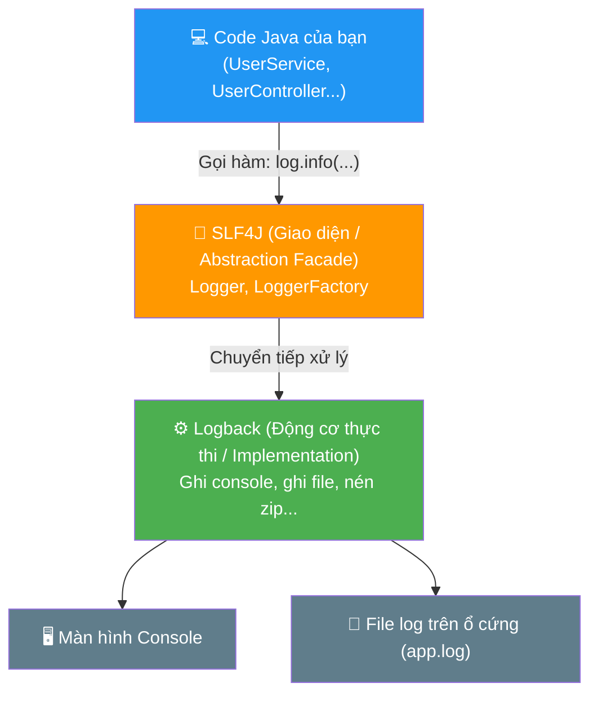
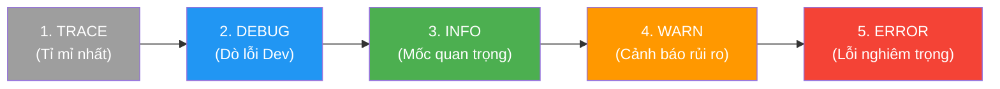

# 📘 BÀI 2 (Chuyên đề): Cơ Chế Logging Trong Spring Boot — SLF4J & Logback vs `System.out.println()`

> **Mục tiêu:** Hiểu rõ bản chất cơ chế ghi log trong ứng dụng doanh nghiệp. Nắm vững lý do tại sao `System.out.println()` bị cấm trong môi trường Production và cách sử dụng SLF4J / Logback chuẩn chỉ trong Spring Boot.

---

## MỤC LỤC

| Phần | Nội dung | Trọng tâm |
|:---:|:---|:---|
| 1 | Tổng quan & Bản chất kiến trúc | SLF4J (Facade) vs Logback (Implementation) |
| 2 | Mổ xẻ chi tiết cú pháp khai báo | `private static final Logger log = ...` |
| 3 | 5 lý do "sống còn": Tại sao cấm `System.out.println()`? | Performance, Log Level, Config, File Rolling, Context |
| 4 | 5 Cấp độ Log (Log Levels) trong thực tế | TRACE, DEBUG, INFO, WARN, ERROR |
| 5 | Parameterized Logging: Sức mạnh của Placeholder `{}` | Tiết kiệm CPU & RAM như thế nào? |
| 6 | Cấu hình Logging trong `application.properties` | Đổi level động, ghi log ra file |
| 7 | Thực tế dự án: Phân tích code trong `UserService.java` | Áp dụng đúng level cho từng tình huống |
| 8 | Mẹo hiện đại: Lombok `@Slf4j` | Rút gọn code chỉ với 1 annotation |
| 9 | Câu hỏi phỏng vấn thường gặp | Cheat-sheet chuẩn bị phỏng vấn |

---

## PHẦN 1: TỔNG QUAN & BẢN CHẤT KIẾN TRÚC LOGGING

Trong các dự án Java doanh nghiệp và Spring Boot, việc in thông tin ra màn hình bằng `System.out.println()` là một **Bad Practice** (thói quen xấu bị cấm trên Production). Thay vào đó, Spring Boot tích hợp sẵn hệ thống logging chuẩn mực gồm 2 thành phần: **SLF4J** và **Logback**.



### 1.1. Phân biệt SLF4J vs Logback

* **SLF4J (Simple Logging Facade for Java):**
  * Là một **giao diện (Interface / Facade)**, không trực tiếp ghi log.
  * Nó đóng vai trò như chiếc "vô lăng xe hơi". Bạn lái xe chỉ cần biết xoay vô lăng (gọi hàm `log.info()`, `log.error()`), không cần quan tâm động cơ bên dưới là xăng hay điện.
  * *Lợi ích:* Sau này dự án muốn đổi sang động cơ khác (như Log4j2), code của bạn **không cần sửa một dòng nào**.

* **Logback:**
  * Là **động cơ thực thi thật sự (Implementation)** đứng phía sau SLF4J.
  * Chịu trách nhiệm format ngày giờ, ghi ra console, ghi ra file ổ cứng, nén file zip...
  * Được viết bởi chính tác giả của Log4j, nhưng có hiệu năng cao hơn và tiết kiệm bộ nhớ hơn.

> [!NOTE]
> Khi bạn thêm dependency `spring-boot-starter-web`, Spring Boot đã tự động kéo theo `spring-boot-starter-logging` (chứa sẵn SLF4J + Logback). Bạn **không cần cài thêm bất kỳ thư viện nào**!

---

## PHẦN 2: MỔ XẺ CHI TIẾT CÚ PHÁP KHAI BÁO

Trong `UserService.java`, bạn bắt gặp dòng code:

```java
private static final Logger log = LoggerFactory.getLogger(UserService.class);
```

Hãy phân tích chi tiết từng từ khóa:

| Thành phần | Ý nghĩa chi tiết | Tại sao phải làm vậy? |
|:---|:---|:---|
| `private` | Chỉ dùng trong nội bộ class `UserService` | Đảm bảo tính đóng gói (Encapsulation), không cho class khác dùng ké logger của class này. |
| `static` | Thuộc về Class, không thuộc về Object | Dù bạn có tạo ra 1 hay 1.000 instance của `UserService`, **chỉ có duy nhất 1 Logger được tạo ra**, tiết kiệm RAM tối đa. |
| `final` | Hằng số, không thể gán lại | Đảm bảo biến `log` không bao giờ bị trỏ sang một đối tượng khác trong suốt quá trình chạy. |
| `Logger` | Kiểu dữ liệu Interface (của `org.slf4j.Logger`) | Chuẩn giao diện để gọi các hàm `.info()`, `.debug()`, `.warn()`, `.error()`. |
| `LoggerFactory.getLogger(...)` | Nhà máy sinh Logger | Tạo và cấu hình Logger theo đúng tiêu chuẩn. |
| `UserService.class` | Truyền class hiện tại vào tham số | **Cực kỳ quan trọng:** Giúp Logger biết những dòng log này sinh ra từ class nào để in tên class đó lên màn hình! |

---

## PHẦN 3: 5 LÝ DO TẠI SAO CẤM `System.out.println()`

```
                ┌── ① Hiệu năng: println là Blocking I/O làm nghẽn luồng
                ├── ② Không có Log Level: Bất lực khi cần tắt bớt log trên Production
TẠI SAO CẤM?  ──┼── ③ Ngữ cảnh kém: Không có ngày giờ, Thread, Class
                ├── ④ Không lưu trữ: Tắt ứng dụng là mất trắng
                └── ⑤ Tốn RAM: Ghép chuỗi bằng dấu '+' gây lãng phí bộ nhớ
```

### 3.1. So sánh trực quan

| Tiêu chí | `System.out.println()` (In cơ bản) | `Logger` (SLF4J + Logback) |
|:---|:---|:---|
| **Môi trường phù hợp** | Bài tập console nhập môn cơ bản (Học `for`, `while`) | Ứng dụng Backend thực tế, Microservices, Production |
| **Hiệu năng (Performance)** | ❌ **Blocking I/O:** Khóa luồng (Thread) lại cho đến khi in xong màn hình. Server nghẽn khi có nhiều request. | ✅ **Non-blocking / Buffer:** Ghi bất đồng bộ (Async), cực nhanh, không chặn luồng của khách hàng. |
| **Cấp độ hiển thị (Level)** | ❌ Không có (chỉ in hoặc không in). | ✅ Có 5 cấp (`TRACE`, `DEBUG`, `INFO`, `WARN`, `ERROR`). |
| **Quản lý bật/tắt** | ❌ Muốn tắt phải vào từng file code xóa thủ công. | ✅ Chỉ cần sửa 1 dòng trong file cấu hình `application.properties`. |
| **Thông tin đính kèm** | ❌ Trơ trọi mỗi đoạn chữ. | ✅ Đầy đủ: Timestamp (ms), Level, Thread ID, Tên Class. |
| **Lưu trữ dài hạn** | ❌ Tắt server là mất sạch. | ✅ Tự ghi ra file, tự chia file theo ngày, nén zip. |

---

## PHẦN 4: 5 CẤP ĐỘ LOG (LOG LEVELS) TRONG THỰC TẾ

SLF4J phân chia các thông báo thành **5 cấp độ** theo thứ tự từ chi tiết nhất đến nghiêm trọng nhất:



### Chi tiết cách dùng từng level trong dự án:

#### ① `TRACE` (Mức độ chi tiết đến từng chân tơ kẽ tóc)
* **Ý nghĩa:** Log giá trị từng biến trong từng vòng lặp for, từng bước nhảy code.
* **Khi nào dùng?** Chỉ dùng khi gặp lỗi cực kỳ bí ẩn cần mổ xẻ nội tạng code. Hầu như luôn tắt trên Production.
* **Ví dụ:** `log.trace("Vòng lặp i={}, giá trị temp={}", i, temp);`

#### ② `DEBUG` (Dành cho Lập trình viên lúc phát triển)
* **Ý nghĩa:** Ghi nhận luồng chạy logic của hàm, tham số đầu vào để dev kiểm tra xem code chạy đúng ý đồ không.
* **Ví dụ trong `UserService.java`:**
  ```java
  log.debug("Lấy danh sách tất cả users");
  log.debug("Tìm user với id={}", id);
  ```

#### ③ `INFO` (Mốc sự kiện quan trọng của hệ thống)
* **Ý nghĩa:** Những sự kiện bình thường nhưng đáng lưu ý trong chu trình hoạt động của ứng dụng.
* **Ví dụ:**
  * *"Server khởi động thành công trên port 8080"*
  * *"Người dùng 'admin' vừa đăng nhập"*
  * *"Đơn hàng #9988 đã thanh toán thành công qua MoMo"*

#### ④ `WARN` (Cảnh báo nguy cơ tiềm ẩn)
* **Ý nghĩa:** Chưa làm sập ứng dụng, nhưng có dấu hiệu bất thường cần lưu tâm.
* **Ví dụ trong `UserService.java`:**
  ```java
  log.warn("Không tìm thấy user với id={}", id);
  ```
  *(User gõ nhầm ID không làm sập server, nhưng nếu xuất hiện hàng triệu lần/phút thì có thể hệ thống đang bị hacker dò quét ID!)*

#### ⑤ `ERROR` (Lỗi nghiêm trọng)
* **Ý nghĩa:** Có lỗi làm gián đoạn hoặc thất bại một chức năng (thường nằm trong khối `catch`).
* **Ví dụ:**
  ```java
  try {
      sendEmailReceipt(user);
  } catch (Exception e) {
      log.error("Gửi email thất bại cho user {}: {}", user.getEmail(), e.getMessage());
  }
  ```

---

## PHẦN 5: PARAMETERIZED LOGGING — SỨC MẠNH CỦA `{}`

Đây là một trong những điểm tinh hoa nhất của SLF4J so với `System.out.println()`.

### Cách viết sai lầm (Dùng dấu cộng chuỗi `+`):
```java
// ❌ BAD PRACTICE:
log.debug("User " + user.getName() + " mua hàng với số tiền " + order.getTotal() + " VND");
```
* **Vấn đề:** Dù hiện tại hệ thống đang tắt mức `DEBUG`, CPU và RAM của bạn **vẫn bị ép buộc chạy phép cộng chuỗi** (`StringBuilder`) để tạo ra một Object chuỗi mới rồi mới ném vào hàm! Nếu có 10.000 request/giây, bộ nhớ sẽ bị rác (Garbage Collector) quá tải.

### Cách viết chuẩn mực (Dùng Placeholder `{}`):
```java
// ✅ BEST PRACTICE:
log.debug("User {} mua hàng với số tiền {} VND", user.getName(), order.getTotal());
```
* **Cơ chế:** SLF4J sẽ **kiểm tra trước**: Mức `DEBUG` có đang được bật không?
  * Nếu **ĐANG TẮT:** SLF4J dừng lại ngay lập tức, **hoàn toàn không tốn 1 nano-giây nào để nối chuỗi**!
  * Nếu **ĐANG BẬT:** Lúc này nó mới lấy dữ liệu thế vào vị trí `{}`.

---

## PHẦN 6: CẤU HÌNH LOG TRONG `application.properties`

Bạn có thể điều khiển toàn bộ hệ thống log mà **không cần sửa một dòng code Java nào**:

```properties
# ==========================================
# 1. Cấu hình cấp độ Log (Log Level)
# ==========================================
# Mặc định toàn bộ hệ thống chỉ in từ mức INFO trở lên:
logging.level.root=INFO

# Nhưng riêng package của chúng ta thì cho phép in mức DEBUG để dev dễ nhìn:
logging.level.com.example.springbootlearning=DEBUG

# Muốn xem câu lệnh SQL do Hibernate sinh ra:
logging.level.org.hibernate.SQL=DEBUG

# ==========================================
# 2. Cấu hình ghi Log ra File
# ==========================================
# Tên file log lưu trên máy tính:
logging.file.name=logs/springboot-app.log

# Giới hạn kích thước mỗi file (khi đạt 10MB sẽ tự tách file mới):
logging.logback.rollingpolicy.max-file-size=10MB

# Lưu lại lịch sử tối đa trong 30 ngày:
logging.logback.rollingpolicy.max-history=30
```

---

## PHẦN 7: MẸO HIỆN ĐẠI — SỬ DỤNG LOMBOK `@Slf4j`

Trong các bài học tiếp theo khi cài đặt thư viện **Lombok**, bạn thậm chí không cần phải gõ dòng khai báo dài dòng:
```java
// Cách cũ (phải gõ tay):
private static final Logger log = LoggerFactory.getLogger(UserService.class);
```

Thay vào đó, bạn chỉ cần gắn nhãn `@Slf4j` lên đầu class:

```java
import lombok.extern.slf4j.Slf4j;

@Slf4j // ← Tự động sinh ra biến "log" ở hậu trường!
@Service
public class UserService {

    public void doSomething() {
        log.info("Chỉ cần gắn @Slf4j là dùng được biến log ngay lập tức!");
    }
}
```

---

## PHẦN 8: BẢNG TỔNG KẾT & CÂU HỎI PHỎNG VẤN

### 🎯 Tóm tắt nhanh:
1. **SLF4J** = Cửa sổ giao diện facade; **Logback** = Động cơ thực thi ngầm.
2. Dùng **`log.info()`, `log.debug()`** thay vì `System.out.println()`.
3. Luôn dùng **`{}` (Placeholder)** thay vì dấu cộng chuỗi `+`.
4. Điều chỉnh độ ồn của log linh hoạt qua **`application.properties`**.

---

### 💼 Câu hỏi phỏng vấn thường gặp:

> **Q1: Tại sao không nên dùng `System.out.println()` trong ứng dụng Spring Boot Production?**
>
> **Trả lời:**
> 1. `System.out.println()` là I/O đồng bộ (Blocking I/O), nó giữ khóa luồng của server, làm giảm thông lượng (throughput) và tăng thời gian phản hồi khi có nhiều request cùng lúc.
> 2. Không thể phân cấp độ log (DEBUG, INFO, ERROR), không thể bật/tắt linh hoạt theo môi trường (Dev vs Prod).
> 3. Không có cơ chế xoay vòng file (rolling), nén file lưu trữ dài hạn như Logback.

> **Q2: SLF4J khác gì với Logback hay Log4j2?**
>
> **Trả lời:**
> SLF4J chỉ là **Logging Facade (Abstraction layer)** định nghĩa các phương thức chuẩn. Còn Logback hay Log4j2 là **Logging Framework (Implementation)** trực tiếp xử lý format và ghi log. Mô hình này giúp code không bị phụ thuộc chặt chẽ (tight coupling) vào một thư viện log cụ thể.
