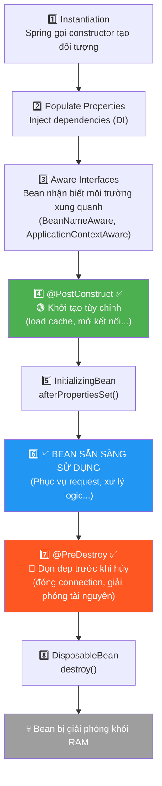
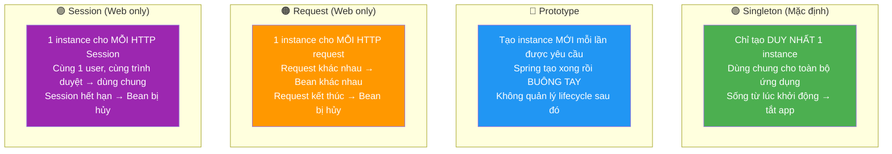
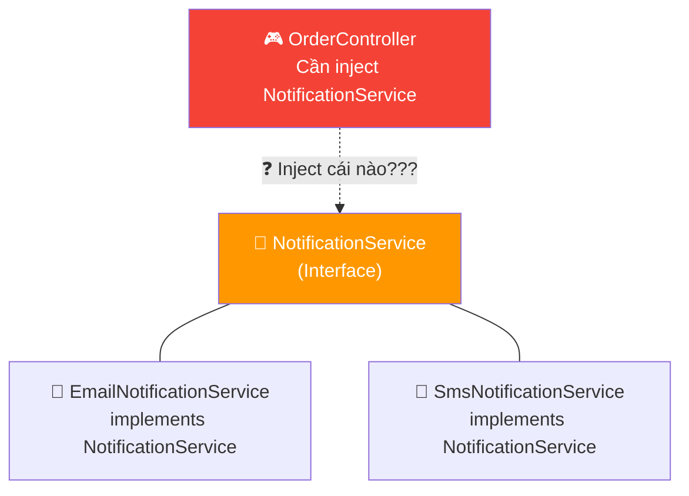
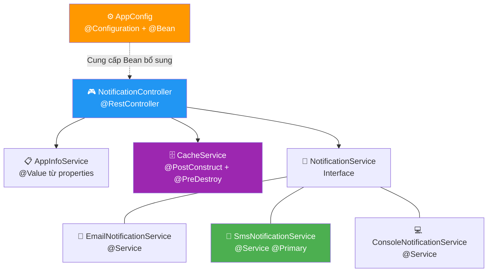

# 📘 BÀI 3: Bean Lifecycle, Bean Scope & Cấu Hình Nâng Cao

> **Mục tiêu:** Hiểu vòng đời (Lifecycle) của một Spring Bean từ khi tạo đến khi hủy, phân biệt các Bean Scope (Singleton, Prototype, Request, Session), thành thạo `@Configuration` + `@Bean`, `@Qualifier`, `@Primary`, `@Value` và Externalized Configuration.
>
> **Tiên quyết:** Đã hoàn thành Bài 2 (IoC & Dependency Injection, hiểu rõ Bean là gì, Constructor Injection)

---

## MỤC LỤC

| Phần | Nội dung | Trọng tâm |
|:---:|:---|:---|
| 1 | Vòng đời của một Spring Bean (Bean Lifecycle) | `@PostConstruct`, `@PreDestroy`, các giai đoạn từ sinh đến diệt |
| 2 | Bean Scope — Phạm vi sống của Bean | Singleton vs Prototype vs Request vs Session |
| 3 | `@Configuration` + `@Bean` — Đăng ký Bean thủ công | Khi nào dùng? Khác gì `@Component`? |
| 4 | `@Qualifier` & `@Primary` — Khi có nhiều Bean cùng kiểu | Spring chọn Bean nào? Cách chỉ định |
| 5 | `@Value` & Externalized Configuration | Đọc cấu hình từ `application.properties` |
| 6 | Thực hành: Hệ thống Notification đa kênh | Tổng hợp tất cả kiến thức, code thực tế |
| 7 | Câu hỏi phỏng vấn | Chuẩn bị cho Junior Interview |

---

## PHẦN 1: VÒNG ĐỜI CỦA MỘT SPRING BEAN (BEAN LIFECYCLE)

### 1.1. Tổng quan vòng đời

Trong Bài 2 (Chương 7 & 8 bổ sung), bạn đã biết rằng Bean được tạo ra khi ứng dụng khởi động và bị hủy khi ứng dụng tắt. Nhưng giữa hai thời điểm đó, Bean trải qua **nhiều giai đoạn chi tiết**:



> [!IMPORTANT]
> **Bạn chỉ cần nhớ 2 callback quan trọng nhất:**
> 1. **`@PostConstruct`** — Chạy **SAU** khi bean được tạo và inject dependencies xong. Dùng để khởi tạo tùy chỉnh.
> 2. **`@PreDestroy`** — Chạy **TRƯỚC** khi bean bị hủy (khi tắt ứng dụng). Dùng để dọn dẹp tài nguyên.
>
> Các giai đoạn khác (Aware Interfaces, InitializingBean, DisposableBean) là cơ chế nâng cao, hiếm khi cần dùng trực tiếp trong dự án thông thường.

### 1.2. Ví dụ thực tế — `@PostConstruct` và `@PreDestroy`

Hãy tưởng tượng `CacheService` là một **Tủ lạnh** trong nhà hàng:

| Giai đoạn | Ví dụ Tủ lạnh | Tương đương Spring |
|:---|:---|:---|
| **Mở cửa nhà hàng** | Tủ lạnh được lắp đặt + cắm điện + nhập đồ ăn vào trước giờ mở cửa | `@PostConstruct` → load cache, mở connection pool |
| **Phục vụ suốt ngày** | Nhân viên bếp mở tủ lấy nguyên liệu nấu cho khách suốt cả ngày | Bean sẵn sàng phục vụ request |
| **Đóng cửa nhà hàng** | Nhân viên tắt tủ lạnh, dọn sạch đồ thừa, rút điện | `@PreDestroy` → đóng connection, giải phóng tài nguyên |

```java
import jakarta.annotation.PostConstruct;
import jakarta.annotation.PreDestroy;
import org.springframework.stereotype.Service;
import org.slf4j.Logger;
import org.slf4j.LoggerFactory;

@Service
public class CacheService {
    private static final Logger log = LoggerFactory.getLogger(CacheService.class);

    // Giả lập bộ nhớ cache (trong thực tế sẽ là Redis, Caffeine, ...)
    private Map<String, String> cache = new HashMap<>();

    /**
     * @PostConstruct: Hàm này chạy tự động SAU KHI:
     *   ✅ Spring đã gọi constructor để tạo CacheService
     *   ✅ Spring đã inject tất cả dependencies vào xong
     *   → Thích hợp để: load dữ liệu ban đầu, khởi tạo kết nối, warmup cache
     */
    @PostConstruct
    public void init() {
        log.info("🟢 CacheService initialized — Loading initial cache data...");
        cache.put("app.name", "Spring Boot Learning");
        cache.put("app.version", "1.0.0");
        log.info("🟢 Cache loaded with {} entries", cache.size());
    }

    /**
     * @PreDestroy: Hàm này chạy tự động TRƯỚC KHI:
     *   ❌ Spring hủy CacheService (khi tắt ứng dụng)
     *   → Thích hợp để: đóng kết nối DB, giải phóng file handle, flush buffer
     */
    @PreDestroy
    public void cleanup() {
        log.info("🔴 CacheService destroying — Clearing {} cache entries...", cache.size());
        cache.clear();
        log.info("🔴 Cache cleared. Resources released.");
    }

    public String get(String key) {
        return cache.getOrDefault(key, "NOT_FOUND");
    }

    public void put(String key, String value) {
        cache.put(key, value);
    }
}
```

### 1.3. Khi nào cần dùng `@PostConstruct` và `@PreDestroy`?

| Annotation | Khi nào dùng? | Ví dụ thực tế |
|:---|:---|:---|
| `@PostConstruct` | Cần khởi tạo tài nguyên **sau khi** DI hoàn tất | Load cache từ DB, mở connection pool, warm up dữ liệu, validate config |
| `@PreDestroy` | Cần dọn dẹp tài nguyên **trước khi** app tắt | Đóng kết nối DB, flush log buffer, gửi tín hiệu shutdown cho hệ thống khác |

> [!WARNING]
> **Tại sao không dùng Constructor thay cho `@PostConstruct`?**
> - Trong Constructor, **dependencies có thể chưa được inject đầy đủ** (đặc biệt khi dùng Field Injection hoặc Setter Injection).
> - `@PostConstruct` đảm bảo chạy **SAU KHI** mọi dependency đã được inject hoàn tất → an toàn hơn.
> - Với Constructor Injection thuần: Constructor cũng hoạt động tốt. Nhưng `@PostConstruct` vẫn rõ ràng hơn về **ý đồ** (semantic): *"Đây là logic khởi tạo, không phải logic inject dependency"*.

---

## PHẦN 2: BEAN SCOPE — PHẠM VI SỐNG CỦA BEAN

### 2.1. Khái niệm Bean Scope

**Bean Scope** quyết định: *"Spring sẽ tạo ra **bao nhiêu** instance của Bean này, và chúng **sống bao lâu**?"*

### 2.2. Bốn loại Scope phổ biến



### 2.3. Bảng so sánh chi tiết

| Tiêu chí | `singleton` (Mặc định) | `prototype` | `request` | `session` |
|:---|:---|:---|:---|:---|
| **Số lượng instance** | ĐÚng 1 | Mới mỗi lần inject/getBean | 1 per HTTP request | 1 per HTTP session |
| **Ai quản lý lifecycle?** | Spring quản lý từ đầu đến cuối | Spring tạo xong rồi **buông tay** | Spring quản lý theo request | Spring quản lý theo session |
| **`@PreDestroy` có hoạt động?** | ✅ Có (khi tắt app) | ❌ **KHÔNG** (Spring không quản lý sau khi tạo) | ✅ Có (khi request kết thúc) | ✅ Có (khi session hết hạn) |
| **Thread-safe?** | ⚠️ Cần cẩn thận — 10.000 request dùng chung 1 instance | ✅ Mỗi nơi dùng instance riêng | ✅ Mỗi request riêng biệt | ✅ Mỗi session riêng biệt |
| **Ví dụ thực tế** | Service, Repository, Controller | ShoppingCart, RequestContext, Form data | Lưu thông tin request hiện tại | Giỏ hàng, thông tin đăng nhập user |
| **Cách khai báo** | Mặc định (không cần gì thêm) | `@Scope("prototype")` | `@Scope("request")` | `@Scope("session")` |

### 2.4. Singleton — Cạm bẫy Thread-Safety

> [!CAUTION]
> **TUYỆT ĐỐI KHÔNG** lưu trạng thái (state) có thể thay đổi trong bean Singleton! Vì tất cả request chia sẻ cùng 1 instance, sẽ gây ra **lỗi đa luồng (Race Condition)** nghiêm trọng.

```java
// ❌ SAI — CỰC KỲ NGUY HIỂM:
@Service  // Singleton mặc định
public class OrderService {
    private int orderCount = 0;  // ← Biến trạng thái — NGUY HIỂM!

    public void createOrder() {
        orderCount++;  // 10.000 người gọi cùng lúc → giá trị sai lệch hoàn toàn!
    }
}

// ✅ ĐÚNG — Bean Singleton chỉ nên chứa logic "thuần" (stateless):
@Service
public class OrderService {
    private final OrderRepository orderRepository;  // dependency — KHÔNG ĐỔI sau inject

    public OrderService(OrderRepository orderRepository) {
        this.orderRepository = orderRepository;
    }

    public Order createOrder(OrderRequest request) {
        // Chỉ dùng tham số truyền vào (local variable) — an toàn đa luồng!
        Order order = new Order();
        order.setProduct(request.getProduct());
        return orderRepository.save(order);
    }
}
```

### 2.5. Prototype — Khi nào dùng?

```java
@Component
@Scope("prototype")  // ← Mỗi lần inject / getBean sẽ tạo instance MỚI
public class ShoppingCart {
    private List<String> items = new ArrayList<>();

    public void addItem(String item) {
        items.add(item);
    }

    public List<String> getItems() {
        return Collections.unmodifiableList(items);
    }
}
```

> [!NOTE]
> **Lưu ý quan trọng:** Nếu bạn inject một bean Prototype vào một bean Singleton, thì bean Prototype đó **chỉ được tạo MỘT LẦN DUY NHẤT** (lúc Singleton được khởi tạo) — chứ không phải mỗi lần gọi method. Đây là một "bẫy" phổ biến mà nhiều lập trình viên mắc phải!

### 2.6. Ví dụ thực tế — Quán Cà Phê (tiếp nối Bài 2)

| Scope | Tương đương trong Quán Cà Phê |
|:---|:---|
| **Singleton** | Chiếc **máy pha cà phê** — cả quán chỉ có 1 chiếc, phục vụ tất cả khách hàng từ sáng tới tối |
| **Prototype** | **Cốc đựng nước** — mỗi khách hàng sẽ được phát 1 cốc mới hoàn toàn riêng, uống xong thì vứt |
| **Request** | **Đơn order giấy** — mỗi lượt khách gọi nước tạo ra 1 tờ giấy order riêng, xong thì hủy |
| **Session** | **Thẻ thành viên tích điểm** — mỗi khách hàng có 1 thẻ riêng, dùng đi dùng lại mỗi lần ghé quán cho đến khi thẻ hết hạn |

---

## PHẦN 3: `@Configuration` + `@Bean` — ĐĂNG KÝ BEAN THỦ CÔNG

### 3.1. Nhắc lại: 2 cách tạo Bean

Ở Bài 2 (mục 2.2), bạn đã học 2 cách tạo Bean:

```
                  ┌── Cách 1: @Component (và @Service, @Repository, @Controller)
                  │           → Dùng cho CLASS DO BẠN TỰ VIẾT
ĐỐI TƯỢNG (BEAN) ─┤
                  └── Cách 2: @Bean bên trong @Configuration
                              → Dùng cho CLASS TỪ THƯ VIỆN NGOÀI hoặc cần logic phức tạp
```

Bài này sẽ đi sâu vào **Cách 2** với các ví dụ thực tế.

### 3.2. `@Configuration` là gì?

`@Configuration` đánh dấu một class là **"nguồn cấu hình"** (Configuration Source) — nơi chứa các phương thức `@Bean`. Nó tương đương với file cấu hình XML ngày xưa của Spring, nhưng viết bằng code Java nên có kiểm tra lỗi tại thời điểm compile.

```java
@Configuration  // "Class này là nhà máy sản xuất Bean"
public class AppConfig {

    @Bean  // "Hãy chạy hàm này và lấy đối tượng return về làm Bean"
    public RestTemplate restTemplate() {
        return new RestTemplate();
    }

    @Bean
    public ObjectMapper objectMapper() {
        ObjectMapper mapper = new ObjectMapper();
        // Cấu hình tùy chỉnh: bỏ qua các field null khi serialize thành JSON
        mapper.setSerializationInclusion(JsonInclude.Include.NON_NULL);
        // Cấu hình đọc ngày giờ theo format chuẩn
        mapper.registerModule(new JavaTimeModule());
        return mapper;
    }
}
```

### 3.3. `@Configuration` vs `@Component`

| Tiêu chí | `@Configuration` | `@Component` |
|:---|:---|:---|
| **Mục đích chính** | Chứa các `@Bean` method để cấu hình | Đánh dấu class thông thường thành Bean |
| **Proxy hóa (CGLIB)** | ✅ Spring tạo proxy cho class → đảm bảo gọi `@Bean` method nhiều lần vẫn trả về **cùng 1 instance** | ❌ Không proxy — gọi method trực tiếp |
| **Ví dụ** | AppConfig, SecurityConfig, SwaggerConfig | Helper class, Utility class |

> [!NOTE]
> **Proxy hóa là gì?** Khi bạn gắn `@Configuration`, Spring tạo một "phiên bản sao chép" (proxy) của class đó. Nếu trong class, method A gọi method B (cũng có `@Bean`), Spring sẽ đảm bảo method B **không tạo thêm instance mới** mà trả về chính Bean đã có sẵn trong container. Đây chính là cơ chế đảm bảo Singleton cho `@Bean` method.

---

## PHẦN 4: `@QUALIFIER` & `@PRIMARY` — KHI CÓ NHIỀU BEAN CÙNG KIỂU

### 4.1. Vấn đề: Spring bối rối!

Khi bạn có **nhiều class implement cùng 1 Interface**, Spring không biết phải inject class nào:



Lỗi sẽ xảy ra: **`NoUniqueBeanDefinitionException`** — *"Spring tìm thấy 2 Bean phù hợp, không biết chọn ai!"*

### 4.2. Giải pháp 1: `@Primary` — "Ưu tiên mặc định"

Gắn `@Primary` lên class mà bạn muốn Spring **tự động chọn** khi không có chỉ định cụ thể.

```java
@Service("emailNotification")
public class EmailNotificationService implements NotificationService {
    @Override
    public void send(String to, String message) {
        log.info("📧 Gửi Email tới {}: {}", to, message);
    }
}

@Service("smsNotification")
@Primary  // ← ƯU TIÊN: Khi không chỉ định cụ thể, Spring sẽ inject cái này
public class SmsNotificationService implements NotificationService {
    @Override
    public void send(String to, String message) {
        log.info("📱 Gửi SMS tới {}: {}", to, message);
    }
}
```

```java
@RestController
public class OrderController {
    private final NotificationService notificationService;

    // Không chỉ định cụ thể → Spring chọn @Primary → SmsNotificationService
    public OrderController(NotificationService notificationService) {
        this.notificationService = notificationService;
    }
}
```

### 4.3. Giải pháp 2: `@Qualifier` — "Tôi muốn chọn đích danh"

Gắn `@Qualifier("tên_bean")` trực tiếp tại nơi inject để chỉ định Bean cụ thể, **ghi đè cả `@Primary`**.

```java
@RestController
public class OrderController {
    private final NotificationService emailService;
    private final NotificationService smsService;

    public OrderController(
        @Qualifier("emailNotification") NotificationService emailService,  // Chỉ đích danh Email
        NotificationService smsService  // Không chỉ định → lấy @Primary (SMS)
    ) {
        this.emailService = emailService;
        this.smsService = smsService;
    }
}
```

### 4.4. Bảng so sánh `@Primary` vs `@Qualifier`

| Tiêu chí | `@Primary` | `@Qualifier` |
|:---|:---|:---|
| **Đặt ở đâu?** | Trên **class được inject** (bên cung cấp) | Trên **tham số nhận inject** (bên tiêu thụ) |
| **Ý nghĩa** | *"Nếu không ai chỉ định, hãy chọn tôi"* | *"Tôi muốn đích danh cái này, bỏ qua mọi ưu tiên khác"* |
| **Độ ưu tiên** | Thấp hơn — bị `@Qualifier` ghi đè | Cao nhất — luôn thắng |
| **Khi nào dùng?** | Khi có 1 Bean phổ biến nhất, dùng nhiều nơi | Khi cần inject chính xác 1 Bean cụ thể tại 1 chỗ |

### 4.5. Ví dụ thực tế — Nhà hàng

| Annotation | Tương đương trong nhà hàng |
|:---|:---|
| **`@Primary`** | Nước suối là **đồ uống mặc định** — khách chỉ cần gọi *"cho tôi nước"* mà không chỉ định, nhân viên sẽ mang nước suối ra |
| **`@Qualifier`** | Khách nói *"cho tôi **nước cam** Meru"* — dù nước suối là mặc định, khách đã chỉ đích danh → nhân viên phải mang đúng nước cam Meru |

---

## PHẦN 5: `@VALUE` & EXTERNALIZED CONFIGURATION

### 5.1. Vấn đề: Hard-code trong code Java

```java
// ❌ SAI — Hard-code: Muốn đổi thì phải sửa code + build lại ứng dụng!
public class AppService {
    private String appName = "My App";
    private int maxUsers = 100;
    private String apiKey = "sk-abc123xyz";  // 🔒 Lộ secret trong code!
}
```

### 5.2. Giải pháp: Externalized Configuration

**Externalized Configuration** là việc tách các giá trị cấu hình ra khỏi code Java, đưa vào file cấu hình bên ngoài (`application.properties` hoặc `application.yml`). Sau đó dùng `@Value` để Spring tự động inject giá trị vào biến.

### 5.3. Cú pháp `@Value`

```properties
# application.properties
app.name=Spring Boot Learning
app.version=3.0
app.max-users=100
app.welcome-message=Chào mừng bạn đến với ${app.name} phiên bản ${app.version}!
```

```java
@Service
public class AppInfoService {
    private static final Logger log = LoggerFactory.getLogger(AppInfoService.class);

    @Value("${app.name}")               // Inject giá trị "Spring Boot Learning"
    private String appName;

    @Value("${app.version}")             // Inject giá trị "3.0"
    private String appVersion;

    @Value("${app.max-users:50}")        // Giá trị mặc định = 50 nếu property không tồn tại
    private int maxUsers;

    @Value("${app.welcome-message}")     // Hỗ trợ nội suy (interpolation) chuỗi
    private String welcomeMessage;

    @Value("${app.secret-key:NOT_SET}")  // Key không tồn tại → dùng giá trị mặc định "NOT_SET"
    private String secretKey;

    @PostConstruct
    public void printConfig() {
        log.info("📋 App Name: {}", appName);
        log.info("📋 Version: {}", appVersion);
        log.info("📋 Max Users: {}", maxUsers);
        log.info("📋 Welcome: {}", welcomeMessage);
    }
}
```

### 5.4. Cú pháp `@Value` chi tiết

| Cú pháp | Ý nghĩa | Ví dụ |
|:---|:---|:---|
| `@Value("${key}")` | Lấy giá trị từ property, **báo lỗi** nếu không tồn tại | `@Value("${app.name}")` |
| `@Value("${key:default}")` | Lấy giá trị, nếu không có thì dùng **giá trị mặc định** | `@Value("${app.port:8080}")` |
| `@Value("#{expression}")` | **SpEL** (Spring Expression Language) — Biểu thức tính toán | `@Value("#{2 * 5}")` → 10 |
| `@Value("Giá trị cố định")` | Gán trực tiếp chuỗi cố định (ít dùng) | `@Value("Hello")` |

> [!TIP]
> **`application.properties` vs `application.yml`:**
> - `.properties`: Dạng `key=value`, đơn giản, dễ đọc cho config phẳng.
> - `.yml`: Dạng cấu trúc phân cấp (indentation), dễ đọc cho config nhiều tầng lồng nhau.
> - Spring Boot hỗ trợ **cả hai**. Bạn có thể chọn 1, hoặc dùng cả 2 cùng lúc (properties ưu tiên hơn).

---

## PHẦN 6: THỰC HÀNH — HỆ THỐNG NOTIFICATION ĐA KÊNH

Chúng ta sẽ xây dựng một hệ thống gửi thông báo (Notification) hỗ trợ nhiều kênh (Email, SMS, Console) để tổng hợp tất cả kiến thức vừa học:



### Cấu trúc file cần tạo:

```
springboot-learning/src/main/java/com/example/springbootlearning/
├── config/
│   └── AppConfig.java                    ← @Configuration + @Bean
├── service/
│   ├── notification/
│   │   ├── NotificationService.java      ← Interface
│   │   ├── EmailNotificationService.java ← Implementation 1
│   │   ├── SmsNotificationService.java   ← Implementation 2 (@Primary)
│   │   └── ConsoleNotificationService.java ← Implementation 3
│   ├── AppInfoService.java               ← @Value demo
│   └── CacheService.java                 ← @PostConstruct + @PreDestroy
├── controller/
│   └── NotificationController.java       ← REST API test
```

---

## PHẦN 7: CÂU HỎI PHỎNG VẤN

### 💼 Câu hỏi thường gặp cho vị trí Junior Spring Boot Developer:

> **Q1: Bean Scope có những loại nào? Singleton có thread-safe không?**
>
> **Trả lời:** Spring có 4 scope chính: `singleton` (mặc định, 1 instance xuyên suốt), `prototype` (tạo mới mỗi lần), `request` (1 per HTTP request), `session` (1 per HTTP session). Singleton **không tự động thread-safe** — nếu bean Singleton chứa trạng thái (state) thay đổi được mà không đồng bộ hóa, sẽ xảy ra race condition khi nhiều thread truy cập cùng lúc.

> **Q2: `@PostConstruct` khác gì Constructor?**
>
> **Trả lời:** Constructor chạy khi đối tượng được tạo, nhưng tại thời điểm đó **dependencies có thể chưa được inject đầy đủ** (đặc biệt với Field Injection). `@PostConstruct` chạy **SAU** khi tất cả dependency đã inject xong, nên an toàn hơn cho việc khởi tạo tùy chỉnh. Ngoài ra `@PostConstruct` thể hiện rõ ý đồ: "Đây là logic khởi tạo, không phải logic inject".

> **Q3: `@Qualifier` và `@Primary` khác nhau như thế nào?**
>
> **Trả lời:** `@Primary` gắn trên class cung cấp Bean — đóng vai trò "ưu tiên mặc định" khi không có chỉ định cụ thể. `@Qualifier` gắn tại nơi inject — cho phép chỉ đích danh Bean cần thiết và **ghi đè `@Primary`**. Trong dự án, thường dùng `@Primary` cho trường hợp phổ biến nhất và `@Qualifier` cho các trường hợp đặc biệt.

> **Q4: Tại sao nên dùng `@Value` thay vì hard-code?**
>
> **Trả lời:** 3 lý do chính:
> 1. **Tách biệt cấu hình khỏi code:** Đổi giá trị mà không cần build lại ứng dụng.
> 2. **Hỗ trợ nhiều môi trường (Profiles):** Dev dùng `application-dev.properties`, Prod dùng `application-prod.properties`.
> 3. **Bảo mật:** Secret key, API key không bị lộ trong source code (có thể inject từ biến môi trường hệ thống).

> **Q5: Prototype Bean inject vào Singleton thì chuyện gì xảy ra?**
>
> **Trả lời:** Prototype Bean chỉ được tạo **1 lần duy nhất** tại thời điểm Singleton Bean được khởi tạo, sau đó Singleton sẽ giữ nguyên instance Prototype đó mãi mãi. Điều này vi phạm mục đích của Prototype Scope. Giải pháp: dùng `ObjectProvider<T>` hoặc `@Lookup` để lấy instance mới mỗi lần cần.

---

> [!TIP]
> **Ghi nhớ chuỗi logic Bài 3:**
> - **`@PostConstruct`** = hàm chạy **SAU** inject → khởi tạo tài nguyên
> - **`@PreDestroy`** = hàm chạy **TRƯỚC** hủy → dọn dẹp tài nguyên
> - **Singleton** = 1 instance duy nhất → **KHÔNG lưu state thay đổi được**
> - **`@Configuration` + `@Bean`** = tạo Bean từ thư viện ngoài
> - **`@Primary`** = ưu tiên mặc định; **`@Qualifier`** = chỉ đích danh, ghi đè tất cả
> - **`@Value`** = inject config từ file properties → tách cấu hình khỏi code
