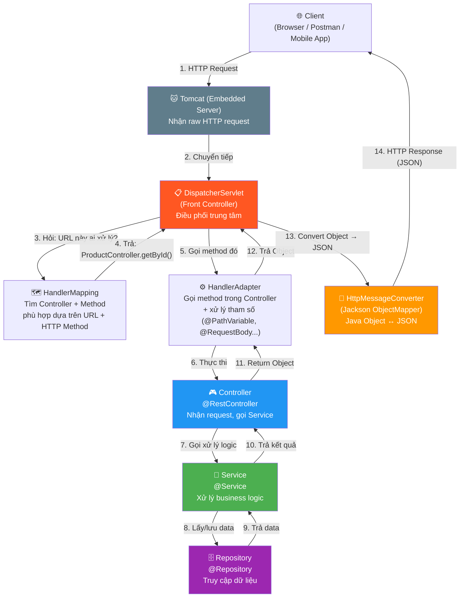
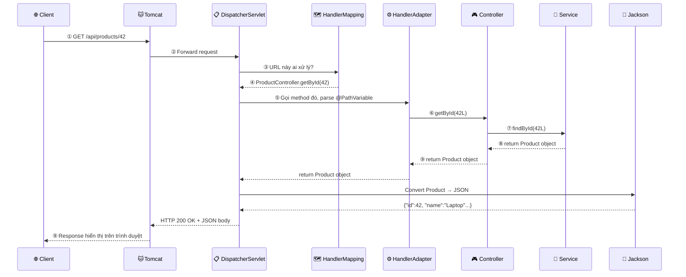
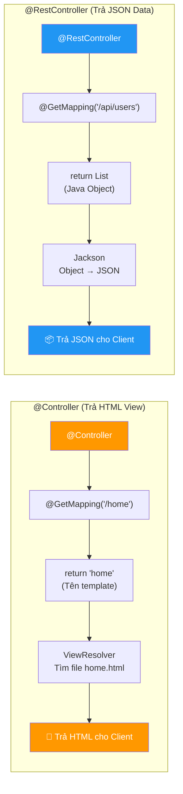
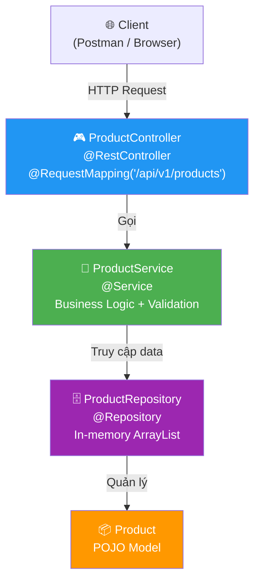

# 📘 BÀI 4: Spring MVC Architecture & Request Lifecycle

> **Mục tiêu:** Hiểu kiến trúc Spring MVC và vai trò trung tâm của DispatcherServlet, nắm rõ luồng xử lý HTTP Request từ đầu đến cuối, phân biệt `@Controller` vs `@RestController`, và sử dụng thành thạo các HTTP Method Mapping + Annotation nhận dữ liệu.
>
> **Tiên quyết:** Đã hoàn thành Bài 3 (Bean Lifecycle, Bean Scope, `@Qualifier`, `@Value`)

---

## MỤC LỤC

| Phần | Nội dung | Trọng tâm |
|:---:|:---|:---|
| 1 | Kiến trúc Spring MVC tổng quan | DispatcherServlet, Front Controller Pattern |
| 2 | Luồng xử lý một HTTP Request (9 bước) | Từ trình duyệt → Controller → JSON response |
| 3 | `@Controller` vs `@RestController` | Lịch sử, bên trong mã nguồn, khi nào dùng |
| 4 | HTTP Methods & Mapping Annotations | GET / POST / PUT / PATCH / DELETE + Idempotent |
| 5 | 4 Annotation nhận dữ liệu từ Request | `@PathVariable`, `@RequestParam`, `@RequestBody`, `@RequestHeader` |
| 6 | Thực hành: CRUD API cho Product | In-memory List, sử dụng tất cả kiến thức |
| 7 | Bổ sung kiến thức Java Core | `Optional` chaining, Stream API, Static factory method |
| 8 | Câu hỏi phỏng vấn | Chuẩn bị cho Junior Interview |

---

## PHẦN 1: KIẾN TRÚC SPRING MVC TỔNG QUAN

### 1.1. MVC là gì?

**MVC (Model-View-Controller)** là một design pattern chia ứng dụng thành 3 thành phần tách biệt:

| Thành phần | Vai trò | Trong Spring Boot |
|:---|:---|:---|
| **Model** | Dữ liệu và logic nghiệp vụ | Entity/POJO + Service + Repository |
| **View** | Giao diện trả về cho người dùng | JSON response (REST API) hoặc HTML template (Thymeleaf) |
| **Controller** | Tiếp nhận request, gọi Model xử lý, trả View | Class `@RestController` |

### 1.2. DispatcherServlet — "Lễ tân" của Spring MVC

`DispatcherServlet` là **trung tâm thần kinh** (Front Controller) của toàn bộ Spring MVC. **Mọi HTTP request** đều phải đi qua nó trước.

> [!IMPORTANT]
> **Ví dụ đời thực — Khách sạn 5 sao:**
> - **DispatcherServlet** = **Lễ tân tổng đài** (Front Desk Receptionist)
> - **HandlerMapping** = **Sổ phân công** (ai phụ trách phòng nào?)
> - **Controller** = **Nhân viên chuyên trách** (người thực sự đi phục vụ)
> - **HttpMessageConverter** = **Phiên dịch viên** (dịch kết quả sang ngôn ngữ khách hiểu — JSON)
>
> Khách (Client) không bao giờ tự đi tìm nhân viên. Khách chỉ gặp lễ tân → lễ tân tra sổ → lễ tân gọi đúng người → người đó xử lý xong → lễ tân dịch và trả kết quả cho khách.

### 1.3. Sơ đồ kiến trúc chi tiết



> [!NOTE]
> **Tomcat được nhúng sẵn (Embedded) trong Spring Boot.** Bạn không cần cài Tomcat riêng. Khi chạy `./mvnw spring-boot:run`, Spring Boot tự động khởi động Tomcat bên trong, và tự động đăng ký DispatcherServlet để xử lý mọi request.

---

## PHẦN 2: LUỒNG XỬ LÝ MỘT HTTP REQUEST (9 BƯỚC CHI TIẾT)

Khi bạn gõ URL `http://localhost:8080/api/products/42` trong trình duyệt và nhấn Enter, đây là **toàn bộ hành trình** mà request đi qua:



### Bảng giải thích từng bước

| Bước | Ai làm? | Việc gì xảy ra? |
|:---:|:---|:---|
| ① | **Client** | Gửi `GET /api/products/42` (kèm headers, cookies...) |
| ② | **Tomcat** | Nhận raw HTTP bytes, parse thành `HttpServletRequest` object |
| ③ | **DispatcherServlet** | Hỏi HandlerMapping: "URL `/api/products/42` + method `GET` thì chạy method nào?" |
| ④ | **HandlerMapping** | Quét tất cả `@RequestMapping`, `@GetMapping` trong các Controller → tìm ra `ProductController.getById()` match pattern `/api/products/{id}` |
| ⑤ | **HandlerAdapter** | Parse `{id}` = `42` từ URL → chuyển thành `Long 42L` → chuẩn bị tham số gọi method |
| ⑥ | **Controller** | Method `getById(42L)` được gọi, Controller gọi tiếp Service |
| ⑦ | **Service** | Thực hiện business logic (validate, xử lý...), gọi Repository lấy data |
| ⑧ | **Service → Controller** | Trả về `Product` object (Java object thuần trong RAM) |
| ⑨ | **Jackson (HttpMessageConverter)** | Chuyển `Product` object → JSON string → đóng gói HTTP Response → gửi về Client |

> [!TIP]
> **Jackson** là thư viện chuyển đổi Java Object ↔ JSON, được Spring Boot tích hợp sẵn. Bạn không cần cấu hình gì — cứ `return` một Java object từ Controller, Jackson sẽ tự động serialize thành JSON.
>
> Jackson dùng **Getter methods** để đọc giá trị từ object. Vì vậy class Model **bắt buộc phải có Getter** (hoặc dùng `@JsonProperty`).

---

## PHẦN 3: `@CONTROLLER` vs `@RESTCONTROLLER`

### 3.1. Lịch sử ngắn gọn

| Thời kỳ | Cách làm | Annotation |
|:---|:---|:---|
| **Spring MVC cũ** (trước REST API phổ biến) | Controller trả về **tên View** (HTML template) | `@Controller` + return `"index.html"` |
| **Spring 4.0+** (2014, REST API bùng nổ) | Controller trả về **dữ liệu JSON** trực tiếp | `@Controller` + `@ResponseBody` trên mỗi method |
| **Spring 4.0+ (tiện lợi)** | Gộp 2 annotation lại cho gọn | `@RestController` = `@Controller` + `@ResponseBody` |

### 3.2. Bên trong mã nguồn Spring

Nếu bạn mở mã nguồn Spring, bạn sẽ thấy:

```java
// Mã nguồn thật của @RestController trong Spring Framework:
@Target(ElementType.TYPE)
@Retention(RetentionPolicy.RUNTIME)
@Documented
@Controller                  // ← Bên trong chứa @Controller
@ResponseBody                // ← Và thêm @ResponseBody
public @interface RestController {
    @AliasFor(annotation = Controller.class)
    String value() default "";
}
```

→ `@RestController` **không phải annotation mới**, mà chỉ là **tổ hợp** (meta-annotation) của 2 annotation cũ.

### 3.3. So sánh chi tiết



| Tiêu chí | `@Controller` | `@RestController` |
|:---|:---|:---|
| **Return value** | Tên template (String) → ViewResolver tìm file HTML | Java Object → Jackson chuyển thành JSON |
| **Dùng khi nào?** | Ứng dụng web server-side render (Thymeleaf, JSP) | REST API trả JSON cho Frontend/Mobile |
| **Có `@ResponseBody`?** | ❌ Không (phải thêm thủ công trên từng method nếu muốn trả JSON) | ✅ Có sẵn (tự động trên mọi method) |
| **Phổ biến trong 2024+?** | Ít — trừ khi dùng Thymeleaf / SSR | ✅ Rất phổ biến — REST API là chuẩn hiện đại |

```java
// ❶ @Controller — Trả HTML (hiếm dùng trong API hiện đại)
@Controller
public class PageController {
    @GetMapping("/home")
    public String homePage(Model model) {
        model.addAttribute("title", "Trang chủ");
        return "home";  // → Spring tìm file templates/home.html
    }

    // Nếu muốn trả JSON, phải thêm @ResponseBody thủ công:
    @GetMapping("/api/data")
    @ResponseBody  // ← Bắt buộc phải thêm!
    public Map<String, String> getData() {
        return Map.of("status", "ok");
    }
}

// ❷ @RestController — Trả JSON (dùng trong khoá học này)
@RestController
@RequestMapping("/api/products")
public class ProductController {
    @GetMapping
    public List<Product> getAll() {
        return productService.findAll();  // Jackson tự chuyển thành JSON
    }
}
```

> [!IMPORTANT]
> **Trong khoá học này, chúng ta LUÔN dùng `@RestController`** vì mục tiêu là xây dựng REST API. `@Controller` chỉ dùng khi làm web server-side rendering (ví dụ: Thymeleaf — không thuộc phạm vi khoá học).

---

## PHẦN 4: HTTP METHODS & MAPPING ANNOTATIONS

### 4.1. Bảng tổng hợp

| HTTP Method | Spring Annotation | Mục đích | Ví dụ URL | Idempotent? | Safe? |
|:---|:---|:---|:---|:---:|:---:|
| `GET` | `@GetMapping` | **Lấy** dữ liệu (read-only) | `GET /api/products` | ✅ | ✅ |
| `POST` | `@PostMapping` | **Tạo mới** dữ liệu | `POST /api/products` | ❌ | ❌ |
| `PUT` | `@PutMapping` | **Cập nhật toàn bộ** (replace) | `PUT /api/products/42` | ✅ | ❌ |
| `PATCH` | `@PatchMapping` | **Cập nhật một phần** (partial) | `PATCH /api/products/42` | ❌ | ❌ |
| `DELETE` | `@DeleteMapping` | **Xóa** dữ liệu | `DELETE /api/products/42` | ✅ | ❌ |

### 4.2. Idempotent và Safe — Hai khái niệm quan trọng

**① Idempotent (Bất biến / Lũy đẳng):**
> Gọi 1 lần hay gọi 100 lần đều cho **cùng kết quả cuối cùng** trên server.

| Method | Idempotent? | Giải thích |
|:---|:---:|:---|
| `GET /api/products/42` | ✅ | Gọi 100 lần vẫn trả cùng product, không thay đổi gì trên server |
| `PUT /api/products/42` | ✅ | Gọi 100 lần với cùng body → product luôn giống nhau (thay thế toàn bộ) |
| `DELETE /api/products/42` | ✅ | Lần 1 xóa thành công, lần 2-100 trả "không tìm thấy" → trạng thái server không đổi |
| `POST /api/products` | ❌ | Gọi 3 lần → tạo ra 3 product mới! Trạng thái server thay đổi mỗi lần |

**② Safe (An toàn):**
> Method **không gây thay đổi** dữ liệu trên server.

Chỉ có `GET` (và `HEAD`, `OPTIONS`) là safe. Tất cả method còn lại (POST, PUT, PATCH, DELETE) đều **thay đổi dữ liệu** → không safe.

### 4.3. `PUT` vs `PATCH` — Khác nhau như thế nào?

```java
// ===== Dữ liệu ban đầu trên server =====
// Product { id: 42, name: "Laptop", price: 1000, category: "Electronics" }

// ===== PUT — Thay thế TOÀN BỘ =====
// PUT /api/products/42
// Body: { "name": "Gaming Laptop", "price": 1500 }
// → Kết quả: { id: 42, name: "Gaming Laptop", price: 1500, category: null }
//   ⚠️ Field "category" bị null vì PUT thay thế TOÀN BỘ object!

// ===== PATCH — Cập nhật MỘT PHẦN =====
// PATCH /api/products/42
// Body: { "price": 1500 }
// → Kết quả: { id: 42, name: "Laptop", price: 1500, category: "Electronics" }
//   ✅ Chỉ field "price" thay đổi, các field khác giữ nguyên!
```

| Tiêu chí | `PUT` | `PATCH` |
|:---|:---|:---|
| **Ý nghĩa** | Thay thế **toàn bộ** resource | Cập nhật **một phần** resource |
| **Body chứa gì?** | Toàn bộ dữ liệu (kể cả field không đổi) | Chỉ những field cần thay đổi |
| **Field không gửi?** | Bị set thành `null` / default | Giữ nguyên giá trị cũ |
| **Ví dụ đời thực** | Viết lại **toàn bộ** CV | Chỉ sửa **số điện thoại** trong CV |

### 4.4. `@RequestMapping` — Annotation tổng quát

Tất cả `@GetMapping`, `@PostMapping`... đều là **dạng rút gọn** của `@RequestMapping`:

```java
// Hai dòng này TƯƠNG ĐƯƠNG nhau:
@GetMapping("/api/products")
@RequestMapping(value = "/api/products", method = RequestMethod.GET)

// Hai dòng này TƯƠNG ĐƯƠNG nhau:
@PostMapping("/api/products")
@RequestMapping(value = "/api/products", method = RequestMethod.POST)
```

`@RequestMapping` khi đặt ở **cấp class** sẽ làm **prefix** (tiền tố URL) cho tất cả method bên trong:

```java
@RestController
@RequestMapping("/api/products")  // ← Prefix: /api/products
public class ProductController {

    @GetMapping           // → GET    /api/products
    @GetMapping("/{id}")  // → GET    /api/products/{id}
    @PostMapping          // → POST   /api/products
    @PutMapping("/{id}")  // → PUT    /api/products/{id}
    @DeleteMapping("/{id}") // → DELETE /api/products/{id}
}
```

---

## PHẦN 5: 4 ANNOTATION NHẬN DỮ LIỆU TỪ REQUEST

Spring cung cấp 4 annotation chính để **bóc tách dữ liệu** từ HTTP Request và đưa vào tham số method:

### 5.1. Tổng quan 4 annotation

```mermaid
graph TD
    HTTP["📨 HTTP Request"]
    URL["🔗 URL Path<br/>/api/products/42"]
    QS["❓ Query String<br/>?category=laptop&page=1"]
    Body["📦 Request Body<br/>{\"name\":\"Laptop\",\"price\":999}"]
    Header["📋 Request Headers<br/>Authorization: Bearer xyz"]

    HTTP --> URL
    HTTP --> QS
    HTTP --> Body
    HTTP --> Header

    URL -->|"@PathVariable"| PV["Long id = 42"]
    QS -->|"@RequestParam"| RP["String category = 'laptop'<br/>int page = 1"]
    Body -->|"@RequestBody"| RB["Product product = new Product(...)"]
    Header -->|"@RequestHeader"| RH["String token = 'Bearer xyz'"]

    style PV fill:#4CAF50,color:#fff
    style RP fill:#2196F3,color:#fff
    style RB fill:#FF9800,color:#fff
    style RH fill:#9C27B0,color:#fff
```

### 5.2. `@PathVariable` — Lấy giá trị từ URL Path

**Dùng khi:** Giá trị là một phần **bắt buộc** của URL, thường là ID hoặc slug.

```java
// URL: GET /api/products/42
@GetMapping("/{id}")
public Product getById(@PathVariable Long id) {
    // id = 42  (Spring tự parse String "42" → Long 42L)
    return productService.findById(id);
}

// URL: GET /api/products/electronics/laptop-dell
@GetMapping("/{category}/{slug}")
public Product getBySlug(
    @PathVariable String category,    // = "electronics"
    @PathVariable String slug         // = "laptop-dell"
) {
    return productService.findBySlug(category, slug);
}

// Đổi tên biến khác tên placeholder:
@GetMapping("/{productId}")
public Product getById(@PathVariable("productId") Long id) {
    // Biến Java là "id" nhưng URL pattern là "{productId}"
    return productService.findById(id);
}
```

### 5.3. `@RequestParam` — Lấy giá trị từ Query String

**Dùng khi:** Giá trị là tham số **tùy chọn** trên URL, thường dùng cho filter, sort, pagination.

```java
// URL: GET /api/products?category=electronics&page=2&sort=price
@GetMapping
public List<Product> search(
    @RequestParam String category,                          // Bắt buộc phải có
    @RequestParam(defaultValue = "0") int page,             // Nếu không truyền → mặc định = 0
    @RequestParam(required = false) String sort,            // Không bắt buộc, có thể null
    @RequestParam(name = "min_price", required = false) Double minPrice  // Đổi tên param
) {
    // category = "electronics", page = 2, sort = "price", minPrice = null
    return productService.search(category, page, sort, minPrice);
}
```

| Thuộc tính | Ý nghĩa | Ví dụ |
|:---|:---|:---|
| `value` / `name` | Tên param trên URL (nếu khác tên biến Java) | `@RequestParam("min_price")` |
| `required` | Bắt buộc hay không? (mặc định `true`) | `required = false` → có thể thiếu |
| `defaultValue` | Giá trị mặc định khi param không có trên URL | `defaultValue = "0"` |

### 5.4. `@RequestBody` — Lấy dữ liệu từ Body (JSON)

**Dùng khi:** Client gửi dữ liệu phức tạp (JSON) trong body, thường cho POST và PUT.

```java
// POST /api/products
// Content-Type: application/json
// Body: {"name": "Laptop", "price": 999.99, "category": "Electronics"}
@PostMapping
public Product create(@RequestBody Product product) {
    // Jackson tự chuyển JSON body → Product object:
    //   product.getName()     = "Laptop"
    //   product.getPrice()    = 999.99
    //   product.getCategory() = "Electronics"
    return productService.save(product);
}
```

> [!WARNING]
> **`@RequestBody` hoạt động nhờ Jackson.** Điều kiện bắt buộc:
> 1. Class đích phải có **constructor mặc định** (no-args constructor)
> 2. Phải có **setter methods** (hoặc dùng `@JsonProperty` / `@JsonCreator`)
> 3. Header `Content-Type` phải là `application/json`

### 5.5. `@RequestHeader` — Lấy giá trị từ HTTP Header

**Dùng khi:** Cần đọc metadata từ header (token xác thực, ngôn ngữ, thông tin client...).

```java
@GetMapping("/profile")
public Map<String, String> getProfile(
    @RequestHeader("Authorization") String authToken,
    @RequestHeader(value = "Accept-Language", defaultValue = "vi") String lang
) {
    return Map.of("token", authToken, "language", lang);
}
```

### 5.6. Bảng tổng hợp so sánh

| Annotation | Lấy dữ liệu từ đâu? | Ví dụ URL / Request | Khi nào dùng? |
|:---|:---|:---|:---|
| `@PathVariable` | **URL path** (`/products/{id}`) | `/products/42` → `id = 42` | Truy cập resource cụ thể (theo ID, slug) |
| `@RequestParam` | **Query string** (`?key=value`) | `/products?page=1&sort=name` | Filter, search, pagination, sorting |
| `@RequestBody` | **HTTP Body** (JSON) | `{"name":"Laptop"}` | POST, PUT — gửi dữ liệu phức tạp |
| `@RequestHeader` | **HTTP Header** | `Authorization: Bearer xxx` | Auth token, metadata, ngôn ngữ |

> [!TIP]
> **Quy tắc ngón tay cái:**
> - Đi kèm **danh từ/ID** → `@PathVariable` (ví dụ: `/users/42`, `/products/laptop-dell`)
> - Đi kèm **bộ lọc/tùy chọn** → `@RequestParam` (ví dụ: `?category=phone&sort=price`)
> - Gửi **dữ liệu tạo/cập nhật** → `@RequestBody` (JSON trong body)
> - Đọc **metadata/token** → `@RequestHeader`

---

## PHẦN 6: THỰC HÀNH — CRUD API HOÀN CHỈNH CHO PRODUCT

Chúng ta sẽ xây dựng một Product CRUD API hoàn chỉnh sử dụng in-memory List (chưa cần database), áp dụng mọi kiến thức vừa học:



### Cấu trúc file cần tạo:

```
springboot-learning/src/main/java/com/example/springbootlearning/
├── model/
│   └── Product.java                ← POJO Model
├── repository/
│   └── ProductRepository.java      ← In-memory data store
├── service/
│   └── ProductService.java         ← Business logic + validation
├── controller/
│   └── ProductController.java      ← REST API endpoints
```

### 📋 Danh sách API Endpoints:

| Method | URL | Mô tả | Request Data |
|:---|:---|:---|:---|
| `GET` | `/api/v1/products` | Lấy tất cả sản phẩm (hỗ trợ filter) | `?category=...&minPrice=...&maxPrice=...` |
| `GET` | `/api/v1/products/{id}` | Lấy sản phẩm theo ID | `@PathVariable` |
| `POST` | `/api/v1/products` | Tạo sản phẩm mới | `@RequestBody` (JSON) |
| `PUT` | `/api/v1/products/{id}` | Cập nhật toàn bộ sản phẩm | `@PathVariable` + `@RequestBody` |
| `PATCH` | `/api/v1/products/{id}` | Cập nhật một phần sản phẩm | `@PathVariable` + `@RequestBody` (partial JSON) |
| `DELETE` | `/api/v1/products/{id}` | Xóa sản phẩm | `@PathVariable` |
| `GET` | `/api/v1/products/search` | Tìm kiếm theo tên | `?keyword=...` |

---

## PHẦN 7: BỔ SUNG KIẾN THỨC JAVA CORE

### 7.1. Optional Chaining — Xử lý giá trị "có thể null" an toàn

```java
// ❌ SAI — Kiểu C/C++ truyền thống, dễ NullPointerException:
Product product = repository.findById(id);
if (product == null) {
    throw new RuntimeException("Not found");
}
return product;

// ✅ ĐÚNG — Dùng Optional (Java 8+):
return repository.findById(id)           // Optional<Product>
    .orElseThrow(() ->                   // Nếu Optional rỗng → throw exception
        new RuntimeException("Product not found: " + id)
    );

// Các method hữu ích của Optional:
optional.isPresent()           // true nếu có giá trị
optional.isEmpty()             // true nếu rỗng (Java 11+)
optional.get()                 // Lấy giá trị (⚠️ throw NoSuchElementException nếu rỗng)
optional.orElse(defaultValue)  // Lấy giá trị, hoặc dùng default
optional.orElseThrow()         // Lấy giá trị, hoặc throw exception
optional.map(fn)               // Biến đổi giá trị bên trong (nếu có)
optional.ifPresent(consumer)   // Chạy logic nếu có giá trị
```

### 7.2. Stream API — Xử lý danh sách theo kiểu "đường ống"

```java
// Tìm tất cả product có category = "Electronics" và giá < 1000
List<Product> result = products.stream()                // Mở "vòi nước"
    .filter(p -> "Electronics".equals(p.getCategory())) // Lọc theo category
    .filter(p -> p.getPrice() < 1000)                   // Lọc theo giá
    .sorted(Comparator.comparing(Product::getPrice))    // Sắp xếp theo giá tăng dần
    .collect(Collectors.toList());                       // Đóng gói kết quả thành List
```

### 7.3. `Map.of()` — Tạo nhanh Map bất biến (Java 9+)

```java
// Thay vì:
Map<String, Object> map = new HashMap<>();
map.put("status", "ok");
map.put("count", 42);

// Viết gọn:
Map<String, Object> map = Map.of("status", "ok", "count", 42);
// ⚠️ Map.of() tạo ra Map KHÔNG THỂ THAY ĐỔI (immutable).
// ⚠️ Tối đa 10 cặp key-value. Không cho phép key hoặc value là null.
```

---

## PHẦN 8: CÂU HỎI PHỎNG VẤN

### 💼 Câu hỏi thường gặp cho vị trí Junior Spring Boot Developer:

> **Q1: DispatcherServlet là gì? Nó hoạt động như thế nào?**
>
> **Trả lời:** DispatcherServlet là Front Controller của Spring MVC. Mọi HTTP request đều đi qua nó. Nó nhận request, hỏi HandlerMapping để tìm Controller + method phù hợp, gọi HandlerAdapter để thực thi method đó, rồi dùng HttpMessageConverter (Jackson) để chuyển kết quả thành JSON trả về client.

> **Q2: `@Controller` và `@RestController` khác nhau như thế nào?**
>
> **Trả lời:** `@RestController` = `@Controller` + `@ResponseBody`. `@Controller` trả về tên View (HTML template) qua ViewResolver. `@RestController` trả về dữ liệu trực tiếp (JSON) qua HttpMessageConverter. Trong REST API hiện đại, ta luôn dùng `@RestController`.

> **Q3: Phân biệt `@PathVariable` và `@RequestParam`?**
>
> **Trả lời:** `@PathVariable` lấy giá trị từ URL path (ví dụ: `/products/{id}` → id=42). `@RequestParam` lấy giá trị từ query string (ví dụ: `?page=1&sort=name`). PathVariable dùng cho resource identifier (ID, slug). RequestParam dùng cho filter, sort, pagination.

> **Q4: PUT và PATCH khác nhau như thế nào?**
>
> **Trả lời:** PUT thay thế toàn bộ resource — field nào không gửi sẽ bị set null. PATCH cập nhật một phần — chỉ field được gửi mới thay đổi, còn lại giữ nguyên. PUT là idempotent (gọi nhiều lần kết quả giống nhau), PATCH không nhất thiết idempotent.

> **Q5: Tại sao Jackson cần getter/setter? Có cách nào không cần không?**
>
> **Trả lời:** Jackson dùng getter để serialize (Object → JSON) và setter/constructor để deserialize (JSON → Object). Nếu không muốn dùng getter/setter, có thể: (1) Dùng `@JsonProperty` trên field, (2) Dùng Java Record (JDK 16+), (3) Cấu hình `ObjectMapper` cho phép truy cập private field trực tiếp.

---

> [!TIP]
> **Ghi nhớ chuỗi logic Bài 4:**
> - **DispatcherServlet** = Trung tâm điều phối (Front Controller) — mọi request đều qua đây
> - **`@RestController`** = `@Controller` + `@ResponseBody` → trả JSON
> - **`@PathVariable`** = URL path (`/products/{id}`) → resource ID
> - **`@RequestParam`** = Query string (`?key=value`) → filter/sort/page
> - **`@RequestBody`** = JSON body → dữ liệu tạo/cập nhật
> - **PUT** = thay thế toàn bộ; **PATCH** = cập nhật một phần
> - **Idempotent** = gọi nhiều lần → kết quả cuối cùng không đổi (GET ✅, POST ❌)
