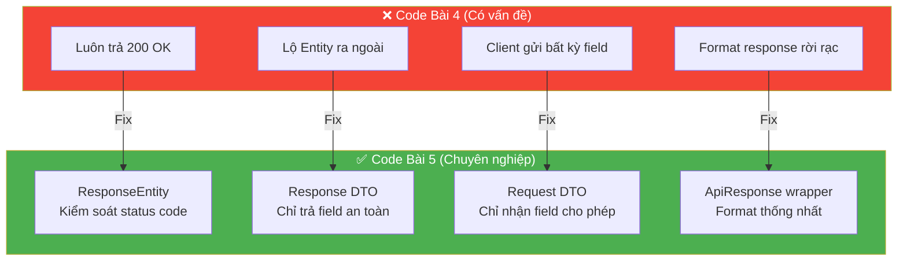
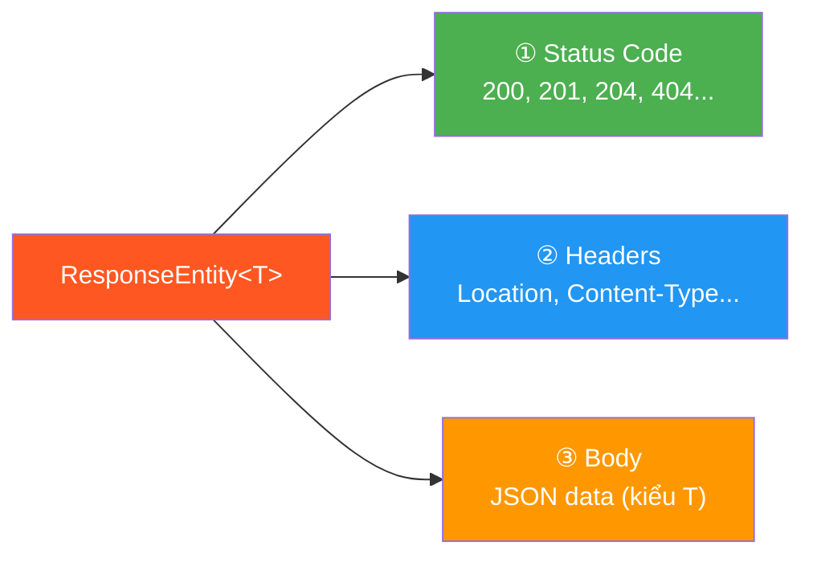
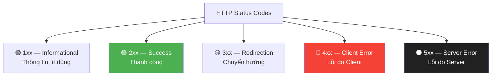
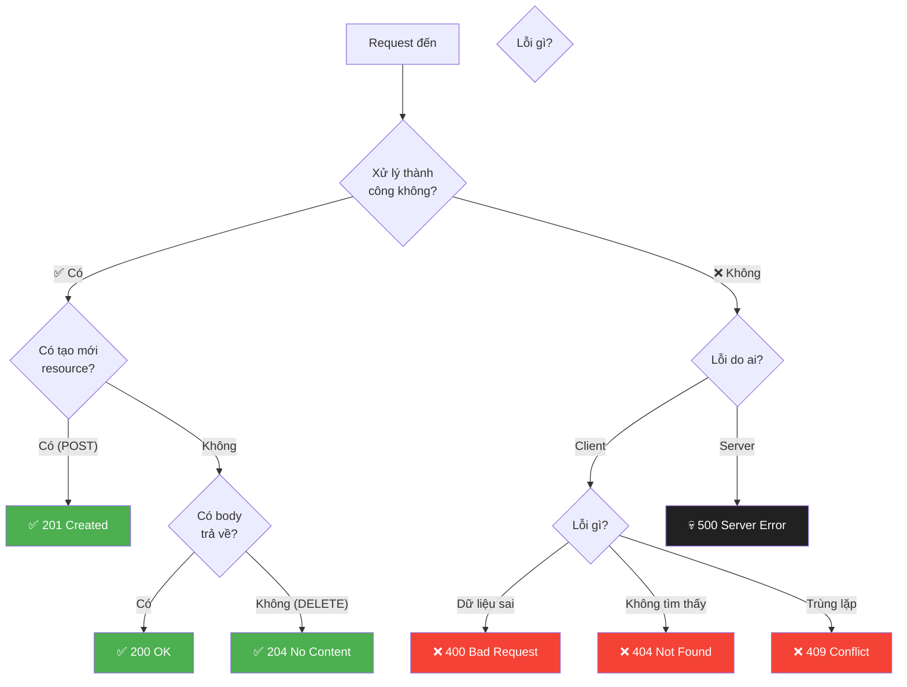
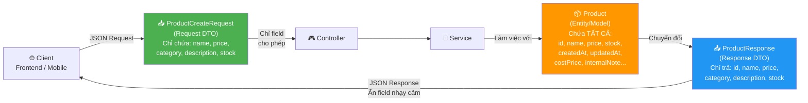
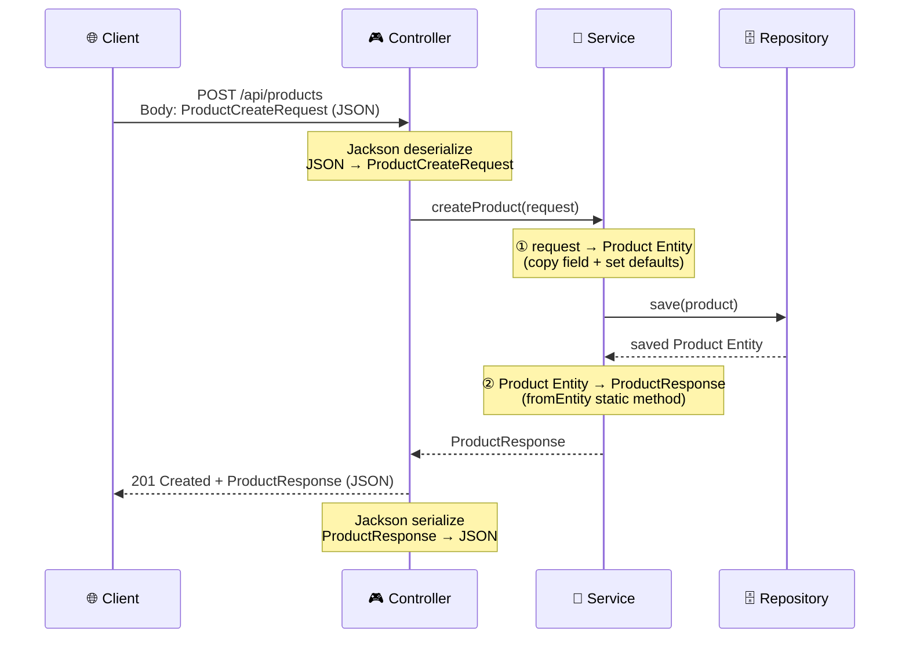

# 📘 BÀI 5: ResponseEntity, HTTP Status Codes & DTO Pattern

> **Mục tiêu:** Hiểu bản chất và cách dùng `ResponseEntity` để kiểm soát hoàn toàn HTTP Response (status code, headers, body). Nắm vững DTO Pattern để tách biệt tầng API và tầng Data. Xây dựng `ApiResponse` wrapper chuẩn hóa cho mọi API response.
>
> **Tiên quyết:** Đã hoàn thành Bài 4 (Spring MVC, CRUD API cho Product, @PathVariable, @RequestParam, @RequestBody)

---

## MỤC LỤC

| Phần | Nội dung | Trọng tâm |
|:---:|:---|:---|
| 1 | Vấn đề với code Bài 4 — Tại sao cần Refactor? | Phân tích 4 "code smell" |
| 2 | `ResponseEntity<T>` — Kiểm soát HTTP Response | Status Code, Headers, Body |
| 3 | HTTP Status Codes — Bảng tra cứu toàn diện | 2xx, 4xx, 5xx, khi nào dùng |
| 4 | DTO Pattern — Tách biệt tầng API và tầng Data | Request DTO, Response DTO, chuyển đổi |
| 5 | Java Record — Viết DTO siêu gọn (JDK 16+) | Record vs Class, khi nào dùng |
| 6 | `ApiResponse<T>` — Chuẩn hóa mọi Response | Wrapper pattern, Generics, Builder |
| 7 | Thực hành: Refactor Product API hoàn chỉnh | Áp dụng tất cả kiến thức vừa học |
| 8 | Bổ sung kiến thức Java Core | Generics, Static Factory Method, URI |
| 9 | Câu hỏi phỏng vấn | Chuẩn bị Junior Interview |

---

## PHẦN 1: VẤN ĐỀ VỚI CODE BÀI 4 — TẠI SAO CẦN REFACTOR?

Nhìn lại code ProductController ở Bài 4, có **4 "code smell"** cần sửa:

### 1.1. 🔴 Code Smell #1: Không kiểm soát HTTP Status Code

```java
// ❌ Code Bài 4 — Luôn trả 200 OK, kể cả khi tạo mới (đáng lẽ 201 Created)
@PostMapping
public Product createProduct(@RequestBody Product product) {
    return productService.createProduct(product);  // → HTTP 200 OK ???
}

@DeleteMapping("/{id}")
public Map<String, Object> deleteProduct(@PathVariable Long id) {
    productService.deleteProduct(id);
    return Map.of("message", "Đã xóa");  // → HTTP 200 OK + body ???
    // Chuẩn REST: DELETE nên trả 204 No Content (không có body)
}
```

> [!WARNING]
> Khi `@RestController` trả về một object, Spring **mặc định trả HTTP 200 OK** — bất kể đó là tạo mới, cập nhật hay xóa. Đây là sai về mặt ngữ nghĩa HTTP.

### 1.2. 🔴 Code Smell #2: Lộ toàn bộ Model ra ngoài API

```java
// ❌ Trả thẳng Entity/Model cho client
@GetMapping("/{id}")
public Product getProductById(@PathVariable Long id) {
    return productService.getProductById(id);
    // Client nhận TẤT CẢ field: id, name, price, stock, createdAt, updatedAt...
    // ⚠️ Nếu Product có password, internal_note, cost_price → BỊ LỘ hết!
}
```

### 1.3. 🔴 Code Smell #3: Nhận thẳng Entity từ request body

```java
// ❌ Nhận thẳng Entity — client có thể gửi bất kỳ field nào
@PostMapping
public Product createProduct(@RequestBody Product product) {
    // Client có thể gửi: {"id": 999, "createdAt": "2020-01-01T00:00:00"}
    // → Ghi đè id và createdAt!!! Lỗi bảo mật nghiêm trọng.
}
```

### 1.4. 🔴 Code Smell #4: Không có format response thống nhất

```java
// ❌ Mỗi endpoint trả format khác nhau
@GetMapping("/{id}")
public Product getById(...)     // → {"id":1, "name":"Laptop",...}

@DeleteMapping("/{id}")
public Map<String,Object> delete(...)  // → {"message":"Đã xóa", "deletedId":1}

// Frontend phải xử lý N format khác nhau!
```

### 1.5. ✅ Bài 5 sẽ giải quyết tất cả



---

## PHẦN 2: `RESPONSEENTITY<T>` — KIỂM SOÁT HOÀN TOÀN HTTP RESPONSE

### 2.1. ResponseEntity là gì?

`ResponseEntity<T>` là một class của Spring cho phép bạn **kiểm soát đầy đủ 3 thành phần** của HTTP Response:



| Thành phần | Mô tả | Ví dụ |
|:---|:---|:---|
| **Status Code** | Mã trạng thái HTTP | `200 OK`, `201 Created`, `404 Not Found` |
| **Headers** | Metadata bổ sung | `Location: /api/products/42` |
| **Body** | Nội dung trả về (JSON) | `{"id": 42, "name": "Laptop"}` |

> [!IMPORTANT]
> **So sánh: Return trực tiếp vs ResponseEntity**
>
> | | Return trực tiếp (Bài 4) | ResponseEntity (Bài 5) |
> |:---|:---|:---|
> | **Status Code** | Luôn 200 OK (không kiểm soát) | Tùy chọn: 200, 201, 204, 404... |
> | **Headers** | Không set được | Set tùy ý (Location, Cache-Control...) |
> | **Body** | Có (luôn luôn) | Có hoặc không (ví dụ 204 No Content) |
> | **Tính linh hoạt** | ❌ Thấp | ✅ Cao — chuyên nghiệp |

### 2.2. Các cách tạo ResponseEntity

#### Cách 1: Dùng Static Factory Methods (✅ Khuyến nghị — gọn, dễ đọc)

```java
// 200 OK + body
ResponseEntity.ok(product);

// 200 OK, không body
ResponseEntity.ok().build();

// 201 Created + Location header + body
URI location = URI.create("/api/products/" + product.getId());
ResponseEntity.created(location).body(product);

// 204 No Content (dùng cho DELETE thành công)
ResponseEntity.noContent().build();

// 404 Not Found
ResponseEntity.notFound().build();

// 400 Bad Request + body chứa thông báo lỗi
ResponseEntity.badRequest().body(errorMessage);
```

#### Cách 2: Dùng Constructor (ít dùng hơn, nhưng linh hoạt hơn)

```java
// new ResponseEntity<>(body, headers, statusCode)
HttpHeaders headers = new HttpHeaders();
headers.add("X-Custom-Header", "custom-value");

return new ResponseEntity<>(product, headers, HttpStatus.OK);
```

#### Cách 3: Dùng `ResponseEntity.status(...)` cho status code tùy ý

```java
// 409 Conflict — trùng email
return ResponseEntity.status(HttpStatus.CONFLICT)
        .body("Email đã tồn tại");

// 202 Accepted — đang xử lý async
return ResponseEntity.status(HttpStatus.ACCEPTED)
        .body("Yêu cầu đang được xử lý");
```

### 2.3. Ví dụ thực tế — Refactor từ Bài 4

```java
// ╔══════════════════════════════════════════════════════╗
// ║    BÀI 4 (CŨ)              →    BÀI 5 (MỚI)       ║
// ╠══════════════════════════════════════════════════════╣
// ║ return product;             → ResponseEntity.ok(p); ║
// ║ Luôn 200 OK                 → Đúng status code      ║
// ╚══════════════════════════════════════════════════════╝

// ── GET by ID ──
// ❌ Bài 4:
@GetMapping("/{id}")
public Product getById(@PathVariable Long id) {
    return productService.getProductById(id);  // 200 OK luôn
}

// ✅ Bài 5:
@GetMapping("/{id}")
public ResponseEntity<ProductResponse> getById(@PathVariable Long id) {
    ProductResponse response = productService.getProductById(id);
    return ResponseEntity.ok(response);  // 200 OK, rõ ràng
}

// ── POST Create ──
// ❌ Bài 4:
@PostMapping
public Product create(@RequestBody Product product) {
    return productService.createProduct(product);  // 200 OK ???
}

// ✅ Bài 5:
@PostMapping
public ResponseEntity<ProductResponse> create(@RequestBody ProductCreateRequest request) {
    ProductResponse created = productService.createProduct(request);
    URI location = URI.create("/api/v1/products/" + created.id());
    return ResponseEntity.created(location).body(created);  // 201 Created ✅
}

// ── DELETE ──
// ❌ Bài 4:
@DeleteMapping("/{id}")
public Map<String, Object> delete(@PathVariable Long id) {
    productService.deleteProduct(id);
    return Map.of("message", "Đã xóa");  // 200 + body ???
}

// ✅ Bài 5:
@DeleteMapping("/{id}")
public ResponseEntity<Void> delete(@PathVariable Long id) {
    productService.deleteProduct(id);
    return ResponseEntity.noContent().build();  // 204 No Content ✅
}
```

### 2.4. 🔑 Khi nào dùng `ResponseEntity` vs trả trực tiếp?

| Tình huống | Nên dùng |
|:---|:---|
| API đơn giản, luôn trả 200 OK + body | Trả trực tiếp cũng OK |
| Cần trả status code khác 200 | ✅ `ResponseEntity` |
| Cần set custom headers | ✅ `ResponseEntity` |
| Cần trả response không có body (204) | ✅ `ResponseEntity` |
| API chuyên nghiệp, production-ready | ✅ **Luôn dùng `ResponseEntity`** |

> [!TIP]
> **Best Practice:** Trong dự án thực tế, **luôn dùng `ResponseEntity`** cho tất cả endpoint. Nó giúp code rõ ràng, dễ đọc, và thể hiện đúng ngữ nghĩa HTTP — là chuẩn mà mọi công ty yêu cầu.

---

## PHẦN 3: HTTP STATUS CODES — BẢNG TRA CỨU TOÀN DIỆN

### 3.1. Nhóm Status Code



### 3.2. Bảng tra cứu chi tiết (★ = Rất thường dùng trong REST API)

#### 🟢 2xx — Thành Công (Success)

| Code | Tên | Khi nào dùng | Ví dụ thực tế | Spring |
|:---:|:---|:---|:---|:---|
| ★ **200** | OK | Request thành công, có data trả về | `GET /products/42` → Trả product | `ResponseEntity.ok(body)` |
| ★ **201** | Created | **Tạo mới** resource thành công | `POST /products` → Tạo product mới | `ResponseEntity.created(uri).body(body)` |
| ★ **204** | No Content | Thành công nhưng **không có body** | `DELETE /products/42` → Xóa xong | `ResponseEntity.noContent().build()` |

#### 🔴 4xx — Lỗi Client (Client Error)

| Code | Tên | Khi nào dùng | Ví dụ thực tế | Spring |
|:---:|:---|:---|:---|:---|
| ★ **400** | Bad Request | Dữ liệu gửi lên **sai format/invalid** | JSON sai, thiếu field, validation fail | `ResponseEntity.badRequest().body(error)` |
| ★ **401** | Unauthorized | **Chưa xác thực** (chưa login/token hết hạn) | Gọi API mà không gửi JWT token | `ResponseEntity.status(401).body(error)` |
| ★ **403** | Forbidden | Đã xác thực nhưng **không có quyền** | User thường cố xóa tài khoản admin | `ResponseEntity.status(403).body(error)` |
| ★ **404** | Not Found | Resource **không tồn tại** | `GET /products/99999` → Không có | `ResponseEntity.notFound().build()` |
| **409** | Conflict | **Xung đột** dữ liệu | Tạo user mà email đã tồn tại | `ResponseEntity.status(409).body(error)` |
| **422** | Unprocessable Entity | Cú pháp đúng nhưng **logic sai** | Đặt hàng số lượng > tồn kho | `ResponseEntity.status(422).body(error)` |

#### ⚫ 5xx — Lỗi Server (Server Error)

| Code | Tên | Khi nào dùng | Ví dụ thực tế |
|:---:|:---|:---|:---|
| **500** | Internal Server Error | Lỗi **không lường trước** trên server | NullPointerException, database down |
| **502** | Bad Gateway | Server nhận response **sai** từ upstream | Reverse proxy nhận lỗi từ backend |
| **503** | Service Unavailable | Server **tạm thời quá tải** | Đang bảo trì, quá nhiều request |

### 3.3. Sơ đồ quyết định: Chọn Status Code nào?



> [!TIP]
> **Nhớ nhanh:**
> - **Thành công:** 200 (lấy/sửa OK), 201 (tạo mới OK), 204 (xóa OK, không body)
> - **Lỗi client:** 400 (data sai), 401 (chưa login), 403 (không có quyền), 404 (không tìm thấy), 409 (trùng)
> - **Lỗi server:** 500 (lỗi code/hệ thống)

---

## PHẦN 4: DTO PATTERN — TÁCH BIỆT TẦNG API VÀ TẦNG DATA

### 4.1. DTO (Data Transfer Object) là gì?

**DTO** là những class **chuyên dụng** dùng để **truyền dữ liệu** giữa Client và Server, thay vì truyền trực tiếp Entity/Model.



### 4.2. 🔑 Tại sao cần DTO? — 5 Lý do quan trọng

| # | Lý do | Không dùng DTO | Dùng DTO |
|:---:|:---|:---|:---|
| 1 | 🔒 **Bảo mật** | Client nhìn thấy `costPrice`, `internalNote`, `password` | Chỉ trả field an toàn, ẩn field nhạy cảm |
| 2 | 🛡️ **Chống ghi đè** | Client gửi `{"id": 999}` → ghi đè ID! | Request DTO không có field `id` → không thể ghi đè |
| 3 | 🎯 **Validation riêng** | Validation gắn trên Entity → khó tùy biến | Mỗi DTO có validation riêng (Create ≠ Update) |
| 4 | 🔄 **Linh hoạt** | Thay đổi Entity → API response thay đổi theo → breaking change | Thay đổi Entity không ảnh hưởng API contract |
| 5 | 🔗 **Tránh vòng lặp JSON** | Entity có `@ManyToOne` → Jackson serialize vòng lặp vô hạn | DTO không có relationship → an toàn |

### 4.3. Quy tắc đặt tên DTO

| Loại DTO | Quy tắc tên | Ví dụ | Mục đích |
|:---|:---|:---|:---|
| **Request DTO** (tạo mới) | `<Entity>CreateRequest` | `ProductCreateRequest` | Chứa field cần thiết cho POST |
| **Request DTO** (cập nhật) | `<Entity>UpdateRequest` | `ProductUpdateRequest` | Chứa field cần thiết cho PUT |
| **Response DTO** | `<Entity>Response` | `ProductResponse` | Chứa field an toàn trả về client |

### 4.4. Thực hiện DTO — Bước 1: Tạo Request DTO

```java
/**
 * 📥 Request DTO cho POST /api/v1/products
 *
 * Chỉ chứa những field mà CLIENT ĐƯỢC PHÉP gửi khi tạo sản phẩm mới.
 * ❌ KHÔNG có: id, createdAt, updatedAt (server tự sinh)
 */
public class ProductCreateRequest {

    private String name;         // ✅ Client gửi
    private String description;  // ✅ Client gửi
    private Double price;        // ✅ Client gửi
    private String category;     // ✅ Client gửi
    private Integer stock;       // ✅ Client gửi

    // ❌ KHÔNG có id        → Server tự sinh
    // ❌ KHÔNG có createdAt  → Server tự gán
    // ❌ KHÔNG có updatedAt  → Server tự gán

    // Constructor mặc định (cho Jackson)
    public ProductCreateRequest() {}

    // Getters & Setters
    // ...
}
```

### 4.5. Thực hiện DTO — Bước 2: Tạo Response DTO

```java
/**
 * 📤 Response DTO trả về cho Client
 *
 * Chỉ chứa những field AN TOÀN để hiển thị ra ngoài.
 * ❌ KHÔNG có: costPrice, internalNote, supplierInfo (field nội bộ)
 */
public class ProductResponse {

    private Long id;
    private String name;
    private String description;
    private Double price;
    private String category;
    private Integer stock;
    private LocalDateTime createdAt;

    // ❌ KHÔNG có: costPrice, internalNote → ẩn khỏi client

    // ===== Static Factory Method — Chuyển Entity → DTO =====
    public static ProductResponse fromEntity(Product product) {
        ProductResponse dto = new ProductResponse();
        dto.setId(product.getId());
        dto.setName(product.getName());
        dto.setDescription(product.getDescription());
        dto.setPrice(product.getPrice());
        dto.setCategory(product.getCategory());
        dto.setStock(product.getStock());
        dto.setCreatedAt(product.getCreatedAt());
        return dto;
    }

    // Getters & Setters
    // ...
}
```

### 4.6. Thực hiện DTO — Bước 3: Chuyển đổi trong Service

```java
@Service
public class ProductService {

    // Nhận DTO → Chuyển thành Entity → Xử lý → Trả DTO
    public ProductResponse createProduct(ProductCreateRequest request) {
        // ① Chuyển Request DTO → Entity
        Product product = new Product();
        product.setName(request.getName());
        product.setDescription(request.getDescription());
        product.setPrice(request.getPrice());
        product.setCategory(request.getCategory());
        product.setStock(request.getStock());

        // ② Business logic + Lưu
        Product saved = productRepository.save(product);

        // ③ Chuyển Entity → Response DTO
        return ProductResponse.fromEntity(saved);
    }
}
```

### 4.7. Luồng chuyển đổi tổng hợp



---

## PHẦN 5: JAVA RECORD — VIẾT DTO SIÊU GỌN (JDK 16+)

### 5.1. Vấn đề với class DTO truyền thống

Một class DTO thông thường cần **rất nhiều boilerplate code**:

```java
// 😰 Phải viết: constructor, getters, equals, hashCode, toString
// Một class đơn giản 5 field → ~80 dòng code!
public class ProductResponse {
    private Long id;
    private String name;
    private Double price;
    private String category;
    private Integer stock;

    // Constructor
    public ProductResponse(Long id, String name, Double price, String category, Integer stock) {
        this.id = id;
        this.name = name;
        this.price = price;
        this.category = category;
        this.stock = stock;
    }

    // 5 Getters...
    // equals()...
    // hashCode()...
    // toString()...
    // Tổng cộng ~80 dòng cho 5 fields 😱
}
```

### 5.2. Java Record — Giải pháp 1 dòng

```java
// ✅ Java Record — TẤT CẢ chỉ trong 1 dòng!
// Java tự sinh: constructor, getters (id(), name()...), equals, hashCode, toString
public record ProductResponse(
    Long id,
    String name,
    String description,
    Double price,
    String category,
    Integer stock,
    LocalDateTime createdAt
) {
    // Static factory method — vẫn thêm được như class thường
    public static ProductResponse fromEntity(Product product) {
        return new ProductResponse(
            product.getId(),
            product.getName(),
            product.getDescription(),
            product.getPrice(),
            product.getCategory(),
            product.getStock(),
            product.getCreatedAt()
        );
    }
}
```

### 5.3. Record — Điều gì được tự động sinh ra?

```java
// Khi bạn viết:
public record ProductResponse(Long id, String name, Double price) {}

// Java tự động tạo cho bạn (ngầm bên dưới):
public final class ProductResponse {
    private final Long id;      // final → immutable
    private final String name;
    private final Double price;

    // ① Constructor đầy đủ (tất cả field)
    public ProductResponse(Long id, String name, Double price) {
        this.id = id;
        this.name = name;
        this.price = price;
    }

    // ② Getter (KHÔNG có prefix "get", chỉ tên field)
    public Long id() { return id; }         // product.id()  — KHÔNG phải product.getId()
    public String name() { return name; }   // product.name()
    public Double price() { return price; } // product.price()

    // ③ equals() — so sánh theo tất cả fields
    // ④ hashCode() — tính hash từ tất cả fields
    // ⑤ toString() — ProductResponse[id=1, name=Laptop, price=999.0]
}
```

### 5.4. Bảng so sánh Class vs Record

| Tiêu chí | Class DTO truyền thống | Java Record |
|:---|:---|:---|
| **Dòng code** | 50-100 dòng cho 5 fields | 3-5 dòng cho 5 fields |
| **Mutable?** | ✅ Có thể thay đổi (có setter) | ❌ **Immutable** (không có setter) |
| **Getter tên gì?** | `getName()` | `name()` (không prefix "get") |
| **Constructor** | Phải viết thủ công | Tự sinh từ khai báo |
| **equals / hashCode** | Phải override thủ công | Tự sinh, so sánh tất cả field |
| **Kế thừa** | Có thể extends class khác | ❌ Không thể extends (nhưng implements interface OK) |
| **Jackson hỗ trợ?** | ✅ Có (qua getter/setter) | ✅ Có (từ Spring Boot 2.7+ / Jackson 2.12+) |
| **Khi nào dùng?** | Entity cần thay đổi (set value) | **DTO read-only** — chỉ dùng để truyền data |

> [!IMPORTANT]
> **Record rất phù hợp cho Response DTO** vì:
> - Response DTO chỉ cần **đọc dữ liệu** (không cần sửa sau khi tạo) → immutable hoàn hảo
> - Code siêu gọn, giảm boilerplate
> - Jackson hỗ trợ serialize Record → JSON natively
>
> **Record KHÔNG phù hợp cho Request DTO** khi cần Jackson `@RequestBody` deserialize từ JSON, vì:
> - Jackson cần **no-args constructor + setter** để gán field (mặc định)
> - Record không có setter và chỉ có all-args constructor
> - **Tuy nhiên**: Từ Jackson 2.12+, Record đã được hỗ trợ qua `ParameterNamesModule` (có sẵn trong Spring Boot) → **có thể dùng Record cho cả Request DTO** trong Spring Boot hiện đại!

### 5.5. Record cho Request DTO — Có hoạt động không?

```java
// ✅ Hoạt động trong Spring Boot 3.x (Jackson 2.14+)
// Jackson sử dụng all-args constructor của Record để deserialize JSON
public record ProductCreateRequest(
    String name,
    String description,
    Double price,
    String category,
    Integer stock
) {}

// Controller:
@PostMapping
public ResponseEntity<ProductResponse> create(
    @RequestBody ProductCreateRequest request  // ✅ Jackson → ProductCreateRequest record
) {
    // request.name(), request.price()... (getter không có prefix "get")
}
```

> [!TIP]
> **Trong bài học này**, chúng ta sẽ dùng **Record cho Response DTO** (vì rất gọn và phù hợp) và **class thường cho Request DTO** (để bạn thấy rõ cơ chế hoạt động với Jackson). Khi đã thành thạo, bạn có thể dùng Record cho cả hai.

---

## PHẦN 6: `APIRESPONSE<T>` — CHUẨN HÓA MỌI RESPONSE

### 6.1. Vấn đề: Mỗi endpoint trả format khác nhau

```json
// GET /api/products/1 → trả Product trực tiếp
{"id":1, "name":"Laptop", "price":999}

// DELETE /api/products/1 → trả Map
{"message":"Đã xóa", "deletedId":1}

// Lỗi validation → Spring tự trả format lạ
{"timestamp":"2024-...", "status":400, "error":"Bad Request", ...}
```

Frontend phải xử lý **N format khác nhau** → rất khó maintain!

### 6.2. Giải pháp: `ApiResponse<T>` — Wrapper thống nhất

Mọi API response đều **cùng một cấu trúc**:

```json
{
    "status": 200,
    "message": "Lấy sản phẩm thành công",
    "data": {
        "id": 1,
        "name": "MacBook Pro M3",
        "price": 2499.99
    },
    "timestamp": "2024-09-28T16:00:00"
}
```

```json
{
    "status": 404,
    "message": "Sản phẩm không tồn tại với id: 99",
    "data": null,
    "timestamp": "2024-09-28T16:00:05"
}
```

### 6.3. Triển khai `ApiResponse<T>`

```java
/**
 * 📦 Standardized API Response Wrapper
 *
 * Mọi API response đều trả về cùng cấu trúc:
 * { "status": int, "message": string, "data": T, "timestamp": string }
 *
 * Dùng Generics <T> để linh hoạt:
 *   - ApiResponse<ProductResponse>     → data là ProductResponse
 *   - ApiResponse<List<ProductResponse>> → data là List
 *   - ApiResponse<Void>               → data là null (lỗi hoặc delete)
 */
public class ApiResponse<T> {

    private int status;
    private String message;
    private T data;
    private LocalDateTime timestamp;

    // Private constructor — chỉ tạo qua static factory methods
    private ApiResponse(int status, String message, T data) {
        this.status = status;
        this.message = message;
        this.data = data;
        this.timestamp = LocalDateTime.now();
    }

    // ===== Static Factory Methods =====

    public static <T> ApiResponse<T> success(T data) {
        return new ApiResponse<>(200, "Thành công", data);
    }

    public static <T> ApiResponse<T> success(String message, T data) {
        return new ApiResponse<>(200, message, data);
    }

    public static <T> ApiResponse<T> created(T data) {
        return new ApiResponse<>(201, "Tạo mới thành công", data);
    }

    public static <T> ApiResponse<T> created(String message, T data) {
        return new ApiResponse<>(201, message, data);
    }

    public static <T> ApiResponse<T> error(int status, String message) {
        return new ApiResponse<>(status, message, null);
    }

    // Getters (cho Jackson serialize)
    public int getStatus() { return status; }
    public String getMessage() { return message; }
    public T getData() { return data; }
    public LocalDateTime getTimestamp() { return timestamp; }
}
```

### 6.4. Sử dụng ApiResponse trong Controller

```java
@RestController
@RequestMapping("/api/v1/products")
public class ProductController {

    // GET → 200 + ApiResponse<List<ProductResponse>>
    @GetMapping
    public ResponseEntity<ApiResponse<List<ProductResponse>>> getAllProducts() {
        List<ProductResponse> products = productService.getAllProducts();
        return ResponseEntity.ok(
            ApiResponse.success("Lấy danh sách sản phẩm thành công", products)
        );
    }

    // POST → 201 + ApiResponse<ProductResponse>
    @PostMapping
    public ResponseEntity<ApiResponse<ProductResponse>> createProduct(
            @RequestBody ProductCreateRequest request
    ) {
        ProductResponse created = productService.createProduct(request);
        return ResponseEntity
            .status(HttpStatus.CREATED)
            .body(ApiResponse.created("Tạo sản phẩm thành công", created));
    }

    // DELETE → 204 No Content (không có body)
    @DeleteMapping("/{id}")
    public ResponseEntity<Void> deleteProduct(@PathVariable Long id) {
        productService.deleteProduct(id);
        return ResponseEntity.noContent().build();
    }
}
```

### 6.5. Kết quả JSON Response thống nhất

```json
// ✅ GET /api/v1/products — Lấy danh sách
{
    "status": 200,
    "message": "Lấy danh sách sản phẩm thành công",
    "data": [
        {"id": 1, "name": "MacBook Pro M3", "price": 2499.99, ...},
        {"id": 2, "name": "iPhone 16 Pro", "price": 1199.99, ...}
    ],
    "timestamp": "2024-09-28T16:00:00"
}

// ✅ POST /api/v1/products — Tạo mới
{
    "status": 201,
    "message": "Tạo sản phẩm thành công",
    "data": {"id": 7, "name": "iPad Pro M4", "price": 1299.0, ...},
    "timestamp": "2024-09-28T16:00:05"
}

// ✅ Lỗi — 404 Not Found
{
    "status": 404,
    "message": "Sản phẩm không tồn tại với id: 99",
    "data": null,
    "timestamp": "2024-09-28T16:00:10"
}
```

---

## PHẦN 7: THỰC HÀNH — REFACTOR PRODUCT API HOÀN CHỈNH

Chúng ta sẽ refactor toàn bộ Product API từ Bài 4 với `ResponseEntity`, DTO Pattern, và `ApiResponse`:

### 7.1. Cấu trúc thư mục mới

```
springboot-learning/src/main/java/com/example/springbootlearning/
├── model/
│   └── Product.java                     ← Entity (giữ nguyên từ Bài 4)
├── dto/                                 ← 🆕 THƯ MỤC MỚI
│   ├── request/
│   │   ├── ProductCreateRequest.java    ← Request DTO cho POST
│   │   └── ProductUpdateRequest.java    ← Request DTO cho PUT
│   └── response/
│       ├── ProductResponse.java         ← Response DTO (Java Record)
│       └── ApiResponse.java             ← Wrapper thống nhất
├── repository/
│   └── ProductRepository.java           ← Giữ nguyên từ Bài 4
├── service/
│   └── ProductService.java              ← 🔄 REFACTOR: nhận DTO, trả DTO
├── controller/
│   └── ProductController.java           ← 🔄 REFACTOR: dùng ResponseEntity + DTO
```

### 7.2. Bảng API Endpoints (sau Refactor)

| Method | URL | Request Body | Response | Status Code |
|:---|:---|:---|:---|:---:|
| `GET` | `/api/v1/products` | — | `ApiResponse<List<ProductResponse>>` | 200 |
| `GET` | `/api/v1/products/{id}` | — | `ApiResponse<ProductResponse>` | 200 / 404 |
| `GET` | `/api/v1/products/search?keyword=` | — | `ApiResponse<List<ProductResponse>>` | 200 |
| `POST` | `/api/v1/products` | `ProductCreateRequest` | `ApiResponse<ProductResponse>` | 201 |
| `PUT` | `/api/v1/products/{id}` | `ProductUpdateRequest` | `ApiResponse<ProductResponse>` | 200 / 404 |
| `DELETE` | `/api/v1/products/{id}` | — | (no body) | 204 / 404 |

---

## PHẦN 8: BỔ SUNG KIẾN THỨC JAVA CORE

### 8.1. Generics — Tham số hóa kiểu dữ liệu

```java
// Generics cho phép class/method hoạt động với NHIỀU kiểu dữ liệu khác nhau,
// nhưng vẫn đảm bảo TYPE SAFETY (an toàn kiểu) tại compile time.

// ❌ Không dùng Generics — mất type safety:
public class ApiResponse {
    private Object data;  // Object → có thể là BẤT KỲ kiểu nào → nguy hiểm!
}
ApiResponse res = new ApiResponse();
String name = (String) res.getData();  // Phải ép kiểu thủ công → có thể ClassCastException!

// ✅ Dùng Generics <T> — an toàn:
public class ApiResponse<T> {
    private T data;  // T sẽ được xác định khi sử dụng
}
ApiResponse<ProductResponse> res = new ApiResponse<>();
ProductResponse product = res.getData();  // Không cần ép kiểu — compiler biết kiểu!

// Ví dụ quy ước đặt tên cho type parameter:
// T → Type (kiểu tổng quát)
// E → Element (phần tử, dùng trong Collection)
// K → Key (khóa, dùng trong Map)
// V → Value (giá trị, dùng trong Map)
// R → Return type (kiểu trả về)
```

### 8.2. Static Factory Method Pattern

```java
// Static Factory Method = method static dùng để TẠO đối tượng thay vì dùng `new` trực tiếp.

// ❌ Dùng constructor → không rõ ý nghĩa:
ApiResponse<Product> res = new ApiResponse<>(200, "OK", product, LocalDateTime.now());

// ✅ Dùng Static Factory Method → rõ ý nghĩa ngay từ tên:
ApiResponse<Product> res = ApiResponse.success(product);        // ← Rõ ràng: đây là response thành công
ApiResponse<Product> res = ApiResponse.created(product);        // ← Rõ ràng: đây là response tạo mới
ApiResponse<?> res = ApiResponse.error(404, "Not found");       // ← Rõ ràng: đây là response lỗi

// Ưu điểm:
// 1. Tên method mô tả ý nghĩa (self-documenting)
// 2. Có thể return subclass hoặc cached instance
// 3. Có thể có nhiều factory method với cùng tham số (constructor chỉ phân biệt bằng tham số)
// 4. Ẩn constructor → kiểm soát cách tạo object
```

### 8.3. `URI` — Uniform Resource Identifier

```java
// URI dùng để chỉ định vị trí resource — thường dùng trong header Location
// khi trả 201 Created

URI location = URI.create("/api/v1/products/" + product.getId());
return ResponseEntity.created(location).body(product);
// → HTTP Response:
//   Status: 201 Created
//   Location: /api/v1/products/42     ← Client biết URL của resource vừa tạo
//   Body: { "id": 42, "name": "Laptop" }

// URI.create() là static factory method của class java.net.URI
// Nó tạo URI từ String. Nếu String không hợp lệ → throw IllegalArgumentException
```

### 8.4. Wildcard `?` trong Generics

```java
// ? (wildcard) = "kiểu bất kỳ" — dùng khi không cần biết kiểu cụ thể

// Ví dụ: method error trả ApiResponse mà data luôn null → kiểu data không quan trọng
public static ApiResponse<?> error(int status, String message) {
    return new ApiResponse<>(status, message, null);
}

// Các loại wildcard:
// ? extends T → "bất kỳ kiểu nào là subtype của T" (upper bound)
// ? super T   → "bất kỳ kiểu nào là supertype của T" (lower bound)
// ?           → "bất kỳ kiểu nào" (unbounded)

// Ví dụ thực tế:
List<? extends Number> numbers;  // Chấp nhận List<Integer>, List<Double>, List<Long>...
numbers = List.of(1, 2, 3);     // OK — Integer extends Number
numbers = List.of(1.5, 2.5);    // OK — Double extends Number
```

---

## PHẦN 9: CÂU HỎI PHỎNG VẤN

### 💼 Câu hỏi thường gặp cho vị trí Junior Spring Boot Developer:

> **Q1: ResponseEntity là gì? Khi nào cần dùng?**
>
> **Trả lời:** `ResponseEntity<T>` là class của Spring cho phép kiểm soát đầy đủ HTTP Response: status code, headers, body. Dùng khi cần trả status code khác 200 (201 Created, 204 No Content, 404 Not Found...), set custom headers (Location), hoặc trả response không có body. Trong dự án thực tế, nên luôn dùng ResponseEntity cho tất cả endpoint để code rõ ràng và chuyên nghiệp.

> **Q2: DTO Pattern là gì? Tại sao không trả thẳng Entity cho client?**
>
> **Trả lời:** DTO (Data Transfer Object) là những class chuyên dụng để truyền dữ liệu giữa Client và Server. Không trả Entity trực tiếp vì: (1) Bảo mật — có thể lộ field nhạy cảm như password, costPrice. (2) Chống ghi đè — client không thể gửi id, createdAt. (3) Linh hoạt — thay đổi Entity không ảnh hưởng API contract. (4) Validation riêng — mỗi API có yêu cầu validate khác nhau. (5) Tránh vòng lặp JSON khi Entity có relationship.

> **Q3: Java Record khác gì class thường? Khi nào dùng Record làm DTO?**
>
> **Trả lời:** Java Record (JDK 16+) tự động sinh constructor, getter (không prefix "get"), equals, hashCode, toString. Record là immutable (không có setter). Record phù hợp cho Response DTO vì chỉ cần đọc data. Từ Spring Boot 3.x (Jackson 2.14+), Record cũng hỗ trợ deserialize từ JSON nên có thể dùng cho Request DTO.

> **Q4: HTTP 200 OK vs 201 Created vs 204 No Content — khi nào dùng?**
>
> **Trả lời:** 200 OK dùng cho GET, PUT thành công — có body trả về. 201 Created dùng cho POST tạo resource mới — có body + Location header chỉ URL resource mới. 204 No Content dùng cho DELETE — thành công nhưng không có body trả về.

> **Q5: Tại sao cần chuẩn hóa API Response (ApiResponse wrapper)?**
>
> **Trả lời:** Để Frontend chỉ cần 1 cách xử lý duy nhất: kiểm tra `status`, đọc `message` để hiển thị, lấy `data` để xử lý. Không cần viết logic khác nhau cho mỗi endpoint. Cũng giúp Backend thống nhất format lỗi, dễ log, dễ debug.

---

> [!TIP]
> **Ghi nhớ chuỗi logic Bài 5:**
> - **`ResponseEntity<T>`** = Kiểm soát hoàn toàn HTTP Response (status, headers, body)
> - **DTO** = Class chuyên dụng truyền data giữa Client ↔ Server — KHÔNG dùng Entity trực tiếp
> - **Request DTO** = `ProductCreateRequest` — chỉ chứa field client ĐƯỢC PHÉP gửi
> - **Response DTO** = `ProductResponse` — chỉ chứa field AN TOÀN để hiển thị
> - **Java Record** = Viết DTO siêu gọn, immutable, tự sinh constructor/getter/equals
> - **`ApiResponse<T>`** = Wrapper thống nhất — mọi response cùng cấu trúc `{status, message, data, timestamp}`
> - **Static Factory Method** = `ApiResponse.success(data)` thay vì `new ApiResponse(200, "OK", data, ...)`
