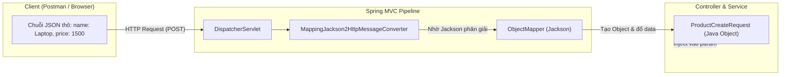
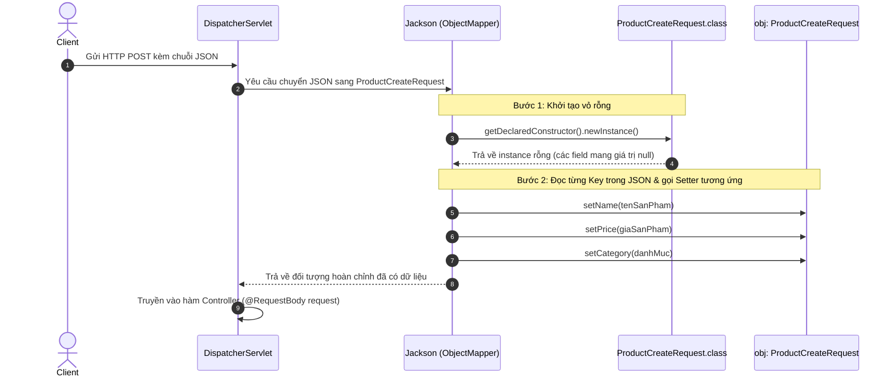
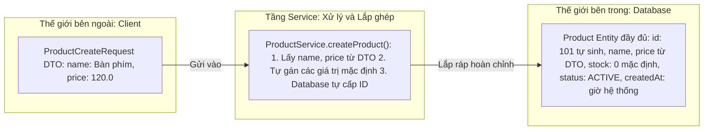
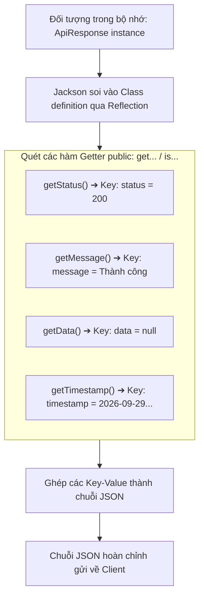
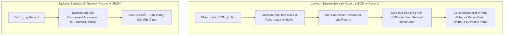

# 📘 CHUYÊN ĐỀ ĐẶC BIỆT: GIẢI MÃ JACKSON — CƠ CHẾ SERIALIZE & DESERIALIZE BÊN DƯỚI GẦM SPRING BOOT

> **Mục tiêu bài học:**
> 1. Hiểu cặn kẽ bản chất Jackson làm thế nào để biến chuỗi JSON thành Java Object (**Deserialization**) và ngược lại (**Serialization**).
> 2. Trả lời dứt khoát câu hỏi: *"Constructor không tham số, Getter, Setter sinh ra để làm gì và ai là người gọi chúng?"*
> 3. Hiểu tại sao **Java Record** (từ Java 16+) không cần Getter/Setter hay Constructor rỗng mà Jackson vẫn xử lý mượt mà.
> 4. Nắm vững các Jackson Annotation quyền lực nhất trong dự án thực tế (`@JsonProperty`, `@JsonIgnore`, `@JsonFormat`, `@JsonInclude`, `@JsonCreator`).
> 5. Khám phá cơ chế Java Reflection bên dưới gầm và kiến trúc `HttpMessageConverter` của Spring MVC.

---

## 1. Tổng quan: Jackson là gì & Đứng ở đâu trong Spring Boot?

Khi xây dựng RESTful API với Spring Boot, bạn chỉ cần khai báo:
- Controller nhận `@RequestBody ProductCreateRequest request`
- Controller trả về `ResponseEntity<ApiResponse<ProductResponse>>`

Client gửi lên chuỗi văn bản JSON, và nhận về chuỗi văn bản JSON. Bạn **không hề** viết dòng code nào để cắt chuỗi (string parsing) hay nối chuỗi JSON.

### ❓ Ai đã làm công việc phiên dịch đó?
Đó chính là thư viện **Jackson** (artifact `com.fasterxml.jackson.core:jackson-databind`), được tích hợp sẵn mặc định trong starter `spring-boot-starter-web`.



Trong hệ sinh thái Spring MVC, đối tượng trung tâm làm việc này là **`ObjectMapper`** của Jackson, được bọc bên trong `MappingJackson2HttpMessageConverter`.

---

## 2. Quá trình 1: Deserialization (JSON ➔ Java Object)

Giả sử Client gửi một HTTP POST request với body JSON:

```json
{
  "name": "Bàn phím cơ AKKO",
  "price": 1250000.0,
  "category": "Bàn phím"
}
```

Và trong mã nguồn dự án của bạn có class [ProductCreateRequest.java](file:///Users/vovantu/HTML_CSS/JAVA%20/springboot-learning/src/main/java/com/example/springbootlearning/dto/request/ProductCreateRequest.java):

```java
public class ProductCreateRequest {
    private String name;
    private Double price;
    private String category;

    // Constructor rỗng (No-args constructor)
    public ProductCreateRequest() {}

    // Getters & Setters
    public void setName(String name) { this.name = name; }
    public void setPrice(Double price) { this.price = price; }
    public void setCategory(String category) { this.category = category; }

    public String getName() { return name; }
    public Double getPrice() { return price; }
    public String getCategory() { return category; }
}
```

Jackson là một thư viện độc lập, nó **không có phép thuật**. Để biến chuỗi văn bản thuần túy thành đối tượng Java với dữ liệu chuẩn, Jackson thực hiện tuần tự **2 bước cốt lõi qua Java Reflection**:



---

### ❓ Đi sâu câu hỏi 1: Tại sao BẮT BUỘC cần Constructor không tham số?

Hãy thử đặt mình vào vị trí của lập trình viên viết thư viện Jackson:
Nếu class `ProductCreateRequest` chỉ có duy nhất một constructor có tham số:
```java
public ProductCreateRequest(String name, Double price, String category) {
    this.name = name;
    this.price = price;
    this.category = category;
}
```

Khi nhận được JSON, Jackson gặp bài toán bế tắc:
1. Thứ tự các key trong JSON gửi lên là **ngẫu nhiên** (JSON không bảo toàn thứ tự: `price` có thể đứng trước `name`).
2. Nếu client chỉ gửi 2 trường mà thiếu `category`, Jackson sẽ không biết truyền giá trị gì vào vị trí thứ 3 của constructor.
3. Trong mã Java bytecode biên dịch thông thường, tên tham số constructor (`arg0`, `arg1`, `arg2`) có thể bị mất nếu không bật cờ `-parameters`. Jackson không biết `arg0` tương ứng với key nào trong JSON!

👉 **Giải pháp chuẩn hoá (JavaBeans Specification):**
Jackson chọn cách an toàn và tổng quát nhất:
```java
// Jackson dùng Reflection để gọi constructor 0 tham số:
Constructor<ProductCreateRequest> ctor = ProductCreateRequest.class.getDeclaredConstructor();
ProductCreateRequest obj = ctor.newInstance(); // Tạo ra vỏ đối tượng rỗng
```

> [!WARNING]
> **Hậu quả nếu thiếu Constructor không tham số:**
> Nếu bạn tự viết một constructor có tham số mà quên viết constructor rỗng (Java sẽ không tự tạo constructor mặc định nữa), Jackson sẽ ném lỗi:
> ```text
> com.fasterxml.jackson.databind.exc.InvalidDefinitionException: 
> Cannot construct instance of `com.example.springbootlearning.dto.request.ProductCreateRequest` 
> (no Creators, like default constructor, exist): cannot deserialize from Object value (no delegate- or property-based Creator)
> ```

---

### ❓ Đi sâu câu hỏi 2: Tại sao BẮT BUỘC cần các hàm Setter?

Trong lập trình hướng đối tượng (OOP), các biến thành viên thường được đặt mức truy cập `private`:
```java
private String name;
private Double price;
```

Sau khi tạo ra đối tượng rỗng ở Bước 1, Jackson cần gán giá trị `"Bàn phím cơ AKKO"` vào biến `name`. 
Theo quy ước JavaBeans:
- Thấy key `"name"` trong JSON ➔ Jackson biến đổi thành tên hàm: `"set"` + Viết hoa chữ cái đầu ➔ `setName(...)`.
- Thấy key `"price"` trong JSON ➔ Tìm hàm `setPrice(...)`.

Jackson gọi các hàm setter này để đưa dữ liệu vào đối tượng một cách hợp lệ, tôn trọng tính đóng gói của Java.

> [!CAUTION]
> **Hậu quả nếu thiếu Setter:**
> Nếu bạn xóa hàm `setName(String name)`, Jackson mặc định sẽ **bỏ qua** key `"name"` trong JSON mà không báo lỗi. Kết quả là trong Controller của bạn:
> `request.getName()` sẽ trả về `null` dù Client có gửi dữ liệu lên đầy đủ!

---

### ❓ Đi sâu câu hỏi 3: Thuộc tính không có trong DTO có bị set `null` không? (Vũ khí chống Mass Assignment Attack)

Đây là thắc mắc cực kỳ phổ biến: *"Nếu DTO chỉ chứa các thuộc tính cho phép (không chứa `id`, `role`, `createdAt`), vậy khi Deserialize thì các thuộc tính không có trong DTO sẽ mang giá trị gì? Có bị set `null` không?"*

Để trả lời chính xác, chúng ta cần phân biệt rõ **2 tình huống hoàn toàn khác nhau**:

#### 🔴 Tình huống 1: Thuộc tính HOÀN TOÀN KHÔNG ĐƯỢC KHAI BÁO trong class DTO
*(Ví dụ: Trong Entity `Product` có các trường `id`, `createdAt`, `role`, nhưng trong [ProductCreateRequest.java](file:///Users/vovantu/HTML_CSS/JAVA%20/springboot-learning/src/main/java/com/example/springbootlearning/dto/request/ProductCreateRequest.java) ta cố tình không khai báo).*

* **Bản chất trong bộ nhớ RAM:** Trong đối tượng DTO, nó **thậm chí không hề có ô nhớ nào để chứa giá trị `null` cả!**
* Khi Jackson khởi tạo `ProductCreateRequest`, đối tượng này chỉ cấp phát ô nhớ cho đúng các biến đã khai báo (`name`, `price`, `category`, `description`, `stock`). Biến `id` hay `role` đơn giản là **không tồn tại**.

> [!TIP]
> **🛡️ Kịch bản Hacker tấn công Mass Assignment (Over-Posting Vulnerability):**
> Giả sử một người dùng cố tình can thiệp HTTP Request để tự phong làm ADMIN hoặc tự gán ID:
> ```json
> {
>   "name": "Bàn phím cơ AKKO",
>   "price": 120.0,
>   "role": "ADMIN",
>   "id": 9999
> }
> ```
> **Jackson sẽ làm gì?**
> 1. Duyệt key `"name"` ➔ Gọi `setName("Bàn phím cơ AKKO")` ✅
> 2. Duyệt key `"price"` ➔ Gọi `setPrice(120.0)` ✅
> 3. Duyệt key `"role"` và `"id"` ➔ Soi vào `ProductCreateRequest` thấy **không có biến và không có hàm setter nào** ➔ **Jackson lập tức vứt bỏ (ignore) hoàn toàn 2 trường này!**
> 
> Nhờ đó, dù Client có gửi dữ liệu độc hại gì lên, hệ thống vẫn an toàn tuyệt đối ngay tại cửa ngõ Controller.

#### 🔵 Tình huống 2: Thuộc tính CÓ trong DTO, nhưng Client KHÔNG GỬI lên trong JSON
*(Ví dụ: Trong DTO có khai báo biến `description`, nhưng Client gửi JSON chỉ có `name` và `price`).*

```json
{
  "name": "Bàn phím",
  "price": 120.0
}
```

* **Câu trả lời:** **ĐÚNG, thuộc tính `description` sẽ mang giá trị `null`!**
* **Tại sao lại là `null`?**
  1. Ở Bước 1: Jackson gọi constructor rỗng `new ProductCreateRequest()`. Mặc định trong Java, các biến đối tượng (`String`, `Double`, `Long`) khi chưa được gán giá trị sẽ nhận giá trị mặc định là **`null`** (biến nguyên thủy `int`, `boolean` sẽ là `0`, `false`).
  2. Ở Bước 2: Vì trong chuỗi JSON **không có key `"description"`**, Jackson **không bao giờ gọi** `setDescription(...)`.
  3. Kết quả: `description` vẫn giữ nguyên giá trị khởi tạo ban đầu là **`null`**.

---

### ❓ Đi sâu câu hỏi 4: Phân định 2 thế giới DTO vs Entity — Các thuộc tính còn lại (`id`, `createdAt`,...) ở đâu ra?

Nếu đối tượng DTO chỉ lưu trữ vỏn vẹn `name`, `price`, vậy khi lưu xuống Cơ sở dữ liệu, một bản ghi `Product` hoàn chỉnh cần tới 10 cột dữ liệu thì **các thuộc tính còn lại đó lấy từ đâu ra và được gán khi nào?**

Câu trả lời nằm ở: **Tầng Service (Business Logic) và Cơ sở dữ liệu (Database)!**



#### 🔍 Minh chứng trực tiếp từ mã nguồn dự án:

Hãy quan sát hàm `createProduct` trong file [ProductService.java](file:///Users/vovantu/HTML_CSS/JAVA%20/springboot-learning/src/main/java/com/example/springbootlearning/service/ProductService.java#L133-L147):

```java
public ProductResponse createProduct(ProductCreateRequest request) {
    // 1. Tạo đối tượng Entity mới toanh
    Product product = new Product();

    // 2. Những gì DTO có: Ta lấy từ DTO copy sang
    product.setName(request.getName());
    product.setPrice(request.getPrice());
    product.setDescription(request.getDescription());
    product.setCategory(request.getCategory());

    // 3. Những gì Client không bắt buộc: Service tự quyết định giá trị mặc định
    product.setStock(request.getStock() != null ? request.getStock() : 0);

    // 4. Lưu Entity xuống Database:
    Product saved = productRepository.save(product);

    return ProductResponse.fromEntity(saved);
}
```

Và bên trong [ProductRepository.java](file:///Users/vovantu/HTML_CSS/JAVA%20/springboot-learning/src/main/java/com/example/springbootlearning/repository/ProductRepository.java#L46-L52), hàm `save()` thực hiện bước cấp phát cuối cùng:

```java
public Product save(Product product) {
    // Tự sinh ID tăng dần (Database Auto Increment)
    product.setId(idCounter.incrementAndGet()); 
    
    // Tự lấy thời gian thực của máy chủ (Server Timestamp)
    product.setCreatedAt(LocalDateTime.now());
    product.setUpdatedAt(LocalDateTime.now());
    
    products.add(product);
    return product;
}
```

#### 🌟 Ví dụ kinh điển: Chức năng Đăng ký tài khoản (User Registration)
Sự phân tách này thể hiện rõ nhất khi làm tính năng tạo tài khoản:
- **Client gửi lên DTO:** Chỉ có `email` và `password`.
- **Hệ thống lắp ráp Entity trước khi lưu:**
  - `id`: Database tự sinh (`1, 2, 3...`).
  - `email`: Copy từ DTO.
  - `password`: **Service mã hóa BCrypt** `passwordEncoder.encode(dto.getPassword())` (tuyệt đối không lưu raw password).
  - `role`: **Service tự gán cứng là `"ROLE_USER"`** (ngăn chặn Client tự gửi `"role": "ROLE_ADMIN"`).
  - `status`: **Service gán là `"PENDING_VERIFICATION"`** (chờ xác thực email).
  - `createdAt`: Lấy `LocalDateTime.now()`.
  - `failedLoginAttempts`: Gán mặc định bằng `0`.

#### 📊 Bảng tổng kết các kịch bản dữ liệu

| Kịch bản | DTO có khai báo biến không? | Client có gửi lên trong JSON không? | Giá trị trong DTO Object | Giá trị trong Entity sau khi lưu |
| :--- | :---: | :---: | :---: | :--- |
| **Bình thường** (`name`) | Có | Có | Giá trị Client gửi (`"Laptop"`) | Lưu giá trị từ DTO |
| **Client bỏ trống** (`description`) | Có | **Không** | **`null`** (mặc định của Java) | Mang giá trị `null` (hoặc default do Service quy định) |
| **Trường nhạy cảm/hệ thống** (`id`, `role`, `createdAt`) | **Không** | Cố tình gửi (`role: "ADMIN"`) | **Không tồn tại trong DTO** (Jackson bỏ qua) | Do Database hoặc Service tự quyết định (`ROLE_USER`, `now()`) |

---

## 3. Quá trình 2: Serialization (Java Object ➔ JSON)

Bây giờ là chiều ngược lại: Bạn có một đối tượng Java trong RAM (ví dụ: [ApiResponse](file:///Users/vovantu/HTML_CSS/JAVA%20/springboot-learning/src/main/java/com/example/springbootlearning/dto/response/ApiResponse.java) chứa dữ liệu trả về) và muốn gửi về cho Client qua giao thức HTTP.

```java
ApiResponse<String> response = ApiResponse.success("Thành công");
```

Spring chuyển đối tượng `response` cho Jackson và ra lệnh: *"Hãy tuần tự hóa (serialize) đối tượng này thành chuỗi JSON!"*



---

### 💡 Sự thật bất ngờ: Jackson chỉ nhìn vào GETTER, KHÔNG nhìn vào Field!

Rất nhiều lập trình viên nghĩ rằng Jackson quét qua các biến `private String name;`, `private Double price;` để tạo JSON. **Thực tế hoàn toàn không phải vậy!** 

Theo chuẩn JavaBeans, Jackson phát hiện thuộc tính (properties) thông qua **các hàm Getter**:
- Bất kỳ hàm public nào bắt đầu bằng `get` (hoặc `is` đối với kiểu `boolean`) và không nhận tham số đều được Jackson coi là một thuộc tính JSON.

#### Thí nghiệm 1: Getter "ma" sinh ra field JSON mới
Giả sử trong class của bạn chỉ có 2 biến `price` và `taxRate`, không hề có biến nào tên là `finalPrice`:
```java
public class Invoice {
    private Double price = 100.0;
    private Double taxRate = 0.1;

    // Không có biến private Double finalPrice;
    
    // NHƯNG cố tình viết thêm Getter này:
    public Double getFinalPrice() {
        return this.price * (1 + this.taxRate);
    }

    public Double getPrice() { return price; }
    public Double getTaxRate() { return taxRate; }
}
```
**Kết quả JSON sinh ra:**
```json
{
  "price": 100.0,
  "taxRate": 0.1,
  "finalPrice": 110.0
}
```
👉 **Field `"finalPrice"` tự động xuất hiện trong JSON!** Vì Jackson thấy hàm `getFinalPrice()`.

#### Thí nghiệm 2: Có biến private nhưng xóa mất Getter
Nếu bạn có `private String secretKey = "123456";` nhưng bạn **không viết hàm `getSecretKey()`**:
👉 **Trong JSON trả về sẽ hoàn toàn KHÔNG CÓ trường `"secretKey"`!**

#### Thí nghiệm 3: Class không có bất kỳ Getter nào
Nếu một class có 10 trường `private` nhưng không có hàm `get` nào, Jackson sẽ ném lỗi ngay:
```text
com.fasterxml.jackson.databind.exc.InvalidDefinitionException: 
No serializer found for class com.example.MyClass and no properties discovered to create BeanSerializer
```

---

## 4. Bảng tổng hợp vai trò của 3 thành phần

| Thành phần | Thuộc quá trình nào? | Vai trò cụ thể đối với Jackson | Nếu thiếu thì điều gì sẽ xảy ra? |
| :--- | :--- | :--- | :--- |
| **Constructor không tham số** *(No-args ctor)* | **Deserialization** *(JSON ➔ Object)* | Dùng để tạo ra một instance rỗng ban đầu trong bộ nhớ RAM qua Reflection. | Ném lỗi `InvalidDefinitionException: no Creators, like default constructor, exist`. |
| **Hàm Setter** *(`setXxx`)* | **Deserialization** *(JSON ➔ Object)* | Đọc giá trị tương ứng với key từ JSON và gán vào instance rỗng vừa tạo. | Field trong Java Object sẽ bị mang giá trị mặc định (`null`, `0`, `false`). |
| **Hàm Getter** *(`getXxx` / `isXxx`)* | **Serialization** *(Object ➔ JSON)* | Jackson gọi getter để lấy dữ liệu ra và quyết định tên key tương ứng trong JSON. | JSON bị thiếu trường dữ liệu, hoặc ném lỗi `No serializer found`. |

---

## 5. Cuộc cách mạng Java Record: Tại sao không cần Getter/Setter vẫn chạy?

Ở [Bài 5](file:///Users/vovantu/HTML_CSS/JAVA%20/Note/Lesson05/bai-5-responseentity-dto-pattern.md), chúng ta đã dùng [ProductResponse.java](file:///Users/vovantu/HTML_CSS/JAVA%20/springboot-learning/src/main/java/com/example/springbootlearning/dto/response/ProductResponse.java):

```java
public record ProductResponse(
    Long id,
    String name,
    Double price,
    String category
) {}
```

Quan sát kỹ class Record trên:
- ❌ Không có constructor không tham số (`public ProductResponse() {}`).
- ❌ Không có các hàm `setId()`, `setName()`, `setPrice()` (Record vốn là Immutable - bất biến, không cho phép sửa đổi).
- ❌ Không có các hàm `getId()`, `getName()` (Record dùng tên hàm trùng với tên biến: `id()`, `name()`).

### ❓ Vì sao Jackson vẫn đọc và ghi được Record?

Từ phiên bản **Jackson 2.12+** (tương thích hoàn hảo với Java 16+), nhóm phát triển Jackson đã bổ sung tính năng hỗ trợ trực tiếp (native support) cho Java Record:



### ⚖️ So sánh: JavaBean truyền thống vs Java Record

| Tiêu chí | DTO dùng JavaBean thông thường | DTO dùng Java Record (Khuyên dùng) |
| :--- | :--- | :--- |
| **Cách tạo Object (Deserialize)** | 2 bước: New rỗng ➔ Gọi từng Setter | **1 bước duy nhất:** Gọi Canonical Constructor |
| **Tính bất biến (Immutability)** | Thường là Mutable (dễ bị code khác vô tình `set` đổi dữ liệu) | **100% Immutable** (an toàn tuyệt đối giữa các luồng) |
| **Số dòng code boilerplate** | Dài (cần ctor rỗng, ctor đầy đủ, getters, setters, equals, hashCode) | **Chỉ 1 dòng khai báo ngắn gọn** |
| **Mục đích sử dụng tối ưu** | Dùng cho Request DTO phức tạp hoặc Entity JPA | **Tối ưu tuyệt đối cho Response DTO** |

---

## 6. Các Jackson Annotation quyền lực nhất trong dự án thực tế

Trong công việc thực tế, dữ liệu JSON từ Client hoặc từ bên thứ ba (Third-party API) không phải lúc nào cũng khớp hoàn hảo với quy ước camelCase của Java. Jackson cung cấp bộ annotation mạnh mẽ để kiểm soát hành vi:

### 1. `@JsonProperty`: Đổi tên field & chỉ định quyền đọc/ghi
Khi Client gửi định dạng `snake_case` nhưng Java dùng `camelCase`:

```java
public class UserDto {
    // JSON nhận: {"user_name": "anhtu", "pass_word": "123"}
    @JsonProperty("user_name")
    private String userName;

    // Write-only: Chỉ cho phép Client gửi lên (Deserialize), KHÔNG BAO GIỜ serialize trả về trong JSON
    @JsonProperty(value = "pass_word", access = JsonProperty.Access.WRITE_ONLY)
    private String password;
}
```

---

### 2. `@JsonIgnore`: Ẩn hoàn toàn dữ liệu nhạy cảm
Ngăn không cho Jackson serialize field này ra JSON (tránh lộ thông tin bảo mật):

```java
public class AccountResponse {
    private String accountNumber;
    private Double balance;

    @JsonIgnore // Trường này sẽ không bao giờ xuất hiện trong JSON trả về
    private String internalAuditNotes;
}
```

---

### 3. `@JsonFormat`: Định dạng ngày tháng & số thực
Giải quyết triệt để lỗi định dạng thời gian giữa Java `LocalDateTime` và Javascript:

```java
public class OrderResponse {
    private Long id;

    // Hiển thị chuẩn theo giờ Việt Nam
    @JsonFormat(shape = JsonFormat.Shape.STRING, pattern = "dd/MM/yyyy HH:mm:ss", timezone = "Asia/Ho_Chi_Minh")
    private LocalDateTime createdAt;
}
```

---

### 4. `@JsonInclude`: Loại bỏ các trường NULL để làm nhẹ payload
Mặc định nếu field bằng `null`, Jackson vẫn sinh ra `"data": null` trong JSON. Để tối ưu dung lượng mạng:

```java
@JsonInclude(JsonInclude.Include.NON_NULL) // Chỉ serialize những field nào KHÁC NULL
public class ApiResponse<T> {
    private int status;
    private String message;
    private T data; // Nếu data == null, trường "data" sẽ biến mất khỏi JSON hoàn toàn
}
```

---

### 5. `@JsonCreator` & `@JsonProperty`: Tạo class Immutable không cần No-args constructor
Nếu bạn muốn dùng Class thông thường (thay vì Record) nhưng muốn các field là `final` (không có Setter):

```java
public class ImmutableProductRequest {
    private final String name;
    private final Double price;

    // Báo cho Jackson biết dùng constructor này thay vì constructor rỗng:
    @JsonCreator
    public ImmutableProductRequest(
            @JsonProperty("name") String name,
            @JsonProperty("price") Double price) {
        this.name = name;
        this.price = price;
    }

    public String getName() { return name; }
    public Double getPrice() { return price; }
}
```

---

## 7. Kiến thức Java Core & Pattern chuyên sâu

### 1. Java Reflection API — Bí mật dưới gầm của Jackson
Khi chạy ứng dụng, Jackson sử dụng gói `java.lang.reflect.*`.
Nếu bạn tò mò Jackson gọi Constructor rỗng như thế nào, mã nguồn bản chất tương tự như đoạn code Java Core sau:

```java
// Giả lập cơ chế Jackson Deserialization thuần bằng Reflection:
Class<?> clazz = Class.forName("com.example.springbootlearning.dto.request.ProductCreateRequest");

// 1. Tìm constructor không tham số
Constructor<?> noArgCtor = clazz.getDeclaredConstructor();
noArgCtor.setAccessible(true); // Vượt qua kiểm tra private nếu cần
Object instance = noArgCtor.newInstance(); // Tạo đối tượng rỗng

// 2. Tìm setter và invoke
Method setNameMethod = clazz.getMethod("setName", String.class);
setNameMethod.invoke(instance, "Laptop Dell XPS"); // Tương đương instance.setName("Laptop Dell XPS")
```

### 2. Design Pattern: Strategy Pattern trong Jackson Serialization
Jackson không dùng một khối `if-else` khổng lồ để kiểm tra kiểu dữ liệu (String, Integer, List, Map...). 
Thay vào đó, Jackson sử dụng **Strategy Pattern**:
- Mỗi kiểu dữ liệu có một `JsonSerializer<T>` riêng biệt: `StringSerializer`, `NumberSerializer`, `CollectionSerializer`, `BeanSerializer`.
- Khi duyệt qua từng getter của object, Jackson tra cứu trong `SerializerProvider` để lấy ra chiến lược serialize phù hợp và ghi vào `JsonGenerator`.

---

## 8. 🎯 Câu đố củng cố kiến thức (Interview Quiz)

### Câu hỏi 1:
> **Đoạn code sau đây trả về JSON như thế nào cho Client?**
> ```java
> public class Student {
>     private String fullName = "Nguyễn Văn A";
>     public String getName() {
>         return this.fullName;
>     }
> }
> ```
> A. `{"fullName": "Nguyễn Văn A"}`  
> B. `{"name": "Nguyễn Văn A"}`  
> C. Lỗi vì tên biến và tên getter không trùng nhau.  
> 
> 👉 **Đáp án:** **B**. Vì Jackson sinh key dựa trên tên Getter (`getName` ➔ `"name"`), hoàn toàn bỏ qua tên biến `fullName`.

---

### Câu hỏi 2:
> **Tại sao khi dùng Lombok `@Getter` và `@Setter` trên field boolean `boolean isActive`, Jackson lại sinh ra key `"active"` thay vì `"isActive"`?**
> 
> 👉 **Giải thích:** Lombok tuân thủ quy ước JavaBean: với biến kiểu boolean nguyên thủy `boolean`, hàm getter sinh ra sẽ là `public boolean isActive()`. 
> Khi Jackson quét thấy hàm `isActive()`, theo quy tắc nó sẽ cắt bỏ tiền tố `is` và viết thường chữ tiếp theo ➔ sinh ra key `"active"`. 
> 
> *Cách khắc phục nếu muốn giữ nguyên `isActive` trong JSON:* Đổi sang kiểu đối tượng `Boolean isActive` (Lombok sẽ sinh `getIsActive()`) hoặc gắn `@JsonProperty("isActive")`.

---

## 📚 Tóm tắt ghi nhớ nhanh (Takeaway)

1. **Jackson** là cầu nối trung gian giữa chuỗi văn bản JSON của HTTP và Java Object trong Spring Boot.
2. **Deserialize (JSON ➔ Object):** Cần **Constructor 0 tham số** để tạo vỏ rỗng, và cần **Setter** để đổ dữ liệu vào vỏ đó.
3. **Serialize (Object ➔ JSON):** Jackson chỉ quét các hàm **Getter public**, không phụ thuộc vào biến `private`.
4. **Java Record (Java 16+):** Giải pháp hiện đại tối ưu nhất cho DTO response, tự động tương thích với Jackson mà không cần Getter/Setter hay Constructor rỗng.
5. Sử dụng các annotation như `@JsonProperty`, `@JsonIgnore`, `@JsonInclude`, `@JsonFormat` để điều khiển chính xác cấu trúc JSON theo mong muốn.
