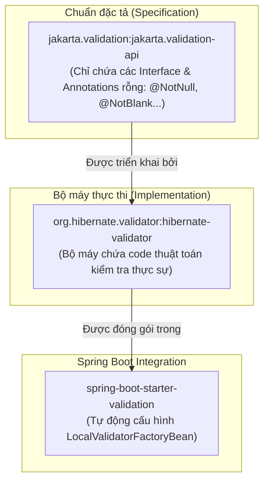
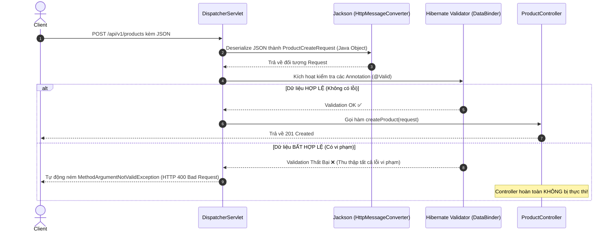
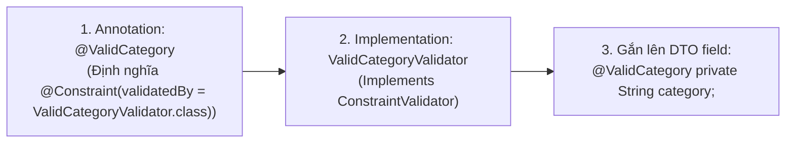
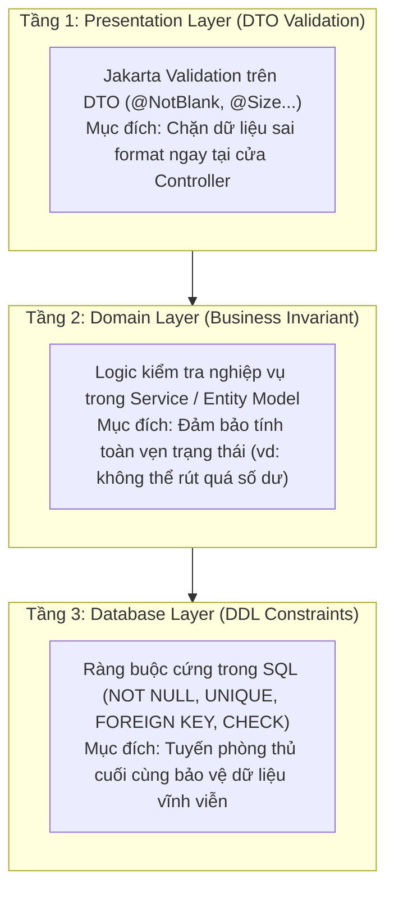

# 📘 BÀI 6: VALIDATION — KIỂM TRA DỮ LIỆU ĐẦU VÀO VỚI BEAN VALIDATION & HIBERNATE VALIDATOR

> **Mục tiêu bài học:**
> 1. Nắm vững triết lý **"Never Trust User Input"** và nguyên lý **Fail-Fast** trong phát triển REST API chuyên nghiệp.
> 2. Hiểu rõ kiến trúc **Jakarta Bean Validation (JSR 380)** và vai trò của **Hibernate Validator** bên dưới gầm Spring Boot.
> 3. Phân biệt chính xác bộ ba "kinh điển" `@NotNull`, `@NotEmpty`, `@NotBlank` và các annotation kiểm tra số, chuỗi, định dạng regex.
> 4. Kích hoạt Validation bằng `@Valid` và `@Validated` trên Request Body, Path Variable và Request Param.
> 5. Tự tay xây dựng **Custom Constraint Validator** có khả năng inject Spring Bean (`ProductRepository`) để kiểm tra nghiệp vụ.
> 6. Refactor mã nguồn dự án: Loại bỏ hoàn toàn các câu lệnh `if-else` validation thủ công ở tầng Service.

---

## 1. Đặt vấn đề: Nỗi ám ảnh "Dữ liệu bẩn" & Bẫy `if-else` thủ công

Ở [Bài 5](file:///Users/vovantu/HTML_CSS/JAVA%20/Note/Lesson05/bai-5-responseentity-dto-pattern.md), chúng ta đã xây dựng tầng Service hoàn chỉnh. Tuy nhiên, nếu bạn mở lại [ProductService.java](file:///Users/vovantu/HTML_CSS/JAVA%20/springboot-learning/src/main/java/com/example/springbootlearning/service/ProductService.java#L259-L272), bạn sẽ thấy đoạn code sau:

```java
// ❌ CÁCH LÀM CŨ: Viết if-else thủ công trong Service
private void validateCreateRequest(ProductCreateRequest request) {
    if (request.getName() == null || request.getName().isBlank()) {
        throw new IllegalArgumentException("Tên sản phẩm không được để trống");
    }
    if (request.getPrice() == null || request.getPrice() <= 0) {
        throw new IllegalArgumentException("Giá sản phẩm phải lớn hơn 0");
    }
    if (request.getCategory() == null || request.getCategory().isBlank()) {
        throw new IllegalArgumentException("Danh mục sản phẩm không được để trống");
    }
}
```

### 😱 Tại sao cách làm này bị coi là "Code Smell" trong dự án lớn?
1. **Vi phạm nguyên tắc Single Responsibility (SRP):** Tầng Service sinh ra để giải quyết **Business Logic** (tính toán, trừ tồn kho, lưu đơn hàng). Nó không nên bị biến thành bãi rác chứa hàng trăm dòng `if (x == null || x.isEmpty())`.
2. **Trùng lặp mã nguồn (DRY Violation):** Nếu có 5 API nhận thông tin sản phẩm (Tạo mới, Cập nhật toàn phần, Cập nhật một phần, Nhập kho, Kiểm hàng), bạn sẽ phải copy-paste đống `if-else` này 5 lần!
3. **Dữ liệu bẩn đã đi quá sâu vào hệ thống:** Thay vì chặn ngay tại "cửa khẩu" (Controller), dữ liệu bẩn đã lọt qua DispatcherServlet, đi qua Controller rồi mới vào đến Service mới bị văng Exception.
4. **Phản hồi người dùng không thân thiện:** Nếu người dùng gửi thiếu cả `name`, `price`, và `category`, câu lệnh `if` đầu tiên sẽ văng lỗi ngay lập tức. Người dùng sửa xong `name`, gửi lại thì mới biết `price` cũng sai! Họ không nhận được danh sách tổng hợp tất cả các trường bị lỗi cùng một lúc.

---

## 2. Kiến trúc Jakarta Bean Validation & Hibernate Validator

Để giải quyết vấn đề trên, cộng đồng Java đã chuẩn hóa giải pháp **Bean Validation (JSR 380 / Jakarta Validation)**.



> [!NOTE]
> - **`jakarta.validation-api`**: Là bộ tiêu chuẩn (Interface), quy định các annotation như `@NotNull`, `@Size`, `@Min`.
> - **`hibernate-validator`**: Là thư viện thực thi chuẩn đó (hoàn toàn độc lập với Hibernate ORM / Database). Nó có thể chạy trong mọi ứng dụng Java thuần.
> - **`spring-boot-starter-validation`**: Là gói starter của Spring Boot giúp gắn kết Hibernate Validator vào quy trình xử lý Request của Spring MVC một cách tự động.

---

### 🔄 Luồng thực thi Validation bên dưới gầm Spring MVC

Khi một request gửi đến Controller có gắn `@Valid`, chuyện gì xảy ra?



👉 **Nguyên lý Fail-Fast:** Nếu dữ liệu sai, Spring dừng lại ngay lập tức và ném mã lỗi `400 Bad Request`. Tầng Controller và Service được bảo vệ an toàn 100%, không bao giờ phải tiếp xúc với dữ liệu rác!

---

## 3. Bộ Annotations Validation chuẩn & Bảng so sánh "Kinh điển"

### 3.1. Phân biệt `@NotNull` vs `@NotEmpty` vs `@NotBlank` (Câu hỏi phỏng vấn số 1)

Đây là 3 annotation dễ gây nhầm lẫn nhất đối với mọi lập trình viên Java:

| Giá trị kiểm tra | `@NotNull` | `@NotEmpty` | `@NotBlank` | Giải thích chi tiết |
| :--- | :---: | :---: | :---: | :--- |
| `null` | ❌ Lỗi | ❌ Lỗi | ❌ Lỗi | Cả 3 đều cấm `null`. |
| `""` *(Chuỗi rỗng, length = 0)* | ✅ Hợp lệ | ❌ Lỗi | ❌ Lỗi | `@NotNull` cho qua vì chuỗi rỗng vẫn là một đối tượng non-null. |
| `"   "` *(Toàn dấu cách space)* | ✅ Hợp lệ | ✅ Hợp lệ | ❌ Lỗi | `@NotEmpty` cho qua vì length = 3 > 0. Chỉ `@NotBlank` trim khoảng trắng rồi mới kiểm tra! |
| `"iPhone 16"` *(Chuỗi hợp lệ)* | ✅ Hợp lệ | ✅ Hợp lệ | ✅ Hợp lệ | Hợp lệ với cả 3. |
| **Áp dụng cho kiểu dữ liệu nào?** | **Mọi kiểu Object** (String, Long, Double, Object...) | **String, Collection, Map, Array** | **CHỈ DÀNH CHO String** (Char sequence) |

> [!IMPORTANT]
> **Quy tắc vàng khi chọn:**
> - Với chuỗi văn bản (Tên, Email, Mật khẩu, Số điện thoại) 👉 **Luôn luôn dùng `@NotBlank`**! (Tránh trường hợp người dùng cố tình nhập toàn dấu cách `space`).
> - Với số, ngày tháng, enum hoặc đối tượng (`Double price`, `Long categoryId`, `LocalDate dob`) 👉 **Dùng `@NotNull`**! (Không bao giờ đặt `@NotBlank` trên kiểu số vì sẽ văng lỗi `UnexpectedTypeException`).
> - Với danh sách mảng (`List<Long> itemIds`) 👉 **Dùng `@NotEmpty`** (đảm bảo danh sách không null và có ít nhất 1 phần tử).

---

### 3.2. Bảng tổng hợp các Annotation thông dụng nhất

#### 1. Kiểm tra độ dài & Kích thước:
* `@Size(min = 3, max = 50, message = "...")`: Giới hạn độ dài chuỗi hoặc số phần tử trong List.
* `@Length(min = 3, max = 50)`: Tương tự `@Size` nhưng là annotation riêng của Hibernate Validator (khuyên dùng `@Size` chuẩn Jakarta).

#### 2. Kiểm tra Số học (Numeric):
* `@Min(value = 0, message = "...")`: Giá trị số nguyên tối thiểu.
* `@Max(value = 100, message = "...")`: Giá trị số nguyên tối đa.
* `@Positive`: Bắt buộc phải là số dương (`> 0`). Rất thích hợp cho `price`!
* `@PositiveOrZero`: Số dương hoặc bằng 0 (`>= 0`). Rất thích hợp cho số lượng tồn kho `stock`!
* `@Negative` / `@NegativeOrZero`: Bắt buộc số âm / âm hoặc 0.
* `@DecimalMin("0.01")` / `@DecimalMax("99999.99")`: Dành cho kiểm tra số thực (`Double`, `BigDecimal`).

#### 3. Định dạng văn bản & Biểu thức chính quy (Regex):
* `@Email(message = "Email không đúng định dạng")`: Kiểm tra định dạng email tiêu chuẩn.
* `@Pattern(regexp = "^0[0-9]{9}$", message = "Số điện thoại phải có 10 chữ số bắt đầu bằng 0")`: Kiểm tra định dạng tùy ý qua Regular Expression.

#### 4. Kiểm tra Thời gian (Date & Time):
* `@Past` / `@PastOrPresent`: Thời điểm phải ở trong quá khứ (ví dụ: ngày sinh `dateOfBirth`).
* `@Future` / `@FutureOrPresent`: Thời điểm phải ở tương lai (ví dụ: ngày hết hạn voucher, hạn thẻ tín dụng).

---

## 4. Kích hoạt Validation trong Spring MVC

### 4.1. Phân biệt `@Valid` vs `@Validated`

Trong Spring Boot, bạn sẽ thấy lúc thì dùng `@Valid`, lúc lại dùng `@Validated`:

| Tiêu chí | `@Valid` | `@Validated` |
| :--- | :--- | :--- |
| **Nguồn gốc** | Thuộc chuẩn **Jakarta Validation** (`jakarta.validation.Valid`) | Thuộc framework **Spring** (`org.springframework.validation.annotation.Validated`) |
| **Vị trí sử dụng** | Đặt trước tham số method: `@Valid @RequestBody DTO` | Đặt trên **Class Controller** hoặc trước tham số method |
| **Tính năng nâng cao** | Không hỗ trợ Validation Groups | **Hỗ trợ Validation Groups** (nhóm các rule validate khác nhau khi tạo mới vs cập nhật) |
| **Validate PathVariable & RequestParam** | Không tự kích hoạt được trên tham số đơn lẻ | **BẮT BUỘC** phải có `@Validated` trên Class Controller |

---

### 4.2. Cách sử dụng chuẩn xác trong Controller

#### Kịch bản 1: Validate Request Body (Dùng `@Valid`)
```java
@PostMapping
public ResponseEntity<ApiResponse<ProductResponse>> createProduct(
        @Valid @RequestBody ProductCreateRequest request) { // 👈 Bắt buộc có @Valid
    
    ProductResponse created = productService.createProduct(request);
    return ResponseEntity.status(HttpStatus.CREATED).body(ApiResponse.created(created));
}
```

#### Kịch bản 2: Validate Path Variable & Request Param (Dùng `@Validated`)
Nếu Client gọi: `GET /api/v1/products/-5` hoặc `GET /api/v1/products?page=-1`, làm sao chặn ngay tại tham số?
👉 **Bắt buộc gắn `@Validated` trên Class Controller** và các annotation kiểm tra trực tiếp trên biến:

```java
@RestController
@RequestMapping("/api/v1/products")
@Validated // 👈 Bắt buộc có annotation này ở cấp Class!
public class ProductController {

    @GetMapping("/{id}")
    public ResponseEntity<ApiResponse<ProductResponse>> getProductById(
            @PathVariable @Min(value = 1, message = "ID sản phẩm phải là số nguyên dương lớn hơn hoặc bằng 1") Long id) {
        
        return ResponseEntity.ok(ApiResponse.success(productService.getProductById(id)));
    }
}
```

---

## 5. Nâng cao: Tự chế Custom Constraint Validator

Đôi khi các annotation có sẵn không đáp ứng được nghiệp vụ thực tế. Ví dụ:
1. Danh mục sản phẩm chỉ được phép là 1 trong các danh mục quy định: `Laptop`, `Phone`, `Tablet`, `Phụ kiện`, `Bàn phím`.
2. Tên sản phẩm không được trùng với tên đã có trong Database.

Chúng ta hoàn toàn có thể tự tạo các Annotation kiểm tra riêng!

### 5.1. Cấu trúc của một Custom Constraint trong Java

Để tạo một custom validator, chúng ta luôn cần **2 thành phần**:
1. **Annotation định nghĩa**: Khai báo tên annotation và cấu hình ràng buộc (`@Target`, `@Retention`, `@Constraint`).
2. **Validator class**: Class cài đặt interface `ConstraintValidator<Annotation, KiểuDữLiệu>` chứa logic kiểm tra trả về `true` hoặc `false`.



---

### 5.2. Triển khai Custom Validator 1: `@ValidCategory` (Whitelist Validation)

#### Bước 1: Tạo Annotation `@ValidCategory`
```java
package com.example.springbootlearning.validation.annotation;

import com.example.springbootlearning.validation.validator.ValidCategoryValidator;
import jakarta.validation.Constraint;
import jakarta.validation.Payload;

import java.lang.annotation.*;

@Target({ElementType.FIELD, ElementType.PARAMETER})
@Retention(RetentionPolicy.RUNTIME)
@Documented
@Constraint(validatedBy = ValidCategoryValidator.class) // Liên kết với class xử lý
public @interface ValidCategory {

    // Thông báo lỗi mặc định nếu không truyền message
    String message() default "Danh mục không hợp lệ. Chỉ chấp nhận: Laptop, Phone, Tablet, Phụ kiện, Bàn phím";

    // 2 thuộc tính chuẩn bắt buộc phải có theo quy chuẩn Jakarta Bean Validation:
    Class<?>[] groups() default {};
    Class<? extends Payload>[] payload() default {};
}
```

#### Bước 2: Tạo Class xử lý `ValidCategoryValidator`
```java
package com.example.springbootlearning.validation.validator;

import com.example.springbootlearning.validation.annotation.ValidCategory;
import jakarta.validation.ConstraintValidator;
import jakarta.validation.ConstraintValidatorContext;

import java.util.List;

public class ValidCategoryValidator implements ConstraintValidator<ValidCategory, String> {

    // Danh sách whitelist các danh mục hợp lệ
    private static final List<String> ALLOWED_CATEGORIES = List.of(
            "Laptop", "Phone", "Tablet", "Phụ kiện", "Bàn phím"
    );

    @Override
    public boolean isValid(String value, ConstraintValidatorContext context) {
        // Lưu ý: Nếu value = null, ta trả về true để nhường quyền kiểm tra cho @NotBlank hoặc @NotNull
        if (value == null || value.isBlank()) {
            return true;
        }

        // Kiểm tra xem danh mục gửi lên có nằm trong danh sách cho phép không (không phân biệt hoa thường)
        return ALLOWED_CATEGORIES.stream()
                .anyMatch(cat -> cat.equalsIgnoreCase(value.trim()));
    }
}
```

---

### 5.3. Triển khai Custom Validator 2: `@UniqueProductName` (Inject Spring Bean vào Validator)

> 💡 **Bí thuật ít người biết:** `ConstraintValidator` được quản lý bởi Spring IoC Container! Điều này có nghĩa là bạn hoàn toàn có thể `@Autowired` hoặc Constructor Inject các Service/Repository vào trong Validator để truy vấn Database!

#### Bước 1: Tạo Annotation `@UniqueProductName`
```java
package com.example.springbootlearning.validation.annotation;

import com.example.springbootlearning.validation.validator.UniqueProductNameValidator;
import jakarta.validation.Constraint;
import jakarta.validation.Payload;

import java.lang.annotation.*;

@Target({ElementType.FIELD})
@Retention(RetentionPolicy.RUNTIME)
@Documented
@Constraint(validatedBy = UniqueProductNameValidator.class)
public @interface UniqueProductName {

    String message() default "Tên sản phẩm đã tồn tại trong hệ thống, vui lòng chọn tên khác";

    Class<?>[] groups() default {};
    Class<? extends Payload>[] payload() default {};
}
```

#### Bước 2: Tạo Validator và Inject [ProductRepository](file:///Users/vovantu/HTML_CSS/JAVA%20/springboot-learning/src/main/java/com/example/springbootlearning/repository/ProductRepository.java)
```java
package com.example.springbootlearning.validation.validator;

import com.example.springbootlearning.repository.ProductRepository;
import com.example.springbootlearning.validation.annotation.UniqueProductName;
import jakarta.validation.ConstraintValidator;
import jakarta.validation.ConstraintValidatorContext;
import org.springframework.beans.factory.annotation.Autowired;

public class UniqueProductNameValidator implements ConstraintValidator<UniqueProductName, String> {

    @Autowired
    private ProductRepository productRepository; // 👈 Spring tự động inject Bean vào đây!

    @Override
    public boolean isValid(String name, ConstraintValidatorContext context) {
        if (name == null || name.isBlank()) {
            return true; // Để @NotBlank xử lý
        }

        // Kiểm tra xem tên sản phẩm đã có trong kho chưa
        return !productRepository.existsByName(name.trim());
    }
}
```

---

## 6. Thực hành: Nâng cấp toàn diện Product API trong dự án

### 6.1. Cập nhật `ProductCreateRequest.java` với bộ Validation toàn diện

Mở file [ProductCreateRequest.java](file:///Users/vovantu/HTML_CSS/JAVA%20/springboot-learning/src/main/java/com/example/springbootlearning/dto/request/ProductCreateRequest.java) và gắn các annotation ràng buộc:

```java
package com.example.springbootlearning.dto.request;

import com.example.springbootlearning.validation.annotation.UniqueProductName;
import com.example.springbootlearning.validation.annotation.ValidCategory;
import jakarta.validation.constraints.*;

public class ProductCreateRequest {

    @NotBlank(message = "Tên sản phẩm không được để trống")
    @Size(min = 3, max = 100, message = "Tên sản phẩm phải từ 3 đến 100 ký tự")
    @UniqueProductName // Custom Validator kiểm tra trùng tên
    private String name;

    @Size(max = 500, message = "Mô tả sản phẩm không được vượt quá 500 ký tự")
    private String description;

    @NotNull(message = "Giá sản phẩm không được để trống")
    @Positive(message = "Giá sản phẩm phải là số dương lớn hơn 0")
    @DecimalMin(value = "0.01", message = "Giá sản phẩm tối thiểu là 0.01")
    private Double price;

    @NotBlank(message = "Danh mục sản phẩm không được để trống")
    @ValidCategory // Custom Validator kiểm tra danh mục cho phép
    private String category;

    @Min(value = 0, message = "Số lượng tồn kho không được là số âm")
    private Integer stock;

    // Constructors & Getters/Setters...
}
```

---

### 6.2. Cập nhật `ProductController.java` — Gắn `@Valid` & `@Validated`

Trong [ProductController.java](file:///Users/vovantu/HTML_CSS/JAVA%20/springboot-learning/src/main/java/com/example/springbootlearning/controller/ProductController.java):

```java
@RestController
@RequestMapping("/api/v1/products")
@Validated // Kích hoạt validation cho @PathVariable và @RequestParam
public class ProductController {

    // POST: Thêm @Valid để tự động kích hoạt kiểm tra ProductCreateRequest
    @PostMapping
    public ResponseEntity<ApiResponse<ProductResponse>> createProduct(
            @Valid @RequestBody ProductCreateRequest request) {
        
        ProductResponse created = productService.createProduct(request);
        return ResponseEntity
                .status(HttpStatus.CREATED)
                .body(ApiResponse.created("Tạo sản phẩm thành công", created));
    }

    // GET By ID: Validate id >= 1
    @GetMapping("/{id}")
    public ResponseEntity<ApiResponse<ProductResponse>> getProductById(
            @PathVariable @Min(value = 1, message = "ID sản phẩm phải lớn hơn hoặc bằng 1") Long id) {
        
        return ResponseEntity.ok(ApiResponse.success(productService.getProductById(id)));
    }
}
```

---

### 6.3. Refactor `ProductService.java` — Xóa sạch `if-else` thủ công!

Bây giờ mở [ProductService.java](file:///Users/vovantu/HTML_CSS/JAVA%20/springboot-learning/src/main/java/com/example/springbootlearning/service/ProductService.java), bạn có thể **xóa bỏ hoàn toàn** các hàm kiểm tra thủ công:
- ❌ Xóa `validateCreateRequest(request)`
- ❌ Xóa `validateUpdateRequest(request)`
- ❌ Xóa `if (productRepository.existsByName(...))` (vì `@UniqueProductName` đã chặn ngay từ trước khi vào hàm)!

Code trong Service trở nên **cực kỳ sạch sẽ, tập trung 100% vào logic nghiệp vụ**:

```java
public ProductResponse createProduct(ProductCreateRequest request) {
    log.info("📥 Tạo product mới từ request hợp lệ: {}", request);

    // Không cần if-else kiểm tra rác nữa vì Controller đã bảo đảm dữ liệu sạch 100%!
    Product product = new Product();
    product.setName(request.getName());
    product.setDescription(request.getDescription());
    product.setPrice(request.getPrice());
    product.setCategory(request.getCategory());
    product.setStock(request.getStock() != null ? request.getStock() : 0);

    Product saved = productRepository.save(product);
    return ProductResponse.fromEntity(saved);
}
```

---

## 7. Kiến thức Java Core & Pattern chuyên sâu

### 7.1. Java Meta-Annotations là gì?
Khi bạn định nghĩa `@ValidCategory`, chúng ta đã sử dụng các annotation đặt trên chính annotation đó (gọi là **Meta-Annotations**):
1. **`@Target`**: Quy định vị trí annotation được phép gắn lên:
   - `ElementType.FIELD`: Gắn trên biến/thuộc tính class.
   - `ElementType.PARAMETER`: Gắn trên tham số hàm.
   - `ElementType.METHOD`: Gắn trên phương thức.
   - `ElementType.TYPE`: Gắn trên class hoặc interface.
2. **`@Retention(RetentionPolicy.RUNTIME)`**: **CỰC KỲ QUAN TRỌNG!**
   - Nếu để `RetentionPolicy.SOURCE`: Annotation bị vứt bỏ sau khi biên dịch.
   - Nếu để `RetentionPolicy.CLASS`: Có trong file `.class` nhưng JVM không nạp vào RAM.
   - Phải để **`RetentionPolicy.RUNTIME`** thì Spring và Hibernate Validator mới có thể dùng **Java Reflection** đọc được annotation khi ứng dụng đang chạy!
3. **`@Constraint`**: Đánh dấu đây là một Bean Validation Constraint và chỉ định class nào sẽ chịu trách nhiệm thực thi thuật toán kiểm tra.

---

### 7.2. Chiến lược phòng thủ 3 tầng (Defense in Depth)

Một lập trình viên chuyên nghiệp luôn hiểu rõ dữ liệu cần được bảo vệ ở cả 3 lớp:



---

## 8. 🎯 Quiz & Câu hỏi phỏng vấn thực tế

### Câu hỏi 1:
> **Một ứng viên viết code như sau nhưng khi test gửi `name: ""` thì Spring vẫn cho qua và không báo lỗi. Tại sao?**
> ```java
> @PostMapping("/users")
> public ResponseEntity<String> createUser(@RequestBody UserDto dto) {
>     return ResponseEntity.ok("Success");
> }
> ```
> 👉 **Đáp án:** Quên gắn annotation **`@Valid`** (hoặc `@Validated`) trước `@RequestBody UserDto dto`. Dù bên trong `UserDto` có khai báo 100 cái `@NotBlank`, nếu Controller không có `@Valid` thì Hibernate Validator sẽ **không bao giờ được kích hoạt**!

---

### Câu hỏi 2:
> **Khi Validation thất bại, Spring Boot mặc định ném ra Exception gì?**
> 
> 👉 **Đáp án:** 
> - Nếu validate `@RequestBody` thất bại ➔ Spring ném **`MethodArgumentNotValidException`** (HTTP 400).
> - Nếu validate `@PathVariable` hoặc `@RequestParam` (thông qua `@Validated` trên Class) thất bại ➔ Spring ném **`ConstraintViolationException`** (HTTP 500 nếu chưa bắt, hoặc HTTP 400).
> *(Ở Bài 7, chúng ta sẽ bắt 2 exception này tại `@RestControllerAdvice` để format JSON trả về cực đẹp cho Client!)*

---

## 📚 Tóm tắt ghi nhớ nhanh (Takeaway)

1. **`spring-boot-starter-validation`** đem lại sức mạnh của Hibernate Validator vào ứng dụng Spring Boot.
2. Dùng **`@NotBlank`** cho chuỗi String, **`@NotNull`** cho số và đối tượng, **`@NotEmpty`** cho List/Collection.
3. Luôn luôn phải có **`@Valid`** trước `@RequestBody` để đánh thức bộ máy Validation.
4. Đặt **`@Validated`** trên Class Controller khi muốn validate `@PathVariable` và `@RequestParam`.
5. Tạo **Custom Validator** dễ dàng bằng `@Constraint` và có thể inject trực tiếp Spring Repository vào `ConstraintValidator`.
6. Validation giúp tầng Service sạch bong, không còn bóng dáng của những dòng `if-else` kiểm tra dữ liệu thô sơ.
