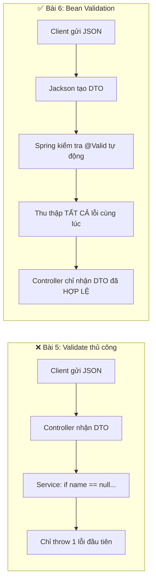
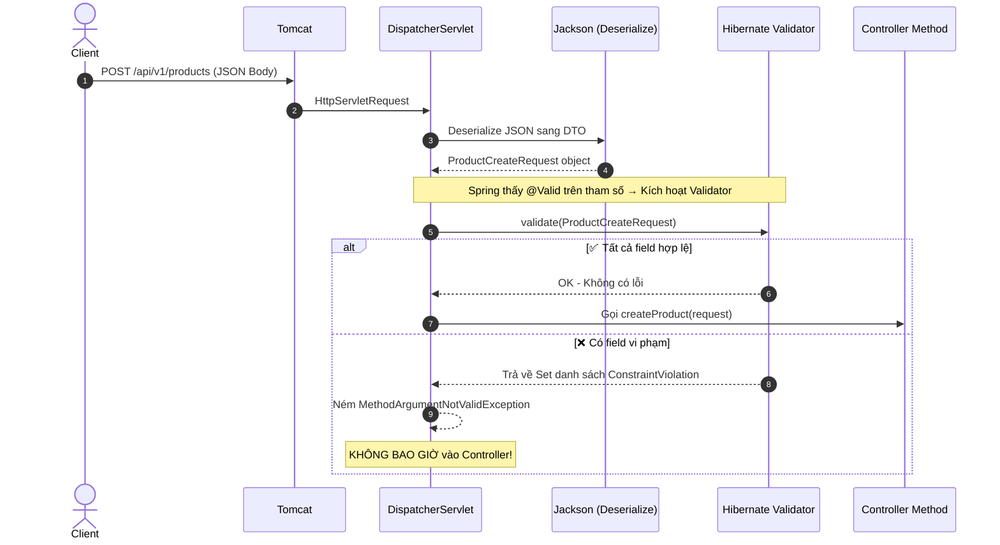

# 📘 BÀI 6: VALIDATION — KIỂM TRA DỮ LIỆU ĐẦU VÀO

> **Mục tiêu bài học:**
> 1. Hiểu tại sao cần validate dữ liệu **trước khi xử lý nghiệp vụ**, và tại sao validate thủ công bằng `if-else` trong Service là **Code Smell**.
> 2. Nắm vững kiến trúc **Jakarta Bean Validation** (`jakarta.validation`) và cơ chế kích hoạt tự động trong Spring MVC.
> 3. Sử dụng thành thạo 15+ **Validation Annotations** phổ biến (`@NotBlank`, `@Size`, `@Min`, `@Email`, `@Pattern`...).
> 4. Xử lý và format lỗi validation bằng `@RestControllerAdvice` trả về cho Client chuẩn `ApiResponse`.
> 5. Tự tạo **Custom Validator** cho nghiệp vụ riêng (vd: kiểm tra tên sản phẩm không trùng lặp).
> 6. Hiểu khái niệm **Validation Groups** để tách rule riêng cho Create/Update trên cùng 1 DTO.

---

## PHẦN 1: VẤN ĐỀ — CODE SMELL KHI VALIDATE THỦ CÔNG

### 1.1. Nhìn lại code Bài 5

Trong file [ProductService.java](file:///Users/vovantu/HTML_CSS/JAVA%20/springboot-learning/src/main/java/com/example/springbootlearning/service/ProductService.java#L262-L287) hiện tại, chúng ta đang validate thủ công bằng `if-else`:

```java
// ❌ CODE SMELL — Validate thủ công trong Service
private void validateCreateRequest(ProductCreateRequest request) {
    if (request.getName() == null || request.getName().isBlank()) {
        throw new IllegalArgumentException("Tên sản phẩm không được để trống");
    }
    if (request.getPrice() == null || request.getPrice() <= 0) {
        throw new IllegalArgumentException("Giá sản phẩm phải lớn hơn 0");
    }
    if (request.getCategory() == null || request.getCategory().isBlank()) {
        throw new IllegalArgumentException("Danh mục sản phẩm không được để trống");
    }
}
```

### 1.2. Bốn vấn đề nghiêm trọng

| # | Vấn đề | Mô tả chi tiết |
| :---: | :--- | :--- |
| ❌ 1 | **Vi phạm SRP** (Single Responsibility Principle) | Service Layer có trách nhiệm xử lý **nghiệp vụ** (business logic), nhưng lại phải gánh thêm trách nhiệm kiểm tra **định dạng dữ liệu** (format validation). |
| ❌ 2 | **Code lặp** (DRY Violation) | Hàm `validateCreateRequest()` và `validateUpdateRequest()` gần như **giống hệt nhau**. Nếu có 10 DTO thì viết 10 hàm validate? |
| ❌ 3 | **Chỉ báo 1 lỗi đầu tiên** | Nếu Client gửi lên request vừa thiếu `name` vừa thiếu `price`, hàm này chỉ throw 1 lỗi đầu tiên (`name`). Client phải sửa rồi gửi lại mới biết lỗi `price` → trải nghiệm kém. |
| ❌ 4 | **Khó đọc, khó maintain** | Khi số field tăng lên 15-20 field, hàm validate sẽ dài hàng trăm dòng `if-else`. Nhìn vào DTO class không biết field nào bắt buộc, field nào có giới hạn. |

### 1.3. Giải pháp: Jakarta Bean Validation

> **Thay vì viết logic kiểm tra trong code Java**, ta **khai báo ngay trên class DTO** những ràng buộc mà dữ liệu phải tuân thủ. Framework sẽ tự động kiểm tra trước khi request vào đến Controller.



---

## PHẦN 2: JAKARTA BEAN VALIDATION — KIẾN TRÚC TỔNG QUAN

### 2.1. Jakarta Validation là gì?

Jakarta Bean Validation (trước đây gọi là **JSR 380 / Hibernate Validator**) là một **đặc tả chuẩn (Specification)** của Java, cho phép bạn khai báo các ràng buộc dữ liệu bằng **annotation** trực tiếp trên class/field.

| Thành phần | Vai trò | Artifact |
| :--- | :--- | :--- |
| **Jakarta Validation API** | Đặc tả (Specification): Định nghĩa các annotation `@NotBlank`, `@Size`,... | `jakarta.validation:jakarta.validation-api` |
| **Hibernate Validator** | Triển khai (Implementation): Thực hiện logic kiểm tra thực tế | `org.hibernate.validator:hibernate-validator` |
| **Spring Boot Starter** | Tích hợp: Kết nối Hibernate Validator vào Spring MVC Pipeline | `spring-boot-starter-validation` |

### 2.2. Vị trí Validation trong Spring MVC Pipeline



> [!IMPORTANT]
> **Điểm then chốt:** Validation xảy ra **TRƯỚC KHI** code trong hàm Controller được thực thi. Nếu dữ liệu không hợp lệ, Spring sẽ ném exception `MethodArgumentNotValidException` mà **hàm Controller hoàn toàn không hay biết** — nó chưa kịp chạy!

---

## PHẦN 3: CÀI ĐẶT & BẢNG TRA CỨU ANNOTATION

### 3.1. Thêm dependency vào `pom.xml`

```xml
<!-- 📘 BÀI 6: Jakarta Bean Validation -->
<dependency>
    <groupId>org.springframework.boot</groupId>
    <artifactId>spring-boot-starter-validation</artifactId>
</dependency>
```

Starter này kéo theo:
- `jakarta.validation:jakarta.validation-api` (API chuẩn)
- `org.hibernate.validator:hibernate-validator` (Implementation)

### 3.2. Bảng tra cứu các Annotation Validation

| Annotation | Áp dụng cho kiểu | Mô tả | Ví dụ |
| :--- | :--- | :--- | :--- |
| `@NotNull` | Mọi kiểu đối tượng | Không được `null` (nhưng cho phép `""` rỗng) | `@NotNull Long id` |
| `@NotEmpty` | `String`, `Collection`, `Map`, `Array` | Không được `null` và **không rỗng** (cho phép `"   "` toàn khoảng trắng) | `@NotEmpty List<String> tags` |
| `@NotBlank` | **Chỉ `String`** | Không được `null`, rỗng, hoặc chỉ chứa khoảng trắng | `@NotBlank String name` |
| `@Size(min, max)` | `String`, `Collection`, `Map`, `Array` | Giới hạn kích thước (độ dài chuỗi hoặc số phần tử) | `@Size(min=2, max=100) String name` |
| `@Min(value)` | `int`, `long`, `BigDecimal`, `BigInteger` | Giá trị tối thiểu (≥) | `@Min(0) Integer stock` |
| `@Max(value)` | `int`, `long`, `BigDecimal`, `BigInteger` | Giá trị tối đa (≤) | `@Max(10000) Double price` |
| `@Positive` | Các kiểu số | Phải > 0 (nghiêm ngặt, không cho phép 0) | `@Positive Double price` |
| `@PositiveOrZero` | Các kiểu số | Phải ≥ 0 | `@PositiveOrZero Integer stock` |
| `@Negative` | Các kiểu số | Phải < 0 | `@Negative Double discount` |
| `@Email` | `String` | Phải đúng định dạng email | `@Email String email` |
| `@Pattern(regexp)` | `String` | Phải khớp biểu thức chính quy (Regex) | `@Pattern(regexp="^[A-Z].*") String name` |
| `@Past` | `LocalDate`, `LocalDateTime` | Ngày phải nằm **trong quá khứ** | `@Past LocalDate birthday` |
| `@Future` | `LocalDate`, `LocalDateTime` | Ngày phải nằm **trong tương lai** | `@Future LocalDate deadline` |
| `@Digits(integer, fraction)` | Các kiểu số | Giới hạn số chữ số phần nguyên và phần thập phân | `@Digits(integer=8, fraction=2) BigDecimal price` |
| `@DecimalMin` / `@DecimalMax` | Các kiểu số, `String` (biểu diễn số) | Giá trị tối thiểu/tối đa cho số thập phân | `@DecimalMin("0.01") Double price` |

> [!TIP]
> **Phân biệt bộ 3 hay nhầm lẫn:**
> - `@NotNull`: Chỉ check `!= null`. Chuỗi rỗng `""` vẫn pass ✅
> - `@NotEmpty`: Check `!= null` VÀ `.size() > 0` hoặc `.length() > 0`. Chuỗi `"   "` vẫn pass ✅
> - `@NotBlank`: Check `!= null` VÀ `.trim().length() > 0`. **Chỉ dành cho `String`**. Chuỗi `"   "` sẽ fail ❌

---

## PHẦN 4: TRIỂN KHAI THỰC CHIẾN

### 4.1. Gắn Annotation lên DTO Request

Trước (Bài 5): DTO trống trơn, không có bất kỳ ràng buộc nào:
```java
// ❌ Bài 5 — DTO không có validation
public class ProductCreateRequest {
    private String name;        // Có thể null, rỗng, 1000 ký tự... bất kỳ gì!
    private Double price;       // Có thể null, âm, bằng 0... 
    private String category;    // Có thể null, rỗng...
}
```

Sau (Bài 6): Mỗi field khai báo rõ ràng quy tắc ngay trên class:
```java
// ✅ Bài 6 — DTO có Validation Annotations
import jakarta.validation.constraints.*;

public class ProductCreateRequest {

    @NotBlank(message = "Tên sản phẩm không được để trống")
    @Size(min = 2, max = 200, message = "Tên sản phẩm phải từ 2 đến 200 ký tự")
    private String name;

    private String description; // Không bắt buộc → không cần annotation

    @NotNull(message = "Giá sản phẩm không được để trống")
    @Positive(message = "Giá sản phẩm phải lớn hơn 0")
    private Double price;

    @NotBlank(message = "Danh mục sản phẩm không được để trống")
    private String category;

    @PositiveOrZero(message = "Số lượng tồn kho không được âm")
    private Integer stock;
}
```

> [!NOTE]
> **Thuộc tính `message`** là câu thông báo lỗi sẽ được gửi trả về cho Client khi field vi phạm. Nếu không khai báo `message`, Hibernate Validator sẽ dùng thông báo mặc định bằng tiếng Anh.

### 4.2. Kích hoạt Validation trong Controller với `@Valid`

Chỉ cần thêm **1 từ duy nhất** `@Valid` vào trước tham số `@RequestBody`:

```java
import jakarta.validation.Valid;

@PostMapping
public ResponseEntity<ApiResponse<ProductResponse>> createProduct(
        @Valid @RequestBody ProductCreateRequest request  // ← Thêm @Valid ở đây!
) {
    // Nếu code chạy được đến đây → dữ liệu CHẮC CHẮN hợp lệ rồi
    // Không cần validateCreateRequest(request) nữa!
    ProductResponse created = productService.createProduct(request);
    URI location = URI.create("/api/v1/products/" + created.id());
    return ResponseEntity.created(location)
            .body(ApiResponse.created("Tạo sản phẩm thành công", created));
}
```

### 4.3. Điều gì xảy ra khi Client gửi dữ liệu sai?

Nếu Client gửi:
```json
{
  "name": "",
  "price": -50,
  "category": null,
  "stock": -10
}
```

Spring sẽ **tự động** ném `MethodArgumentNotValidException` chứa **TẤT CẢ** lỗi cùng lúc (không chỉ lỗi đầu tiên như validate thủ công). Tuy nhiên, nếu không xử lý exception này, Spring sẽ trả về mặc định cho Client:

```json
{
  "timestamp": "2026-09-29T21:00:00.000+00:00",
  "status": 400,
  "error": "Bad Request",
  "path": "/api/v1/products"
}
```

→ Client nhận được **400 Bad Request** nhưng **không biết field nào sai, sai như thế nào!** Rất tệ.

---

## PHẦN 5: XỬ LÝ LỖI VALIDATION — `@RestControllerAdvice`

### 5.1. Tạo `GlobalExceptionHandler`

Để bắt `MethodArgumentNotValidException` và trả về danh sách lỗi chi tiết theo chuẩn `ApiResponse`:

```java
@RestControllerAdvice
@Slf4j
public class GlobalExceptionHandler {

    /**
     * 📘 BÀI 6 — Bắt lỗi Validation (@Valid thất bại)
     *
     * Khi @Valid phát hiện field vi phạm, Spring ném MethodArgumentNotValidException.
     * Ta bắt exception này, trích xuất danh sách lỗi từng field, rồi trả về Client
     * dưới dạng Map<String, String>: { "fieldName": "error message" }
     */
    @ExceptionHandler(MethodArgumentNotValidException.class)
    public ResponseEntity<ApiResponse<Map<String, String>>> handleValidationErrors(
            MethodArgumentNotValidException ex) {

        Map<String, String> fieldErrors = new HashMap<>();
        
        // Duyệt qua từng lỗi field và gom vào Map
        ex.getBindingResult().getFieldErrors().forEach(error -> 
            fieldErrors.put(error.getField(), error.getDefaultMessage())
        );

        log.warn("⚠️ Validation failed: {}", fieldErrors);

        return ResponseEntity
                .badRequest() // HTTP 400
                .body(ApiResponse.error(400, "Dữ liệu không hợp lệ", fieldErrors));
    }
}
```

### 5.2. Cần bổ sung hàm `error()` mới trong `ApiResponse<T>`

Hiện tại hàm `error()` của chúng ta không nhận tham số `data`. Ta cần thêm 1 overload mới:

```java
// Trong ApiResponse.java — thêm hàm error() mới cho validation
public static <T> ApiResponse<T> error(int status, String message, T data) {
    return new ApiResponse<>(status, message, data);
}
```

### 5.3. Kết quả JSON trả về cho Client khi dữ liệu sai

```json
{
  "status": 400,
  "message": "Dữ liệu không hợp lệ",
  "data": {
    "name": "Tên sản phẩm không được để trống",
    "price": "Giá sản phẩm phải lớn hơn 0",
    "category": "Danh mục sản phẩm không được để trống",
    "stock": "Số lượng tồn kho không được âm"
  },
  "timestamp": "2026-09-29T21:15:00"
}
```

👉 **Bây giờ Client nhận được TẤT CẢ lỗi cùng lúc**, biết chính xác field nào sai và sai như thế nào. Frontend chỉ cần đọc key trong `data` để highlight form input tương ứng!

---

## PHẦN 6: CUSTOM VALIDATOR — TẠO ANNOTATION KIỂM TRA NGHIỆP VỤ RIÊNG

### 6.1. Khi nào cần Custom Validator?

Các annotation có sẵn chỉ kiểm tra **định dạng dữ liệu** (format validation): không rỗng, độ dài, số dương...

Nhưng có những quy tắc **nghiệp vụ riêng** mà không annotation nào đáp ứng được:
- Tên sản phẩm không được trùng với sản phẩm đã tồn tại trong Database.
- Ngày hết hạn phải sau ngày sản xuất.
- Mã giảm giá phải tồn tại và chưa hết hạn.

### 6.2. Ví dụ: Tạo `@NoDuplicateProductName`

#### Bước 1: Tạo Annotation

```java
import jakarta.validation.Constraint;
import jakarta.validation.Payload;
import java.lang.annotation.*;

@Target({ElementType.FIELD})           // Chỉ dùng trên field
@Retention(RetentionPolicy.RUNTIME)    // Tồn tại lúc Runtime (để Validator đọc được)
@Constraint(validatedBy = NoDuplicateProductNameValidator.class) // Chỉ định class kiểm tra
public @interface NoDuplicateProductName {
    String message() default "Sản phẩm đã tồn tại với tên này";
    Class<?>[] groups() default {};
    Class<? extends Payload>[] payload() default {};
}
```

#### Bước 2: Tạo Validator Class

```java
import jakarta.validation.ConstraintValidator;
import jakarta.validation.ConstraintValidatorContext;
import org.springframework.stereotype.Component;

@Component
public class NoDuplicateProductNameValidator 
        implements ConstraintValidator<NoDuplicateProductName, String> {

    private final ProductRepository productRepository;

    // Constructor Injection — Spring tự inject vào đây
    public NoDuplicateProductNameValidator(ProductRepository productRepository) {
        this.productRepository = productRepository;
    }

    @Override
    public boolean isValid(String name, ConstraintValidatorContext context) {
        // Nếu name == null thì bỏ qua (để @NotBlank xử lý)
        if (name == null || name.isBlank()) {
            return true;
        }
        // Trả về true = hợp lệ, false = vi phạm
        return !productRepository.existsByName(name);
    }
}
```

#### Bước 3: Sử dụng trên DTO

```java
public class ProductCreateRequest {
    @NotBlank(message = "Tên sản phẩm không được để trống")
    @Size(min = 2, max = 200, message = "Tên sản phẩm phải từ 2 đến 200 ký tự")
    @NoDuplicateProductName  // ← Custom Validator!
    private String name;
    // ...
}
```

> [!TIP]
> **Tại sao trong `isValid()` khi `name == null` ta return `true` (bỏ qua)?**
> Vì theo Convention của Jakarta Validation: **Mỗi annotation chỉ kiểm tra đúng 1 trách nhiệm**. Việc kiểm tra null đã có `@NotBlank` lo. Nếu Custom Validator cũng check null thì sẽ **báo lỗi trùng lặp** cho cùng 1 field.

---

## PHẦN 7: VALIDATION GROUPS — TÁCH RULE CHO CREATE vs UPDATE

### 7.1. Vấn đề

Khi cùng 1 class DTO dùng cho cả POST (Create) lẫn PUT (Update), nhưng:
- **POST:** Bắt buộc phải có `name` → `@NotBlank`.
- **PUT:** Cho phép `name` rỗng (nghĩa là "không thay đổi tên") → Không cần `@NotBlank`.

### 7.2. Giải pháp: Validation Groups

```java
// ① Định nghĩa 2 interface nhóm (chỉ là marker interface, không cần method)
public interface OnCreate {}
public interface OnUpdate {}

// ② Gắn groups vào annotation
public class ProductRequest {
    @NotBlank(message = "Tên không được trống", groups = OnCreate.class)
    // Khi update, @NotBlank KHÔNG kích hoạt vì không thuộc group OnUpdate
    private String name;
    
    @NotNull(message = "Giá không được null", groups = {OnCreate.class, OnUpdate.class})
    @Positive(message = "Giá phải > 0", groups = {OnCreate.class, OnUpdate.class})
    private Double price;
}

// ③ Trong Controller, chỉ định group tương ứng
@PostMapping
public ResponseEntity<...> create(
        @Validated(OnCreate.class) @RequestBody ProductRequest request) { ... }

@PutMapping("/{id}")
public ResponseEntity<...> update(
        @Validated(OnUpdate.class) @RequestBody ProductRequest request) { ... }
```

> [!NOTE]
> **`@Valid` vs `@Validated`:**
> - `@Valid` (Jakarta): Chạy TẤT CẢ validation annotation (không phân biệt group). Dùng cho đa số trường hợp.
> - `@Validated` (Spring): Cho phép chỉ định **group** cụ thể. Dùng khi cần tách rule Create/Update.

---

## PHẦN 8: KIẾN THỨC JAVA CORE & PATTERN BỔ SUNG

### 1. Java Annotation — Cơ chế hoạt động bên dưới gầm

Annotation trong Java thực chất là một **metadata** (dữ liệu mô tả dữ liệu) gắn trên class/method/field. Bản thân nó **không tự làm gì cả**. Cần một **Processor** đọc annotation và thực thi logic tương ứng.

Trong Jakarta Validation:
- **Annotation** (`@NotBlank`, `@Size`,...): Chỉ là "nhãn dán" khai báo quy tắc.
- **Processor**: Hibernate Validator (`ConstraintValidator<A, T>`) đọc annotation, gọi hàm `isValid()` và thu thập kết quả.
- **Trigger**: Spring MVC thấy `@Valid` trên tham số → gọi Hibernate Validator.

### 2. Bảng so sánh: Validate thủ công vs Bean Validation

| Tiêu chí | ❌ Validate thủ công (if-else) | ✅ Bean Validation (Annotation) |
| :--- | :--- | :--- |
| **Vị trí code** | Nằm rải rác trong Service | Khai báo tập trung trên DTO class |
| **Số lỗi trả về** | Chỉ 1 lỗi đầu tiên | **Tất cả lỗi cùng lúc** |
| **Khả năng tái sử dụng** | Phải copy-paste hoặc gọi chung hàm | Annotation dùng lại cho mọi class |
| **Đọc code hiểu ngay?** | Phải đọc hàm validate | Nhìn vào DTO thấy ngay ràng buộc |
| **Custom logic** | Viết if-else tùy ý | Tạo Custom Annotation + Validator |
| **Tích hợp Spring** | Tự viết | Spring tự kích hoạt qua `@Valid` |

### 3. Annotation Composition — Gom nhiều annotation lại

Nếu bạn thấy mình luôn viết lặp lại cùng bộ annotation cho mọi field tên:

```java
@NotBlank(message = "Không được để trống")
@Size(min = 2, max = 200, message = "Phải từ 2-200 ký tự")
@Pattern(regexp = "^[A-ZÀ-Ỹ].*", message = "Phải viết hoa chữ cái đầu")
private String productName;
```

Bạn có thể tạo 1 **Composed Annotation** gom tất cả lại:

```java
@NotBlank(message = "Không được để trống")
@Size(min = 2, max = 200, message = "Phải từ 2-200 ký tự")
@Pattern(regexp = "^[A-ZÀ-Ỹ].*", message = "Phải viết hoa chữ cái đầu")
@Target({ElementType.FIELD})
@Retention(RetentionPolicy.RUNTIME)
@Constraint(validatedBy = {})  // Không cần validator riêng, dùng logic của 3 annotation trên
public @interface ValidProductName {
    String message() default "Tên sản phẩm không hợp lệ";
    Class<?>[] groups() default {};
    Class<? extends Payload>[] payload() default {};
}

// Sử dụng — gọn gàng chỉ 1 annotation thay vì 3:
@ValidProductName
private String productName;
```

---

## 📚 TÓM TẮT GHI NHỚ NHANH (Takeaway)

1. **Jakarta Bean Validation** cho phép bạn khai báo ràng buộc **ngay trên DTO class** bằng annotation thay vì viết hàng tá `if-else`.
2. Thêm `@Valid` vào trước `@RequestBody` trong Controller để **kích hoạt** validation.
3. Validation xảy ra **TRƯỚC KHI** code trong Controller chạy → hàm Controller chỉ nhận data **chắc chắn hợp lệ**.
4. Khi có lỗi, Spring ném `MethodArgumentNotValidException` → Bắt bằng `@RestControllerAdvice` để trả về **tất cả lỗi cùng lúc** theo chuẩn `ApiResponse`.
5. Dùng **Custom Validator** (`@Constraint` + `ConstraintValidator<A, T>`) cho các quy tắc nghiệp vụ đặc thù không có sẵn annotation.
6. Dùng **Validation Groups** khi cần rule khác nhau cho Create vs Update trên cùng 1 DTO.
