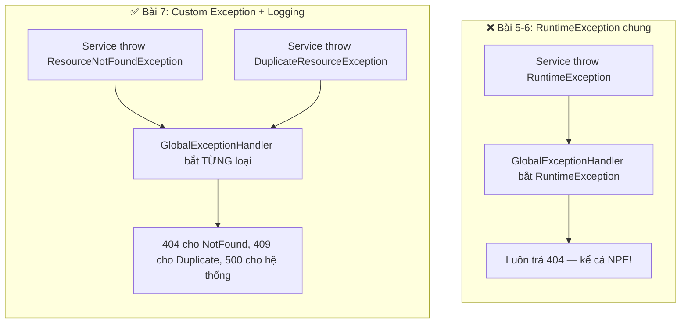
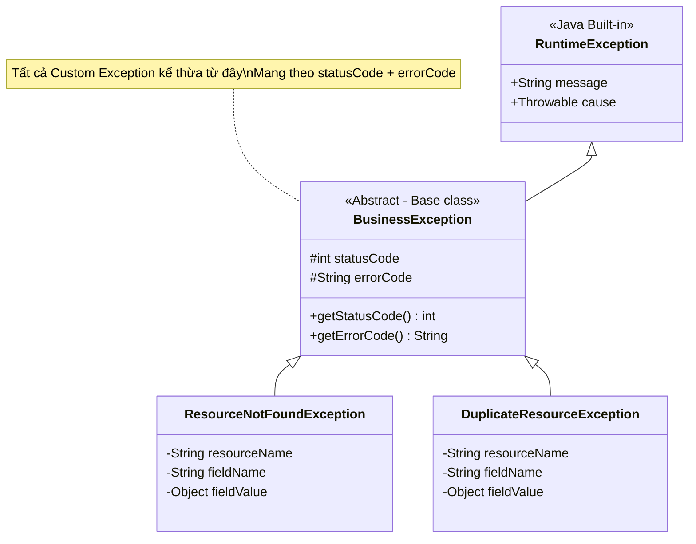
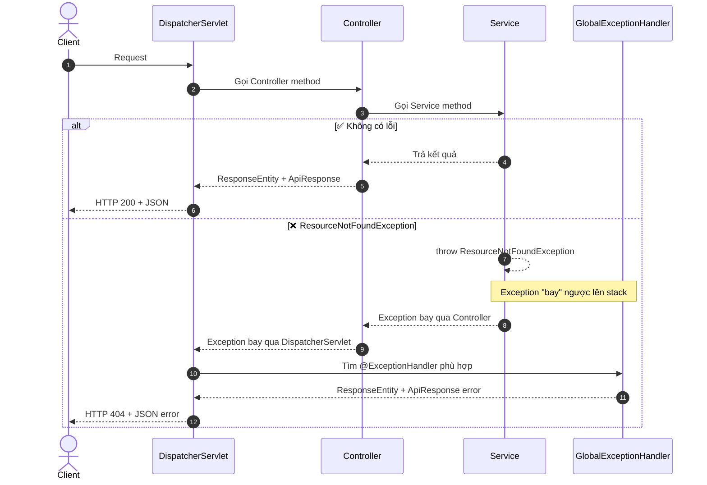
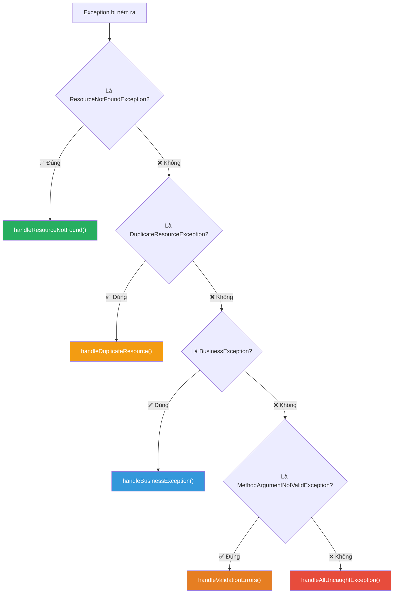
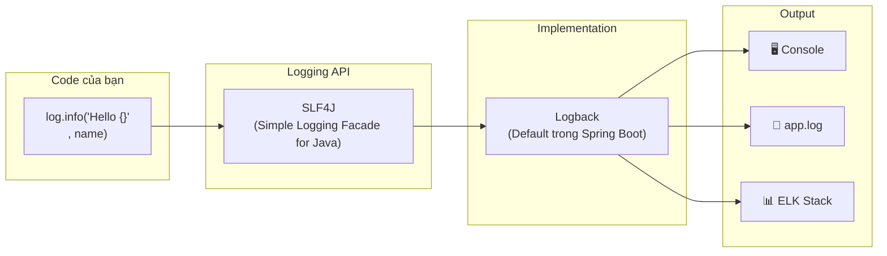
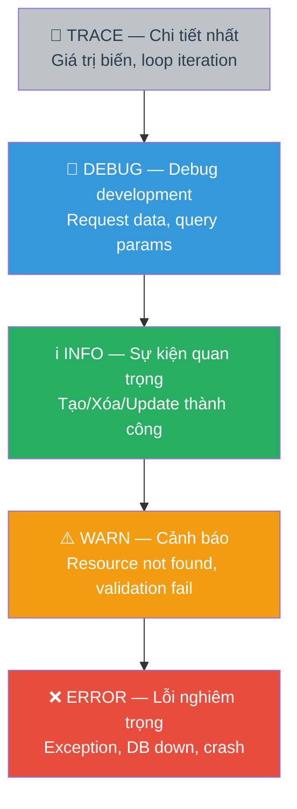
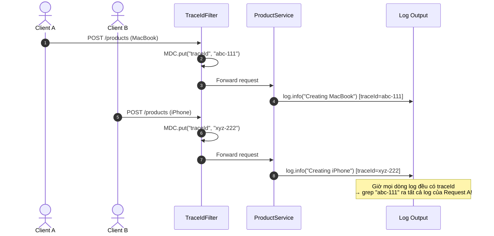
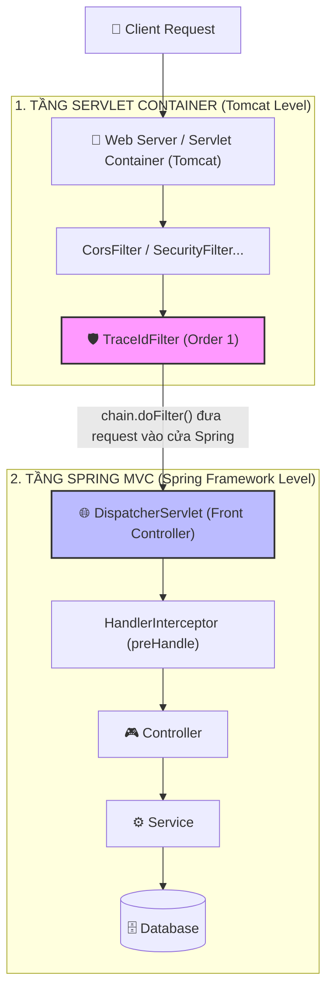
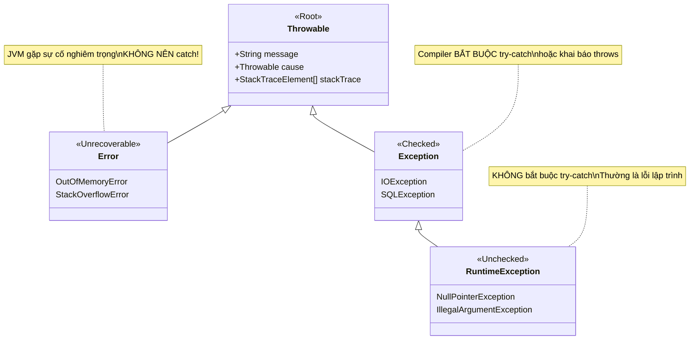
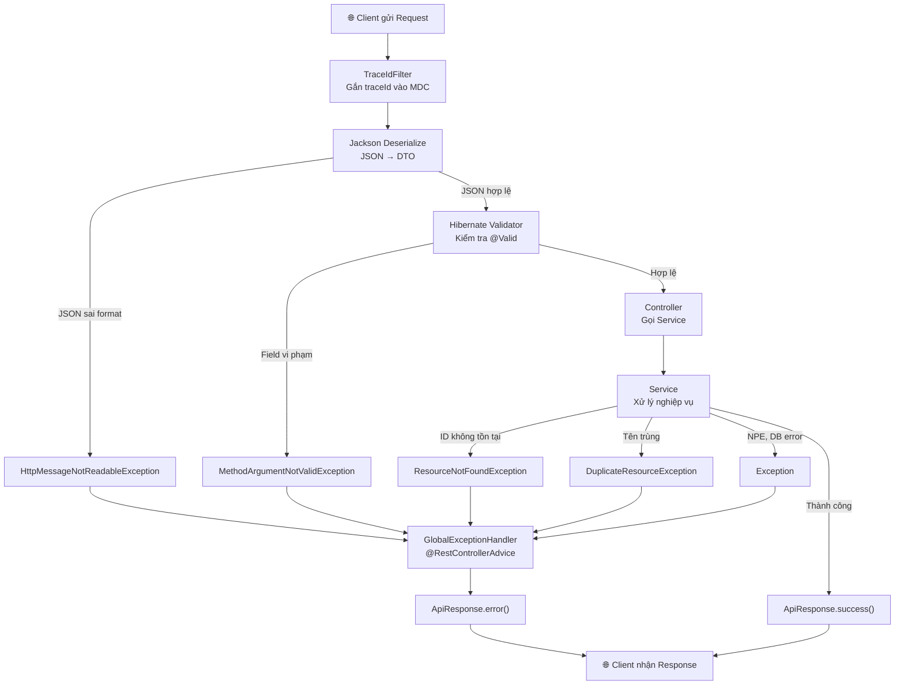

# 📘 BÀI 7: GLOBAL EXCEPTION HANDLING & LOGGING

> **Mục tiêu bài học:**
> 1. Hiểu tại sao cần hệ thống **xử lý lỗi tập trung** thay vì try-catch rải rác.
> 2. Thiết kế **Exception Hierarchy** chuẩn cho ứng dụng: Custom Exception cho từng loại lỗi nghiệp vụ.
> 3. Nắm vững `@RestControllerAdvice` + `@ExceptionHandler` — cơ chế bắt lỗi toàn cục trong Spring MVC.
> 4. Cấu hình **SLF4J + Logback** chuyên nghiệp: Log Level, Pattern, Log File, Rotation, Profile.
> 5. Áp dụng **MDC** (Mapped Diagnostic Context) gắn `TraceId` theo dõi log xuyên suốt request.
> 6. Trả về **error response chuẩn hóa** (`ApiResponse`) nhất quán cho mọi loại lỗi.

---

## 📑 MỤC LỤC

| Phần | Nội dung | Mục tiêu |
|:---:|:---|:---|
| 1 | 🔍 Vấn đề — Code Smell khi dùng RuntimeException chung | Nhận diện vấn đề |
| 2 | 🏗️ Exception Hierarchy — Custom Exception nghiệp vụ | Thiết kế đúng |
| 3 | 🛡️ `@RestControllerAdvice` — Trạm bắt lỗi toàn cục | Cơ chế hoạt động |
| 4 | ⚡ Triển khai GlobalExceptionHandler hoàn chỉnh | Code thực chiến |
| 5 | 📝 SLF4J & Logback — Hệ thống Logging chuyên nghiệp | Lý thuyết Logging |
| 6 | ⚙️ Cấu hình Logback nâng cao (logback-spring.xml) | Log File & Rotation |
| 7 | 🔗 MDC & TraceId xuyên suốt Request (Vị trí Filter vs DispatcherServlet) | Tracking request & Phân biệt tầng kiến trúc |
| 8 | 📚 Kiến thức Java Core bổ sung | Exception Hierarchy, Checked vs Unchecked |
| 9 | 🎯 Tổng kết & So sánh Before/After | Takeaway |
| 10 | 💼 Câu hỏi phỏng vấn (Interview Questions) | Chuẩn bị phỏng vấn |

---

## PHẦN 1: VẤN ĐỀ — CODE SMELL KHI DÙNG RUNTIMEEXCEPTION CHUNG

### 1.1. Nhìn lại code hiện tại (Bài 5–6)

Trong [ProductService.java](file:///Users/vovantu/HTML_CSS/JAVA%20/springboot-learning/src/main/java/com/example/springbootlearning/service/ProductService.java), chúng ta đang ném `RuntimeException` chung chung ở nhiều nơi:

```java
// ❌ CODE SMELL — Dùng RuntimeException chung cho MỌI loại lỗi
public ProductResponse getProductById(Long id) {
    return productRepository.findById(id)
            .orElseThrow(() -> new RuntimeException("Product không tồn tại với id: " + id));
            //                   ^^^^^^^^^^^^^^^ Quá chung chung!
}

public ProductResponse updateProduct(Long id, ProductUpdateRequest request) {
    productRepository.findById(id)
            .orElseThrow(() -> new RuntimeException("Product không tồn tại với id: " + id));
            //                   ^^^^^^^^^^^^^^^ Cùng kiểu lỗi, nhưng không phân biệt được!
}
```

Và trong `createProduct()`, lỗi trùng tên dùng `IllegalArgumentException`:

```java
if (productRepository.existsByName(request.getName())) {
    throw new IllegalArgumentException("Sản phẩm đã tồn tại với tên: " + request.getName());
    //         ^^^^^^^^^^^^^^^^^^^^^^^^ "Tên trùng" và "Giá âm" đều dùng cùng Exception class!
}
```

### 1.2. Năm vấn đề nghiêm trọng

| # | Vấn đề | Chi tiết |
|:---:|:---|:---|
| ❌ 1 | **Không phân biệt loại lỗi** | `RuntimeException` bị dùng cho cả "không tìm thấy" (404) lẫn "lỗi hệ thống" (500). `GlobalExceptionHandler` trong Bài 6 phải map RuntimeException → 404, nhưng nếu có NullPointerException (cũng là RuntimeException) thì sao? → **Trả 404 sai!** |
| ❌ 2 | **GlobalExceptionHandler bị "nuốt" lỗi thật** | Bắt `RuntimeException.class` quá rộng — mọi lỗi runtime (NPE, IndexOutOfBounds, ClassCast...) đều bị bắt trước khi đến catch-all `Exception.class` |
| ❌ 3 | **Không mang metadata** | `RuntimeException` chỉ có `message`. Muốn biết resource nào? ID bao nhiêu? HTTP Status nên trả? → Phải parse chuỗi message thủ công |
| ❌ 4 | **Log thiếu ngữ cảnh** | Chỉ `log.warn(ex.getMessage())` — thiếu thông tin: ai gọi API? request gì? lúc nào? trên server nào? |
| ❌ 5 | **Khó scale** | Khi có 20 loại lỗi nghiệp vụ khác nhau (hết hàng, hết hạn, quyền không đủ...), tất cả đều throw `RuntimeException` → không thể xử lý riêng từng loại |

### 1.3. Giải pháp Bài 7



---

## PHẦN 2: EXCEPTION HIERARCHY — THIẾT KẾ CUSTOM EXCEPTION

### 2.1. Nguyên tắc thiết kế

> [!IMPORTANT]
> **Mỗi loại lỗi nghiệp vụ PHẢI có 1 class Exception riêng.** Giống như trong bệnh viện, bác sĩ chẩn đoán "Viêm phổi" cụ thể chứ không chẩn đoán "Bệnh" chung chung.

### 2.2. Exception class hierarchy của dự án



### 2.3. Tại sao kế thừa `RuntimeException` mà không phải `Exception`?

| Tiêu chí | `Exception` (Checked) | `RuntimeException` (Unchecked) |
|:---|:---|:---|
| **Bắt buộc try-catch?** | ✅ Bắt buộc — Compiler yêu cầu | ❌ Không — Tùy bạn |
| **Khai báo `throws`?** | ✅ Phải khai báo trên mọi method | ❌ Không cần |
| **Phù hợp cho lỗi nghiệp vụ?** | ❌ Quá cồng kềnh — mọi method phải `throws` | ✅ Gọn gàng — để `@ExceptionHandler` bắt tập trung |
| **Ví dụ trong Java** | `IOException`, `SQLException` | `NullPointerException`, `IllegalArgumentException` |

> [!TIP]
> **Quy ước thực tế:** Trong Spring Boot, lỗi nghiệp vụ (business error) luôn dùng **Unchecked Exception** (`extends RuntimeException`). Lý do: chúng ta đã có `@RestControllerAdvice` bắt lỗi tập trung — không cần ép mỗi method phải `try-catch` thủ công.

### 2.4. Code chi tiết

#### `BusinessException` — Lớp cha trừu tượng

```java
/**
 * 📘 BÀI 7 — Base class cho TẤT CẢ lỗi nghiệp vụ trong ứng dụng.
 *
 * Mọi Custom Exception (NotFound, Duplicate, Forbidden...) đều kế thừa từ class này.
 *
 * Mang theo metadata:
 *   - statusCode: HTTP Status Code nên trả cho Client (404, 409, 403...)
 *   - errorCode:  Mã lỗi nội bộ cho Frontend mapping (RESOURCE_NOT_FOUND, DUPLICATE_RESOURCE...)
 */
public abstract class BusinessException extends RuntimeException {

    private final int statusCode;
    private final String errorCode;

    protected BusinessException(int statusCode, String errorCode, String message) {
        super(message);          // Gọi constructor cha RuntimeException(String message)
        this.statusCode = statusCode;
        this.errorCode = errorCode;
    }

    public int getStatusCode()  { return statusCode; }
    public String getErrorCode() { return errorCode; }
}
```

#### `ResourceNotFoundException` — Không tìm thấy resource (404)

```java
/**
 * Ném khi resource được yêu cầu KHÔNG TỒN TẠI trong hệ thống.
 *
 * Ví dụ: GET /api/v1/products/999 → Product id=999 không tồn tại
 *
 * message tự động: "Product không tìm thấy với id: 999"
 */
public class ResourceNotFoundException extends BusinessException {

    private final String resourceName;
    private final String fieldName;
    private final Object fieldValue;

    public ResourceNotFoundException(String resourceName, String fieldName, Object fieldValue) {
        super(404, "RESOURCE_NOT_FOUND",
              String.format("%s không tìm thấy với %s: %s", resourceName, fieldName, fieldValue));
        this.resourceName = resourceName;
        this.fieldName = fieldName;
        this.fieldValue = fieldValue;
    }

    // Getters cho GlobalExceptionHandler truy xuất nếu cần
    public String getResourceName() { return resourceName; }
    public String getFieldName()    { return fieldName; }
    public Object getFieldValue()   { return fieldValue; }
}
```

#### `DuplicateResourceException` — Tài nguyên trùng lặp (409)

```java
/**
 * Ném khi cố tạo resource mà đã tồn tại (vi phạm unique constraint).
 *
 * Ví dụ: POST tạo product với name="MacBook" nhưng tên này đã có
 *
 * HTTP 409 Conflict — Resource bị xung đột với trạng thái hiện tại.
 */
public class DuplicateResourceException extends BusinessException {

    private final String resourceName;
    private final String fieldName;
    private final Object fieldValue;

    public DuplicateResourceException(String resourceName, String fieldName, Object fieldValue) {
        super(409, "DUPLICATE_RESOURCE",
              String.format("%s đã tồn tại với %s: %s", resourceName, fieldName, fieldValue));
        this.resourceName = resourceName;
        this.fieldName = fieldName;
        this.fieldValue = fieldValue;
    }

    public String getResourceName() { return resourceName; }
    public String getFieldName()    { return fieldName; }
    public Object getFieldValue()   { return fieldValue; }
}
```

### 2.5. Sử dụng trong Service

```java
// ✅ BÀI 7 — Custom Exception rõ ràng
public ProductResponse getProductById(Long id) {
    Product product = productRepository.findById(id)
            .orElseThrow(() -> new ResourceNotFoundException("Product", "id", id));
            //                     ^^^^^^^^^^^^^^^^^^^^^^^^ Rõ ràng: 404 Not Found
    return ProductResponse.fromEntity(product);
}

public ProductResponse createProduct(ProductCreateRequest request) {
    if (productRepository.existsByName(request.getName())) {
        throw new DuplicateResourceException("Product", "name", request.getName());
        //         ^^^^^^^^^^^^^^^^^^^^^^^^^^^ Rõ ràng: 409 Conflict
    }
    // ...
}
```

---

## PHẦN 3: `@RestControllerAdvice` — TRẠM BẮT LỖI TOÀN CỤC

### 3.1. Cơ chế hoạt động



### 3.2. `@RestControllerAdvice` là gì?

```java
@RestControllerAdvice
// = @ControllerAdvice + @ResponseBody
// = "Tôi lắng nghe MỌI exception từ MỌI Controller, và trả về JSON tự động"
```

| Annotation | Mô tả |
|:---|:---|
| `@ControllerAdvice` | Đánh dấu class là "cố vấn toàn cục" — lắng nghe exception từ tất cả Controller |
| `@ResponseBody` | Return value sẽ được Jackson serialize thành JSON (không cần gọi `ObjectMapper.writeValueAsString()` thủ công) |
| `@ExceptionHandler(X.class)` | Method này xử lý khi exception thuộc class `X` bị ném ra |

### 3.3. Exception Specificity Rule — Quy tắc ưu tiên

Khi có nhiều `@ExceptionHandler`, Spring chọn handler **cụ thể nhất** (most specific):



> [!WARNING]
> **Thứ tự khai báo trong file KHÔNG quan trọng!** Spring dựa vào **class hierarchy** để chọn handler cụ thể nhất. `ResourceNotFoundException` cụ thể hơn `BusinessException`, cụ thể hơn `RuntimeException`, cụ thể hơn `Exception`. Luôn đặt catch-all `Exception.class` ở cuối cho dễ đọc.

---

## PHẦN 4: TRIỂN KHAI GLOBALEXCEPTIONHANDLER HOÀN CHỈNH

### 4.1. Refactor `GlobalExceptionHandler` — Bài 7

```java
@RestControllerAdvice
public class GlobalExceptionHandler {

    private static final Logger log = LoggerFactory.getLogger(GlobalExceptionHandler.class);

    // ── ① ResourceNotFoundException → 404 ──
    @ExceptionHandler(ResourceNotFoundException.class)
    public ResponseEntity<ApiResponse<?>> handleResourceNotFound(ResourceNotFoundException ex) {
        log.warn("⚠️ Resource not found: {}", ex.getMessage());
        return ResponseEntity
                .status(HttpStatus.NOT_FOUND)
                .body(ApiResponse.error(ex.getStatusCode(), ex.getMessage()));
    }

    // ── ② DuplicateResourceException → 409 ──
    @ExceptionHandler(DuplicateResourceException.class)
    public ResponseEntity<ApiResponse<?>> handleDuplicateResource(DuplicateResourceException ex) {
        log.warn("⚠️ Duplicate resource: {}", ex.getMessage());
        return ResponseEntity
                .status(HttpStatus.CONFLICT)
                .body(ApiResponse.error(ex.getStatusCode(), ex.getMessage()));
    }

    // ── ③ MethodArgumentNotValidException → 400 (từ Bài 6) ──
    @ExceptionHandler(MethodArgumentNotValidException.class)
    public ResponseEntity<ApiResponse<Map<String, String>>> handleValidationErrors(
            MethodArgumentNotValidException ex) {
        Map<String, String> fieldErrors = new HashMap<>();
        ex.getBindingResult().getFieldErrors().forEach(error ->
                fieldErrors.put(error.getField(), error.getDefaultMessage())
        );
        log.warn("⚠️ Validation failed: {}", fieldErrors);
        return ResponseEntity.badRequest()
                .body(ApiResponse.error(400, "Dữ liệu không hợp lệ", fieldErrors));
    }

    // ── ④ HttpMessageNotReadableException → 400 (JSON sai format) ──
    @ExceptionHandler(HttpMessageNotReadableException.class)
    public ResponseEntity<ApiResponse<?>> handleMalformedJson(HttpMessageNotReadableException ex) {
        log.warn("⚠️ Malformed JSON: {}", ex.getMessage());
        return ResponseEntity.badRequest()
                .body(ApiResponse.error(400, "Request body không đúng định dạng JSON"));
    }

    // ── ⑤ Exception — Catch-all (LUÔN ĐẶT CUỐI CÙNG!) ──
    @ExceptionHandler(Exception.class)
    public ResponseEntity<ApiResponse<?>> handleAllUncaughtException(Exception ex) {
        log.error("❌ Unexpected error: ", ex);  // Log FULL stack trace
        return ResponseEntity
                .status(HttpStatus.INTERNAL_SERVER_ERROR)
                .body(ApiResponse.error(500, "Đã có lỗi xảy ra, vui lòng thử lại sau"));
    }
}
```

### 4.2. Các loại lỗi và HTTP Status Code tương ứng

| Exception | HTTP Status | Khi nào xảy ra | Log Level |
|:---|:---:|:---|:---:|
| `ResourceNotFoundException` | **404** Not Found | Tìm product/user theo ID không tồn tại | `WARN` |
| `DuplicateResourceException` | **409** Conflict | Tạo product với tên đã tồn tại | `WARN` |
| `MethodArgumentNotValidException` | **400** Bad Request | `@Valid` phát hiện field vi phạm | `WARN` |
| `HttpMessageNotReadableException` | **400** Bad Request | Client gửi JSON sai format, body rỗng | `WARN` |
| `Exception` (catch-all) | **500** Internal Server Error | NPE, lỗi DB, lỗi không mong đợi | `ERROR` |

> [!CAUTION]
> **Lỗi 500 KHÔNG BAO GIỜ trả chi tiết cho Client!** Nếu trả `ex.getMessage()` ra ngoài, hacker có thể thấy stack trace, tên class nội bộ, tên bảng DB... Luôn trả message chung chung và log chi tiết vào server.

---

## PHẦN 5: SLF4J & LOGBACK — HỆ THỐNG LOGGING CHUYÊN NGHIỆP

### 5.1. Kiến trúc Logging trong Spring Boot



| Thành phần | Vai trò | Tương tự |
|:---|:---|:---|
| **SLF4J** | **Facade** (API interface) — Code của bạn chỉ giao tiếp với SLF4J | Giống JDBC: bạn dùng `Connection`, `PreparedStatement` — không quan tâm driver MySQL hay PostgreSQL bên dưới |
| **Logback** | **Implementation** — Thực sự ghi log ra console/file | Giống MySQL Driver hay PostgreSQL Driver |

> [!NOTE]
> **Tại sao dùng SLF4J thay vì gọi Logback trực tiếp?** Vì sau này nếu muốn đổi từ Logback sang Log4j2 (implementation khác), bạn chỉ cần đổi dependency trong `pom.xml` — **code không cần sửa một dòng nào** vì code chỉ import `org.slf4j.Logger`.

### 5.2. Năm mức Log (Log Level)



| Level | Khi nào dùng | Ví dụ | Production? |
|:---|:---|:---|:---:|
| `TRACE` | Debug cực kỳ chi tiết, từng bước nhỏ | `log.trace("Bước 3/10: Checking cache key={}", key)` | ❌ Tắt |
| `DEBUG` | Thông tin hữu ích cho developer khi debug | `log.debug("Query params: category={}, page={}", cat, page)` | ❌ Tắt |
| `INFO` | Sự kiện nghiệp vụ quan trọng, milestone | `log.info("✅ Product created: id={}, name={}", id, name)` | ✅ Bật |
| `WARN` | Đáng lưu ý nhưng app vẫn chạy được | `log.warn("⚠️ Product not found: id={}", id)` | ✅ Bật |
| `ERROR` | Lỗi nghiêm trọng, cần xử lý gấp | `log.error("❌ Database connection failed", ex)` | ✅ Bật |

> [!TIP]
> **Quy tắc ngón tay cái:** Khi set `logging.level.root=INFO`, thì chỉ log ≥ INFO mới hiện (INFO, WARN, ERROR). TRACE và DEBUG bị ẩn. Trong Production luôn đặt `INFO` hoặc `WARN`.

### 5.3. Cách dùng Logger đúng chuẩn

```java
import org.slf4j.Logger;
import org.slf4j.LoggerFactory;

@Service
public class ProductService {

    // ① Khai báo Logger — 1 logger cho mỗi class
    // Quy ước: private static final — tạo 1 lần, dùng chung cho mọi instance
    private static final Logger log = LoggerFactory.getLogger(ProductService.class);
    //                                                        ^^^^^^^^^^^^^^^^^^
    //                     Truyền class hiện tại → Log sẽ hiện tên class trong output

    public ProductResponse createProduct(ProductCreateRequest request) {
        // ② Parameterized Logging — Dùng {} placeholder
        log.info("📥 Creating product: name={}, price={}", request.getName(), request.getPrice());
        //                              ^^     ^^
        //       {} sẽ được thay bằng giá trị thực tế khi log

        try {
            Product saved = productRepository.save(product);
            log.info("✅ Product created successfully: id={}", saved.getId());
            return ProductResponse.fromEntity(saved);
        } catch (Exception ex) {
            // ③ Log exception — Truyền exception object ở CUỐI CÙNG
            log.error("❌ Failed to create product: name={}", request.getName(), ex);
            //                                                                  ^^
            //         Khi argument cuối là Throwable, SLF4J tự in full stack trace
            throw ex;
        }
    }
}
```

### 5.4. Parameterized Logging — Tại sao dùng `{}` thay vì nối chuỗi?

```java
// ❌ SAI — Nối chuỗi: Luôn tạo String MỚI dù log level có tắt
log.debug("Product: " + product.getName() + ", price: " + product.getPrice());
// Nếu log level = INFO → debug bị tắt → nhưng Java VẪN nối chuỗi trước, rồi mới bỏ đi!

// ✅ ĐÚNG — Parameterized: Chỉ nối chuỗi khi log level cho phép
log.debug("Product: {}, price: {}", product.getName(), product.getPrice());
// Nếu log level = INFO → debug bị tắt → SLF4J KHÔNG gọi getName(), getPrice() → tiết kiệm!
```

> [!WARNING]
> **Đây là lỗi performance phổ biến!** Trong vòng lặp 1 triệu lần, nối chuỗi `"ID: " + id` tạo ra 1 triệu object String thừa. Parameterized logging `"ID: {}", id` không tạo String nào nếu level bị tắt.

---

## PHẦN 6: CẤU HÌNH LOGBACK NÂNG CAO

### 6.1. Cấu hình cơ bản trong `application.properties`

```properties
# === Logging Configuration ===

# Mức log mặc định cho toàn bộ ứng dụng
logging.level.root=INFO

# Mức log chi tiết hơn cho code của mình (Development)
logging.level.com.example.springbootlearning=DEBUG

# Log ra file (ngoài console)
logging.file.name=logs/springboot-learning.log

# Giới hạn kích thước file log (mặc định: 10MB)
logging.logback.rollingpolicy.max-file-size=10MB

# Giữ lại tối đa 30 file log cũ
logging.logback.rollingpolicy.max-history=30
```

### 6.2. Cấu hình nâng cao: `logback-spring.xml`

Tạo file `src/main/resources/logback-spring.xml` để kiểm soát chi tiết hơn:

```xml
<?xml version="1.0" encoding="UTF-8"?>
<configuration>
    <!-- ① Biến dùng chung -->
    <property name="LOG_DIR" value="logs"/>
    <property name="APP_NAME" value="springboot-learning"/>

    <!-- ② Log Pattern — Định dạng mỗi dòng log -->
    <property name="LOG_PATTERN" 
              value="%d{yyyy-MM-dd HH:mm:ss.SSS} [%thread] [%X{traceId:-NO_TRACE}] %-5level %logger{36} — %msg%n"/>
    <!--          
         %d{...}         → Timestamp: 2026-09-30 10:15:30.123
         [%thread]       → Tên thread: [http-nio-8080-exec-1]
         [%X{traceId}]   → MDC TraceId: [abc-123-def] (Phần 7)
         %-5level        → Log level, padding 5 ký tự: INFO , DEBUG, ERROR
         %logger{36}     → Tên class (cắt tối đa 36 ký tự): c.e.s.service.ProductService
         %msg            → Nội dung log message
         %n              → Xuống dòng
    -->

    <!-- ③ Console Appender — Log ra Terminal -->
    <appender name="CONSOLE" class="ch.qos.logback.core.ConsoleAppender">
        <encoder>
            <pattern>${LOG_PATTERN}</pattern>
            <charset>UTF-8</charset>
        </encoder>
    </appender>

    <!-- ④ File Appender — Log ra file, tự xoay vòng (Rolling) -->
    <appender name="FILE" class="ch.qos.logback.core.rolling.RollingFileAppender">
        <file>${LOG_DIR}/${APP_NAME}.log</file>
        
        <!-- Chính sách xoay vòng: Mỗi ngày 1 file, hoặc khi file > 10MB -->
        <rollingPolicy class="ch.qos.logback.core.rolling.SizeAndTimeBasedRollingPolicy">
            <fileNamePattern>${LOG_DIR}/${APP_NAME}.%d{yyyy-MM-dd}.%i.log.gz</fileNamePattern>
            <maxFileSize>10MB</maxFileSize>    <!-- File tối đa 10MB rồi xoay -->
            <maxHistory>30</maxHistory>         <!-- Giữ tối đa 30 ngày -->
            <totalSizeCap>500MB</totalSizeCap>  <!-- Tổng dung lượng tối đa 500MB -->
        </rollingPolicy>
        
        <encoder>
            <pattern>${LOG_PATTERN}</pattern>
            <charset>UTF-8</charset>
        </encoder>
    </appender>

    <!-- ⑤ Profile-based config — Khác nhau giữa dev và prod -->
    <springProfile name="dev">
        <logger name="com.example.springbootlearning" level="DEBUG"/>
    </springProfile>

    <springProfile name="prod">
        <logger name="com.example.springbootlearning" level="INFO"/>
    </springProfile>

    <!-- ⑥ Root logger — Áp dụng cho toàn bộ ứng dụng -->
    <root level="INFO">
        <appender-ref ref="CONSOLE"/>
        <appender-ref ref="FILE"/>
    </root>
</configuration>
```

### 6.3. Giải thích Log Pattern

Một dòng log sẽ hiện ra như sau:

```
2026-09-30 10:15:30.123 [http-nio-8080-exec-1] [f47ac10b-58cc] INFO  c.e.s.service.ProductService — ✅ Product created: id=42, name=MacBook
└─── Timestamp ────────┘ └──── Thread ────────┘ └─ TraceId ──┘ └Lvl┘ └────── Class ────────────┘   └──────── Message ────────────────────┘
```

| Phần | Ý nghĩa | Tại sao cần? |
|:---|:---|:---|
| **Timestamp** | Thời điểm chính xác | Biết log xảy ra lúc nào, so sánh timeline |
| **Thread** | Thread nào xử lý | Phân biệt request đồng thời |
| **TraceId** | ID duy nhất theo request | Nhóm tất cả log của 1 request lại |
| **Level** | Mức độ nghiêm trọng | Lọc log nhanh (chỉ xem ERROR) |
| **Class** | Class nào phát ra log | Biết lỗi ở đâu |
| **Message** | Nội dung | Thông tin chi tiết |

---

## PHẦN 7: MDC — TRACEID XUYÊN SUỐT REQUEST

### 7.1. Vấn đề: Log lẫn lộn khi nhiều request đồng thời

Khi 100 người dùng gọi API cùng lúc, log của họ sẽ **xen kẽ nhau**:

```
10:15:30.001 INFO  ProductService — 📥 Creating product: name=MacBook    ← Request A
10:15:30.002 INFO  ProductService — 📥 Creating product: name=iPhone     ← Request B
10:15:30.003 INFO  ProductRepository — Saved product id=42               ← Thuộc A hay B???
10:15:30.004 ERROR GlobalExceptionHandler — ❌ Duplicate name!           ← Thuộc A hay B???
```

→ Không biết dòng log nào thuộc request nào!

### 7.2. Giải pháp: MDC (Mapped Diagnostic Context)

MDC là **bản đồ key-value gắn theo từng Thread**. Mỗi request trong Spring MVC được xử lý bởi 1 thread riêng → MDC giúp gắn `traceId` duy nhất cho từng request.



### 7.3. Triển khai: `TraceIdFilter`

```java
import jakarta.servlet.*;
import jakarta.servlet.http.HttpServletRequest;
import org.slf4j.Logger;
import org.slf4j.LoggerFactory;
import org.slf4j.MDC;
import org.springframework.core.annotation.Order;
import org.springframework.stereotype.Component;

import java.io.IOException;
import java.util.UUID;

/**
 * 📘 BÀI 7 — Servlet Filter gắn TraceId cho mỗi HTTP request.
 *
 * Luồng: Mọi request → TraceIdFilter (gắn traceId vào MDC) → Controller → Service → ...
 *        Khi request kết thúc → Xóa traceId khỏi MDC (tránh rò rỉ sang request khác)
 *
 * @Order(1) → Chạy đầu tiên trong chuỗi filter, trước mọi filter khác
 */
@Component
@Order(1)
public class TraceIdFilter implements Filter {

    private static final Logger log = LoggerFactory.getLogger(TraceIdFilter.class);
    private static final String TRACE_ID_KEY = "traceId";

    @Override
    public void doFilter(ServletRequest request, ServletResponse response, FilterChain chain)
            throws IOException, ServletException {
        try {
            // ① Tạo traceId duy nhất (lấy 8 ký tự đầu của UUID cho ngắn gọn)
            String traceId = UUID.randomUUID().toString().substring(0, 8);

            // ② Gắn vào MDC — từ giờ mọi log.xxx() trong thread này đều có traceId
            MDC.put(TRACE_ID_KEY, traceId);

            HttpServletRequest httpRequest = (HttpServletRequest) request;
            log.info("📥 {} {} [traceId={}]",
                    httpRequest.getMethod(), httpRequest.getRequestURI(), traceId);

            // ③ Chuyển tiếp request cho filter/controller tiếp theo
            chain.doFilter(request, response);

        } finally {
            // ④ QUAN TRỌNG: Xóa MDC sau khi request xong!
            // Thread có thể được tái sử dụng (Thread Pool) → nếu không xóa,
            // request sau sẽ "thừa kế" traceId của request trước → log bị sai!
            MDC.remove(TRACE_ID_KEY);
        }
    }
}
```

### 7.4. Kết quả log sau khi có TraceId

```
2026-09-30 10:15:30.001 [exec-1] [abc-111] INFO  TraceIdFilter — 📥 POST /api/v1/products [traceId=abc-111]
2026-09-30 10:15:30.002 [exec-2] [xyz-222] INFO  TraceIdFilter — 📥 POST /api/v1/products [traceId=xyz-222]
2026-09-30 10:15:30.010 [exec-1] [abc-111] INFO  ProductService — ✅ Product created: id=42
2026-09-30 10:15:30.011 [exec-2] [xyz-222] WARN  GlobalExceptionHandler — ⚠️ Duplicate resource: ...
```

Bây giờ để tìm tất cả log của 1 request cụ thể:

```bash
grep "abc-111" logs/springboot-learning.log
```

→ Trả về **mọi dòng log** liên quan đến request A, từ Filter đến Controller → Service → Exception Handler!

> [!CAUTION]
> **`MDC.remove()` trong `finally` block là BẮT BUỘC!** Tomcat dùng Thread Pool — thread xử lý xong request A có thể được tái sử dụng cho request B. Nếu không xóa, request B sẽ mang traceId của A → log bị sai, debug cực kỳ khó.

### 7.5. Bản đồ Kiến trúc: Filter chạy TRƯỚC DispatcherServlet (Đừng nhầm lẫn!)

> [!WARNING]
> **Nhầm lẫn kinh điển:** Nhiều lập trình viên lầm tưởng Request đi qua `DispatcherServlet` rồi mới đến `Filter` để gắn `traceId`. **Thực tế hoàn toàn ngược lại: Filter chạy TRƯỚC `DispatcherServlet`!**

#### 🗺️ Sơ đồ phân chia ranh giới Servlet Container (Tomcat) & Spring MVC:



#### 🔍 Tại sao Filter lại chạy trước DispatcherServlet?
1. **Filter thuộc về Java Servlet API (Jakarta EE):** Nó được quản lý trực tiếp bởi **Web Server (Tomcat)**, nằm ngoài ranh giới của Spring Framework.
2. **`DispatcherServlet` thực chất chỉ là một Servlet:** Tomcat tiếp nhận mọi HTTP Request, chạy qua chuỗi `FilterChain` trước, sau đó mới chuyển gói tin vào `DispatcherServlet` (Servlet đóng vai trò Front Controller của Spring MVC).
3. **Lệnh `chain.doFilter(request, response)`:** Khi [TraceIdFilter](file:///Users/vovantu/HTML_CSS/JAVA%20/springboot-learning/src/main/java/com/example/springbootlearning/filter/TraceIdFilter.java) gọi `chain.doFilter()`, request mới tiếp tục hành trình đi vào `DispatcherServlet` ➔ `HandlerInterceptor` ➔ [ProductController](file:///Users/vovantu/HTML_CSS/JAVA%20/springboot-learning/src/main/java/com/example/springbootlearning/controller/ProductController.java).

#### 🏰 Ẩn dụ trực quan: Cổng bảo vệ & Sảnh Lễ tân
- **TraceIdFilter (Bác bảo vệ gác cổng ngoài tòa nhà):** Vừa bước chân vào cổng (Tomcat), bác bảo vệ chặn lại dán ngay chiếc thẻ khách có mã số duy nhất `#a1b2c3d4` vào áo bạn (`MDC.put("traceId", traceId)`), rồi mới mở barrier cho bạn vào (`chain.doFilter`).
- **DispatcherServlet (Quầy Lễ tân điều phối trung tâm):** Khi bạn vào sảnh lớn gặp Lễ tân, trên áo bạn **đã có sẵn chiếc thẻ** rồi! Lễ tân chỉ việc hướng dẫn bạn lên đúng phòng làm việc ([ProductController](file:///Users/vovantu/HTML_CSS/JAVA%20/springboot-learning/src/main/java/com/example/springbootlearning/controller/ProductController.java)).
- **Khối `finally` (Cửa ra về):** Khi công việc xong xuôi và bạn bước ra khỏi cổng, bác bảo vệ thu hồi thẻ và hủy bỏ (`MDC.remove("traceId")`) để tránh người khách tiếp theo mượn lại chiếc xe/thẻ đó bị trùng mã!

#### 🎯 So sánh vị trí gắn `traceId`: Tại sao chọn Filter?

| Vị trí đặt code | Đánh giá | Hệ quả |
| :--- | :---: | :--- |
| **Controller** | ❌ Quá muộn | Controller là tầng cuối cùng của Web Layer. Toàn bộ log của Security, Filter, Interceptor đều bị mất dấu `traceId`. |
| **HandlerInterceptor** | ⚠️ Chưa trọn vẹn | Chỉ theo dõi được log từ lúc bắt đầu vào Spring MVC. Nếu các Filter phía trước (Security, Cors) bị chặn hoặc ném lỗi thì không trace được. |
| **Servlet Filter (`@Order(1)`)** | ✅ Hoàn hảo 100% | Bao trọn toàn bộ vòng đời Request từ khi mới chạm vào server cho đến lúc phản hồi ra về. Mọi log ở mọi tầng đều có `traceId`. |

---

## PHẦN 8: KIẾN THỨC JAVA CORE BỔ SUNG

### 1. Java Exception Class Hierarchy



### 2. Checked vs Unchecked Exception — Bảng so sánh

| Tiêu chí | Checked Exception | Unchecked Exception |
|:---|:---|:---|
| **Kế thừa từ** | `Exception` (trực tiếp) | `RuntimeException` |
| **Compiler kiểm tra?** | ✅ Bắt buộc `try-catch` hoặc `throws` | ❌ Không bắt buộc |
| **Khi nào dùng?** | Lỗi **dự đoán được** và **khôi phục được** (file không tồn tại, mạng đứt) | Lỗi **logic lập trình** hoặc **nghiệp vụ** (null reference, index out of bounds, product not found) |
| **Ví dụ trong Java** | `IOException`, `SQLException`, `FileNotFoundException` | `NullPointerException`, `ArrayIndexOutOfBoundsException` |
| **Trong Spring Boot** | Hiếm khi dùng | ✅ **Luôn dùng** cho business exception |

### 3. Try-with-Resources (Java 7+)

```java
// ❌ Trước Java 7: Phải close thủ công trong finally
BufferedReader reader = null;
try {
    reader = new BufferedReader(new FileReader("data.txt"));
    String line = reader.readLine();
} finally {
    if (reader != null) reader.close();  // Phiền phức!
}

// ✅ Từ Java 7: try-with-resources tự close khi ra khỏi block
try (BufferedReader reader = new BufferedReader(new FileReader("data.txt"))) {
    String line = reader.readLine();
}
// reader.close() được gọi TỰ ĐỘNG, kể cả khi có exception!
```

> [!NOTE]
> `MDC.remove()` trong `TraceIdFilter` cũng theo nguyên tắc tương tự: **dọn dẹp resource** (MDC context) khi không còn cần, đặt trong `finally` block để đảm bảo luôn được gọi dù có exception hay không.

### 4. SLF4J Logger — Tại sao `private static final`?

```java
private static final Logger log = LoggerFactory.getLogger(ProductService.class);
//  │       │      │
//  │       │      └── final: Gán 1 lần, không đổi
//  │       └── static: Chung cho mọi instance — vì Logger KHÔNG chứa trạng thái riêng
//  └── private: Không cho class khác truy cập — mỗi class tự có Logger riêng
```

---

## PHẦN 9: TÓM TẮT & SO SÁNH BEFORE/AFTER

### Bảng so sánh tổng thể

| Tiêu chí | ❌ Trước Bài 7 | ✅ Sau Bài 7 |
|:---|:---|:---|
| **Exception** | `RuntimeException`, `IllegalArgumentException` — chung chung | `ResourceNotFoundException`, `DuplicateResourceException` — cụ thể |
| **HTTP Status** | RuntimeException → luôn 404 (kể cả NPE!) | NotFound → 404, Duplicate → 409, Unknown → 500 |
| **Error Response** | Message chung, không nhất quán | `ApiResponse` chuẩn hóa mọi lỗi |
| **Log** | `System.out.println` hoặc log cơ bản | SLF4J + Logback, log file, rotation, pattern |
| **Truy vết** | Không biết log nào thuộc request nào | MDC TraceId nhóm log theo request |
| **Log lỗi 500** | Chỉ message, mất stack trace | `log.error("...", ex)` — full stack trace |

### Luồng xử lý hoàn chỉnh



---

## PHẦN 10: 💼 CÂU HỎI PHỎNG VẤN (INTERVIEW QUESTIONS)

### Câu 1: `@ControllerAdvice` vs `@RestControllerAdvice` khác nhau thế nào?

> **Gợi ý trả lời:**
> - `@RestControllerAdvice` = `@ControllerAdvice` + `@ResponseBody`.
> - `@ControllerAdvice`: Return value là View (cho MVC truyền thống, render HTML).
> - `@RestControllerAdvice`: Return value tự động được Jackson serialize thành JSON (cho REST API).
> - Trong Spring Boot REST API hiện đại, **luôn dùng** `@RestControllerAdvice`.

### Câu 2: Nếu có 2 class cùng đánh `@RestControllerAdvice`, Spring chọn cái nào?

> **Gợi ý trả lời:**
> - Spring sẽ quét **tất cả** `@RestControllerAdvice` class và đăng ký handlers từ tất cả.
> - Nếu 2 class cùng xử lý **cùng 1 exception**, Spring chọn dựa trên: (1) `@Order` annotation, (2) `Ordered` interface, (3) thứ tự scan.
> - **Best practice:** Chỉ nên có **1** `GlobalExceptionHandler` trong ứng dụng. Nếu cần chia nhỏ, dùng `@Order` để xác định ưu tiên.

### Câu 3: Checked Exception vs Unchecked Exception — Khi nào dùng cái nào?

> **Gợi ý trả lời:**
> - **Checked** (`extends Exception`): Lỗi **dự đoán được** và **caller có thể recovery** — ví dụ: file không tồn tại → thử đường dẫn khác. Compiler bắt buộc xử lý.
> - **Unchecked** (`extends RuntimeException`): Lỗi **logic lập trình** (NPE, ClassCast) hoặc **lỗi nghiệp vụ** mà caller không thể recovery (product not found → không có gì để "thử lại").
> - Trong Spring Boot: **Luôn dùng Unchecked** cho business exception vì có `@ExceptionHandler` bắt tập trung.

### Câu 4: Tại sao cần Custom Exception thay vì dùng `RuntimeException` trực tiếp?

> **Gợi ý trả lời:**
> - **Phân biệt loại lỗi**: Mỗi exception class ánh xạ sang 1 HTTP Status Code riêng (404, 409, 403...).
> - **Mang metadata**: Custom Exception có thể chứa thêm field (resourceName, fieldName, errorCode) — RuntimeException chỉ có message.
> - **Type-safe catching**: `@ExceptionHandler(ResourceNotFoundException.class)` chỉ bắt đúng lỗi "không tìm thấy" — không bắt nhầm NPE hay lỗi khác.
> - **Self-documenting**: Nhìn vào code `throw new ResourceNotFoundException(...)` biết ngay ý nghĩa, thay vì `throw new RuntimeException("not found")`.

### Câu 5: `log.error("Error: " + ex.getMessage())` có vấn đề gì?

> **Gợi ý trả lời:**
> - **Mất stack trace!** `ex.getMessage()` chỉ trả message text, không có dòng code nào gây lỗi.
> - **Nối chuỗi thừa:** Tạo String mới ngay cả khi log level bị tắt.
> - **Đúng:** `log.error("Error: {}", ex.getMessage(), ex)` — argument cuối cùng là `Throwable`, SLF4J tự in full stack trace.

### Câu 6: MDC là gì? Tại sao cần?

> **Gợi ý trả lời:**
> - MDC (Mapped Diagnostic Context) là **bản đồ thread-local** (`Map<String, String>`) gắn vào từng thread.
> - Khi nhiều request đồng thời, log xen kẽ nhau → không biết dòng log nào thuộc request nào.
> - MDC giải quyết bằng cách gắn `traceId` duy nhất cho mỗi request → `grep traceId` ra tất cả log liên quan.
> - **PHẢI `MDC.remove()` trong `finally`** vì Tomcat tái sử dụng thread (Thread Pool).

### Câu 7: `@ExceptionHandler` hoạt động thế nào khi exception có kế thừa?

> **Gợi ý trả lời:**
> - Spring áp dụng **Exception Specificity Rule**: chọn handler cho class exception **cụ thể nhất** (gần nhất trong cây kế thừa).
> - Ví dụ: `ResourceNotFoundException extends BusinessException extends RuntimeException`.
>   - Nếu có handler cho `ResourceNotFoundException` → chọn nó.
>   - Nếu không → tìm `BusinessException`.
>   - Nếu không → tìm `RuntimeException`.
>   - Nếu không → tìm `Exception` (catch-all).

### Câu 8: `SLF4J` là gì? Tại sao không dùng `Logback` trực tiếp?

> **Gợi ý trả lời:**
> - SLF4J là **Facade Pattern** (mặt nạ/giao diện) cho logging — code chỉ import `org.slf4j.Logger`, không import class cụ thể của Logback hay Log4j2.
> - Lợi ích: Nếu sau này muốn đổi từ Logback sang Log4j2 → chỉ đổi dependency trong `pom.xml`, **code không sửa gì**.
> - Tương tự JDBC: code dùng `java.sql.Connection` — không import MySQL driver hay PostgreSQL driver trực tiếp.

### Câu 9: Trong production, nên set log level gì? Tại sao?

> **Gợi ý trả lời:**
> - **Root level: `WARN`** hoặc **`INFO`** — chỉ ghi sự kiện quan trọng, cảnh báo, và lỗi.
> - **Tại sao không `DEBUG`?** Vì lượng log quá lớn → đầy ổ cứng, giảm performance I/O, khó tìm log quan trọng.
> - **Khi cần debug production:** Tạm thời đổi level của 1 package cụ thể (Spring Boot Actuator cho phép đổi log level runtime mà không restart).

### Câu 10: Trả HTTP 500 cho client nên kèm `ex.getMessage()` hay message chung?

> **Gợi ý trả lời:**
> - **LUÔN trả message chung** ("Đã có lỗi xảy ra, vui lòng thử lại sau").
> - **KHÔNG BAO GIỜ** trả `ex.getMessage()` hay stack trace cho client vì:
>   - Có thể lộ tên class, tên bảng DB, SQL query, đường dẫn file server.
>   - Hacker dùng thông tin này để khai thác lỗ hổng.
> - Chi tiết lỗi phải `log.error("...", ex)` ghi vào **server log** để developer debug.

### Câu 11: Log Rotation là gì? Cấu hình thế nào trong Logback?

> **Gợi ý trả lời:**
> - Log Rotation = tự động **xoay vòng file log** khi đạt giới hạn kích thước hoặc thời gian.
> - Cấu hình trong Logback: `SizeAndTimeBasedRollingPolicy`.
>   - `maxFileSize=10MB`: Khi file > 10MB → tạo file mới.
>   - `maxHistory=30`: Giữ tối đa 30 file cũ.
>   - `totalSizeCap=500MB`: Tổng dung lượng tất cả file log ≤ 500MB.
> - **Tại sao cần?** Nếu không rotation, file log sẽ phình to vô hạn → đầy ổ cứng → server crash.

### Câu 12: Giải thích cơ chế Thread Pool trong Tomcat và tại sao MDC cần `remove()`?

> **Gợi ý trả lời:**
> - Tomcat tạo sẵn một "Thread Pool" (mặc định ~200 threads).
> - Khi request đến, Tomcat **mượn** 1 thread từ pool để xử lý, xong rồi **trả lại** pool (không hủy thread).
> - MDC gắn data theo **Thread** (ThreadLocal). Nếu request A gắn `traceId=abc` vào thread-1, xong request A nhưng không `remove()`:
>   - Request B được gán thread-1 → tự động "thừa kế" `traceId=abc` → log request B bị gắn sai traceId!
> - **`MDC.remove()` trong `finally`** đảm bảo dọn sạch context trước khi trả thread lại pool.
