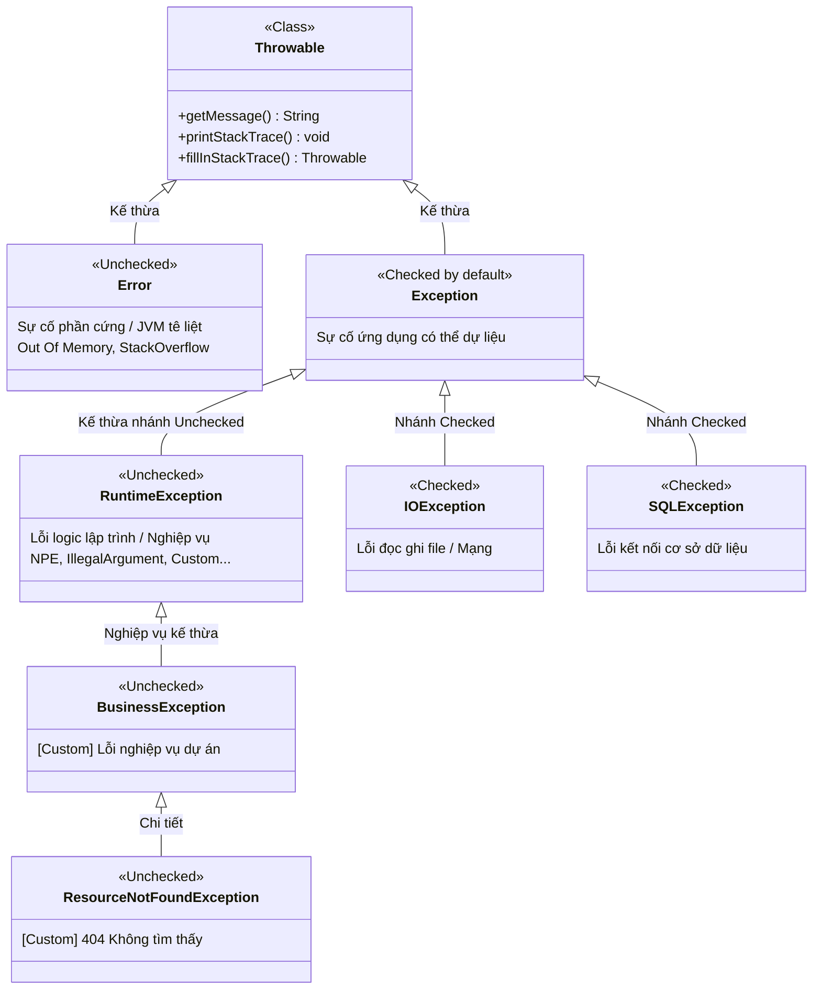
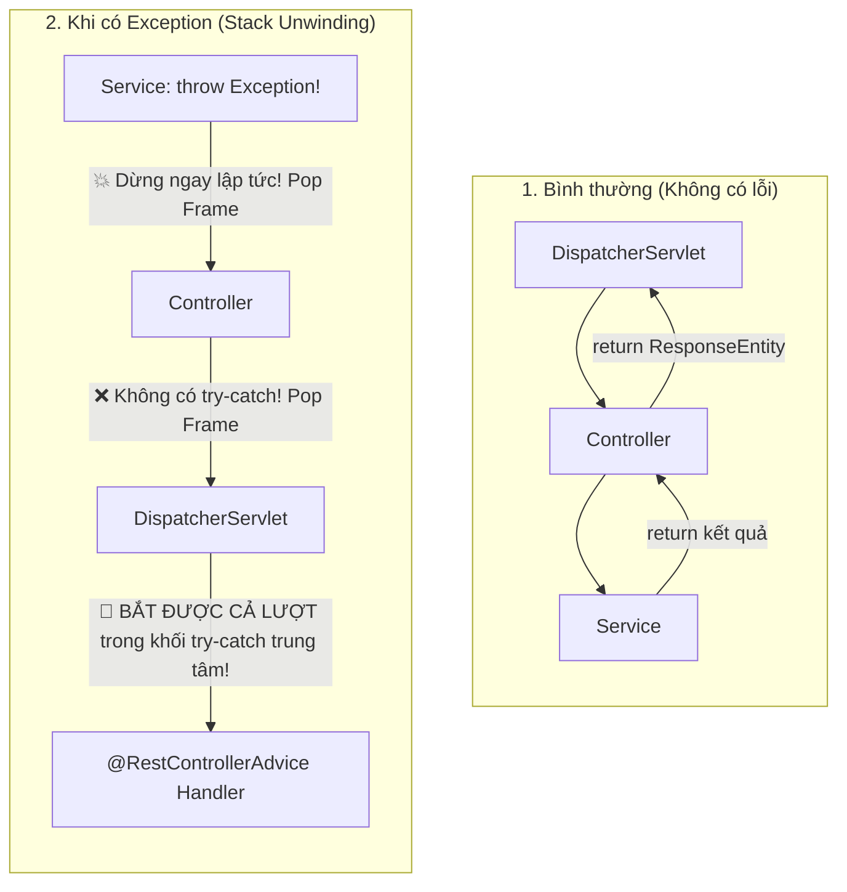
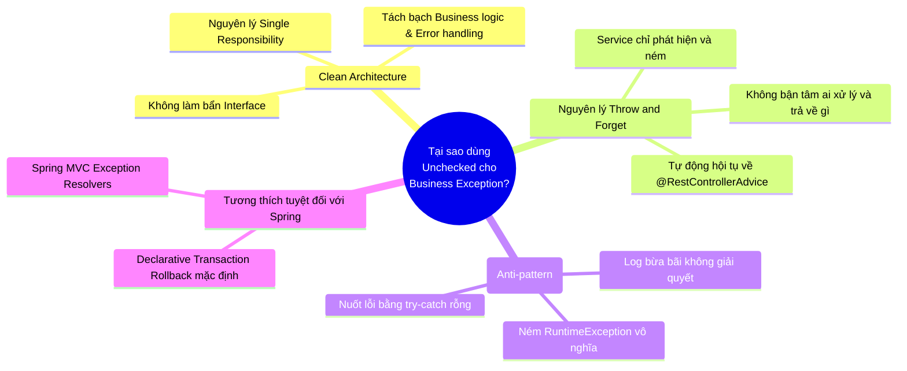
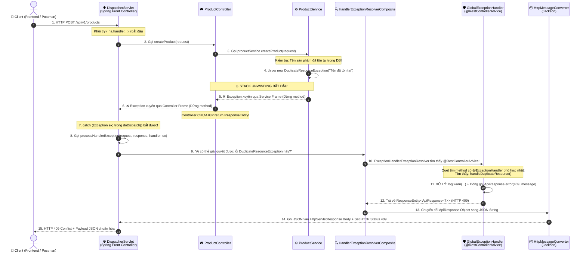
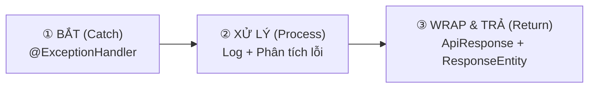
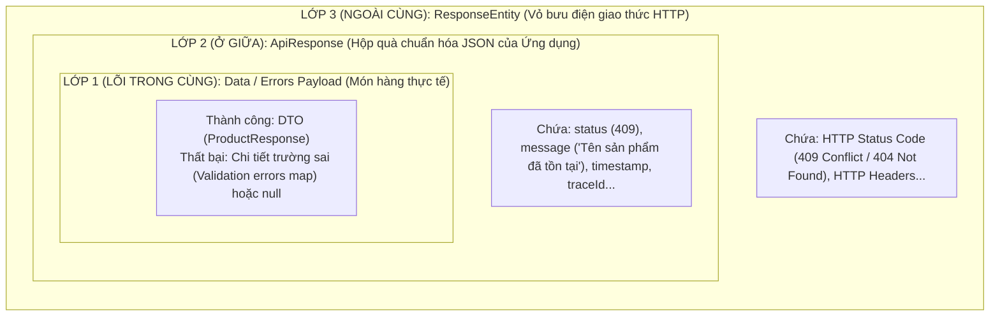

# 🌋 CHUYÊN ĐỀ CHUYÊN SÂU: BẢN CHẤT EXCEPTION & TOÀN CẢNH LUỒNG XỬ LÝ LỖI TRONG SPRING BOOT

> **Tài liệu tham khảo chuyên sâu & mở rộng cho [Bài 7: Global Exception Handling & Logging](file:///Users/vovantu/HTML_CSS/JAVA%20/Note/Lesson07/bai-7-global-exception-handling-logging.md)**  
> *Dành cho kỹ sư phần mềm muốn nắm vững tận gốc cơ chế JVM, luồng đi thực sự của Exception qua DispatcherServlet và tư duy kiến trúc xử lý lỗi hiện đại.*

---

## 📑 MỤC LỤC TỔNG QUAN

1. [Tổng quan & Cây gia phả Exception trong Java (JVM Anatomy)](#1-tổng-quan--cây-gia-phả-exception-trong-java-jvm-anatomy)
2. [Ẩn dụ Trực quan: Phân biệt Checked vs Unchecked Exception](#2-ẩn-dụ-trực-quan-phân-biệt-checked-vs-unchecked-exception)
3. [So sánh Đối chiếu Kỹ thuật: Checked vs Unchecked](#3-so-sánh-đối-chiếu-kỹ-thuật-checked-vs-unchecked)
4. [Cơ chế Call Stack & Hiện tượng Stack Unwinding trong JVM](#4-cơ-chế-call-stack--hiện-tượng-stack-unwinding-trong-jvm)
5. [Tại sao Lỗi Nghiệp Vụ (Business Exception) Luôn Phải là Unchecked?](#5-tại-sao-lỗi-nghiệp-vụ-business-exception-luôn-phải-là-unchecked)
6. [Giải phẫu Luồng Đi Thực Sự của Exception trong Spring Boot MVC](#6-giải-phẫu-luồng-đi-thực-sự-của-exception-trong-spring-boot-mvc)
7. [Ẩn dụ Kiến trúc: Bệnh viện Đa khoa & Tổng đài Cấp cứu DispatcherServlet](#7-ẩn-dụ-kiến-trúc-bệnh-viện-đa-khoa--tổng-đài-cấp-cứu-dispatcherservlet)
8. [Quy trình 3 Bước Chuẩn mực trong `@RestControllerAdvice`](#8-quy-trình-3-bước-chuẩn-mực-trong-restcontrolleradvice)
9. [Mô hình Đóng gói Dữ liệu "Búp bê Nga" (3-Layer Envelope Pattern)](#9-mô-hình-đóng-gói-dữ-liệu-búp-bê-nga-3-layer-envelope-pattern)
10. [Góc nhìn Kiến trúc sư: Tại sao Checked Exception Bị Coi là Thất bại?](#10-góc-nhìn-kiến-trúc-sư-tại-sao-checked-exception-bị-coi-là-thất-bại)
11. [Bộ câu hỏi Phỏng vấn Đỉnh cao (Senior Interview Q&A)](#11-bộ-câu-hỏi-phỏng-vấn-đỉnh-cao-senior-interview-qa)

---

## 1. 🧬 TỔNG QUAN & CÂY GIA PHẢ EXCEPTION TRONG JAVA (JVM ANATOMY)

Mọi sự cố bất thường xảy ra trong môi trường JVM đều được biểu diễn dưới dạng các đối tượng (Objects) kế thừa từ gốc rễ tối cao: `java.lang.Throwable`.



### Chi tiết 3 nhánh chính trong JVM:

1. **`java.lang.Error` (Unchecked - Tuyệt đối không can thiệp):**
   - Đại diện cho những tai ương thảm khốc của hạ tầng hoặc máy ảo JVM: `OutOfMemoryError`, `StackOverflowError`, `VirtualMachineError`.
   - **Đặc điểm:** Ứng dụng hầu như không thể làm gì để tự cứu vãn. Thread hoặc toàn bộ JVM sắp sụp đổ. Không bao giờ viết code `try-catch (Error e)`.
2. **`java.lang.Exception` (Nhánh Checked - Ngoại trừ `RuntimeException`):**
   - Các lỗi xảy ra do môi trường bên ngoài nằm ngoài tầm kiểm soát trực tiếp của code: Mất mạng (`SocketException`), file bị xóa mất (`FileNotFoundException`), SQL database ngắt kết nối (`SQLException`).
   - **Đặc điểm:** Trình biên dịch (Java Compiler - `javac`) ép buộc lập trình viên **phải** tường minh xử lý: hoặc bọc trong `try-catch`, hoặc khai báo `throws` ở chữ ký hàm.
3. **`java.lang.RuntimeException` (Nhánh Unchecked - Tâm điểm của Spring Boot):**
   - Đại diện cho các lỗi logic lập trình (bug) hoặc các vi phạm quy tắc nghiệp vụ: `NullPointerException`, `IllegalArgumentException`, `IndexOutOfBoundsException`, và toàn bộ **Custom Business Exceptions**.
   - **Đặc điểm:** Compiler hoàn toàn không can thiệp ép buộc khai báo `throws`. Ngoại lệ này có thể tự do lan truyền ngược call stack cho đến khi gặp tầng xử lý tập trung.

---

## 2. 🎭 ẨN DỤ TRỰC QUAN: PHÂN BIỆT CHECKED VS UNCHECKED EXCEPTION

Để khắc sâu bản chất vào tư duy, hãy quan sát hai lát cắt cuộc sống đời thực sau:

```
+---------------------------------------------------------------------------------------+
| ✈️ ẨN DỤ 1: CHECKED EXCEPTION — THỦ TỤC HẢI QUAN & VISA KHI XUẤT CẢNH                 |
+---------------------------------------------------------------------------------------+
| Khi bạn muốn bay từ Việt Nam sang Mỹ (gọi hàm `readFile()` hoặc `queryDB()`):        |
| - Nhân viên an ninh sân bay (Java Compiler `javac`) chặn bạn ngay tại cửa khẩu.      |
| - Họ hỏi: "Nếu bạn bị từ chối nhập cảnh hoặc mất hộ chiếu thì sao?"                   |
| - Bạn BẮT BUỘC phải chứng minh phương án ứng phó ngay lập tức:                        |
|   1. Mua bảo hiểm du lịch sẵn sàng tự giải quyết (Khối `try-catch`).                   |
|   2. Ký giấy cam kết chuyển giao trách nhiệm cho đại lý bảo lãnh (Từ khóa `throws`).  |
| => Nếu bạn KHÔNG làm 1 trong 2 việc trên, an ninh sân bay KHÔNG BAO GIỜ cho bạn lên    |
|    máy bay (Code báo đỏ gạch chân, không thể Compile!).                               |
+---------------------------------------------------------------------------------------+

+---------------------------------------------------------------------------------------+
| 🚗 ẨN DỤ 2: UNCHECKED EXCEPTION — LỖI KỸ THUẬT LÁI XE & TẮC ĐƯỜNG ĐỘT XUẤT            |
+---------------------------------------------------------------------------------------+
| Khi bạn lái xe ô tô từ nhà đến công ty (chạy luồng `createProduct()` trong Service): |
| - Không có nhân viên hải quan nào đứng ở cửa nhà bắt bạn cam kết: "Hôm nay tôi sẽ     |
|   không vượt đèn đỏ, không để xe bị thủng lốp".                                      |
| - Bạn cứ nổ máy và chạy bình thường (Compiler không kiểm tra, không ép `throws`).    |
| - Nhưng nếu giữa đường:                                                               |
|   + Bạn đâm sầm vào gốc cây do sơ suất (`NullPointerException` - bug logic).          |
|   + Bạn bị bảo vệ tòa nhà báo hết chỗ gửi xe (`DuplicateResourceException` - nghiệp vụ) |
| => Chuyến đi lập tức bị DỪNG NGAY TẠI ĐÓ. Xe cứu hộ giao thông (@RestControllerAdvice)|
|    sẽ tới hiện trường, dọn dẹp xe hỏng, lập biên bản và đưa bạn về điểm an toàn.     |
+---------------------------------------------------------------------------------------+
```

---

## 3. ⚖️ SO SÁNH ĐỐI CHIẾU KỸ THUẬT: CHECKED VS UNCHECKED

| Tiêu chí | 📋 Checked Exception | ⚡ Unchecked Exception (`RuntimeException`) |
| :--- | :--- | :--- |
| **Gốc kế thừa** | Kế thừa trực tiếp từ `java.lang.Exception` | Kế thừa từ `java.lang.RuntimeException` |
| **Vai trò của Compiler** | **Bắt buộc kiểm tra** tại thời điểm compile (`javac`). Báo lỗi đỏ nếu thiếu xử lý. | **Không kiểm tra**. Code biên dịch bình thường, chỉ nổ khi chạy (Runtime). |
| **Cú pháp bắt buộc** | Phải có `try-catch` HOẶC khai báo `throws SomeException` ở method signature. | Không yêu cầu `try-catch`, không cần khai báo `throws`. |
| **Bản chất ngữ nghĩa** | Sự cố môi trường/hạ tầng bên ngoài, có cơ hội phục hồi (Recoverable). | Lỗi sai sót lập trình (Bug) hoặc điều kiện vi phạm quy tắc nghiệp vụ (Business Rule). |
| **Ví dụ kinh điển** | `IOException`, `SQLException`, `FileNotFoundException`, `ParseException` | `NullPointerException`, `IndexOutOfBoundsException`, `IllegalArgumentException`, `DuplicateResourceException` |
| **Ứng dụng trong Spring** | Ít dùng trong tầng Web/Service; thường được wrap lại thành Unchecked. | **Là tiêu chuẩn vàng (100%)** cho toàn bộ Business Exception và DataAccessException. |

### Minh họa Code so sánh:

#### Trường hợp 1: Checked Exception làm "ô nhiễm" chữ ký hàm (Code Pollution)
```java
// ❌ CHECKED EXCEPTION: Thêm throws ở đâu là lây lan lên tận Controller
public class FileService {
    // 1. Service phải throws
    public byte[] loadAvatar(String path) throws IOException { 
        return Files.readAllBytes(Paths.get(path)); // Ném IOException
    }
}

public class UserController {
    // 2. Controller BỊ ÉP PHẢI throws theo dù không muốn xử lý ở đây!
    @GetMapping("/avatar")
    public ResponseEntity<byte[]> getAvatar() throws IOException { 
        return ResponseEntity.ok(fileService.loadAvatar("/tmp/a.png"));
    }
}
```

#### Trường hợp 2: Unchecked Exception giữ code sạch và tách bạch triệt để
```java
// ✅ UNCHECKED EXCEPTION: Tự do, không ô nhiễm code
public class ProductService {
    // Service hoàn toàn sạch sẽ, không có chữ 'throws' nào!
    public ProductResponse createProduct(ProductRequest request) {
        if (productRepository.existsByName(request.getName())) {
            // Ném lỗi và ủy thác toàn bộ cho GlobalExceptionHandler
            throw new DuplicateResourceException("Tên sản phẩm đã tồn tại!");
        }
        // ... Logic lưu database
    }
}

public class ProductController {
    // Controller tập trung đúng chức năng routing HTTP, không lo lót bắt lỗi!
    @PostMapping
    public ResponseEntity<ApiResponse<ProductResponse>> create(@RequestBody ProductRequest req) {
        ProductResponse res = productService.createProduct(req);
        return ResponseEntity.status(HttpStatus.CREATED).body(ApiResponse.success(res));
    }
}
```

---

## 4. 🧵 CƠ CHẾ CALL STACK & HIỆN TƯỢNG STACK UNWINDING TRONG JVM

Khi một luồng (Thread) trong Java thực thi, JVM tạo ra một **Call Stack** (Ngăn xếp cuộc gọi). Mỗi khi một phương thức được gọi, một **Stack Frame** (khung ngăn xếp) mới được đẩy (`push`) vào đỉnh Call Stack.

```
       Đỉnh Stack (Top)
┌─────────────────────────────────┐
│ Frame 3: ProductRepository.save │  <- Đang thực thi
├─────────────────────────────────┤
│ Frame 2: ProductService.create  │  <- Chờ Frame 3 hoàn tất
├─────────────────────────────────┤
│ Frame 1: ProductController.add  │  <- Chờ Frame 2 hoàn tất
├─────────────────────────────────┤
│ Frame 0: DispatcherServlet      │  <- Điểm vào của Spring MVC Request
└─────────────────────────────────┘
       Đáy Stack (Bottom)
```

### Hiện tượng gì xảy ra khi câu lệnh `throw` được kích hoạt?

Giả sử tại `ProductService.create`, điều kiện nghiệp vụ bị vi phạm và lệnh `throw new DuplicateResourceException(...)` được chạy:



### 🔬 Cơ chế Stack Unwinding (Tháo dỡ Ngăn xếp):
1. **Lập tức dừng luồng bình thường:** Mọi dòng code phía sau lệnh `throw` bên trong `ProductService` sẽ **vĩnh viễn không bao giờ được chạy**.
2. **Hủy Stack Frame hiện tại:** JVM kiểm tra xem phương thức hiện tại có khối `try-catch` nào bắt ngoại lệ này không.
   - Nếu **KHÔNG**: Toàn bộ Stack Frame của phương thức bị phá hủy (Popped off stack). Các biến cục bộ bị giải phóng.
3. **Lan truyền ngược lên Caller (Người gọi):** Quyền điều khiển bị đẩy ngược về phương thức đã gọi nó (`ProductController`).
4. **Tiếp tục phá hủy nếu không bắt:** Vì `ProductController` cũng không có `try-catch`, Stack Frame của Controller lập tức bị phá hủy! Controller **chưa kịp chạy đến câu lệnh `return ResponseEntity...`**.
5. **Điểm dừng chân cứu rỗi:** Quá trình unwinding tiếp tục diễn ra cho đến khi chạm tới khung ngăn xếp của **`DispatcherServlet`** - nơi Spring MVC đã chủ động bọc toàn bộ chu trình xử lý request trong một khối `try-catch` vĩ đại.

---

## 5. 💡 TẠI SAO LỖI NGHIỆP VỤ (BUSINESS EXCEPTION) LUÔN PHẢI LÀ UNCHECKED?

Có 4 lý do kiến trúc mang tính sống còn khiến toàn bộ các dự án Enterprise hiện đại quy định: **100% Custom Business Exceptions phải kế thừa từ `RuntimeException`**.



### 1. Nguyên lý "Throw and Forget" (Ném và Ủy thác)
Tầng Service chỉ có một nhiệm vụ duy nhất: **Thực thi logic nghiệp vụ**.  
Khi phát hiện dữ liệu không hợp lệ (ví dụ: Số dư không đủ, Email đã đăng ký, Sản phẩm đã hết hàng):
- Service chỉ cần hét lên: *"Có lỗi nghiệp vụ này xảy ra!"* (`throw new BusinessException(...)`).
- Service **không cần quan tâm và không nên quan tâm** ai sẽ đón nhận nó, lỗi sẽ biến thành mã HTTP 400 hay 409, hay giao diện người dùng sẽ hiển thị màu đỏ hay màu vàng.
- Trách nhiệm dịch từ lỗi nghiệp vụ thành HTTP Response thuộc về tầng Web (`GlobalExceptionHandler`).

### 2. Tránh làm vỡ tính trừu tượng của Interface (Interface Segregation & Purity)
Hãy tưởng tượng bạn có interface `PaymentService`:
```java
public interface PaymentService {
    void processPayment(Order order); // Giao diện rất đẹp và thanh thoát
}
```
Nếu dùng Checked Exception, khi bạn thêm một implementation mới dùng Cổng thanh toán VNPay có thể ném `VNPaySecurityException`, bạn sẽ buộc phải sửa chữ ký Interface:
```java
void processPayment(Order order) throws VNPaySecurityException; // ❌ Hỏng tính trừu tượng!
```
Tất cả các implementation khác (Momo, ZaloPay, Cash) đều bị ảnh hưởng! Unchecked Exception giải quyết triệt để vấn đề này.

### 3. Tương thích với Cơ chế Quản lý Giao dịch (`@Transactional Rollback`)
Theo mặc định trong Spring Framework:
- **`RuntimeException` (Unchecked) & `Error`**: Spring Transaction Manager sẽ **tự động Rollback** (thu hồi giao dịch database).
- **Checked Exception**: Spring **KHÔNG tự động rollback** (trừ khi bạn cấu hình rõ `@Transactional(rollbackFor = Exception.class)`).  
Do đó, việc dùng Unchecked Exception đảm bảo tính toàn vẹn dữ liệu cho cơ sở dữ liệu khi có lỗi xảy ra.

---

## 6. 🕵️ GIẢI PHẪU LUỒNG ĐI THỰC SỰ CỦA EXCEPTION TRONG SPRING BOOT MVC

Đây là phần quan trọng nhất giúp xóa bỏ hiểu lầm phổ biến:  
> *"Controller bắt exception từ Service rồi chuyển cho `@RestControllerAdvice`."* -> **HOÀN TOÀN SAI!**

Thực chất, Controller là nạn nhân bị exception "thổi bay qua" (bị ngắt ngang giữa chừng). **DispatcherServlet** mới chính là tổng đài trung tâm tiếp nhận ngoại lệ.

### Sơ đồ Tuần tự Chi tiết (Spring Internal Sequence Diagram)



### 🔍 Nhìn sâu vào mã nguồn Spring Framework (`DispatcherServlet.java`)

Bản thân mã nguồn thực tế của Spring MVC hoạt động đúng như mô tả trên:

```java
// Trích xuất đơn giản hóa từ org.springframework.web.servlet.DispatcherServlet
protected void doDispatch(HttpServletRequest request, HttpServletResponse response) throws Exception {
    Exception dispatchException = null;
    try {
        // 1. Tìm Controller Handler phù hợp
        HandlerExecutionChain mappedHandler = getHandler(processedRequest);
        HandlerAdapter ha = getHandlerAdapter(mappedHandler.getHandler());

        // 2. Thực thi Controller method (Nếu Service ném lỗi, nó văng ra tại đây!)
        mv = ha.handle(processedRequest, response, mappedHandler.getHandler());

    } catch (Exception ex) {
        // 3. ĐIỂM BẮT ĐẦU CỨU HỘ: Exception được bắt tại chính DispatcherServlet!
        dispatchException = ex;
    }

    // 4. Chuyển giao cho hệ thống Exception Resolvers xử lý
    processDispatchResult(processedRequest, response, mappedHandler, mv, dispatchException);
}
```

Khi `dispatchException != null`, hàm `processHandlerException()` sẽ kích hoạt chuỗi các `HandlerExceptionResolver`. Trong đó, `ExceptionHandlerExceptionResolver` chính là bộ máy dùng **Java Reflection** để quét và gọi đúng phương thức có gắn `@ExceptionHandler` trong class [`GlobalExceptionHandler`](file:///Users/vovantu/HTML_CSS/JAVA%20/springboot-learning/src/main/java/com/example/springbootlearning/exception/GlobalExceptionHandler.java).

---

## 7. 🏥 ẨN DỤ KIẾN TRÚC: BỆNH VIỆN ĐA KHOA & TỔNG ĐÀI CẤP CỨU DISPATCHERSERVLET

Hãy tưởng tượng toàn bộ hệ thống Spring Boot của bạn là một **Tổ hợp Bệnh viện Đa khoa Quốc tế**:

```
+-----------------------------------------------------------------------------------------------+
|                               🏨 MÔ HÌNH BỆNH VIỆN ĐA KHOA SPRING BOOT                         |
+-----------------------------------------------------------------------------------------------+
| 1. Bệnh nhân (Client): Gửi yêu cầu khám bệnh (HTTP Request).                                  |
|                                                                                               |
| 2. Tiếp tân điều phối (DispatcherServlet):                                                    |
|    - Tiếp nhận bệnh nhân, kiểm tra hồ sơ và hướng dẫn đến đúng phòng khám chuyên khoa.        |
|                                                                                               |
| 3. Bác sĩ chuyên khoa Tai-Mũi-Họng (ProductController):                                       |
|    - Đón bệnh nhân, yêu cầu y tá/phòng xét nghiệm tiến hành siêu âm.                          |
|                                                                                               |
| 4. Kỹ thuật viên xét nghiệm (ProductService):                                                 |
|    - Đang phân tích máu thì phát hiện bệnh nhân bị dị ứng thuốc kháng sinh cấp tính           |
|      (Phát hiện vi phạm logic: `throw new DuplicateResourceException()`).                     |
|    - Kỹ thuật viên KHÔNG TỰ Ý CHỮA, cũng KHÔNG BẢO BÁC SĨ TAI-MŨI-HỌNG CHỮA.                  |
|    - Kỹ thuật viên nhấn chuông báo động khẩn cấp! Toàn bộ quy trình khám tai-mũi-họng dừng lại.|
|                                                                                               |
| 5. Tổng đài tiếp tân (DispatcherServlet) nhận tín hiệu báo động:                              |
|    - Ngay lập tức kích hoạt: ĐỘI PHẢN ỨNG NHANH CẤP CỨU TOÀN VIỆN (@RestControllerAdvice).    |
|                                                                                               |
| 6. Đội Cấp cứu Toàn viện (@RestControllerAdvice - GlobalExceptionHandler):                   |
|    - Có nhiều chuyên gia túc trực sẵn:                                                        |
|      + Bác sĩ chống sốc phản vệ [@ExceptionHandler(DuplicateResourceException.class)]         |
|      + Bác sĩ tìm kiếm cứu hộ [@ExceptionHandler(ResourceNotFoundException.class)]            |
|      + Bác sĩ hồi sức cấp cứu [@ExceptionHandler(Exception.class)]                           |
|    - Bác sĩ phù hợp nhất bước tới, ổn định tình trạng bệnh nhân (Ghi log.warn).               |
|    - Viết phiếu thông báo kết quả chuẩn hóa màu xanh/đỏ (ApiResponse + ResponseEntity).       |
|    - Bàn giao lại cho Tiếp tân chuyển tận tay người nhà (Client).                             |
+-----------------------------------------------------------------------------------------------+
```

---

## 8. 🛠️ QUY TRÌNH 3 BƯỚC CHUẨN MỰC TRONG `@RestControllerAdvice`

Khi bạn thiết kế bất kỳ một phương thức bắt lỗi nào trong [`GlobalExceptionHandler`](file:///Users/vovantu/HTML_CSS/JAVA%20/springboot-learning/src/main/java/com/example/springbootlearning/exception/GlobalExceptionHandler.java), hãy luôn tuân thủ nghiêm ngặt **3 bước công tác**:



### Minh họa Code thực tế từ dự án:

```java
@RestControllerAdvice // 👈 Đăng ký với Spring đây là Trạm Cấp Cứu Toàn Ứng Dụng
public class GlobalExceptionHandler {

    private static final Logger log = LoggerFactory.getLogger(GlobalExceptionHandler.class);

    // =========================================================================
    // BƯỚC ①: BẮT (Catch) — Khai báo chính xác loại ngoại lệ muốn thụ lý
    // =========================================================================
    @ExceptionHandler(DuplicateResourceException.class)
    public ResponseEntity<ApiResponse<?>> handleDuplicateResource(
            DuplicateResourceException ex, 
            HttpServletRequest request) {

        // =====================================================================
        // BƯỚC ②: XỬ LÝ (Process) — Viết logic nghiệp vụ khi có sự cố:
        //  - Ghi log (chọn log level phù hợp: WARN cho 4xx, ERROR cho 5xx)
        //  - Trích xuất thông tin: Message, URI path, TraceId...
        // =====================================================================
        log.warn("⚠️ [409 Conflict] Tại URI: {} | Chi tiết: {}", 
                request.getRequestURI(), ex.getMessage());

        // =====================================================================
        // BƯỚC ③: WRAP & TRẢ VỀ (Encapsulate & Respond)
        //  - Đóng gói lỗi vào cấu trúc thống nhất: ApiResponse.error(...)
        //  - Đặt HTTP Status Code tương ứng vào ResponseEntity: 409 CONFLICT
        // =====================================================================
        return ResponseEntity
                .status(HttpStatus.CONFLICT) // HTTP Status 409 trên Header
                .body(ApiResponse.error(ex.getStatusCode(), ex.getMessage())); // Body JSON
    }
}
```

---

## 9. 🪆 MÔ HÌNH ĐÓNG GÓI DỮ LIỆU "BÚP BÊ NGA" (3-LAYER ENVELOPE PATTERN)

Tại sao sau khi xử lý exception, chúng ta không trả thẳng chuỗi String mà phải gói qua nhiều tầng như vậy?



### So sánh gói tin truyền trên dây mạng (Wire Format):

Nếu không bọc lớp `ApiResponse`, Client nhận một chuỗi text trọc lóc hoặc định dạng mặc định xấu xí của Tomcat/Whitelabel Error.  
Khi áp dụng mô hình 3 lớp chuẩn hóa:

```http
HTTP/1.1 409 Conflict                          <--- [LỚP 3: ResponseEntity điều khiển]
Content-Type: application/json
Date: Sat, 03 Oct 2026 18:00:00 GMT

{                                              <--- [LỚP 2: ApiResponse bao bọc]
  "status": 409,
  "message": "Sản phẩm với tên 'MacBook Pro' đã tồn tại trong hệ thống!",
  "data": null,                                <--- [LỚP 1: Lõi dữ liệu rỗng khi lỗi]
  "timestamp": "2026-10-03T18:00:00.123456"
}
```

**Lợi ích vàng cho Frontend:**
- Frontend chỉ cần viết đúng **1 Interceptor duy nhất** ở Axios/Fetch.
- Bất kể API nào ném lỗi (Validation 400, Not Found 404, Conflict 409, Crash 500), Frontend luôn luôn đọc được trường `res.data.message` để hiển thị Toast thông báo cho người dùng một cách nhất quán!

---

## 10. 🏛️ GÓC NHÌN KIẾN TRÚC SƯ: TẠI SAO CHECKED EXCEPTION BỊ COI LÀ THẤT BẠI?

Java là ngôn ngữ lập trình chủ lưu (mainstream) **DUY NHẤT** trên thế giới đưa tính năng Checked Exception vào thiết kế ban đầu. Các ngôn ngữ ra đời sau: **C#, Kotlin, Scala, Go, Rust, Python, TypeScript** đều đồng loạt từ chối học tập tính năng này.

### Những bộ óc vĩ đại nói gì?

> **Anders Hejlsberg (Cha đẻ của C# và TypeScript, cựu kỹ sư thiết kế Turbo Pascal):**  
> *"Thực tế cho thấy, việc ép buộc lập trình viên phải bắt hoặc khai báo tất cả các ngoại lệ không giúp hệ thống tin cậy hơn, mà chỉ dẫn đến những đoạn code đối phó vô nghĩa: try-catch rồi để trống, hoặc throws Exception tù mù ở tất cả mọi nơi."*

> **Rod Johnson (Cha đẻ của Spring Framework):**  
> *"Một trong những triết lý cốt lõi khi tạo ra Spring Framework vào năm 2003 là giải phóng lập trình viên khỏi 'Cơn ác mộng Checked Exception' của Java EE (EJB). Chúng tôi bọc toàn bộ `SQLException` thành `DataAccessException` (Unchecked). Bạn chỉ xử lý lỗi ở nơi bạn thực sự có khả năng giải quyết nó."*

```
          ┌─────────────────────────────────────────────────────────┐
          │     HẬU QUẢ CỦA THÓI QUEN ĐỐI PHÓ VỚI CHECKED EXCEPTION │
          └─────────────────────────────────────────────────────────┘
                                       │
                ┌──────────────────────┴──────────────────────┐
                ▼                                             ▼
  ❌ Anti-Pattern 1: Try-Catch Nuốt Lỗi          ❌ Anti-Pattern 2: Khai báo Throws Lười Biếng
  try {                                         public void doSomething() throws Exception {
      file.read();                                  // Throws thẳng Exception cha
  } catch (IOException e) {                     }   // Làm mất hoàn toàn ý nghĩa mô tả lỗi!
      // Bỏ trống để compiler không la mắng!
      // => Bug bị giấu kín, không thể debug!
  }
```

---

## 11. 🎯 BỘ CÂU HỎI PHỎNG VẤN ĐỈNH CAO (SENIOR INTERVIEW Q&A)

### Câu 1: Giả sử trong hệ thống có cả `@ExceptionHandler(BusinessException.class)` và `@ExceptionHandler(ResourceNotFoundException.class)`. Khi `ResourceNotFoundException` bị ném ra, Spring sẽ gọi method nào?
**Trả lời:**  
Spring tuân theo **Quy tắc Độ đặc hiệu sâu nhất (Most Specific Exception Rule)**.  
Vì `ResourceNotFoundException` kế thừa từ `BusinessException`, nó nằm ở vị trí sâu hơn (cụ thể hơn) trên cây gia phả. Spring sẽ duyệt qua cây thừa kế và luôn ưu tiên chọn Handler có kiểu dữ liệu gần nhất với đối tượng ngoại lệ được ném ra. Do đó, `handleResourceNotFound()` sẽ được gọi.

### Câu 2: Trong Spring MVC, nếu một Exception xảy ra ở Filter (trước khi tới DispatcherServlet) thì `@RestControllerAdvice` có bắt được không?
**Trả lời:**  
**KHÔNG!** Đây là câu hỏi gài bẫy kinh điển.  
`@RestControllerAdvice` được quản lý bởi `DispatcherServlet`. Các Filter (như Spring Security Filter, CorsFilter, hay [TraceIdFilter](file:///Users/vovantu/HTML_CSS/JAVA%20/springboot-learning/src/main/java/com/example/springbootlearning/filter/TraceIdFilter.java)) nằm ở tầng Servlet Container ngoài cùng, trước khi Request chạm tới `DispatcherServlet`.  
Khi exception xảy ra trong Filter, nó sẽ rơi thẳng về Servlet Container (Tomcat). Để xử lý lỗi trong Filter theo chuẩn JSON của `@RestControllerAdvice`, ta phải inject `HandlerExceptionResolver` vào Filter và gọi thủ công: `resolver.resolveException(request, response, null, ex)`.

### Câu 3: `@ControllerAdvice` khác gì `@RestControllerAdvice`?
**Trả lời:**  
`@RestControllerAdvice` là một annotation tổng hợp (composed annotation), được định nghĩa bằng:
```java
@ControllerAdvice
@ResponseBody
public @interface RestControllerAdvice { ... }
```
Nó tương tự như sự khác biệt giữa `@Controller` và `@RestController`. Nếu dùng `@ControllerAdvice`, các method `@ExceptionHandler` muốn trả về JSON cho client bắt buộc phải thêm `@ResponseBody`. Dùng `@RestControllerAdvice` giúp code ngắn gọn, tự động serialize mọi object trả về sang JSON qua Jackson.

### Câu 4: Phân biệt chiến lược ghi Log giữa lỗi 4xx (Client Error) và lỗi 5xx (Server Error)?
**Trả lời:**
- **Lỗi 4xx (400, 404, 409...):** Do Client gửi sai dữ liệu hoặc vi phạm quy tắc nghiệp vụ. Hệ thống vận hành hoàn toàn bình thường. Chỉ nên ghi ở mức `log.warn(...)` với thông điệp ngắn gọn, **không in toàn bộ Stack Trace (`e.printStackTrace()`)** để tránh tràn ngập file log (Log Flooding).
- **Lỗi 5xx (500, 503...):** Do lỗi hệ thống, bug code, sập database hoặc ngoại lệ không mong muốn. Bắt buộc phải ghi ở mức `log.error(...)` kèm theo **toàn bộ Stack Trace** (`log.error("Unhandled error", ex)`) để đội ngũ kỹ sư có thể truy vết và sửa lỗi ngay lập tức.

---

## 📚 TÀI LIỆU LIÊN KẾT LIÊN QUAN TRONG DỰ ÁN

- [Bài 7: Global Exception Handling & Logging](file:///Users/vovantu/HTML_CSS/JAVA%20/Note/Lesson07/bai-7-global-exception-handling-logging.md)
- [GlobalExceptionHandler.java](file:///Users/vovantu/HTML_CSS/JAVA%20/springboot-learning/src/main/java/com/example/springbootlearning/exception/GlobalExceptionHandler.java)
- [BusinessException.java](file:///Users/vovantu/HTML_CSS/JAVA%20/springboot-learning/src/main/java/com/example/springbootlearning/exception/BusinessException.java)
- [ResourceNotFoundException.java](file:///Users/vovantu/HTML_CSS/JAVA%20/springboot-learning/src/main/java/com/example/springbootlearning/exception/ResourceNotFoundException.java)
- [DuplicateResourceException.java](file:///Users/vovantu/HTML_CSS/JAVA%20/springboot-learning/src/main/java/com/example/springbootlearning/exception/DuplicateResourceException.java)
- [ApiResponse.java](file:///Users/vovantu/HTML_CSS/JAVA%20/springboot-learning/src/main/java/com/example/springbootlearning/dto/response/ApiResponse.java)
- [ROADMAP.md](file:///Users/vovantu/HTML_CSS/JAVA%20/Note/ROADMAP.md)
