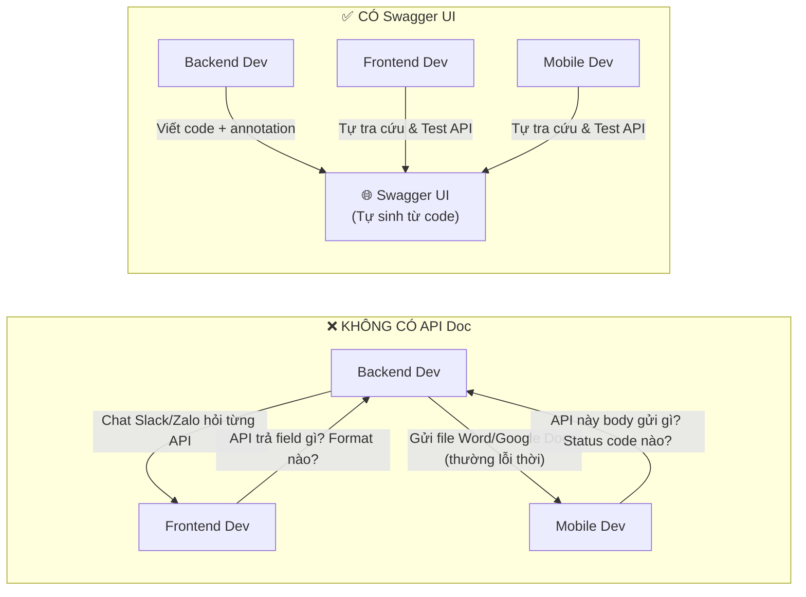
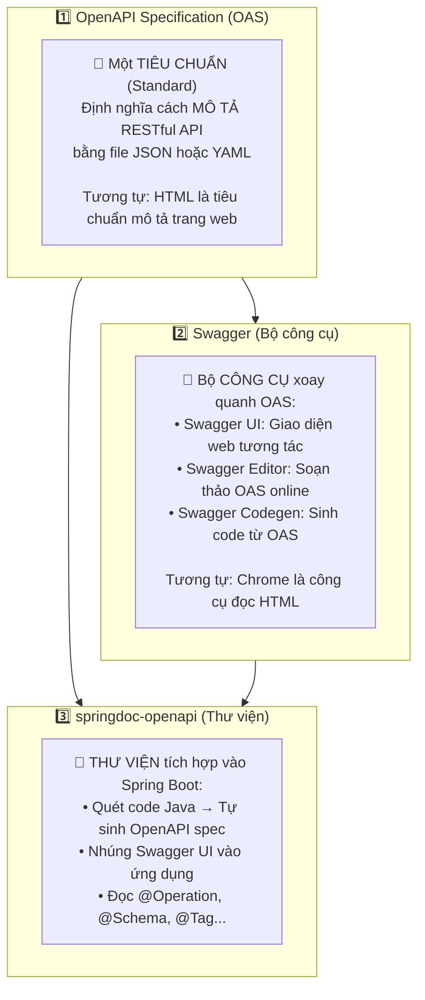
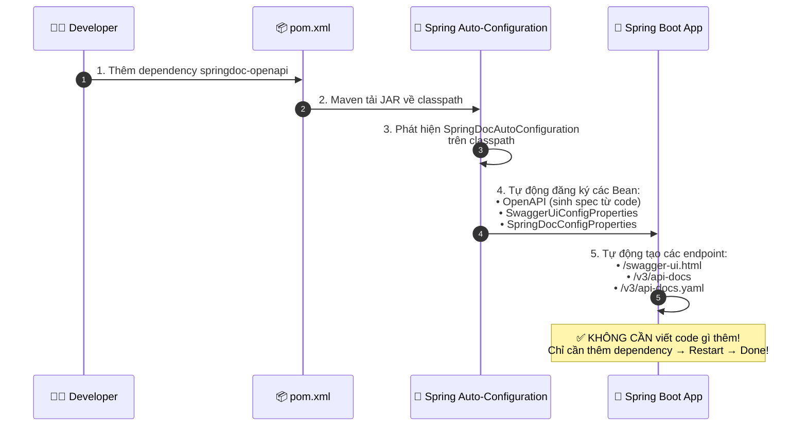
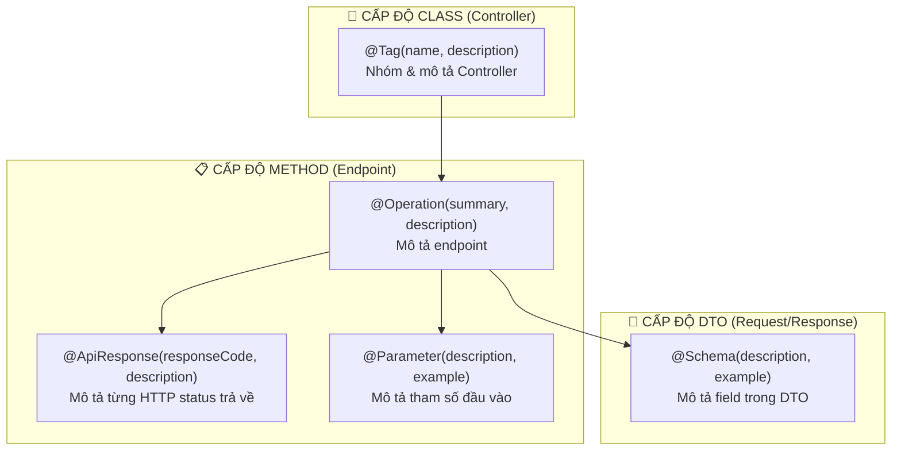
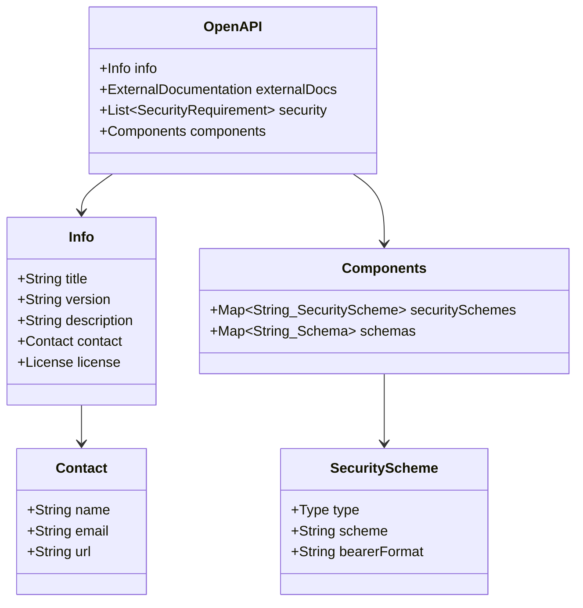
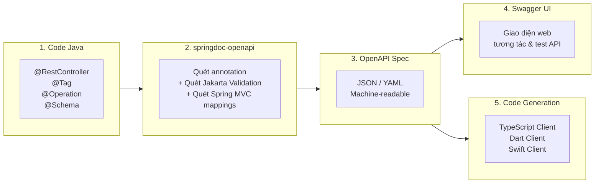
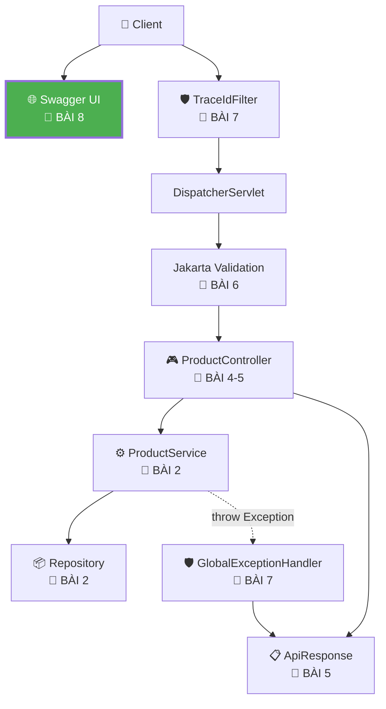

# 📘 BÀI 8: API DOCUMENTATION VỚI SWAGGER/OPENAPI

> **Mục tiêu bài học:**
> 1. Hiểu **tại sao cần API Documentation** tự động và vai trò quan trọng của nó trong quy trình phát triển.
> 2. Phân biệt rõ **OpenAPI Specification (OAS)** vs **Swagger UI** vs **springdoc-openapi** — ba khái niệm thường bị nhầm lẫn.
> 3. Tích hợp `springdoc-openapi-starter-webmvc-ui` vào project Spring Boot 4.x.
> 4. Thành thạo các annotation: `@Tag`, `@Operation`, `@ApiResponse`, `@Schema`, `@Parameter`.
> 5. Tạo class `OpenApiConfig` tùy chỉnh thông tin dự án, nhóm API, và Security Scheme (chuẩn bị cho JWT sau này).
> 6. Biết cách xuất **OpenAPI spec (JSON/YAML)** để chia sẻ cho frontend/mobile/QA.

---

## 📑 MỤC LỤC

| Phần | Nội dung | Mục tiêu |
|:---:|:---|:---|
| 1 | 🔍 Vấn đề — Tại sao cần API Documentation tự động? | Nhận diện Pain Point |
| 2 | 🧬 Bản chất: OpenAPI Specification vs Swagger vs springdoc | Phân biệt 3 khái niệm |
| 3 | ⚙️ Tích hợp springdoc-openapi vào Spring Boot | Cài đặt & Cấu hình |
| 4 | 🏷️ Annotation cốt lõi: `@Tag`, `@Operation`, `@ApiResponse` | Mô tả Controller |
| 5 | 📐 `@Schema` — Mô tả DTO chi tiết | Mô tả Request/Response |
| 6 | 🎨 `OpenApiConfig` — Tùy chỉnh giao diện & Metadata | Cấu hình nâng cao |
| 7 | 🗂️ Nhóm API (Group) & Ẩn/Hiện endpoint | Quản lý API Doc |
| 8 | 🔐 Chuẩn bị Security Scheme cho JWT (Preview Bài 18-20) | Preview tích hợp Auth |
| 9 | 🚀 Triển khai code thực chiến hoàn chỉnh | Code Walkthrough |
| 10 | 📚 Kiến thức bổ sung & Pattern hay | Best Practices |
| 11 | 🎯 Tổng kết & So sánh Before/After | Takeaway |
| 12 | 💼 Câu hỏi phỏng vấn (Interview Questions) | Chuẩn bị phỏng vấn |

---

## PHẦN 1: VẤN ĐỀ — TẠI SAO CẦN API DOCUMENTATION TỰ ĐỘNG?

### 1.1. Bức tranh "trước và sau" Swagger

Hãy tưởng tượng bạn đang làm dự án có 3 nhóm: **Backend, Frontend, Mobile**. Backend phát triển API, hai nhóm còn lại gọi API để xây giao diện.



### 1.2. Năm vấn đề khi KHÔNG CÓ API Documentation tự động

| # | Vấn đề | Hậu quả |
|:---:|:---|:---|
| 1 | 📄 **Tài liệu viết tay (Word/Notion) bị lỗi thời** | Backend sửa API nhưng quên cập nhật tài liệu → Frontend gọi sai, debug mất nửa ngày |
| 2 | 💬 **Phải hỏi đi hỏi lại qua chat** | Backend bị interrupt liên tục, mất flow code |
| 3 | 🧪 **Test API phải mở Postman riêng** | Phải tạo Collection, set header, body thủ công → chậm |
| 4 | 🤝 **Không có contract rõ ràng giữa Frontend & Backend** | Hai bên hiểu khác nhau về API spec → integrate bị lệch |
| 5 | 📦 **Không thể auto-generate SDK/Client code** | Từ OpenAPI spec, có thể tự sinh client code cho React, Flutter, Swift... Không có spec thì phải viết tay |

> [!IMPORTANT]
> **API Documentation không phải "trang trí đẹp"** — nó là **công cụ giao tiếp sống** giữa các đội trong dự án. Swagger UI cho phép tất cả stakeholder (Backend, Frontend, Mobile, QA, PM) cùng nhìn vào **một nguồn sự thật duy nhất (Single Source of Truth)** về API.

---

## PHẦN 2: BẢN CHẤT — OPENAPI SPECIFICATION VS SWAGGER VS SPRINGDOC

### 2.1. Ba khái niệm thường bị nhầm lẫn

Nhiều lập trình viên dùng "Swagger" như từ đồng nghĩa của "API Documentation", nhưng thực tế có **3 thực thể khác nhau hoàn toàn**:



### 2.2. Bảng so sánh chi tiết

| | OpenAPI Specification (OAS) | Swagger | springdoc-openapi |
|:---|:---|:---|:---|
| **Là gì?** | Tiêu chuẩn kỹ thuật (Standard/Spec) | Bộ công cụ (Tool Suite) | Thư viện Java (Library) |
| **Ai quản lý?** | OpenAPI Initiative (Linux Foundation) | SmartBear Software | Daniel Mota (Open Source) |
| **Chức năng** | Định nghĩa format mô tả API | Hiển thị, soạn, sinh code từ OAS | Tự quét code Spring → Sinh OAS + Nhúng Swagger UI |
| **Phiên bản** | OAS 3.0, OAS 3.1 | Swagger UI 5.x | v3.x (cho Spring Boot 4.x) |
| **Ví dụ ẩn dụ** | 📐 Bản vẽ kiến trúc (Tiêu chuẩn ISO) | 🖥️ Phần mềm đọc bản vẽ (AutoCAD) | 🤖 Robot tự vẽ bản vẽ từ tòa nhà thật |

> [!TIP]
> **Quy tắc ghi nhớ:**
> - **OpenAPI** = Ngôn ngữ mô tả (Language)
> - **Swagger UI** = Trình duyệt để đọc (Viewer)
> - **springdoc** = Thợ phiên dịch từ code Java sang ngôn ngữ OpenAPI (Translator)

---

## PHẦN 3: TÍCH HỢP SPRINGDOC-OPENAPI VÀO SPRING BOOT

### 3.1. Thêm dependency vào `pom.xml`

```xml
<!-- 📘 BÀI 8: Swagger / OpenAPI Documentation -->
<dependency>
    <groupId>org.springdoc</groupId>
    <artifactId>springdoc-openapi-starter-webmvc-ui</artifactId>
    <version>3.0.3</version>
</dependency>
```

### 3.2. Điều gì xảy ra khi thêm dependency? (Auto-Configuration Magic)



### 3.3. Ba URL quan trọng sau khi tích hợp

| URL | Chức năng | Định dạng |
|:---|:---|:---|
| `http://localhost:8080/swagger-ui.html` | 🌐 **Giao diện web tương tác** — Xem, thử nghiệm API trực tiếp | HTML |
| `http://localhost:8080/v3/api-docs` | 📄 **OpenAPI spec dạng JSON** — Machine-readable | JSON |
| `http://localhost:8080/v3/api-docs.yaml` | 📄 **OpenAPI spec dạng YAML** — Human-readable | YAML |

> [!NOTE]
> **Zero-Config Philosophy:** springdoc tuân theo triết lý "Convention over Configuration" — chỉ cần thêm dependency vào `pom.xml`, Spring Boot Auto-Configuration sẽ tự quét tất cả `@RestController`, `@GetMapping`, `@PostMapping`... và sinh ra tài liệu API tự động. Không cần viết thêm bất kỳ dòng config nào!

### 3.4. Cấu hình tùy chỉnh trong `application.properties`

```properties
# ===================================================
# 📘 BÀI 8: Swagger / OpenAPI Configuration
# ===================================================

# Đường dẫn tới OpenAPI JSON spec (mặc định: /v3/api-docs)
springdoc.api-docs.path=/v3/api-docs

# Đường dẫn tới Swagger UI (mặc định: /swagger-ui.html)
springdoc.swagger-ui.path=/swagger-ui.html

# Sắp xếp API operations theo method (GET trước, POST sau...)
springdoc.swagger-ui.operations-sorter=method

# Sắp xếp tag theo thứ tự alphabet
springdoc.swagger-ui.tags-sorter=alpha

# Mặc định Content-Type cho response
springdoc.default-produces-media-type=application/json

# Mở rộng schema definition mặc định (hiện chi tiết hơn)
springdoc.swagger-ui.doc-expansion=list

# Hiện thanh tìm kiếm filter trên Swagger UI
springdoc.swagger-ui.filter=true
```

---

## PHẦN 4: ANNOTATION CỐT LÕI — `@Tag`, `@Operation`, `@ApiResponse`

### 4.1. Sơ đồ vị trí của từng annotation trên kiến trúc code



### 4.2. `@Tag` — Nhóm và Mô tả Controller

`@Tag` gắn lên class Controller, tạo ra **một mục nhóm** (Group) trên Swagger UI. Nếu không có `@Tag`, springdoc sẽ tự đặt tên theo class name (xấu và không chuyên nghiệp).

```java
// ❌ TRƯỚC: Swagger UI hiển thị tên lớp xấu xí "product-controller"
@RestController
@RequestMapping("/api/v1/products")
public class ProductController { ... }

// ✅ SAU: Swagger UI hiển thị tên đẹp "📦 Product Management"
@Tag(name = "📦 Product Management", description = "CRUD API quản lý sản phẩm")
@RestController
@RequestMapping("/api/v1/products")
public class ProductController { ... }
```

### 4.3. `@Operation` — Mô tả Endpoint

`@Operation` gắn lên từng method trong Controller, mô tả **mục đích** (summary) và **chi tiết** (description) của endpoint đó.

```java
@Operation(
    summary = "Tạo sản phẩm mới",
    description = """
        Tạo một sản phẩm mới trong hệ thống.
        - Tên sản phẩm phải duy nhất (không trùng).
        - Giá phải lớn hơn 0.
        - Trả về 201 Created nếu thành công.
        """
)
@PostMapping
public ResponseEntity<ApiResponse<ProductResponse>> createProduct(...) { ... }
```

| Thuộc tính | Ý nghĩa | Vị trí hiển thị trên Swagger UI |
|:---|:---|:---|
| `summary` | Tiêu đề ngắn gọn (~1 dòng) | Dòng tiêu đề bên cạnh HTTP method |
| `description` | Mô tả chi tiết (có thể markdown) | Khi expand endpoint |
| `operationId` | ID duy nhất (dùng cho codegen) | Ẩn, nhưng quan trọng khi sinh client code |
| `deprecated` | Đánh dấu endpoint sắp bị loại bỏ | Hiện gạch ngang trên Swagger UI |

### 4.4. `@ApiResponse` / `@ApiResponses` — Mô tả Response Status Code

Mỗi endpoint có thể trả về **nhiều status code khác nhau**. `@ApiResponse` giúp liệt kê tất cả cho Frontend/Mobile biết trước.

```java
@Operation(summary = "Lấy sản phẩm theo ID")
@ApiResponses(value = {
    @ApiResponse(responseCode = "200", description = "✅ Tìm thấy sản phẩm"),
    @ApiResponse(responseCode = "404", description = "❌ Không tìm thấy sản phẩm với ID này",
                 content = @Content),  // content = @Content → body rỗng (không có data)
    @ApiResponse(responseCode = "500", description = "🔥 Lỗi server nội bộ",
                 content = @Content)
})
@GetMapping("/{id}")
public ResponseEntity<ApiResponse<ProductResponse>> getProductById(@PathVariable Long id) { ... }
```

### 4.5. `@Parameter` — Mô tả Tham số Đầu vào

```java
@GetMapping
public ResponseEntity<ApiResponse<List<ProductResponse>>> getAllProducts(
        @Parameter(description = "Lọc theo danh mục sản phẩm", example = "Laptop")
        @RequestParam(required = false) String category,

        @Parameter(description = "Giá tối thiểu", example = "500")
        @RequestParam(required = false) Double minPrice,

        @Parameter(description = "Giá tối đa", example = "3000")
        @RequestParam(required = false) Double maxPrice
) { ... }
```

---

## PHẦN 5: `@Schema` — MÔ TẢ DTO CHI TIẾT

### 5.1. Tại sao cần `@Schema`?

Khi Frontend mở Swagger UI để xem body cần gửi cho `POST /api/v1/products`, họ cần biết:
- Mỗi field có ý nghĩa gì?
- Giá trị mẫu (example) là gì?
- Độ dài tối thiểu / tối đa?
- Field nào bắt buộc, field nào tùy chọn?

`@Schema` chính là annotation cung cấp tất cả thông tin đó.

### 5.2. Cách dùng `@Schema` trên DTO

```java
@Schema(description = "Dữ liệu tạo sản phẩm mới — gửi trong body của POST /api/v1/products")
public class ProductCreateRequest {

    @Schema(
        description = "Tên sản phẩm (phải duy nhất trong hệ thống)",
        example = "MacBook Pro M4 16 inch",
        minLength = 2,
        maxLength = 200,
        requiredMode = Schema.RequiredMode.REQUIRED
    )
    @NotBlank(message = "Tên sản phẩm không được để trống")
    @Size(min = 2, max = 200, message = "Tên sản phẩm phải từ 2 đến 200 ký tự")
    private String name;

    @Schema(
        description = "Mô tả chi tiết sản phẩm (không bắt buộc)",
        example = "Laptop cao cấp với chip M4, RAM 32GB, SSD 1TB",
        requiredMode = Schema.RequiredMode.NOT_REQUIRED
    )
    private String description;

    @Schema(
        description = "Giá sản phẩm (USD), phải lớn hơn 0",
        example = "2499.99",
        minimum = "0"
    )
    @NotNull(message = "Giá sản phẩm không được để trống")
    @Positive(message = "Giá sản phẩm phải lớn hơn 0")
    private Double price;

    // ... các field khác
}
```

### 5.3. `@Schema` trên Response DTO (Java Record)

```java
@Schema(description = "Thông tin sản phẩm trả về cho Client")
public record ProductResponse(
        @Schema(description = "ID duy nhất của sản phẩm", example = "42")
        Long id,

        @Schema(description = "Tên sản phẩm", example = "MacBook Pro M4")
        String name,

        @Schema(description = "Mô tả sản phẩm", example = "Laptop cao cấp")
        String description,

        @Schema(description = "Giá sản phẩm (USD)", example = "2499.99")
        Double price,

        @Schema(description = "Danh mục", example = "Laptop")
        String category,

        @Schema(description = "Số lượng tồn kho", example = "15")
        Integer stock,

        @Schema(description = "Thời điểm tạo", example = "2026-10-03T14:30:00")
        LocalDateTime createdAt,

        @Schema(description = "Thời điểm cập nhật gần nhất", example = "2026-10-03T15:45:00")
        LocalDateTime updatedAt
) { ... }
```

### 5.4. Mối quan hệ giữa `@Schema` và Jakarta Validation

> [!NOTE]
> **springdoc tự đọc một phần Jakarta Validation!** Kết quả kiểm chứng thực tế với springdoc 3.0.3 (xem Phần 9.7):
> - `@NotBlank` → `required` + `minLength: 1`
> - `@NotNull` → `required`
> - `@Size(min=2, max=200)` → `minLength: 2, maxLength: 200`
> - `@Positive` / `@PositiveOrZero` → **KHÔNG** sinh `minimum` trong spec (đã test) — nếu muốn hiển thị, hãy tự khai báo `@Schema(minimum = "0", exclusiveMinimum = true)` hoặc ghi trong `description`.
>
> Do đó, `@Schema` chủ yếu dùng để thêm **mô tả ngữ nghĩa** (`description`) và **giá trị mẫu** (`example`) — những thông tin mà Validation annotation không cung cấp được.

---

## PHẦN 6: `OpenApiConfig` — TÙY CHỈNH GIAO DIỆN & METADATA

### 6.1. Tại sao cần cấu hình tùy chỉnh?

Swagger UI mặc định sẽ hiển thị:
- Tiêu đề: *"OpenAPI definition"* (chung chung, không rõ dự án gì)
- Không có thông tin liên hệ, phiên bản, license
- Không có Security scheme (không test được API yêu cầu JWT token)

### 6.2. Tạo class `OpenApiConfig`

```java
@Configuration
public class OpenApiConfig {

    @Bean
    public OpenAPI customOpenAPI() {
        return new OpenAPI()
            .info(new Info()
                .title("🚀 Spring Boot Learning API")
                .version("1.0.0")
                .description("""
                    RESTful API cho dự án Spring Boot Learning.
                    
                    **Chức năng chính:**
                    - CRUD quản lý sản phẩm (Product)
                    - Validation dữ liệu đầu vào
                    - Xử lý lỗi tập trung (Global Exception Handling)
                    - Logging với TraceId (MDC)
                    """)
                .contact(new Contact()
                    .name("Spring Boot Learning Team")
                    .email("dev@springbootlearning.com")
                    .url("https://github.com/springboot-learning"))
                .license(new License()
                    .name("MIT License")
                    .url("https://opensource.org/licenses/MIT")))
            .externalDocs(new ExternalDocumentation()
                .description("📚 Tài liệu học tập chi tiết")
                .url("https://github.com/springboot-learning/docs"));
    }
}
```

### 6.3. Giải thích sơ đồ cấu trúc `OpenAPI` object



---

## PHẦN 7: NHÓM API (GROUP) & ẨN/HIỆN ENDPOINT

### 7.1. Nhóm API (GroupedOpenApi)

Khi dự án lớn (50+ endpoints), Swagger UI sẽ rất dài và khó tìm. Bạn có thể chia API thành các nhóm:

```java
@Configuration
public class OpenApiConfig {

    // Nhóm 1: Product API
    @Bean
    public GroupedOpenApi productApi() {
        return GroupedOpenApi.builder()
                .group("product-management")
                .displayName("📦 Product Management")
                .pathsToMatch("/api/v1/products/**")
                .build();
    }

    // Nhóm 2: User API (sau này mở rộng)
    @Bean
    public GroupedOpenApi userApi() {
        return GroupedOpenApi.builder()
                .group("user-management")
                .displayName("👤 User Management")
                .pathsToMatch("/api/v1/users/**")
                .build();
    }
}
```

### 7.2. Ẩn endpoint khỏi Swagger UI

Đôi khi có những endpoint nội bộ (debug, health check) không muốn hiển thị:

```java
// Cách 1: Dùng @Hidden trên method
@Hidden  // ← springdoc annotation
@GetMapping("/debug/headers")
public ResponseEntity<?> debugHeaders(...) { ... }

// Cách 2: Dùng @Hidden trên class (ẩn toàn bộ Controller)
@Hidden
@RestController
@RequestMapping("/internal")
public class InternalController { ... }
```

---

## PHẦN 8: CHUẨN BỊ SECURITY SCHEME CHO JWT (PREVIEW BÀI 18-20)

### 8.1. Tại sao cần cấu hình Security Scheme ngay từ bây giờ?

Khi bạn thêm Spring Security + JWT vào ứng dụng (Bài 18-20), các API yêu cầu token JWT trong header `Authorization: Bearer <token>`. Nếu Swagger UI không có nút "Authorize", Frontend developer không thể test các API bảo mật.

```java
@Bean
public OpenAPI customOpenAPI() {
    return new OpenAPI()
        .info(new Info().title("...").version("..."))
        // Khai báo Security Scheme
        .addSecurityItem(new SecurityRequirement().addList("Bearer JWT"))
        .components(new Components()
            .addSecuritySchemes("Bearer JWT",
                new SecurityScheme()
                    .type(SecurityScheme.Type.HTTP)
                    .scheme("bearer")
                    .bearerFormat("JWT")
                    .description("Nhập JWT token (không cần prefix 'Bearer')")));
}
```

> [!NOTE]
> **Hiện tại** project chưa có Spring Security, nên nút "Authorize" sẽ hiện trên Swagger UI nhưng chưa có tác dụng thực tế. Khi học đến Bài 18-20, bạn sẽ cấu hình Spring Security Filter để validate JWT token, và lúc đó nút Authorize sẽ hoạt động thật sự.

---

## PHẦN 9: TRIỂN KHAI CODE THỰC CHIẾN HOÀN CHỈNH

### 9.1. Cấu trúc file thay đổi / thêm mới

```
springboot-learning/
├── pom.xml                                          ← ✏️ Thêm dependency springdoc
├── src/main/
│   ├── java/com/example/springbootlearning/
│   │   ├── config/
│   │   │   ├── AppConfig.java                       (giữ nguyên)
│   │   │   ├── OpenApiConfig.java                   ← 🆕 BÀI 8
│   │   │   └── TraceIdFilter.java                   (giữ nguyên)
│   │   ├── controller/
│   │   │   └── ProductController.java               ← ✏️ Thêm @Tag, @Operation, @ApiResponse
│   │   ├── dto/
│   │   │   ├── request/
│   │   │   │   ├── ProductCreateRequest.java        ← ✏️ Thêm @Schema
│   │   │   │   └── ProductUpdateRequest.java        ← ✏️ Thêm @Schema
│   │   │   └── response/
│   │   │       ├── ApiResponse.java                 ← ✏️ Thêm @Schema
│   │   │       └── ProductResponse.java             ← ✏️ Thêm @Schema
│   │   └── ...
│   └── resources/
│       └── application.properties                   ← ✏️ Thêm springdoc config
```

### 9.2. Bước 1: Thêm dependency vào `pom.xml`

```xml
<!-- 📘 BÀI 8: Swagger / OpenAPI Documentation -->
<dependency>
    <groupId>org.springdoc</groupId>
    <artifactId>springdoc-openapi-starter-webmvc-ui</artifactId>
    <version>3.0.3</version>
</dependency>
```

### 9.3. Bước 2: Tạo `OpenApiConfig.java`

```java
package com.example.springbootlearning.config;

import io.swagger.v3.oas.models.*;
import io.swagger.v3.oas.models.info.*;
import io.swagger.v3.oas.models.security.*;
import org.springframework.context.annotation.Bean;
import org.springframework.context.annotation.Configuration;

/**
 * 📘 BÀI 8 — Cấu hình OpenAPI / Swagger UI
 *
 * Tùy chỉnh thông tin hiển thị trên Swagger UI:
 *  - Tiêu đề, phiên bản, mô tả dự án
 *  - Thông tin liên hệ (Contact)
 *  - Giấy phép (License)
 *  - Security Scheme (chuẩn bị cho JWT ở Bài 18-20)
 */
@Configuration
public class OpenApiConfig {

    @Bean
    public OpenAPI customOpenAPI() {
        return new OpenAPI()
            .info(new Info()
                .title("🚀 Spring Boot Learning API")
                .version("1.0.0")
                .description("""
                    RESTful API cho dự án Spring Boot Learning — Khóa học từ cơ bản đến nâng cao.
                    
                    **Chức năng hiện tại:**
                    - ✅ CRUD quản lý sản phẩm (Product)
                    - ✅ Validation dữ liệu đầu vào (Jakarta Bean Validation)
                    - ✅ Xử lý lỗi tập trung (Global Exception Handling)
                    - ✅ Logging với TraceId (SLF4J + MDC)
                    
                    **Quy ước Response:**
                    - Mọi response đều bọc trong `ApiResponse<T>` thống nhất
                    - Lỗi trả về cùng cấu trúc với `data: null`
                    """)
                .contact(new Contact()
                    .name("Spring Boot Learning Team")
                    .email("dev@springbootlearning.com")
                    .url("https://github.com/springboot-learning"))
                .license(new License()
                    .name("MIT License")
                    .url("https://opensource.org/licenses/MIT")))
            // Security Scheme — chuẩn bị cho JWT (Bài 18-20)
            .addSecurityItem(new SecurityRequirement().addList("Bearer JWT"))
            .components(new Components()
                .addSecuritySchemes("Bearer JWT",
                    new SecurityScheme()
                        .type(SecurityScheme.Type.HTTP)
                        .scheme("bearer")
                        .bearerFormat("JWT")
                        .description("Nhập JWT token (không cần prefix 'Bearer')")));
    }
}
```

### 9.4. Bước 3: Annotate `ProductController` với `@Tag`, `@Operation`, `@ApiResponse`

> [!WARNING]
> **Bẫy trùng tên `ApiResponse`!** Dự án đã có DTO `com.example.springbootlearning.dto.response.ApiResponse` (Bài 5), trùng tên với annotation `io.swagger.v3.oas.annotations.responses.ApiResponse`. Java không cho import 2 class cùng tên đơn giản trong 1 file → phải dùng **tên đầy đủ (fully-qualified name)** cho một trong hai. Ở đây ta giữ import DTO (dùng nhiều trong kiểu trả về) và viết đầy đủ tên annotation.

```java
import com.example.springbootlearning.dto.response.ApiResponse;      // DTO của dự án
import io.swagger.v3.oas.annotations.Hidden;
import io.swagger.v3.oas.annotations.Operation;
import io.swagger.v3.oas.annotations.Parameter;
import io.swagger.v3.oas.annotations.media.Content;
import io.swagger.v3.oas.annotations.responses.ApiResponses;        // số nhiều → không trùng
import io.swagger.v3.oas.annotations.tags.Tag;

@Tag(name = "📦 Product Management", description = "CRUD API quản lý sản phẩm — tạo, đọc, cập nhật, xóa, tìm kiếm")
@RestController
@RequestMapping("/api/v1/products")
public class ProductController {

    @Operation(summary = "Tạo sản phẩm mới", description = """
            Tạo sản phẩm mới. Quy tắc:
            - Tên sản phẩm phải **duy nhất** (trùng → 409)
            - Giá phải > 0, tồn kho >= 0 (sai → 400 kèm lỗi từng field)
            - Thành công → **201 Created** + header `Location`
            """)
    @ApiResponses({
        @io.swagger.v3.oas.annotations.responses.ApiResponse(responseCode = "201", description = "✅ Tạo thành công"),
        @io.swagger.v3.oas.annotations.responses.ApiResponse(responseCode = "400", description = "❌ Dữ liệu không hợp lệ", content = @Content),
        @io.swagger.v3.oas.annotations.responses.ApiResponse(responseCode = "409", description = "⚠️ Tên đã tồn tại", content = @Content)
    })
    @PostMapping
    public ResponseEntity<ApiResponse<ProductResponse>> createProduct(
            @Valid @RequestBody ProductCreateRequest request) { ... }

    @Operation(summary = "Lấy sản phẩm theo ID")
    @GetMapping("/{id}")
    public ResponseEntity<ApiResponse<ProductResponse>> getProductById(
            @Parameter(description = "ID sản phẩm", example = "1", required = true)
            @PathVariable Long id) { ... }

    @Hidden   // Ẩn endpoint debug khỏi Swagger UI
    @GetMapping("/debug/headers")
    public ResponseEntity<...> debugHeaders(...) { ... }
}
```

👉 Code đầy đủ 7 endpoint: [ProductController.java](file:///Users/vovantu/HTML_CSS/JAVA%20/springboot-learning/src/main/java/com/example/springbootlearning/controller/ProductController.java)

### 9.5. Bước 4: Annotate DTO với `@Schema`

Thêm `@Schema` vào các DTO:
- `ProductCreateRequest`: Mô tả mỗi field + example
- `ProductUpdateRequest`: Tương tự
- `ProductResponse`: Mô tả field trả về
- `ApiResponse<T>`: Mô tả cấu trúc wrapper

### 9.6. Bước 5: Cấu hình `application.properties`

```properties
# ===================================================
# 📘 BÀI 8: Swagger / OpenAPI Configuration
# ===================================================
springdoc.swagger-ui.path=/swagger-ui.html
springdoc.api-docs.path=/v3/api-docs
springdoc.swagger-ui.operations-sorter=method
springdoc.swagger-ui.tags-sorter=alpha
springdoc.default-produces-media-type=application/json
springdoc.swagger-ui.doc-expansion=list
springdoc.swagger-ui.filter=true
```

---

### 9.7. Bước 6: Chạy & kiểm chứng (kết quả thực tế)

```bash
./mvnw spring-boot:run
# Mở trình duyệt: http://localhost:8080/swagger-ui.html
```

| Kiểm tra | Kết quả thực tế |
|:---|:---|
| `GET /swagger-ui.html` | `302` → redirect sang `/swagger-ui/index.html` ✅ |
| Dropdown "Select a definition" | `🌐 Tất cả API`, `📦 Product Management (v1)` ✅ |
| Phiên bản spec | `openapi: 3.1.0` ✅ |
| `POST /api/v1/products` | responses: `201, 400, 409` ✅ |
| `DELETE /api/v1/products/{id}` | responses: `204, 404` ✅ |
| `/debug/headers` | **Không xuất hiện** (nhờ `@Hidden`) ✅ |
| Schemas sinh ra | `ProductCreateRequest`, `ProductUpdateRequest`, `ProductResponse`, `ApiResponseProductResponse`, `ApiResponseListProductResponse` ✅ |

Schema `ProductCreateRequest` thực tế (trích `/v3/api-docs/1-product-management`):

```json
{
  "type": "object",
  "description": "Dữ liệu tạo sản phẩm mới — body của POST /api/v1/products",
  "properties": {
    "name":     { "type": "string", "example": "MacBook Pro M4 16 inch", "minLength": 2, "maxLength": 200 },
    "price":    { "type": "number", "format": "double", "example": 2499.99 },
    "category": { "type": "string", "example": "Laptop", "minLength": 1 },
    "stock":    { "type": "integer", "format": "int32", "example": 15 }
  },
  "required": ["category", "name", "price"]
}
```

> [!TIP]
> Quan sát: `required` và `minLength/maxLength` **tự sinh từ `@NotBlank`/`@NotNull`/`@Size`** — bạn không hề khai báo trong `@Schema`. Còn `@Positive` trên `price` thì không được phản ánh.
>
> 🔑 **Generic resolution:** `ResponseEntity<ApiResponse<List<ProductResponse>>>` được springdoc "trải phẳng" thành schema `ApiResponseListProductResponse` — dù Java có *type erasure*, generic type trong **chữ ký method** vẫn được lưu trong bytecode và đọc qua reflection `Method.getGenericReturnType()`.

**Thực hành trên Swagger UI:** mở `POST /api/v1/products` → **Try it out** → sửa body (thử `price: -5`) → **Execute** → quan sát response `400` từ `GlobalExceptionHandler` (Bài 7) ngay trên giao diện.

---

## PHẦN 10: KIẾN THỨC BỔ SUNG & PATTERN HAY

### 10.1. Ẩn dụ: Swagger UI như "Thực đơn Nhà hàng"

```
+-----------------------------------------------------------------------------------------------+
| 🍽️ ẨN DỤ: SWAGGER UI NHƯ THỰC ĐƠN NHÀ HÀNG                                                  |
+-----------------------------------------------------------------------------------------------+
| Hãy tưởng tượng API backend của bạn là một nhà hàng:                                          |
|                                                                                               |
| 1. Đầu bếp (Backend Developer):                                                              |
|    - Nấu các món ăn (viết code API endpoints).                                                |
|    - Gắn nhãn mô tả lên từng món (@Tag, @Operation, @Schema).                                 |
|                                                                                               |
| 2. Thực đơn (Swagger UI):                                                                     |
|    - Tự động in ra từ nhãn mô tả của đầu bếp.                                                |
|    - Khách (Frontend) mở thực đơn ra xem:                                                    |
|      + Nhóm 1: "🥩 Món chính" (@Tag) → Có 5 món                                              |
|      + Mỗi món: Tên, mô tả, thành phần, giá (@Operation, @Schema)                            |
|      + Khách có thể "nếm thử" ngay tại bàn (Try it out → Execute → Xem response)             |
|                                                                                               |
| 3. OpenAPI Spec (JSON/YAML):                                                                  |
|    - Đây là "bản gốc dữ liệu" của thực đơn, dạng máy có thể đọc được.                      |
|    - Có thể dùng để tự sinh ra ứng dụng đặt hàng tự động (Client SDK / Codegen).             |
|                                                                                               |
| 4. Nếu đầu bếp đổi món nhưng quên sửa thực đơn → Khách order sai!                            |
|    Swagger giải quyết: Thực đơn TỰ ĐỘNG cập nhật theo code, không bao giờ lỗi thời.          |
+-----------------------------------------------------------------------------------------------+
```

### 10.2. OpenAPI Spec — Cấu trúc file JSON/YAML thực tế

Khi bạn truy cập `http://localhost:8080/v3/api-docs`, springdoc trả về một file JSON có cấu trúc:

```yaml
# Trích xuất đơn giản hóa OpenAPI Spec (YAML format)
openapi: "3.1.0"
info:
  title: "🚀 Spring Boot Learning API"
  version: "1.0.0"
  description: "RESTful API cho dự án Spring Boot Learning"
  contact:
    name: "Spring Boot Learning Team"
    email: "dev@springbootlearning.com"

paths:
  /api/v1/products:
    get:
      tags:
        - "📦 Product Management"
      summary: "Lấy danh sách sản phẩm"
      operationId: "getAllProducts"
      parameters:
        - name: category
          in: query
          description: "Lọc theo danh mục"
          required: false
          schema:
            type: string
      responses:
        "200":
          description: "Thành công"
          content:
            application/json:
              schema:
                $ref: "#/components/schemas/ApiResponseListProductResponse"
    post:
      tags:
        - "📦 Product Management"
      summary: "Tạo sản phẩm mới"
      requestBody:
        content:
          application/json:
            schema:
              $ref: "#/components/schemas/ProductCreateRequest"
      responses:
        "201":
          description: "Tạo thành công"
        "400":
          description: "Dữ liệu không hợp lệ"
        "409":
          description: "Tên sản phẩm đã tồn tại"

components:
  schemas:
    ProductCreateRequest:
      type: object
      required: [name, price, category]
      properties:
        name:
          type: string
          minLength: 2
          maxLength: 200
          example: "MacBook Pro M4 16 inch"
        price:
          type: number
          format: double
          example: 2499.99
```

### 10.3. Luồng tổng quan: Từ Code Java đến Swagger UI



### 10.4. springdoc tự đọc những gì từ code? (Không cần annotation)

springdoc rất thông minh — nó tự trích xuất nhiều thông tin chỉ từ code Java thuần:

| Nguồn thông tin | Thông tin springdoc tự trích xuất |
|:---|:---|
| `@GetMapping("/products/{id}")` | Đường dẫn, HTTP method, path parameters |
| `@RequestParam(required = false)` | Query params, optional/required |
| `@RequestBody ProductCreateRequest` | Request body schema |
| `@Valid` | Liên kết tới Jakarta Validation annotations |
| `ResponseEntity<ApiResponse<ProductResponse>>` | Response schema (generic type resolution) |
| `@NotBlank`, `@Size`, `@Positive` | Constraints: required, minLength, min... |
| Method return type (`List<ProductResponse>`) | Array schema |

> Tuy springdoc tự hiểu rất nhiều, nhưng annotation `@Tag`, `@Operation`, `@Schema` vẫn cần thiết để thêm **ngữ nghĩa mà máy không đoán được**: mô tả bằng ngôn ngữ tự nhiên và giá trị mẫu.

---

## PHẦN 11: TỔNG KẾT & SO SÁNH BEFORE/AFTER

### 11.1. Kiến trúc tổng quan sau Bài 1-8



### 11.2. So sánh Before/After toàn bộ Giai đoạn 2

| Bài | Trước | Sau |
|:---:|:---|:---|
| Bài 4 | Controller trả raw Object | Controller trả `ResponseEntity` với status code chuẩn |
| Bài 5 | Trả Entity trực tiếp cho Client | Dùng DTO (Request/Response) + `ApiResponse<T>` wrapper |
| Bài 6 | Validate thủ công bằng if/else | Jakarta Bean Validation tự động (`@Valid` + annotations) |
| Bài 7 | try-catch rải rác + `System.out.println` | `@RestControllerAdvice` tập trung + SLF4J Logging + MDC |
| **Bài 8** | **Tài liệu API viết tay, dễ lỗi thời** | **Swagger UI tự sinh từ code, luôn đồng bộ, test được** |

### 11.3. ✅ Checklist hoàn thành Bài 8

- [ ] Thêm dependency `springdoc-openapi-starter-webmvc-ui` vào `pom.xml`
- [ ] Tạo `OpenApiConfig.java` với Info, Contact, License, Security Scheme
- [ ] Gắn `@Tag` lên `ProductController`
- [ ] Gắn `@Operation` + `@ApiResponses` lên mỗi endpoint
- [ ] Gắn `@Parameter` lên các `@RequestParam`
- [ ] Gắn `@Schema` lên tất cả DTO (Request + Response + ApiResponse)
- [ ] Thêm cấu hình springdoc vào `application.properties`
- [ ] Chạy ứng dụng, truy cập `http://localhost:8080/swagger-ui.html`
- [ ] Test thử tạo sản phẩm ngay trên Swagger UI (Try it out → Execute)

---

## PHẦN 12: CÂU HỎI PHỎNG VẤN (INTERVIEW QUESTIONS)

### Câu 1: Phân biệt OpenAPI Specification, Swagger, và springdoc-openapi?
**Trả lời:**
- **OpenAPI Specification (OAS):** Tiêu chuẩn kỹ thuật (standard) do OpenAPI Initiative quản lý, định nghĩa cách mô tả RESTful API bằng JSON/YAML. Tương tự HTML là tiêu chuẩn mô tả trang web.
- **Swagger:** Bộ công cụ (toolsuite) của SmartBear xoay quanh OAS — bao gồm Swagger UI (viewer), Swagger Editor (editor), Swagger Codegen (code generator).
- **springdoc-openapi:** Thư viện Java mã nguồn mở, tích hợp vào Spring Boot. Nó quét code Java (annotations, return types, validation) và tự sinh ra OpenAPI spec + nhúng Swagger UI vào ứng dụng.

### Câu 2: Nếu không gắn annotation `@Tag`, `@Operation`, `@Schema`, Swagger UI có hiển thị được không?
**Trả lời:**
**CÓ!** springdoc tự quét `@RestController`, `@GetMapping`, `@RequestBody`, `@RequestParam`... và sinh tài liệu cơ bản. Tuy nhiên, tài liệu đó sẽ rất **nghèo nàn**: tên endpoint là tên method Java, không có mô tả, không có example. Các annotation `@Tag`, `@Operation`, `@Schema` giúp thêm **ngữ nghĩa** (semantic) mà springdoc không thể tự đoán từ code.

### Câu 3: springdoc-openapi tự đọc được Jakarta Validation annotation không?
**Trả lời:**
**CÓ, nhưng không phải tất cả.** springdoc map `@NotNull`/`@NotBlank` → `required`, `@Size(min, max)` → `minLength/maxLength` (`@NotBlank` còn thêm `minLength: 1`). Khi kiểm chứng với springdoc 3.0.3, `@Positive` **không** sinh `minimum` — cần tự bổ sung bằng `@Schema(minimum = "0", exclusiveMinimum = true)` nếu muốn. Bài học: **luôn mở `/v3/api-docs` kiểm tra spec thật**, đừng giả định.

### Câu 4: `@ApiResponse(content = @Content)` nghĩa là gì?
**Trả lời:**
`content = @Content` (không chỉ định `schema` hay `mediaType`) có nghĩa là response đó **không có body** (empty body). Thường dùng cho các status code lỗi (404, 500) khi không cần trả dữ liệu chi tiết, hoặc cho `204 No Content` (DELETE thành công).

### Câu 5: Trong production, có nên bật Swagger UI không?
**Trả lời:**
**Tùy chiến lược bảo mật của dự án**, nhưng best practice phổ biến là:
- **Development/Staging:** BẬT — cho team phát triển và QA sử dụng.
- **Production:** TẮT hoặc hạn chế truy cập — tránh lộ cấu trúc API cho attacker.
- Cách tắt trong production:
  ```properties
  # application-prod.properties
  springdoc.api-docs.enabled=false
  springdoc.swagger-ui.enabled=false
  ```
  Hoặc dùng Spring Profiles:
  ```properties
  # Chỉ bật Swagger ở môi trường dev
  springdoc.swagger-ui.enabled=${SWAGGER_ENABLED:false}
  ```

### Câu 6: OpenAPI spec (JSON/YAML) có thể dùng để làm gì ngoài Swagger UI?
**Trả lời:**
OpenAPI spec là **machine-readable contract**, có thể dùng để:
1. **Sinh client code tự động** (Code Generation) cho React/Angular (TypeScript), Flutter (Dart), iOS (Swift)... bằng OpenAPI Generator hoặc Swagger Codegen.
2. **Contract Testing**: So sánh spec giữa 2 phiên bản API để phát hiện breaking changes.
3. **API Gateway Configuration**: Import spec vào Kong, Apigee, AWS API Gateway.
4. **Mock Server**: Dùng spec để tạo mock server cho Frontend phát triển song song khi Backend chưa xong.
5. **Postman Collection**: Import spec trực tiếp vào Postman.

### Câu 7: `@Operation(deprecated = true)` dùng khi nào?
**Trả lời:**
Khi bạn muốn **thông báo cho Frontend/Mobile rằng API endpoint này sắp bị loại bỏ** trong phiên bản tiếp theo, nhưng hiện tại vẫn hoạt động bình thường. Trên Swagger UI, endpoint sẽ hiển thị gạch ngang (strikethrough) và có dấu hiệu "Deprecated".

Best practice là cung cấp endpoint thay thế trong `description`:
```java
@Operation(
    summary = "Lấy sản phẩm (V1 - SẮP LOẠI BỎ)",
    deprecated = true,
    description = "⚠️ API này sẽ bị loại bỏ từ v2.0. Hãy chuyển sang dùng GET /api/v2/products"
)
```

### Câu 8: Trong project có class `ApiResponse<T>` riêng, khi dùng annotation `@ApiResponse` của Swagger thì gặp vấn đề gì? Xử lý thế nào?
**Trả lời:**
Xảy ra **xung đột tên (name clash)**: Java không cho `import` hai type cùng *simple name* trong một file → lỗi biên dịch *"a type with the same simple name is already defined"*. Cách xử lý:
1. **Dùng fully-qualified name** cho một bên: `@io.swagger.v3.oas.annotations.responses.ApiResponse(...)` (cách dự án này dùng).
2. **Đổi tên DTO** thành `ApiResult<T>` / `BaseResponse<T>` — nhiều team chọn cách này ngay từ đầu để tránh va chạm với thư viện phổ biến.
3. **Tạo meta-annotation riêng** (vd `@ApiErrorResponses`) gộp sẵn các response lỗi chung (400/404/500) → vừa tránh lặp code vừa tránh viết tên dài ở Controller.

> Java không có *import alias* như Kotlin (`import ... as ...`) hay TypeScript, nên fully-qualified name là cách duy nhất khi giữ nguyên cả hai tên.

---

## 📚 TÀI LIỆU LIÊN KẾT LIÊN QUAN TRONG DỰ ÁN

- [OpenApiConfig.java](file:///Users/vovantu/HTML_CSS/JAVA%20/springboot-learning/src/main/java/com/example/springbootlearning/config/OpenApiConfig.java) — Cấu hình Swagger UI
- [ProductController.java](file:///Users/vovantu/HTML_CSS/JAVA%20/springboot-learning/src/main/java/com/example/springbootlearning/controller/ProductController.java) — Controller đã annotate
- [ProductCreateRequest.java](file:///Users/vovantu/HTML_CSS/JAVA%20/springboot-learning/src/main/java/com/example/springbootlearning/dto/request/ProductCreateRequest.java) — DTO với @Schema
- [ProductResponse.java](file:///Users/vovantu/HTML_CSS/JAVA%20/springboot-learning/src/main/java/com/example/springbootlearning/dto/response/ProductResponse.java) — Response DTO với @Schema
- [ApiResponse.java](file:///Users/vovantu/HTML_CSS/JAVA%20/springboot-learning/src/main/java/com/example/springbootlearning/dto/response/ApiResponse.java) — Wrapper với @Schema
- [application.properties](file:///Users/vovantu/HTML_CSS/JAVA%20/springboot-learning/src/main/resources/application.properties) — Cấu hình springdoc
- [Bài 7: Global Exception Handling & Logging](file:///Users/vovantu/HTML_CSS/JAVA%20/Note/Lesson07/bai-7-global-exception-handling-logging.md) — Bài trước
- [ROADMAP.md](file:///Users/vovantu/HTML_CSS/JAVA%20/Note/ROADMAP.md) — Lộ trình tổng quan
