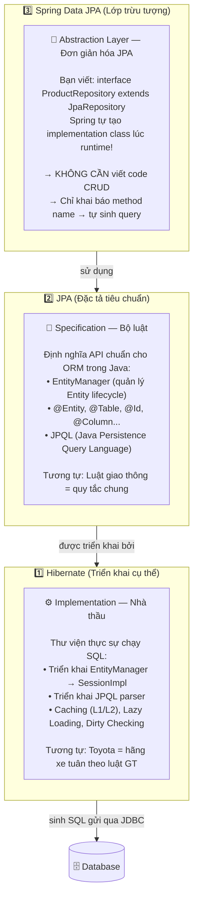
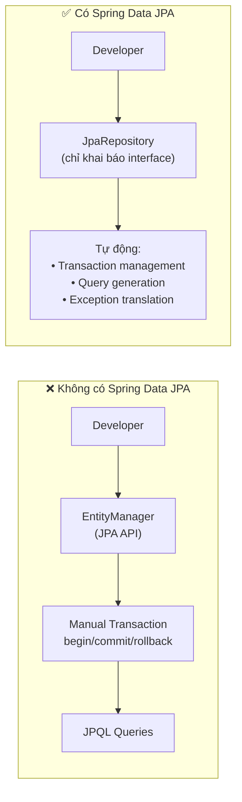
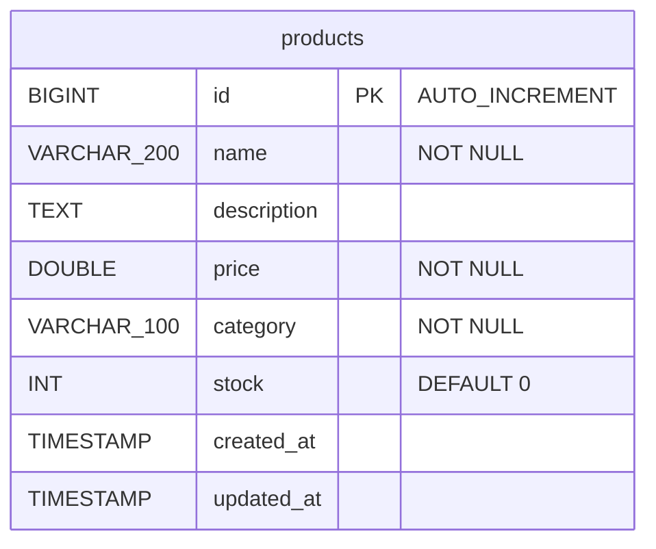
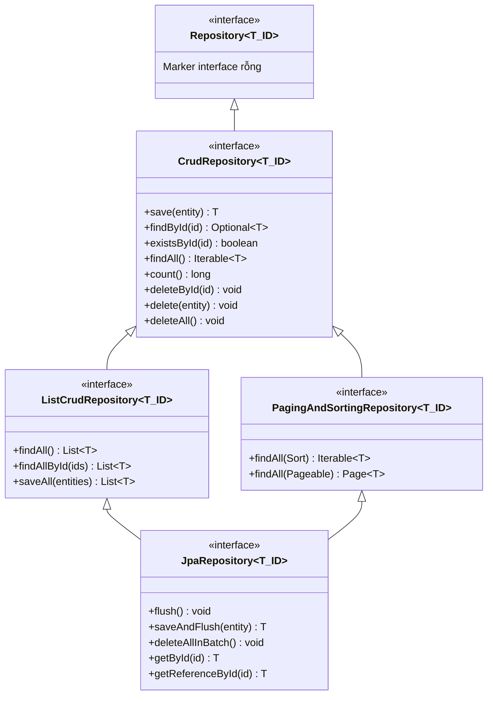
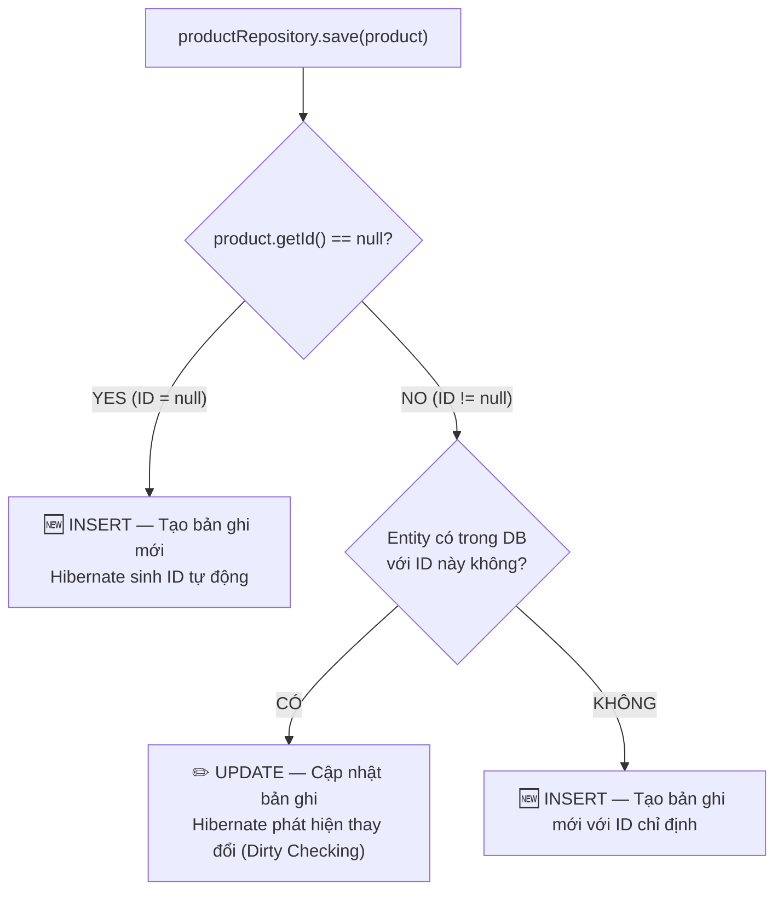
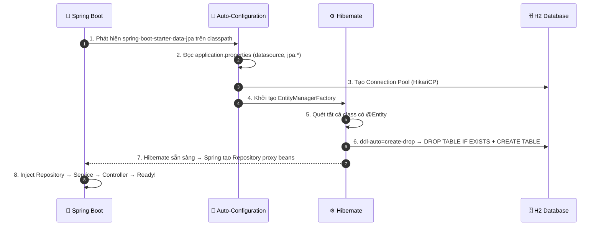
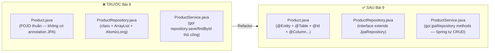
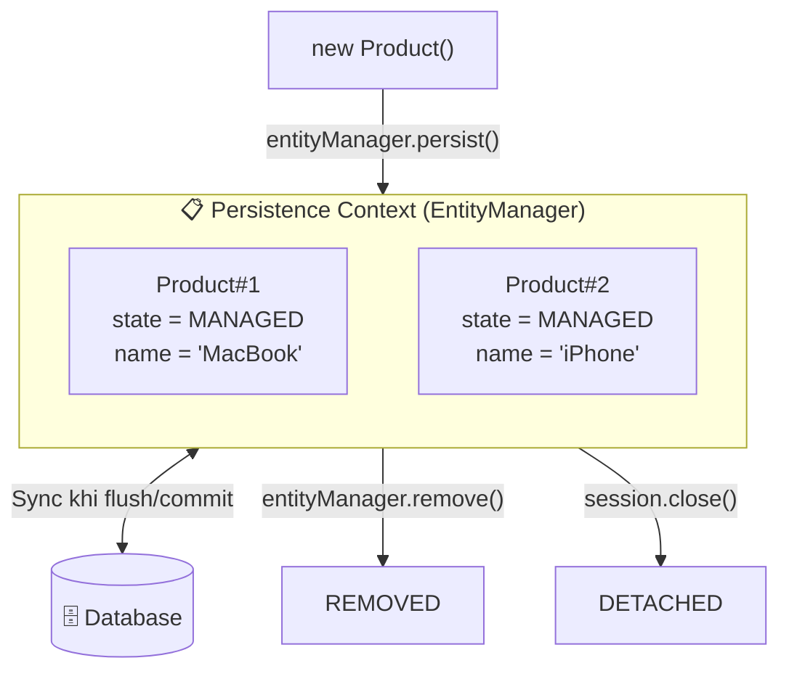
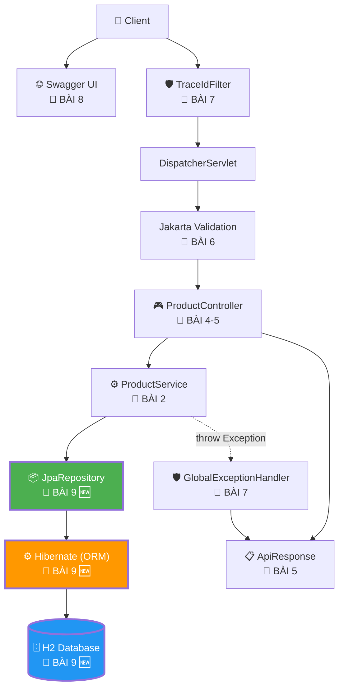

# 📘 BÀI 9: SPRING DATA JPA & HIBERNATE — ORM FUNDAMENTALS

> **Mục tiêu bài học:**
> 1. Hiểu **ORM (Object-Relational Mapping)** là gì và tại sao dùng nó thay vì viết SQL thủ công.
> 2. Phân biệt rõ **JPA (Specification)** vs **Hibernate (Implementation)** vs **Spring Data JPA (Abstraction)** — ba tầng kiến trúc.
> 3. Tạo **JPA Entity** với các annotation: `@Entity`, `@Table`, `@Id`, `@GeneratedValue`, `@Column`, `@Enumerated`, `@CreationTimestamp`, `@UpdateTimestamp`.
> 4. Dùng **JpaRepository** interface để CRUD tự động (không viết SQL).
> 5. Kết nối **H2 in-memory database** (phát triển), hiểu cách chuyển sang MySQL/PostgreSQL (production).
> 6. **Refactor** Product API từ in-memory `ArrayList` sang database thật.

---

## 📑 MỤC LỤC

| Phần | Nội dung | Mục tiêu |
|:---:|:---|:---|
| 1 | 🔍 Vấn đề — Tại sao cần ORM? | Nhận diện Pain Point |
| 2 | 🧬 Bản chất: JPA vs Hibernate vs Spring Data JPA | Kiến trúc ba tầng |
| 3 | 📐 Entity Mapping — Ánh xạ Object ↔ Table | Annotation chi tiết |
| 4 | 🔌 JpaRepository — CRUD tự động | Không viết SQL |
| 5 | 🗄️ H2 In-Memory Database & Cấu hình kết nối | Database phát triển |
| 6 | 🔄 Refactor Product API: ArrayList → JPA | Code Walkthrough |
| 7 | 🩺 Fix lỗi favicon.ico NoResourceFoundException | Bug Fix |
| 8 | 📚 Kiến thức bổ sung: Persistence Context & Dirty Checking | Deep Dive |
| 9 | 🎯 Tổng kết & So sánh Before/After | Takeaway |
| 10 | 💼 Câu hỏi phỏng vấn (Interview Questions) | Chuẩn bị phỏng vấn |

---

## PHẦN 1: VẤN ĐỀ — TẠI SAO CẦN ORM?

### 1.1. Thế giới "trước ORM" — JDBC thuần

Trước khi có ORM, lập trình viên Java phải dùng **JDBC (Java Database Connectivity)** để giao tiếp trực tiếp với database:

```java
// ❌ JDBC thuần — viết SQL thủ công, map kết quả thủ công
public Product findById(Long id) throws SQLException {
    Connection conn = DriverManager.getConnection("jdbc:mysql://localhost:3306/shop", "root", "pass");
    PreparedStatement ps = conn.prepareStatement("SELECT * FROM products WHERE id = ?");
    ps.setLong(1, id);
    ResultSet rs = ps.executeQuery();

    Product product = null;
    if (rs.next()) {
        product = new Product();
        product.setId(rs.getLong("id"));               // Map thủ công từng cột!
        product.setName(rs.getString("name"));
        product.setPrice(rs.getDouble("price"));
        product.setCategory(rs.getString("category"));
        product.setStock(rs.getInt("stock"));
        product.setCreatedAt(rs.getTimestamp("created_at").toLocalDateTime());
    }

    rs.close();       // Phải close thủ công!
    ps.close();
    conn.close();

    return product;
}
```

### 1.2. Bảng so sánh JDBC thuần vs ORM

| | JDBC thuần | ORM (JPA/Hibernate) |
|:---|:---|:---|
| **SQL** | Viết thủ công 100% | Tự sinh SQL từ Java code |
| **Mapping** | `rs.getString("name")` → thủ công | `@Column` → tự động |
| **Connection** | Mở/đóng thủ công (dễ quên → leak) | Connection Pool tự quản lý |
| **Type Safety** | Không có — sai tên cột chỉ biết khi runtime | Compile-time checking qua Entity class |
| **Database** | Gắn chặt với 1 loại DB (SQL dialect) | Đổi DB chỉ cần đổi driver + config |
| **Boilerplate** | Rất nhiều code lặp | Gần như zero boilerplate |
| **N dòng code cho 1 CRUD** | ~50-80 dòng | ~5-10 dòng |

### 1.3. ORM là gì? (Ẩn dụ)

```
+-----------------------------------------------------------------------------------------------+
| 🌉 ORM = PHIÊN DỊCH VIÊN giữa Thế giới Object (Java) và Thế giới Relational (Database)      |
+-----------------------------------------------------------------------------------------------+
|                                                                                               |
|  🏛️ THẾ GIỚI JAVA (OOP)          🌉 ORM (Hibernate)         🗄️ THẾ GIỚI DATABASE (SQL)       |
|  ─────────────────────          ─────────────────          ──────────────────────────           |
|  class Product { }        ←→    @Entity mapping       ←→    Table: products                    |
|  Product product          ←→    INSERT/UPDATE auto    ←→    Row (hàng dữ liệu)                |
|  product.getName()        ←→    Column mapping        ←→    Column: name VARCHAR(200)          |
|  List<Product>            ←→    SELECT * auto         ←→    ResultSet                         |
|  product.setPrice(999)    ←→    Dirty Checking        ←→    UPDATE products SET price=999     |
|                                                                                               |
+-----------------------------------------------------------------------------------------------+
```

> [!IMPORTANT]
> **ORM = Object-Relational Mapping** — kỹ thuật tự động ánh xạ giữa Object (Java class) và Relational (database table). Lập trình viên chỉ thao tác trên Java object, ORM framework (Hibernate) tự động sinh ra SQL tương ứng.

---

## PHẦN 2: BẢN CHẤT — JPA VS HIBERNATE VS SPRING DATA JPA

### 2.1. Kiến trúc ba tầng

Đây là ba khái niệm **khác nhau hoàn toàn** mà nhiều người hay nhầm lẫn:



### 2.2. Bảng so sánh chi tiết

| | JPA | Hibernate | Spring Data JPA |
|:---|:---|:---|:---|
| **Loại** | Specification (Interface) | Implementation (Library) | Abstraction (Framework) |
| **Ai quản lý** | Jakarta EE (Eclipse Foundation) | Red Hat / Jboss | Spring / VMware |
| **Vai trò** | Định nghĩa API chuẩn | Triển khai API | Đơn giản hóa việc dùng JPA |
| **Có thể chạy được?** | ❌ Không (chỉ là spec) | ✅ Có | ✅ Có (chạy qua Hibernate) |
| **Ví dụ interface** | `EntityManager` | `SessionImpl` | `JpaRepository<T, ID>` |
| **Ẩn dụ** | 📐 Bản thiết kế nhà | 🏗️ Nhà thầu xây nhà | 🏠 Công ty bất động sản (thuê nhà thầu giúp bạn) |

> [!TIP]
> **Quy tắc ghi nhớ:**
> - **JPA** = Bộ luật (bạn KHÔNG THỂ lái xe bằng bộ luật)
> - **Hibernate** = Chiếc xe (chạy theo bộ luật)
> - **Spring Data JPA** = Tài xế Grab (bạn chỉ nói địa điểm, tài xế + xe tự lo hết)

### 2.3. Tại sao cần cả 3 tầng?



---

## PHẦN 3: ENTITY MAPPING — ÁNH XẠ OBJECT ↔ TABLE

### 3.1. Khái niệm Entity

**Entity** = Java class được đánh dấu `@Entity`, đại diện cho **một bảng** trong database.
Mỗi **instance** (object) của Entity = **một hàng (row)** trong bảng đó.
Mỗi **field** của Entity = **một cột (column)** trong bảng.

### 3.2. Sơ đồ ánh xạ: Product.java ↔ products table



```
Java Entity (Product.java)              ←→    Database Table (products)
━━━━━━━━━━━━━━━━━━━━━━━━━━             ━━━━━━━━━━━━━━━━━━━━━━━━━━━
@Entity                                 TABLE products
@Table(name = "products")               
─────────────────────────               ───────────────────────────
@Id                                     id BIGINT PRIMARY KEY
@GeneratedValue(IDENTITY)               AUTO_INCREMENT
─────────────────────────               ───────────────────────────
@Column(nullable=false, length=200)     name VARCHAR(200) NOT NULL
private String name;                    
─────────────────────────               ───────────────────────────
private String description;             description TEXT (nullable)
─────────────────────────               ───────────────────────────
@Column(nullable=false)                 price DOUBLE NOT NULL
private Double price;                   
```

### 3.3. Bảng annotation chi tiết

| Annotation | Vị trí | Chức năng | Bắt buộc? |
|:---|:---|:---|:---:|
| `@Entity` | Class | Đánh dấu class là JPA Entity (ánh xạ tới table) | ✅ |
| `@Table(name = "...")` | Class | Chỉ định tên bảng (mặc định = tên class) | ❌ |
| `@Id` | Field | Đánh dấu khóa chính (Primary Key) | ✅ |
| `@GeneratedValue(strategy)` | Field | Chiến lược sinh ID tự động | ❌ |
| `@Column(...)` | Field | Tùy chỉnh cột: name, nullable, length, unique | ❌ |
| `@Enumerated(EnumType.STRING)` | Field | Lưu enum dưới dạng String (thay vì ordinal) | ❌ |
| `@CreationTimestamp` | Field | Tự động gán thời gian khi INSERT | ❌ |
| `@UpdateTimestamp` | Field | Tự động cập nhật thời gian khi UPDATE | ❌ |

### 3.4. `@GeneratedValue` — Các chiến lược sinh ID

| Strategy | SQL tương ứng | Database hỗ trợ | Ưu/Nhược |
|:---|:---|:---|:---|
| `IDENTITY` | `AUTO_INCREMENT` | MySQL, H2, PostgreSQL | ✅ Đơn giản, ❌ Không batch insert |
| `SEQUENCE` | `CREATE SEQUENCE` | PostgreSQL, Oracle | ✅ Batch insert tốt, ❌ Cần tạo sequence |
| `TABLE` | Dùng bảng riêng lưu ID | Mọi DB | ❌ Chậm (pessimistic lock) |
| `AUTO` | Hibernate tự chọn | Mọi DB | ⚠️ Kết quả phụ thuộc DB |

> [!TIP]
> **Quy tắc thực tế:** Dùng `IDENTITY` cho MySQL/H2, dùng `SEQUENCE` cho PostgreSQL. `AUTO` gây bất ngờ (có thể chọn TABLE strategy → chậm).

### 3.5. `@Column` — Tùy chỉnh chi tiết cột

```java
@Column(
    name = "product_name",     // Tên cột trong DB (mặc định = tên field)
    nullable = false,          // NOT NULL constraint
    length = 200,              // VARCHAR(200) — chỉ áp dụng cho String
    unique = true,             // UNIQUE constraint
    columnDefinition = "TEXT"  // Override hoàn toàn kiểu cột
)
private String name;
```

### 3.6. Quy tắc bắt buộc của JPA Entity

JPA **bắt buộc** Entity class phải có:

| Yêu cầu | Lý do |
|:---|:---|
| `@Entity` annotation | Hibernate mới nhận diện đây là Entity |
| `@Id` trên một field | Mỗi Entity phải có Primary Key |
| **No-args constructor** (public hoặc protected) | Hibernate cần tạo instance qua reflection |
| **Không được final** class | Hibernate tạo proxy subclass cho Lazy Loading |

> [!WARNING]
> **Constructor mặc định là BẮT BUỘC!** Hibernate tạo entity instance bằng `Class.newInstance()` (reflection) → cần no-args constructor. Bạn có thể thêm constructor khác, nhưng phải giữ no-args constructor.

---

## PHẦN 4: JpaRepository — CRUD TỰ ĐỘNG

### 4.1. Cây kế thừa Repository



### 4.2. Cách sử dụng — Chỉ khai báo interface!

```java
// 📘 BÀI 9: CHỈ CẦN 1 DÒNG → có 40+ phương thức CRUD miễn phí!
public interface ProductRepository extends JpaRepository<Product, Long> {
    // ↑ Product = kiểu Entity
    //            ↑ Long = kiểu Primary Key

    // Không cần viết gì! Spring Data JPA tự tạo implementation class lúc runtime.
}
```

### 4.3. Bảng phương thức có sẵn từ JpaRepository

| Method | Mô tả | SQL tương đương |
|:---|:---|:---|
| `save(entity)` | Tạo mới hoặc cập nhật (nếu đã có ID) | `INSERT` hoặc `UPDATE` |
| `saveAll(entities)` | Lưu danh sách | Batch `INSERT/UPDATE` |
| `findById(id)` | Tìm theo ID, trả `Optional<T>` | `SELECT * WHERE id = ?` |
| `findAll()` | Lấy tất cả | `SELECT *` |
| `findAllById(ids)` | Lấy theo danh sách ID | `SELECT * WHERE id IN (...)` |
| `existsById(id)` | Kiểm tra tồn tại | `SELECT COUNT(*) WHERE id = ?` |
| `count()` | Đếm tổng số record | `SELECT COUNT(*)` |
| `deleteById(id)` | Xóa theo ID | `DELETE WHERE id = ?` |
| `delete(entity)` | Xóa entity | `DELETE WHERE id = ?` |
| `deleteAll()` | Xóa tất cả | `DELETE FROM products` |
| `flush()` | Đẩy thay đổi vào DB ngay | Force sync to DB |
| `saveAndFlush(entity)` | Save + flush ngay | `INSERT/UPDATE` ngay lập tức |

### 4.4. `save()` vừa INSERT vừa UPDATE — Phép thuật gì?



> [!NOTE]
> **Hibernate dùng `merge()` strategy:** Nếu entity có ID → Hibernate SELECT trước để check tồn tại → nếu có thì UPDATE, nếu không thì INSERT. Đây gọi là **upsert behavior**.

---

## PHẦN 5: H2 IN-MEMORY DATABASE & CẤU HÌNH KẾT NỐI

### 5.1. Tại sao dùng H2 cho phát triển?

| Tiêu chí | H2 In-Memory | MySQL/PostgreSQL |
|:---|:---|:---|
| **Cài đặt** | Không cần cài — chạy trong JVM | Phải cài + cấu hình riêng |
| **Tốc độ** | Siêu nhanh (RAM) | Phụ thuộc disk I/O |
| **Dữ liệu** | Mất khi restart app | Lưu trữ vĩnh viễn |
| **Phù hợp** | Development, Testing | Staging, Production |
| **Dependency** | `com.h2database:h2` | `mysql-connector-j` / `postgresql` |

### 5.2. Dependency cần thêm

```xml
<!-- 📘 BÀI 9: Spring Data JPA + H2 Database -->
<dependency>
    <groupId>org.springframework.boot</groupId>
    <artifactId>spring-boot-starter-data-jpa</artifactId>
</dependency>
<dependency>
    <groupId>com.h2database</groupId>
    <artifactId>h2</artifactId>
    <scope>runtime</scope>
</dependency>
```

### 5.3. Cấu hình `application.properties`

```properties
# ===================================================
# 📘 BÀI 9: Spring Data JPA — H2 Database
# ===================================================

# Datasource — H2 in-memory (tên database: springbootlearning)
spring.datasource.url=jdbc:h2:mem:springbootlearning
spring.datasource.driver-class-name=org.h2.Driver
spring.datasource.username=sa
spring.datasource.password=

# JPA / Hibernate
# ddl-auto = create-drop → Tạo table khi start, xóa khi stop
#   Các giá trị: none | validate | update | create | create-drop
spring.jpa.hibernate.ddl-auto=create-drop
spring.jpa.show-sql=true
spring.jpa.properties.hibernate.format_sql=true

# H2 Console — truy cập http://localhost:8080/h2-console
spring.h2.console.enabled=true
spring.h2.console.path=/h2-console
```

### 5.4. `ddl-auto` — Các chế độ quan trọng

| Giá trị | Hành vi | Khi nào dùng |
|:---|:---|:---|
| `create-drop` | Tạo table khi start → Xóa khi stop | ✅ Development, Testing |
| `create` | Tạo table khi start (không xóa khi stop) | Testing cần giữ data |
| `update` | Cập nhật schema (thêm cột mới, không xóa cột cũ) | ⚠️ Development (cẩn thận) |
| `validate` | Chỉ kiểm tra schema khớp Entity | ✅ Production |
| `none` | Không làm gì | ✅ Production (dùng Flyway/Liquibase) |

> [!CAUTION]
> **KHÔNG BAO GIỜ dùng `create-drop` hoặc `create` trong Production!** Nó sẽ XÓA TOÀN BỘ dữ liệu. Production nên dùng `validate` + database migration tool (Flyway — Bài 12).

### 5.5. Luồng khởi động sau khi thêm JPA



---

## PHẦN 6: REFACTOR PRODUCT API — ARRAYLIST → JPA

### 6.1. Sơ đồ thay đổi Before/After



### 6.2. Bước 1: Chuyển `Product.java` POJO → JPA Entity

**Trước (Bài 4):** Product chỉ là POJO thuần — không có annotation JPA nào.

**Sau (Bài 9):** Thêm `@Entity`, `@Table`, `@Id`, `@GeneratedValue`, `@Column`, `@CreationTimestamp`, `@UpdateTimestamp`.

```java
@Entity
@Table(name = "products")
public class Product {

    @Id
    @GeneratedValue(strategy = GenerationType.IDENTITY)
    private Long id;

    @Column(nullable = false, length = 200)
    private String name;

    @Column(columnDefinition = "TEXT")
    private String description;

    @Column(nullable = false)
    private Double price;

    @Column(nullable = false, length = 100)
    private String category;

    @Column(nullable = false)
    private Integer stock = 0;

    @CreationTimestamp
    @Column(updatable = false)    // Không cho UPDATE cột này
    private LocalDateTime createdAt;

    @UpdateTimestamp
    private LocalDateTime updatedAt;

    // No-args constructor — BẮT BUỘC cho JPA/Hibernate
    public Product() { }

    // Getters & Setters (giữ nguyên)...
}
```

### 6.3. Bước 2: Chuyển `ProductRepository` class → interface

**Trước (Bài 4):** ProductRepository là **class** với `ArrayList`, `AtomicLong`, và 7 phương thức viết tay.

**Sau (Bài 9):** ProductRepository là **interface** extends `JpaRepository` — 1 dòng code, 40+ phương thức miễn phí!

```java
// 📘 BÀI 9: Từ ~100 dòng code → 1 dòng interface!
public interface ProductRepository extends JpaRepository<Product, Long> {
    // Spring Data JPA tự tạo implementation class lúc runtime.
    // Đã có sẵn: save, findById, findAll, deleteById, count, existsById...

    // Custom query methods (Spring tự sinh SQL từ tên method)
    List<Product> findByCategoryIgnoreCase(String category);
    List<Product> findByNameContainingIgnoreCase(String keyword);
    List<Product> findByPriceBetween(Double minPrice, Double maxPrice);
    boolean existsByNameIgnoreCase(String name);
}
```

### 6.4. Bước 3: Refactor `ProductService`

Service thay đổi chủ yếu ở các chỗ gọi repository. JPA `save()` vừa INSERT vừa UPDATE, `deleteById()` tự xóa.

Các thay đổi chính:
- `productRepository.save(product)` → **giữ nguyên** tên method (JPA save = INSERT hoặc UPDATE)
- `productRepository.findById(id)` → **giữ nguyên** (đã trả `Optional<Product>`)
- `productRepository.findAll()` → **giữ nguyên** (JPA cũng trả `List<Product>`)
- `productRepository.update(id, product)` → **XÓA** (JPA dùng `save()` cho cả UPDATE)
- `productRepository.deleteById(id)` → **giữ nguyên** tên method
- `productRepository.existsByName(name)` → `existsByNameIgnoreCase(name)` (query method)

### 6.5. Bước 4: Seed Data với `data.sql`

Khi dùng JPA, không nên seed data trong constructor repository nữa. Dùng file `data.sql`:

```sql
-- src/main/resources/data.sql
-- Hibernate chạy file này SAU KHI tạo xong bảng (ddl-auto = create-drop)

INSERT INTO products (name, description, price, category, stock, created_at, updated_at)
VALUES ('MacBook Pro M3', 'Laptop cao cấp của Apple', 2499.99, 'Laptop', 25, NOW(), NOW());

INSERT INTO products (name, description, price, category, stock, created_at, updated_at)
VALUES ('iPhone 16 Pro', 'Điện thoại flagship Apple', 1199.99, 'Smartphone', 100, NOW(), NOW());
-- ...
```

Cần thêm config để Hibernate chạy `data.sql` sau khi khởi tạo schema:

```properties
# Chạy data.sql SAU KHI Hibernate tạo schema (ddl-auto)
spring.jpa.defer-datasource-initialization=true
```

---

## PHẦN 7: FIX LỖI FAVICON.ICO NORESOURCEFOUNDEXCEPTION

### 7.1. Nguyên nhân

Khi truy cập Swagger UI, trình duyệt tự động request `GET /favicon.ico`. Spring MVC không tìm thấy file `favicon.ico` → ném `NoResourceFoundException` → `GlobalExceptionHandler` catch-all trả `500`.

### 7.2. Cách fix

Thêm handler riêng cho `NoResourceFoundException` vào `GlobalExceptionHandler`:

```java
@ExceptionHandler(NoResourceFoundException.class)
public ResponseEntity<ApiResponse<?>> handleNoResourceFound(NoResourceFoundException ex) {
    log.debug("Resource not found: {}", ex.getMessage());
    return ResponseEntity
            .status(HttpStatus.NOT_FOUND)
            .body(ApiResponse.error(404, "Không tìm thấy tài nguyên: " + ex.getResourcePath()));
}
```

---

## PHẦN 8: KIẾN THỨC BỔ SUNG — PERSISTENCE CONTEXT & DIRTY CHECKING

### 8.1. Persistence Context — "Vùng theo dõi" của Hibernate



**4 trạng thái của Entity:**

| Trạng thái | Mô tả | Ví dụ |
|:---|:---|:---|
| **Transient (New)** | Vừa `new`, chưa liên kết với DB | `Product p = new Product()` |
| **Managed (Persistent)** | Đang trong Persistence Context, Hibernate theo dõi mọi thay đổi | Sau `save()`, `findById()` |
| **Detached** | Từng được quản lý, nhưng session đã đóng | Entity trả về cho Controller |
| **Removed** | Đã đánh dấu xóa, sẽ xóa khi flush | Sau `delete()` |

### 8.2. Dirty Checking — "Tự động phát hiện thay đổi"

Khi entity ở trạng thái **Managed**, Hibernate giữ bản sao (snapshot) của nó. Khi transaction commit hoặc flush, Hibernate so sánh entity hiện tại với snapshot — nếu có khác biệt → **tự sinh UPDATE SQL**:

```java
// Không cần gọi save()! Dirty Checking tự phát hiện thay đổi.
@Transactional
public void updatePrice(Long id, Double newPrice) {
    Product product = productRepository.findById(id).orElseThrow();
    // product đang ở trạng thái MANAGED
    product.setPrice(newPrice);  // ← Thay đổi field
    // Khi method kết thúc (@Transactional commit)
    // → Hibernate so sánh snapshot → phát hiện price đổi
    // → Tự sinh: UPDATE products SET price = ?, updated_at = ? WHERE id = ?
    // KHÔNG CẦN gọi productRepository.save(product) !
}
```

> [!NOTE]
> **Trong Bài 9**, chúng ta vẫn gọi `save()` rõ ràng để code dễ hiểu. Dirty Checking sẽ được khai thác sâu hơn ở Bài 10-11 khi học `@Transactional`.

### 8.3. `spring.jpa.open-in-view` — Cẩn thận!

Spring Boot **mặc định bật** `spring.jpa.open-in-view=true`. Nghĩa là: Persistence Context mở từ khi nhận request cho đến khi trả response (bao gồm cả view rendering).

**Ưu điểm:** Không bị `LazyInitializationException` khi access lazy-loaded data trong Controller/View.

**Nhược điểm:** Giữ database connection lâu → có thể exhaustion connection pool trong ứng dụng lớn.

```properties
# Khuyến nghị production: tắt OSIV
spring.jpa.open-in-view=false
```

---

## PHẦN 9: TỔNG KẾT & SO SÁNH BEFORE/AFTER

### 9.1. Kiến trúc tổng quan sau Bài 1-9



### 9.2. So sánh ProductRepository: Before vs After

| | Trước Bài 9 (In-Memory) | Sau Bài 9 (JPA) |
|:---|:---|:---|
| **Kiểu** | `class ProductRepository` | `interface ProductRepository extends JpaRepository` |
| **Dòng code** | ~110 dòng | ~10 dòng (chỉ khai báo query methods) |
| **Lưu trữ** | `ArrayList` trong RAM | H2/MySQL/PostgreSQL |
| **ID sinh** | `AtomicLong` | `@GeneratedValue(IDENTITY)` |
| **Dữ liệu** | Mất khi restart | Lưu trữ vĩnh viễn (trừ H2 in-memory) |
| **CRUD** | Viết thủ công 7 method | 40+ method có sẵn từ JpaRepository |
| **Query** | Stream API filter | Spring tự sinh SQL từ method name |
| **Thread-safe** | Phải tự quản lý | Database + Transaction tự lo |

### 9.3. ✅ Checklist hoàn thành Bài 9

- [ ] Thêm dependencies: `spring-boot-starter-data-jpa`, `h2`
- [ ] Cấu hình `application.properties`: datasource, jpa, h2-console
- [ ] Chuyển `Product.java` POJO → JPA Entity (`@Entity`, `@Table`, `@Id`, `@Column`...)
- [ ] Chuyển `ProductRepository` class → interface extends `JpaRepository`
- [ ] Refactor `ProductService` dùng JPA methods
- [ ] Tạo `data.sql` seed data
- [ ] Fix `NoResourceFoundException` cho favicon.ico
- [ ] Chạy ứng dụng, truy cập `http://localhost:8080/h2-console`
- [ ] Test CRUD qua Swagger UI, kiểm tra data trong H2 Console

---

## PHẦN 10: CÂU HỎI PHỎNG VẤN (INTERVIEW QUESTIONS)

### Câu 1: Phân biệt JPA, Hibernate, và Spring Data JPA?
**Trả lời:**
- **JPA** (Jakarta Persistence API): Đặc tả (specification) định nghĩa API chuẩn cho ORM trong Java. Nó chỉ là tập hợp interface và annotation, không thể chạy độc lập.
- **Hibernate**: Thư viện (implementation) triển khai cụ thể JPA specification. Nó là ORM framework thực sự chạy SQL, quản lý Entity lifecycle, caching, lazy loading.
- **Spring Data JPA**: Lớp trừu tượng (abstraction) đơn giản hóa việc dùng JPA. Bạn chỉ khai báo interface extends `JpaRepository`, Spring tự tạo implementation class lúc runtime — không cần viết code CRUD.

### Câu 2: `@Entity` class bắt buộc phải có gì?
**Trả lời:**
4 yêu cầu bắt buộc:
1. Annotation `@Entity` trên class
2. Một field đánh dấu `@Id` (primary key)
3. **No-args constructor** (public hoặc protected) — Hibernate dùng reflection để tạo instance
4. Class **không được `final`** — Hibernate cần tạo proxy subclass cho Lazy Loading

### Câu 3: `save()` trong JpaRepository khi nào INSERT, khi nào UPDATE?
**Trả lời:**
- Nếu entity **chưa có ID** (id = null) → `save()` thực hiện **INSERT** (tạo mới).
- Nếu entity **đã có ID** → Hibernate SELECT kiểm tra record có tồn tại trong DB không:
  - Tồn tại → **UPDATE** (merge)
  - Không tồn tại → **INSERT**

Đây gọi là **upsert behavior** của Spring Data JPA.

### Câu 4: `ddl-auto=update` có an toàn cho Production không?
**Trả lời:**
**KHÔNG!** `update` có thể:
- Thêm cột mới → OK
- Nhưng **không bao giờ xóa** cột cũ (dù entity đã bỏ field) → schema drift
- Không hỗ trợ rename column, change data type → phải thủ công
- Không có rollback mechanism

Production nên dùng `validate` + database migration tool (Flyway/Liquibase) để quản lý schema thay đổi một cách kiểm soát, có version, có rollback.

### Câu 5: Persistence Context là gì? Dirty Checking hoạt động thế nào?
**Trả lời:**
- **Persistence Context** (hay Session) = vùng bộ nhớ Hibernate dùng để theo dõi (track) các entity. Mỗi entity được load từ DB sẽ ở trạng thái **Managed** trong Persistence Context.
- **Dirty Checking**: Hibernate giữ bản sao (snapshot) của entity khi load lần đầu. Khi transaction commit hoặc EntityManager flush, Hibernate so sánh entity hiện tại với snapshot — nếu có field thay đổi → tự sinh `UPDATE` SQL.
- Lợi ích: không cần gọi `save()` rõ ràng cho entity Managed — chỉ cần `setXxx()` rồi commit.

### Câu 6: `GenerationType.IDENTITY` vs `SEQUENCE` — khi nào dùng cái nào?
**Trả lời:**
- **IDENTITY** (`AUTO_INCREMENT`): Đơn giản, MySQL/H2 hỗ trợ native. Nhược điểm: Hibernate **không thể batch insert** vì phải chờ DB trả ID sau mỗi INSERT (phá vỡ JDBC batching).
- **SEQUENCE**: Hibernate có thể **allocate ID trước** từ sequence → hỗ trợ batch insert hiệu quả. PostgreSQL, Oracle hỗ trợ native.
- Quy tắc: MySQL → `IDENTITY`, PostgreSQL → `SEQUENCE`, nếu cần batch insert performance → `SEQUENCE` (hoặc `@GenericGenerator` pool).

### Câu 7: Tại sao Entity class không được khai báo `final`?
**Trả lời:**
Hibernate dùng **CGLIB/ByteBuddy** để tạo **proxy subclass** cho Lazy Loading. Ví dụ: khi một entity khác reference `@ManyToOne(fetch = LAZY) Product product`, Hibernate tạo `Product$HibernateProxy` extends `Product` — proxy này chỉ chứa ID, khi access `product.getName()` mới thực sự query DB. Nếu `Product` là `final`, không thể extends → không tạo được proxy → Lazy Loading không hoạt động.

### Câu 8: `spring.jpa.open-in-view=true` (mặc định) có vấn đề gì?
**Trả lời:**
**OSIV (Open Session In View)** giữ Persistence Context (và database connection) mở suốt vòng đời request — từ Controller đến View rendering. Ưu điểm: không bị `LazyInitializationException` khi access lazy data trong Controller. Nhược điểm nghiêm trọng:
- Giữ connection lâu → **connection pool exhaustion** khi traffic cao
- Vi phạm **Separation of Concerns**: Controller/View có thể trigger query bất ngờ (N+1 problem)
- Best practice production: tắt OSIV (`false`) và xử lý lazy loading rõ ràng trong Service layer (dùng `JOIN FETCH` hoặc `@EntityGraph`).

### Câu 9: `@Column(updatable = false)` dùng khi nào?
**Trả lời:**
Dùng cho field **chỉ ghi một lần khi INSERT, không bao giờ thay đổi khi UPDATE**. Ví dụ: `createdAt`, `createdBy`. Hibernate sẽ **loại field này** khỏi `UPDATE` SQL.

```java
@CreationTimestamp
@Column(updatable = false)  // Không bao giờ bị UPDATE
private LocalDateTime createdAt;
```

### Câu 10: Spring Data JPA tạo implementation class lúc runtime bằng cách nào?
**Trả lời:**
Spring sử dụng **JDK Dynamic Proxy** (hoặc CGLIB proxy) + **SimpleJpaRepository** class:
1. Lúc startup, Spring quét tất cả interface extends `Repository`/`JpaRepository`
2. Tạo proxy bean implement interface đó
3. Mỗi method gọi được route đến `SimpleJpaRepository` (implementation mặc định)
4. Với query method tùy chỉnh (vd `findByNameContaining`), Spring parse method name → sinh JPQL → Hibernate chuyển thành SQL
5. Kết quả: bạn khai báo interface, Spring tạo implementation class hoàn chỉnh lúc runtime — đây là "magic" của Spring Data.

---

## 📚 TÀI LIỆU LIÊN KẾT LIÊN QUAN TRONG DỰ ÁN

- [Product.java](file:///Users/vovantu/HTML_CSS/JAVA%20/springboot-learning/src/main/java/com/example/springbootlearning/model/Product.java) — JPA Entity
- [ProductRepository.java](file:///Users/vovantu/HTML_CSS/JAVA%20/springboot-learning/src/main/java/com/example/springbootlearning/repository/ProductRepository.java) — JpaRepository interface
- [ProductService.java](file:///Users/vovantu/HTML_CSS/JAVA%20/springboot-learning/src/main/java/com/example/springbootlearning/service/ProductService.java) — Service refactored cho JPA
- [GlobalExceptionHandler.java](file:///Users/vovantu/HTML_CSS/JAVA%20/springboot-learning/src/main/java/com/example/springbootlearning/exception/GlobalExceptionHandler.java) — Fix NoResourceFoundException
- [application.properties](file:///Users/vovantu/HTML_CSS/JAVA%20/springboot-learning/src/main/resources/application.properties) — Cấu hình JPA + H2
- [data.sql](file:///Users/vovantu/HTML_CSS/JAVA%20/springboot-learning/src/main/resources/data.sql) — Seed data
- [pom.xml](file:///Users/vovantu/HTML_CSS/JAVA%20/springboot-learning/pom.xml) — Dependencies
- [Bài 8: API Documentation](file:///Users/vovantu/HTML_CSS/JAVA%20/Note/Lesson08/bai-8-api-documentation-swagger-openapi.md) — Bài trước
