# 🚀 Lộ Trình Học Spring Boot Từ Cơ Bản Đến Nâng Cao (v2.0)

> **Đối tượng:** Sinh viên IT năm 4, đã biết Java Core, đã làm quen Spring Boot nhưng kiến thức rời rạc.
> **Mục tiêu cuối cùng:** Nắm vững nguyên lý Spring Framework/Spring Boot, tự tin phỏng vấn, và tự làm project từ A đến Z.

---

## Tổng Quan Lộ Trình

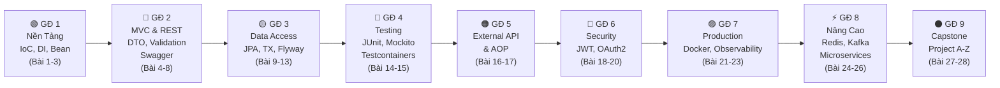

| Giai đoạn | Chủ đề | Số bài | Thời gian |
|:---:|:---|:---:|:---:|
| 1 | Nền Tảng & Khởi Động (IoC, DI, Bean) | 3 bài | 1 tuần |
| 2 | Spring MVC & REST API (DTO, Validation, Exception, Swagger) | 5 bài | 2 tuần |
| 3 | Data Access (JPA, Relationships, Query, Transaction, Flyway) | 5 bài | 2 tuần |
| 4 | Testing (JUnit, Mockito, MockMvc, Testcontainers) | 2 bài | 1 tuần |
| 5 | External API & AOP | 2 bài | 1 tuần |
| 6 | Security & Authentication (JWT + OAuth2) | 3 bài | 1.5 tuần |
| 7 | Production-Ready (Docker, Profiles, Observability) | 3 bài | 1.5 tuần |
| 8 | Kỹ Thuật Nâng Cao (Redis, Kafka, Microservices) | 3 bài | 2 tuần |
| 9 | Capstone Project (Làm project A-Z) | 2 bài | 2+ tuần |
| **Tổng** | | **28 bài** | **~14 tuần** |

---
---

# 🟢 GIAI ĐOẠN 1: NỀN TẢNG & KHỞI ĐỘNG

> **Mục tiêu giai đoạn:** Hiểu bản chất Spring Framework, cài đặt môi trường, nắm vững IoC/DI — hai nguyên lý xương sống của toàn bộ hệ sinh thái Spring.

---

## 📘 Bài 1: Cài Đặt Môi Trường, Tạo Dự Án & Khám Phá Cấu Trúc

### 🎯 Mục tiêu bài học
- [ ] Cài đặt đầy đủ công cụ phát triển (JDK, IDE, Maven/Gradle)
- [ ] Tạo project Spring Boot đầu tiên bằng Spring Initializr
- [ ] Hiểu cấu trúc thư mục chuẩn của một dự án Spring Boot
- [ ] Hiểu luồng khởi động (Bootstrap Flow) của ứng dụng Spring Boot
- [ ] Chạy thành công ứng dụng và truy cập API "Hello World" đầu tiên

### 📖 Nội dung lý thuyết

#### 1.1. Công cụ cần cài đặt

| Công cụ | Phiên bản khuyến nghị | Mục đích |
|:---|:---|:---|
| **JDK** | JDK 17 hoặc 21 (LTS) | Runtime & compiler cho Java |
| **IDE** | IntelliJ IDEA Community/Ultimate | Viết code, debug, hỗ trợ Spring tốt nhất |
| **Build Tool** | Maven 3.9+ (hoặc Gradle 8+) | Quản lý dependencies & build project |
| **Postman** hoặc **Insomnia** | Phiên bản mới nhất | Test REST API |
| **Git** | Phiên bản mới nhất | Quản lý source code |
| **Docker Desktop** | Phiên bản mới nhất | Chạy database, Redis, Kafka... (dùng từ GĐ 3) |
| **MySQL/PostgreSQL** | PostgreSQL 16+ hoặc MySQL 8+ | Database (dùng từ GĐ 3) |

> [!TIP]
> **Tại sao nên dùng JDK 17/21?** Đây là phiên bản LTS (Long-Term Support), được Spring Boot 3.x yêu cầu tối thiểu JDK 17. Các tính năng Java mới như Records, Sealed Classes, Pattern Matching sẽ rất hữu ích.

#### 1.2. Tạo dự án bằng Spring Initializr

Truy cập [start.spring.io](https://start.spring.io) và chọn:

| Mục | Giá trị |
|:---|:---|
| Project | Maven |
| Language | Java |
| Spring Boot | 3.3.x (stable mới nhất) |
| Group | `com.example` |
| Artifact | `demo` |
| Packaging | Jar |
| Java | 17 hoặc 21 |
| Dependencies | Spring Web |

#### 1.3. Cấu trúc thư mục chuẩn

```
demo/
├── src/
│   ├── main/
│   │   ├── java/
│   │   │   └── com/example/demo/
│   │   │       └── DemoApplication.java      ← Entry point
│   │   └── resources/
│   │       ├── application.properties         ← File cấu hình chính
│   │       ├── static/                        ← Tài nguyên tĩnh (CSS, JS, images)
│   │       └── templates/                     ← Template HTML (Thymeleaf)
│   └── test/
│       └── java/
│           └── com/example/demo/
│               └── DemoApplicationTests.java  ← Unit tests
├── pom.xml                                    ← Maven config & dependencies
└── mvnw / mvnw.cmd                            ← Maven Wrapper
```

#### 1.4. Luồng khởi động (Bootstrap Flow) của Spring Boot

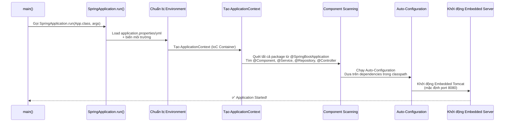

#### 1.5. Annotation `@SpringBootApplication` — "3 trong 1"

```java
// @SpringBootApplication thực chất là tổ hợp của 3 annotation:
@SpringBootConfiguration   // = @Configuration: Đánh dấu class này là nguồn cấu hình
@EnableAutoConfiguration   // Bật cơ chế tự động cấu hình
@ComponentScan             // Quét tất cả bean trong package hiện tại và sub-packages
public @interface SpringBootApplication { }
```

| Annotation con | Vai trò |
|:---|:---|
| `@SpringBootConfiguration` | Đánh dấu class là nguồn cấu hình (tương đương `@Configuration`) |
| `@EnableAutoConfiguration` | Kích hoạt cơ chế Auto-Configuration dựa trên classpath |
| `@ComponentScan` | Quét tất cả package hiện tại + sub-packages để tìm và đăng ký Bean |

### 💻 Thực hành

**Bước 1:** Tạo project từ Spring Initializr, import vào IntelliJ.

**Bước 2:** Tạo Controller đầu tiên:

```java
package com.example.demo.controller;

import org.springframework.web.bind.annotation.GetMapping;
import org.springframework.web.bind.annotation.RestController;
import java.util.HashMap;
import java.util.Map;

@RestController // = @Controller + @ResponseBody
public class HelloController {

    @GetMapping("/hello")
    public String sayHello() {
        return "Xin chào! Đây là API đầu tiên của tôi!";
    }

    @GetMapping("/info")
    public Map<String, Object> getInfo() {
        Map<String, Object> info = new HashMap<>();
        info.put("app", "Spring Boot Demo");
        info.put("version", "1.0");
        info.put("author", "Sinh viên IT năm 4");
        return info; // Tự động chuyển sang JSON nhờ Jackson
    }
}
```

**Bước 3:** Chạy ứng dụng và kiểm tra:
```bash
# Cách 1: Qua Maven
./mvnw spring-boot:run

# Cách 2: Chạy trực tiếp từ IntelliJ (nhấn nút Run ▶)

# Test API
curl http://localhost:8080/hello
curl http://localhost:8080/info
```

> [!NOTE]
> **Kiến thức Java cần biết — `Map` và `HashMap`:** `Map<K,V>` là interface đại diện cho cấu trúc key-value. `HashMap` là implementation phổ biến nhất. Khi return một `Map` từ Controller, Spring Boot sẽ tự động serialize nó thành JSON nhờ thư viện **Jackson** (đã được nhúng sẵn trong `spring-boot-starter-web`).

---

## 📘 Bài 2: IoC Container & Dependency Injection — Trái Tim Của Spring

### 🎯 Mục tiêu bài học
- [ ] Hiểu bản chất Inversion of Control (IoC) và tại sao nó quan trọng
- [ ] Hiểu Dependency Injection (DI) và 3 cách inject
- [ ] Phân biệt `@Component`, `@Service`, `@Repository`, `@Controller` (Stereotype Annotations)
- [ ] Hiểu khái niệm Spring Bean và ApplicationContext
- [ ] Thực hành tạo Service Layer và inject vào Controller

### 📖 Nội dung lý thuyết

#### 2.1. Vấn đề: Tại sao cần IoC/DI?

**Cách truyền thống (KHÔNG dùng DI) — Tight Coupling:**
```java
public class OrderController {
    // Controller tự tạo đối tượng Service → tight coupling
    private OrderService orderService = new OrderService();
    // ❌ Vấn đề:
    // 1. Nếu OrderService cần tham số khởi tạo → phải sửa Controller
    // 2. Không thể thay thế bằng MockOrderService để test
    // 3. Nếu đổi sang OrderServiceV2 → phải sửa mọi nơi tạo new
}
```

**Cách dùng DI — Loose Coupling:**
```java
@RestController
public class OrderController {
    private final OrderService orderService;

    // Spring tự động inject OrderService vào → loose coupling
    public OrderController(OrderService orderService) {
        this.orderService = orderService;
    }
    // ✅ Controller không cần biết OrderService được tạo như thế nào
    // ✅ Dễ dàng thay thế, mock khi test
}
```

#### 2.2. IoC (Inversion of Control) — Đảo ngược quyền kiểm soát

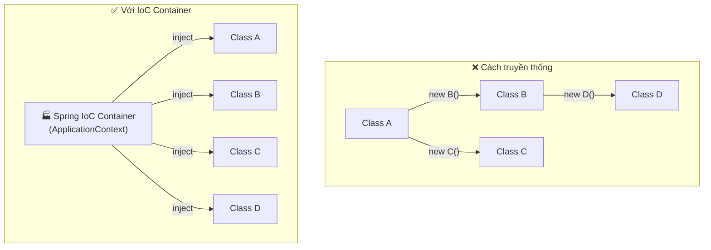

| | Cách truyền thống | Với IoC |
|:---|:---|:---|
| **Ai tạo đối tượng?** | Lập trình viên (`new`) | Spring Container |
| **Ai quản lý vòng đời?** | Lập trình viên | Spring Container |
| **Ai quyết định dependency?** | Class tự quyết định | Container quyết định và inject |
| **Tính linh hoạt** | Thấp (tight coupling) | Cao (loose coupling) |
| **Khả năng test** | Khó mock/stub | Dễ dàng mock/stub |

> **IoC = "Đừng gọi tôi, tôi sẽ gọi bạn" (Hollywood Principle).** Thay vì class A tự `new` class B, Spring Container sẽ tạo B rồi "tiêm" vào A.

#### 2.3. Dependency Injection (DI) — 3 Cách Inject

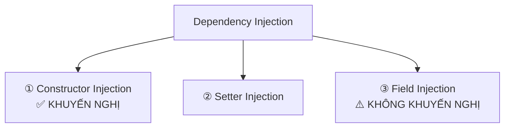

```java
// ===== ① CONSTRUCTOR INJECTION (Khuyến nghị nhất) =====
@RestController
public class UserController {
    private final UserService userService; // final → đảm bảo immutable

    // @Autowired có thể bỏ nếu class chỉ có 1 constructor (từ Spring 4.3+)
    public UserController(UserService userService) {
        this.userService = userService;
    }
}
// ✅ Ưu điểm: Immutable, rõ ràng, dễ test (truyền mock qua constructor)
// ✅ Nếu thiếu dependency → phát hiện ngay tại startup khi Spring tạo bean
//    (ApplicationContext sẽ fail-fast, không phải lỗi compile-time)

// ===== ② SETTER INJECTION =====
@RestController
public class UserController {
    private UserService userService;

    @Autowired
    public void setUserService(UserService userService) {
        this.userService = userService;
    }
}
// ⚠️ Dùng khi dependency là optional

// ===== ③ FIELD INJECTION (Tránh dùng) =====
@RestController
public class UserController {
    @Autowired
    private UserService userService; // inject trực tiếp vào field
}
// ❌ Nhược điểm: Không thể dùng final, khó test (phải dùng reflection),
//    vi phạm nguyên tắc OOP, dependency ẩn (không rõ trong constructor)
```

> [!IMPORTANT]
> **Quy tắc vàng:** Luôn ưu tiên **Constructor Injection**. Đây là best practice được Spring team khuyến nghị chính thức. Nếu thiếu dependency, ứng dụng sẽ **fail-fast tại startup** (khi ApplicationContext tạo bean), giúp bạn phát hiện lỗi sớm — lưu ý đây là lỗi **runtime tại startup**, không phải lỗi Java compile-time.

#### 2.4. Spring Bean & Stereotype Annotations

| Annotation | Ý nghĩa | Tầng (Layer) |
|:---|:---|:---|
| `@Component` | Đánh dấu class là một Spring Bean tổng quát | Bất kỳ |
| `@Controller` / `@RestController` | Bean xử lý HTTP request | Presentation Layer |
| `@Service` | Bean chứa business logic | Service/Business Layer |
| `@Repository` | Bean truy cập database | Data Access Layer |

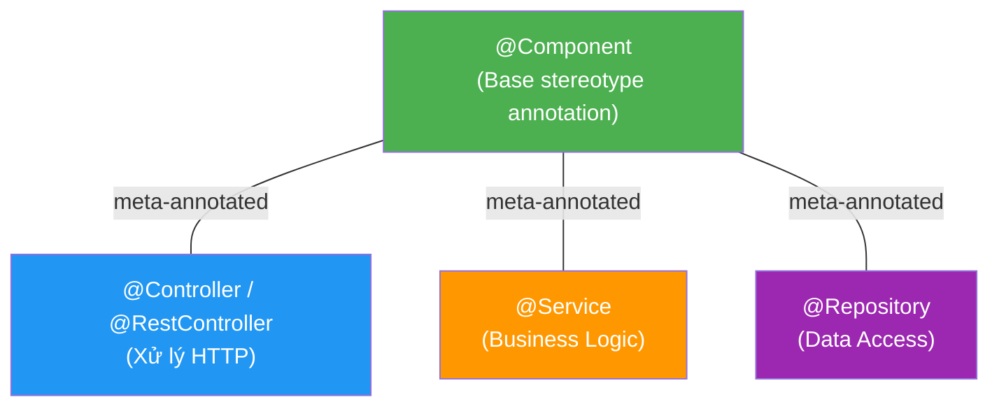

> [!NOTE]
> **`@Service`, `@Repository`, `@Controller` đều được meta-annotated với `@Component`.** Tức là bên trong source code của `@Service`, Spring đã gắn `@Component` lên nó — đây là **annotation composition**, KHÔNG phải class inheritance (Java annotation không có kế thừa). Khi Spring quét `@Component`, nó cũng tìm thấy các annotation được meta-annotated với `@Component`. Ngoài ra, mỗi stereotype annotation có thêm hành vi riêng: `@Repository` tự động translate các exception từ database thành `DataAccessException` của Spring, `@Controller` được nhận diện bởi Spring MVC.

#### 2.5. ApplicationContext — IoC Container của Spring

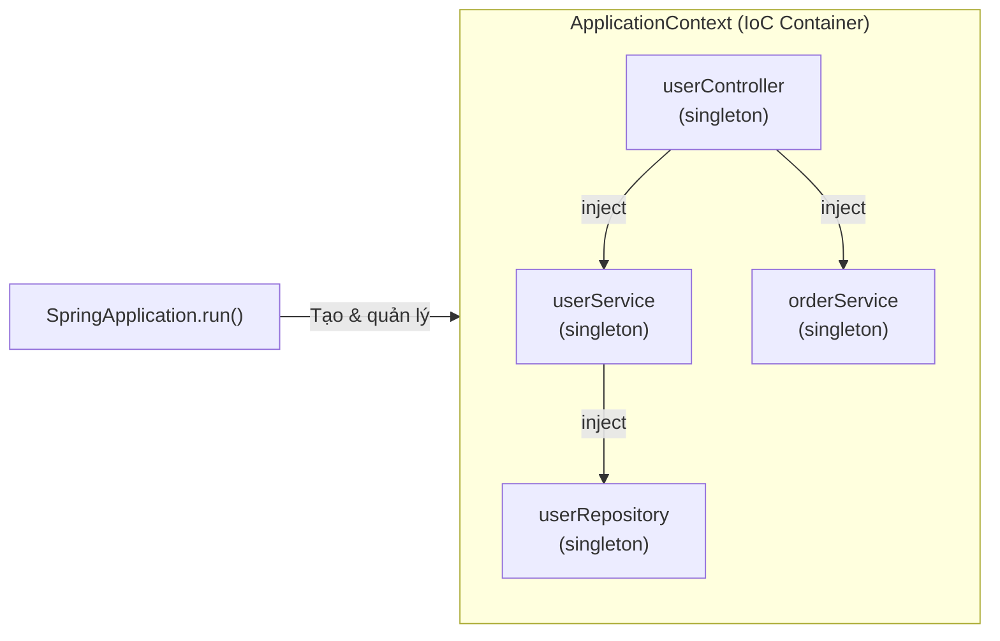

`ApplicationContext` là **trung tâm** quản lý toàn bộ bean trong ứng dụng Spring. Nó chịu trách nhiệm:
- **Tạo** bean (instantiation)
- **Cấu hình** bean (configuration)
- **Lắp ráp** dependencies giữa các bean (wiring)
- **Quản lý vòng đời** bean (lifecycle management)

### 💻 Thực hành

Xây dựng ứng dụng quản lý User với kiến trúc 3 tầng:

```java
// ===== 1. Model (POJO) =====
package com.example.demo.model;

public class User {
    private Long id;
    private String name;
    private String email;

    public User(Long id, String name, String email) {
        this.id = id;
        this.name = name;
        this.email = email;
    }
    // ... getters & setters
}

// ===== 2. Repository Layer =====
package com.example.demo.repository;

import com.example.demo.model.User;
import org.springframework.stereotype.Repository;
import java.util.*;

@Repository  // Đánh dấu đây là bean tầng Data Access
public class UserRepository {
    private final List<User> users = new ArrayList<>(List.of(
        new User(1L, "Nguyễn Văn A", "a@gmail.com"),
        new User(2L, "Trần Thị B", "b@gmail.com")
    ));

    public List<User> findAll() {
        return Collections.unmodifiableList(users);
    }

    public Optional<User> findById(Long id) {
        return users.stream()
                .filter(u -> u.getId().equals(id))
                .findFirst();
    }

    public User save(User user) {
        user.setId((long) (users.size() + 1));
        users.add(user);
        return user;
    }
}

// ===== 3. Service Layer =====
package com.example.demo.service;

import com.example.demo.model.User;
import com.example.demo.repository.UserRepository;
import org.springframework.stereotype.Service;
import java.util.List;

@Service  // Đánh dấu đây là bean tầng Business Logic
public class UserService {
    private final UserRepository userRepository;

    // Constructor Injection — Spring tự inject UserRepository
    public UserService(UserRepository userRepository) {
        this.userRepository = userRepository;
    }

    public List<User> getAllUsers() {
        return userRepository.findAll();
    }

    public User getUserById(Long id) {
        return userRepository.findById(id)
                .orElseThrow(() -> new RuntimeException("User not found: " + id));
    }

    public User createUser(User user) {
        if (user.getEmail() == null || user.getEmail().isBlank()) {
            throw new IllegalArgumentException("Email không được để trống");
        }
        return userRepository.save(user);
    }
}

// ===== 4. Controller Layer =====
package com.example.demo.controller;

import com.example.demo.model.User;
import com.example.demo.service.UserService;
import org.springframework.web.bind.annotation.*;
import java.util.List;

@RestController
@RequestMapping("/api/users")
public class UserController {
    private final UserService userService;

    public UserController(UserService userService) {
        this.userService = userService;
    }

    @GetMapping
    public List<User> getAllUsers() {
        return userService.getAllUsers();
    }

    @GetMapping("/{id}")
    public User getUserById(@PathVariable Long id) {
        return userService.getUserById(id);
    }

    @PostMapping
    public User createUser(@RequestBody User user) {
        return userService.createUser(user);
    }
}
```

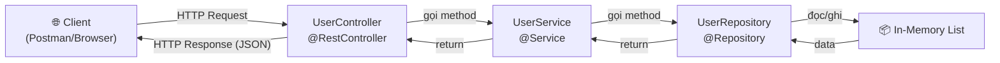

> [!NOTE]
> **Kiến thức Java cần biết — `Optional<T>`:** Là container có thể chứa hoặc không chứa giá trị (thay thế cho `null`). Dùng `Optional` giúp tránh `NullPointerException` và buộc lập trình viên xử lý trường hợp "không có dữ liệu" một cách tường minh. Các method hay dùng: `.isPresent()`, `.get()`, `.orElse()`, `.orElseThrow()`, `.map()`.

---

## 📘 Bài 3: Bean Lifecycle, Bean Scope & Cấu Hình Nâng Cao

### 🎯 Mục tiêu bài học
- [ ] Hiểu vòng đời (Lifecycle) của một Spring Bean từ tạo đến hủy
- [ ] Phân biệt các Bean Scope: Singleton, Prototype, Request, Session
- [ ] Biết cách dùng `@Configuration` + `@Bean` để đăng ký bean thủ công
- [ ] Hiểu `@Qualifier`, `@Primary` khi có nhiều bean cùng kiểu
- [ ] Hiểu `@Value` và file `application.properties` / `application.yml`

### 📖 Nội dung lý thuyết

#### 3.1. Vòng đời của một Spring Bean

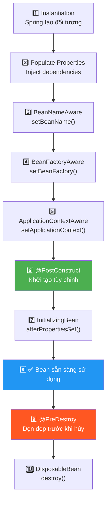

**Hai callback quan trọng nhất cần nhớ:**

```java
@Service
public class CacheService {

    @PostConstruct  // Chạy SAU khi bean được tạo và inject xong
    public void init() {
        System.out.println("🟢 CacheService initialized — loading cache...");
        // Load cache từ database, khởi tạo connection pool, v.v.
    }

    @PreDestroy  // Chạy TRƯỚC khi bean bị hủy (app shutdown)
    public void cleanup() {
        System.out.println("🔴 CacheService destroying — clearing cache...");
        // Đóng connection, giải phóng tài nguyên
    }
}
```

#### 3.2. Bean Scope

| Scope | Mô tả | Khi nào dùng |
|:---|:---|:---|
| **singleton** (mặc định) | Chỉ tạo **1 instance** duy nhất trong toàn bộ ApplicationContext | Hầu hết các service, repository, controller |
| **prototype** | Tạo **instance mới** mỗi lần được yêu cầu (getBean / inject) | Khi cần object stateful mới mỗi lần |
| **request** | 1 instance cho mỗi **HTTP request** (chỉ dùng trong web app) | Lưu data theo từng request |
| **session** | 1 instance cho mỗi **HTTP session** (chỉ dùng trong web app) | Giỏ hàng, thông tin user session |

```java
@Component
@Scope("prototype")  // Mỗi lần inject sẽ tạo instance mới
public class ShoppingCart {
    private List<String> items = new ArrayList<>();

    public void addItem(String item) {
        items.add(item);
    }
}
```

> [!WARNING]
> **Singleton là mặc định!** Điều này có nghĩa tất cả request chia sẻ cùng 1 instance. **KHÔNG BAO GIỜ** lưu trạng thái (state) có thể thay đổi trong bean singleton, vì sẽ gây ra lỗi đa luồng (thread-safety issue).

#### 3.3. `@Configuration` và `@Bean` — Đăng ký Bean thủ công

```java
@Configuration  // Đánh dấu class này là nguồn cấu hình (tương tự file XML ngày xưa)
public class AppConfig {

    @Bean  // Đăng ký bean bằng method — Spring gọi method này để tạo bean
    public RestTemplate restTemplate() {
        return new RestTemplate();  // Bean để gọi API bên ngoài
    }

    @Bean
    public ObjectMapper objectMapper() {
        ObjectMapper mapper = new ObjectMapper();
        mapper.setSerializationInclusion(JsonInclude.Include.NON_NULL);
        return mapper;
    }
}
```

> **Khi nào dùng `@Bean`?** Khi bạn muốn tạo bean từ class **không thuộc project** (ví dụ: `RestTemplate`, `ObjectMapper` từ thư viện bên ngoài) hoặc khi cần **cấu hình phức tạp** mà `@Component` không đủ.

#### 3.4. `@Qualifier` và `@Primary` — Xử lý nhiều bean cùng kiểu

```java
// Khi có NHIỀU implementation cho 1 interface:
public interface NotificationService {
    void send(String message);
}

@Service("emailNotification")  // Đặt tên bean
public class EmailNotificationService implements NotificationService {
    public void send(String message) { System.out.println("📧 Email: " + message); }
}

@Service("smsNotification")
@Primary  // Ưu tiên inject bean này khi không chỉ định cụ thể
public class SmsNotificationService implements NotificationService {
    public void send(String message) { System.out.println("📱 SMS: " + message); }
}

// Sử dụng:
@RestController
public class OrderController {
    private final NotificationService emailService;
    private final NotificationService smsService;

    public OrderController(
        @Qualifier("emailNotification") NotificationService emailService,  // Chỉ định cụ thể
        NotificationService smsService  // Sẽ inject @Primary (SMS)
    ) {
        this.emailService = emailService;
        this.smsService = smsService;
    }
}
```

#### 3.5. `@Value` và Externalized Configuration

```properties
# application.properties
app.name=My Spring Boot App
app.version=1.0.0
server.port=8080
app.max-users=100
```

```java
@Service
public class AppInfoService {

    @Value("${app.name}")        // Inject giá trị từ properties
    private String appName;

    @Value("${app.version}")
    private String appVersion;

    @Value("${app.max-users:50}")  // Giá trị mặc định nếu property không tồn tại
    private int maxUsers;
}
```

> [!TIP]
> **`application.properties` vs `application.yml`:** Cả hai đều là file cấu hình. YAML (`.yml`) hỗ trợ cấu trúc phân cấp nên dễ đọc hơn với config phức tạp. Properties (`.properties`) đơn giản hơn. Bạn có thể chọn 1 trong 2, Spring Boot hỗ trợ cả hai.

### 💻 Thực hành

Tạo một hệ thống log đơn giản với nhiều implementation:

```java
// 1. Interface
public interface Logger {
    void log(String message);
}

// 2. File Logger
@Component("fileLogger")
public class FileLogger implements Logger {
    @PostConstruct
    public void init() { System.out.println("FileLogger initialized"); }

    public void log(String message) { System.out.println("[FILE] " + message); }
}

// 3. Console Logger
@Component("consoleLogger")
@Primary
public class ConsoleLogger implements Logger {
    public void log(String message) { System.out.println("[CONSOLE] " + message); }
}

// 4. Sử dụng trong Controller
@RestController
@RequestMapping("/api/log")
public class LogController {
    private final Logger defaultLogger;
    private final Logger fileLogger;

    public LogController(
            Logger defaultLogger,  // inject @Primary → ConsoleLogger
            @Qualifier("fileLogger") Logger fileLogger
    ) {
        this.defaultLogger = defaultLogger;
        this.fileLogger = fileLogger;
    }

    @GetMapping("/test")
    public String testLog() {
        defaultLogger.log("Hello from default logger");
        fileLogger.log("Hello from file logger");
        return "Check console output!";
    }
}
```

---
---

# 🔵 GIAI ĐOẠN 2: SPRING MVC & REST API

> **Mục tiêu giai đoạn:** Thành thạo xây dựng RESTful API hoàn chỉnh — CRUD, validation, exception handling, API documentation (Swagger/OpenAPI), và hiểu sâu cơ chế hoạt động của Spring MVC.

---

## 📘 Bài 4: Spring MVC Architecture & Request Lifecycle

### 🎯 Mục tiêu bài học
- [ ] Hiểu kiến trúc Spring MVC và vai trò của DispatcherServlet
- [ ] Nắm rõ luồng xử lý một HTTP Request từ đầu đến cuối
- [ ] Phân biệt `@Controller` vs `@RestController`
- [ ] Hiểu và sử dụng thành thạo các HTTP Method Mapping

### 📖 Nội dung lý thuyết

#### 4.1. Kiến trúc Spring MVC

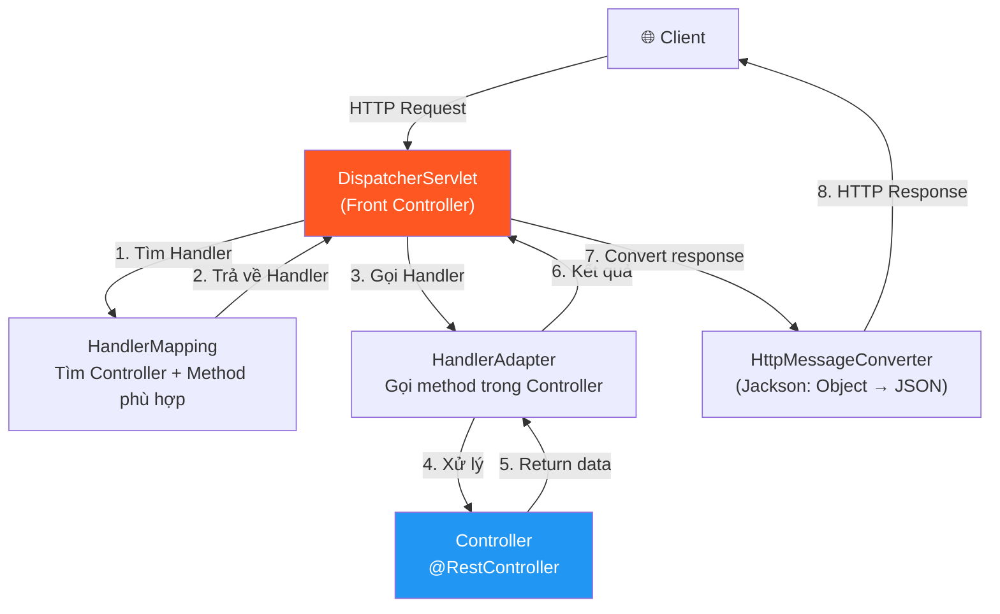

> **DispatcherServlet** là **trung tâm** (Front Controller) của Spring MVC. Mọi HTTP request đều đi qua nó đầu tiên. Nó giống như "lễ tân" trong khách sạn — tiếp nhận yêu cầu, tìm người xử lý phù hợp, rồi trả kết quả về.

#### 4.2. HTTP Methods & Mapping Annotations

| HTTP Method | Annotation | Mục đích | Idempotent? |
|:---|:---|:---|:---:|
| `GET` | `@GetMapping` | Lấy dữ liệu | ✅ Có |
| `POST` | `@PostMapping` | Tạo mới dữ liệu | ❌ Không |
| `PUT` | `@PutMapping` | Cập nhật toàn bộ | ✅ Có |
| `PATCH` | `@PatchMapping` | Cập nhật một phần | ❌ Không |
| `DELETE` | `@DeleteMapping` | Xóa dữ liệu | ✅ Có |

> [!NOTE]
> **Kiến thức cần biết — Idempotent (Bất biến):** Một operation gọi là idempotent khi gọi 1 lần hay nhiều lần đều cho cùng kết quả. `GET /users/1` trả về cùng user dù gọi 100 lần. `POST /users` tạo user MỚI mỗi lần gọi → không idempotent.

#### 4.3. Các annotation nhận dữ liệu từ Request

```java
@RestController
@RequestMapping("/api/products")
public class ProductController {

    // ① @PathVariable — Lấy giá trị từ URL path
    // GET /api/products/42
    @GetMapping("/{id}")
    public String getById(@PathVariable Long id) {
        return "Product ID: " + id;
    }

    // ② @RequestParam — Lấy giá trị từ query string
    // GET /api/products?category=electronics&page=1
    @GetMapping
    public String search(
            @RequestParam String category,
            @RequestParam(defaultValue = "0") int page,
            @RequestParam(required = false) String sort
    ) {
        return "Category: " + category + ", Page: " + page;
    }

    // ③ @RequestBody — Lấy dữ liệu từ body (JSON → Java Object)
    // POST /api/products   Body: {"name": "Laptop", "price": 999}
    @PostMapping
    public Product create(@RequestBody Product product) {
        return product;
    }

    // ④ @RequestHeader — Lấy giá trị từ HTTP header
    @GetMapping("/check")
    public String check(@RequestHeader("Authorization") String token) {
        return "Token: " + token;
    }
}
```

### 💻 Thực hành

Xây dựng CRUD API hoàn chỉnh cho Product (sử dụng in-memory List, chưa cần database).

---

## 📘 Bài 5: ResponseEntity, HTTP Status Codes & DTO Pattern

### 🎯 Mục tiêu bài học
- [ ] Sử dụng `ResponseEntity` để kiểm soát hoàn toàn HTTP Response
- [ ] Hiểu và áp dụng đúng HTTP Status Codes
- [ ] Áp dụng DTO (Data Transfer Object) Pattern để tách biệt tầng API và tầng Data
- [ ] Xây dựng API Response chuẩn hóa (Standardized API Response)

### 📖 Nội dung lý thuyết

#### 5.1. ResponseEntity — Kiểm soát hoàn toàn Response

```java
@GetMapping("/{id}")
public ResponseEntity<User> getUserById(@PathVariable Long id) {
    User user = userService.findById(id);
    if (user == null) {
        return ResponseEntity.notFound().build();             // 404
    }
    return ResponseEntity.ok(user);                           // 200 + body
}

@PostMapping
public ResponseEntity<User> createUser(@RequestBody User user) {
    User created = userService.save(user);
    URI location = URI.create("/api/users/" + created.getId());
    return ResponseEntity.created(location).body(created);    // 201 + Location header
}

@DeleteMapping("/{id}")
public ResponseEntity<Void> deleteUser(@PathVariable Long id) {
    userService.delete(id);
    return ResponseEntity.noContent().build();                // 204 No Content
}
```

#### 5.2. HTTP Status Codes cần nhớ

| Code | Tên | Khi nào dùng |
|:---:|:---|:---|
| 200 | OK | Request thành công, có data trả về |
| 201 | Created | Tạo mới resource thành công |
| 204 | No Content | Thành công nhưng không có body (delete) |
| 400 | Bad Request | Request sai format, validation fail |
| 401 | Unauthorized | Chưa xác thực (chưa login) |
| 403 | Forbidden | Đã xác thực nhưng không có quyền |
| 404 | Not Found | Resource không tồn tại |
| 409 | Conflict | Xung đột (email đã tồn tại, v.v.) |
| 500 | Internal Server Error | Lỗi server không xác định |

#### 5.3. DTO Pattern

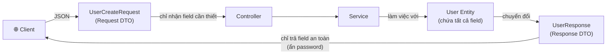

```java
// ===== Request DTO — Chỉ nhận dữ liệu cần thiết =====
public class UserCreateRequest {
    private String name;
    private String email;
    private String password;
    // Getters, Setters
}

// ===== Response DTO — Chỉ trả dữ liệu an toàn =====
public class UserResponse {
    private Long id;
    private String name;
    private String email;
    // ❌ KHÔNG có password
    private LocalDateTime createdAt;

    // Static factory method để chuyển Entity → DTO
    public static UserResponse fromEntity(User user) {
        UserResponse dto = new UserResponse();
        dto.setId(user.getId());
        dto.setName(user.getName());
        dto.setEmail(user.getEmail());
        dto.setCreatedAt(user.getCreatedAt());
        return dto;
    }
}

// ===== Hoặc dùng Java Record (JDK 16+) cho DTO =====
public record UserResponse(Long id, String name, String email, LocalDateTime createdAt) {
    public static UserResponse fromEntity(User user) {
        return new UserResponse(user.getId(), user.getName(),
                                user.getEmail(), user.getCreatedAt());
    }
}
```

> [!IMPORTANT]
> **Tại sao cần DTO?** (1) Bảo mật — không để lộ password, internal ID. (2) Linh hoạt — API response có thể khác hoàn toàn Entity. (3) Validation riêng cho từng API. (4) Tránh vòng lặp JSON khi Entity có relationship (bài JPA).

#### 5.4. Standardized API Response

```java
public class ApiResponse<T> {
    private int status;
    private String message;
    private T data;
    private LocalDateTime timestamp;

    // Constructors, Getters, Setters

    public static <T> ApiResponse<T> success(T data) {
        return new ApiResponse<>(200, "Success", data, LocalDateTime.now());
    }

    public static <T> ApiResponse<T> created(T data) {
        return new ApiResponse<>(201, "Created", data, LocalDateTime.now());
    }

    public static ApiResponse<?> error(int status, String message) {
        return new ApiResponse<>(status, message, null, LocalDateTime.now());
    }
}
```

### 💻 Thực hành

Refactor lại User API ở Bài 2 / Bài 4 với `ResponseEntity`, DTO Pattern (thử cả class thường và Java Record), và `ApiResponse` wrapper.

---

## 📘 Bài 6: Validation — Kiểm Tra Dữ Liệu Đầu Vào

### 🎯 Mục tiêu bài học
- [ ] Sử dụng Bean Validation (`jakarta.validation`) để validate request body
- [ ] Tạo Custom Validator cho logic nghiệp vụ riêng
- [ ] Xử lý và format lỗi validation trả về cho client

### 📖 Nội dung lý thuyết

#### 6.1. Các annotation validation phổ biến

```java
public class UserCreateRequest {
    @NotBlank(message = "Tên không được để trống")
    @Size(min = 2, max = 50, message = "Tên phải từ 2-50 ký tự")
    private String name;

    @NotBlank(message = "Email không được để trống")
    @Email(message = "Email không đúng định dạng")
    private String email;

    @NotBlank(message = "Mật khẩu không được để trống")
    @Size(min = 8, message = "Mật khẩu phải ít nhất 8 ký tự")
    @Pattern(regexp = "^(?=.*[a-z])(?=.*[A-Z])(?=.*\\d).*$",
             message = "Mật khẩu phải chứa chữ hoa, chữ thường và số")
    private String password;

    @Min(value = 18, message = "Tuổi phải >= 18")
    @Max(value = 100, message = "Tuổi phải <= 100")
    private int age;
}
```

| Annotation | Mô tả |
|:---|:---|
| `@NotNull` | Không được null |
| `@NotBlank` | Không được null, rỗng, hoặc chỉ chứa khoảng trắng (cho String) |
| `@NotEmpty` | Không được null hoặc rỗng (cho String, Collection, Map, Array) |
| `@Size(min, max)` | Giới hạn kích thước |
| `@Min` / `@Max` | Giá trị số tối thiểu / tối đa |
| `@Email` | Phải đúng format email |
| `@Pattern(regexp)` | Phải khớp regex |
| `@Positive` / `@Negative` | Phải dương / âm |
| `@Past` / `@Future` | Ngày trong quá khứ / tương lai |

**Kích hoạt validation trong Controller:**
```java
@PostMapping
public ResponseEntity<UserResponse> createUser(@Valid @RequestBody UserCreateRequest request) {
    // Nếu validation fail → Spring tự động throw MethodArgumentNotValidException
    // trước khi vào method body
    return ResponseEntity.status(201).body(userService.createUser(request));
}
```

#### 6.2. Custom Validator

```java
// 1. Tạo annotation
@Target({ElementType.FIELD})
@Retention(RetentionPolicy.RUNTIME)
@Constraint(validatedBy = UniqueEmailValidator.class)
public @interface UniqueEmail {
    String message() default "Email đã tồn tại";
    Class<?>[] groups() default {};
    Class<? extends Payload>[] payload() default {};
}

// 2. Tạo validator
public class UniqueEmailValidator implements ConstraintValidator<UniqueEmail, String> {
    @Autowired
    private UserRepository userRepository;

    @Override
    public boolean isValid(String email, ConstraintValidatorContext context) {
        return !userRepository.existsByEmail(email);
    }
}

// 3. Sử dụng
public class UserCreateRequest {
    @Email
    @UniqueEmail  // Custom validation
    private String email;
}
```

### 💻 Thực hành
- Thêm dependency `spring-boot-starter-validation`
- Apply validation cho tất cả DTO đã tạo
- Tạo 1 custom validator

---

## 📘 Bài 7: Global Exception Handling & Logging

### 🎯 Mục tiêu bài học
- [ ] Xây dựng cơ chế xử lý lỗi tập trung với `@ControllerAdvice`
- [ ] Tạo Custom Exception cho từng loại lỗi nghiệp vụ
- [ ] Cấu hình Logging với SLF4J + Logback
- [ ] Trả về error response chuẩn hóa và nhất quán

### 📖 Nội dung lý thuyết

#### 7.1. `@ControllerAdvice` + `@ExceptionHandler`

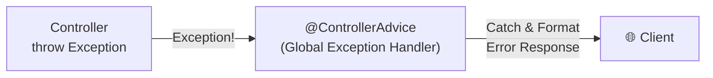

```java
// ===== Custom Exceptions =====
public class ResourceNotFoundException extends RuntimeException {
    public ResourceNotFoundException(String resource, Long id) {
        super(resource + " không tìm thấy với ID: " + id);
    }
}

public class DuplicateResourceException extends RuntimeException {
    public DuplicateResourceException(String message) {
        super(message);
    }
}

// ===== Global Exception Handler =====
@RestControllerAdvice  // = @ControllerAdvice + @ResponseBody
public class GlobalExceptionHandler {

    private static final Logger log = LoggerFactory.getLogger(GlobalExceptionHandler.class);

    @ExceptionHandler(ResourceNotFoundException.class)
    public ResponseEntity<ApiError> handleNotFound(ResourceNotFoundException ex) {
        log.warn("Resource not found: {}", ex.getMessage());
        ApiError error = new ApiError(404, ex.getMessage());
        return ResponseEntity.status(404).body(error);
    }

    @ExceptionHandler(MethodArgumentNotValidException.class)
    public ResponseEntity<ApiError> handleValidation(MethodArgumentNotValidException ex) {
        Map<String, String> errors = new HashMap<>();
        ex.getBindingResult().getFieldErrors().forEach(e ->
            errors.put(e.getField(), e.getDefaultMessage())
        );
        log.warn("Validation failed: {}", errors);
        ApiError error = new ApiError(400, "Dữ liệu không hợp lệ", errors);
        return ResponseEntity.badRequest().body(error);
    }

    @ExceptionHandler(Exception.class)  // Catch-all — luôn đặt cuối cùng
    public ResponseEntity<ApiError> handleGeneral(Exception ex) {
        log.error("Unexpected error", ex);  // Log full stack trace
        ApiError error = new ApiError(500, "Đã xảy ra lỗi, vui lòng thử lại sau");
        return ResponseEntity.status(500).body(error);
    }
}
```

#### 7.2. Logging với SLF4J

```java
@Service
public class UserService {
    // Tạo logger — quy ước: 1 logger cho mỗi class
    private static final Logger log = LoggerFactory.getLogger(UserService.class);

    public User createUser(UserCreateRequest request) {
        log.info("Creating user with email: {}", request.getEmail());  // {} = placeholder
        log.debug("Full request data: {}", request);  // debug — chỉ hiện khi dev
        try {
            User user = // ... save logic
            log.info("User created successfully with ID: {}", user.getId());
            return user;
        } catch (Exception e) {
            log.error("Failed to create user: {}", request.getEmail(), e);  // log exception
            throw e;
        }
    }
}
```

| Log Level | Mục đích | Dùng khi |
|:---|:---|:---|
| `TRACE` | Chi tiết nhất | Debug sâu, hiếm khi bật |
| `DEBUG` | Thông tin debug | Development |
| `INFO` | Thông tin chung | Production — sự kiện quan trọng |
| `WARN` | Cảnh báo | Lỗi có thể xử lý, cần chú ý |
| `ERROR` | Lỗi nghiêm trọng | Exception, lỗi cần fix ngay |

### 💻 Thực hành

Refactor toàn bộ User API: thêm Custom Exception, Global Exception Handler, và Logging đầy đủ.

---

## 📘 Bài 8: API Documentation với Swagger/OpenAPI

### 🎯 Mục tiêu bài học
- [ ] Hiểu tại sao cần API Documentation và lợi ích của Swagger/OpenAPI
- [ ] Tích hợp `springdoc-openapi` vào project Spring Boot
- [ ] Sử dụng các annotation: `@Tag`, `@Operation`, `@ApiResponse`, `@Schema`
- [ ] Tùy chỉnh Swagger UI và OpenAPI specification
- [ ] Xuất OpenAPI spec dưới dạng JSON/YAML để chia sẻ cho frontend/mobile team

### 📖 Nội dung lý thuyết

#### 8.1. Tại sao cần API Documentation?

| Không có Swagger | Có Swagger |
|:---|:---|
| Frontend phải hỏi backend từng API | Frontend tự tra cứu trên Swagger UI |
| Tài liệu API viết tay, dễ lỗi thời | Tài liệu tự sinh từ code, luôn đồng bộ |
| Test API phải dùng Postman thủ công | Test trực tiếp trên Swagger UI |
| Không có contract rõ ràng | OpenAPI spec là contract chính thức |

#### 8.2. Tích hợp springdoc-openapi

```xml
<!-- pom.xml -->
<dependency>
    <groupId>org.springdoc</groupId>
    <artifactId>springdoc-openapi-starter-webmvc-ui</artifactId>
    <version>2.6.0</version>
</dependency>
```

Sau khi thêm dependency, truy cập:
- **Swagger UI:** `http://localhost:8080/swagger-ui.html`
- **OpenAPI JSON:** `http://localhost:8080/v3/api-docs`
- **OpenAPI YAML:** `http://localhost:8080/v3/api-docs.yaml`

#### 8.3. Các annotation chính

```java
@Tag(name = "User Management", description = "API quản lý người dùng")
@RestController
@RequestMapping("/api/users")
public class UserController {

    @Operation(
        summary = "Lấy danh sách user",
        description = "Hỗ trợ phân trang và tìm kiếm theo tên"
    )
    @ApiResponses({
        @ApiResponse(responseCode = "200", description = "Thành công"),
        @ApiResponse(responseCode = "401", description = "Chưa xác thực",
                     content = @Content)  // Không có body
    })
    @GetMapping
    public List<UserResponse> getAllUsers() { ... }

    @Operation(summary = "Tạo user mới")
    @ApiResponse(responseCode = "201", description = "Tạo thành công")
    @ApiResponse(responseCode = "400", description = "Dữ liệu không hợp lệ")
    @ApiResponse(responseCode = "409", description = "Email đã tồn tại")
    @PostMapping
    public ResponseEntity<UserResponse> createUser(
            @RequestBody @Valid UserCreateRequest request) { ... }
}
```

#### 8.4. `@Schema` — Mô tả DTO

```java
@Schema(description = "Thông tin tạo user mới")
public class UserCreateRequest {

    @Schema(description = "Họ tên đầy đủ", example = "Nguyễn Văn A",
            minLength = 2, maxLength = 50)
    @NotBlank
    private String name;

    @Schema(description = "Địa chỉ email", example = "nguyenvana@gmail.com")
    @Email @NotBlank
    private String email;

    @Schema(description = "Mật khẩu (tối thiểu 8 ký tự)", example = "Pass123!",
            minLength = 8)
    @NotBlank @Size(min = 8)
    private String password;
}
```

#### 8.5. Cấu hình tùy chỉnh

```java
@Configuration
public class OpenApiConfig {

    @Bean
    public OpenAPI customOpenAPI() {
        return new OpenAPI()
            .info(new Info()
                .title("User Management API")
                .version("1.0.0")
                .description("RESTful API quản lý người dùng — Spring Boot Demo")
                .contact(new Contact()
                    .name("Dev Team")
                    .email("dev@example.com")))
            .addSecurityItem(new SecurityRequirement().addList("Bearer JWT"))
            .components(new Components()
                .addSecuritySchemes("Bearer JWT",
                    new SecurityScheme()
                        .type(SecurityScheme.Type.HTTP)
                        .scheme("bearer")
                        .bearerFormat("JWT")
                        .description("Nhập JWT token (không cần prefix Bearer)")));
    }
}
```

```properties
# application.properties
springdoc.api-docs.path=/v3/api-docs
springdoc.swagger-ui.path=/swagger-ui.html
springdoc.swagger-ui.operations-sorter=method
springdoc.swagger-ui.tags-sorter=alpha
springdoc.default-produces-media-type=application/json
```

> [!TIP]
> **Swagger UI không chỉ là tài liệu — nó còn là công cụ test!** Frontend developer có thể test API trực tiếp trên giao diện Swagger mà không cần Postman. Khi bạn thêm Security scheme (JWT), Swagger UI sẽ có nút "Authorize" để nhập token.

### 💻 Thực hành

- Thêm `springdoc-openapi-starter-webmvc-ui` dependency
- Annotate tất cả Controller đã tạo với `@Tag`, `@Operation`, `@ApiResponse`
- Annotate tất cả DTO với `@Schema` (có example)
- Tạo `OpenApiConfig` tùy chỉnh thông tin project
- Truy cập Swagger UI, test thử các API trực tiếp trên giao diện

---
---

# 🟡 GIAI ĐOẠN 3: DATA ACCESS LAYER — JPA, TRANSACTION & MIGRATION

> **Mục tiêu giai đoạn:** Kết nối và thao tác database thật sự bằng Spring Data JPA & Hibernate. Hiểu ORM, Entity mapping, Relationships, Transaction management, và Database Migration.

---

## 📘 Bài 9: Spring Data JPA & Hibernate — ORM Fundamentals

### 🎯 Mục tiêu bài học
- [ ] Hiểu ORM (Object-Relational Mapping) là gì và tại sao dùng nó
- [ ] Phân biệt JPA (specification) vs Hibernate (implementation) vs Spring Data JPA (abstraction)
- [ ] Tạo Entity, kết nối database, và thực hiện CRUD với `JpaRepository`
- [ ] Hiểu các annotation: `@Entity`, `@Table`, `@Id`, `@GeneratedValue`, `@Column`

### 📖 Nội dung lý thuyết

#### 9.1. JPA vs Hibernate vs Spring Data JPA

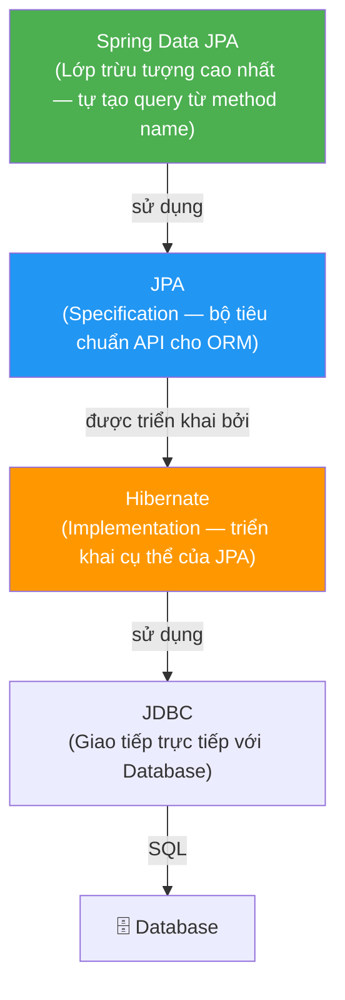

| | JPA | Hibernate | Spring Data JPA |
|:---|:---|:---|:---|
| **Là gì?** | Specification (interface) | Implementation (thư viện) | Abstraction layer |
| **Vai trò** | Định nghĩa API chuẩn | Triển khai API | Đơn giản hóa việc dùng JPA |
| **Ví dụ** | `EntityManager` interface | `SessionImpl` class | `JpaRepository<T, ID>` interface |

#### 9.2. Entity Mapping

```java
@Entity  // Đánh dấu class này tương ứng với 1 bảng trong database
@Table(name = "users")  // Chỉ định tên bảng (mặc định = tên class)
public class User {

    @Id  // Khóa chính
    @GeneratedValue(strategy = GenerationType.IDENTITY)  // Auto increment
    private Long id;

    @Column(nullable = false, length = 100)  // NOT NULL, VARCHAR(100)
    private String name;

    @Column(unique = true, nullable = false)  // UNIQUE, NOT NULL
    private String email;

    @Column(name = "phone_number")  // Mapping tên cột khác tên field
    private String phoneNumber;

    @Enumerated(EnumType.STRING)  // Lưu enum dưới dạng String
    private UserStatus status;

    @CreationTimestamp  // Tự động gán thời gian khi tạo
    private LocalDateTime createdAt;

    @UpdateTimestamp  // Tự động cập nhật thời gian khi update
    private LocalDateTime updatedAt;
}
```

#### 9.3. JpaRepository — CRUD tự động

```java
public interface UserRepository extends JpaRepository<User, Long> {
    // Spring Data JPA tự động tạo implementation cho bạn!
    // Bạn KHÔNG cần viết code cho: save, findById, findAll, delete, count...
}
```

**Các method có sẵn từ `JpaRepository`:**

| Method | Mô tả |
|:---|:---|
| `save(entity)` | Tạo mới hoặc cập nhật |
| `findById(id)` | Tìm theo ID, trả về `Optional<T>` |
| `findAll()` | Lấy tất cả |
| `deleteById(id)` | Xóa theo ID |
| `count()` | Đếm tổng số record |
| `existsById(id)` | Kiểm tra tồn tại |

### 💻 Thực hành

Chuyển User API từ in-memory List sang MySQL/PostgreSQL thật.
- Thêm dependencies: `spring-boot-starter-data-jpa`, driver (`postgresql` hoặc `mysql-connector-j`)
- Cấu hình `application.properties` kết nối database
- Tạo Entity, Repository
- Refactor Service và Controller để dùng JPA

---

## 📘 Bài 10: Entity Relationships & Query Methods

### 🎯 Mục tiêu bài học
- [ ] Hiểu và triển khai các loại relationship: `@OneToOne`, `@OneToMany`, `@ManyToOne`, `@ManyToMany`
- [ ] Hiểu `FetchType.LAZY` vs `FetchType.EAGER` và bẫy N+1 query
- [ ] Sử dụng Query Methods (Derived Queries) — Spring tự tạo SQL từ tên method
- [ ] Viết custom query với `@Query` (JPQL & Native SQL)

### 📖 Nội dung lý thuyết

#### 10.1. Entity Relationships

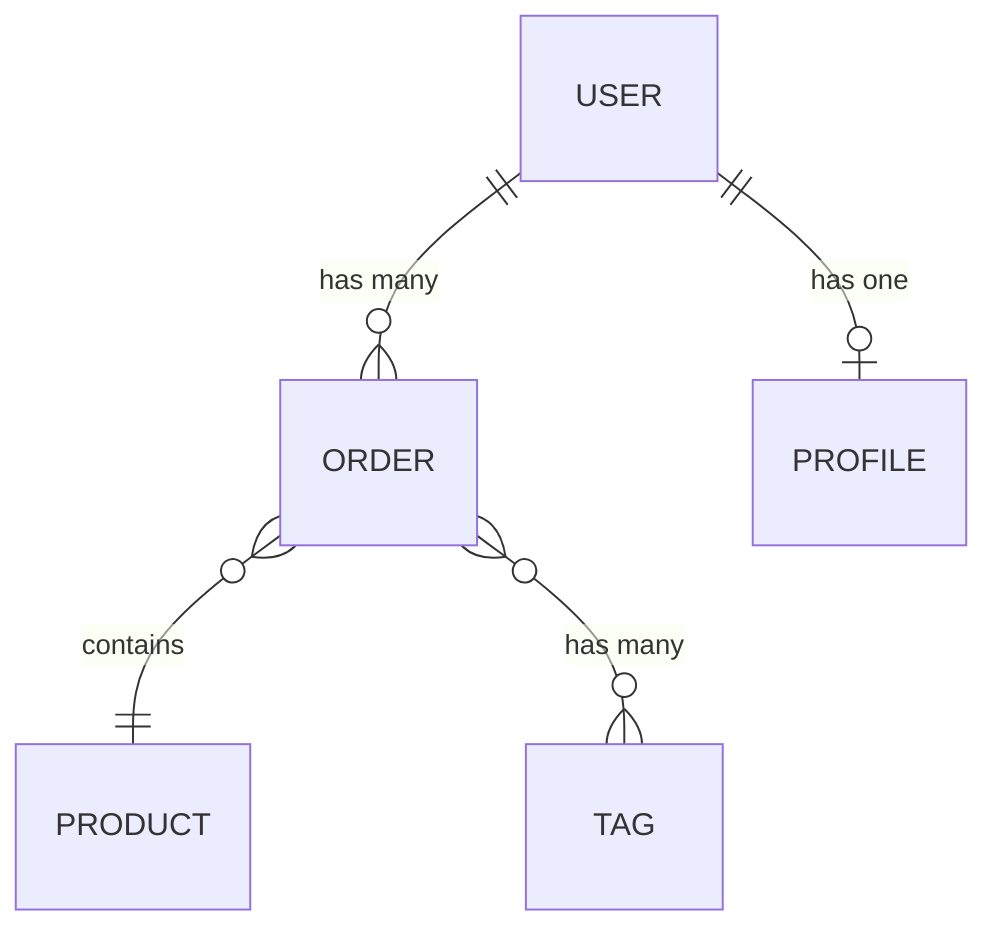

```java
// ONE-TO-MANY: 1 User có nhiều Orders
@Entity
public class User {
    @Id @GeneratedValue(strategy = GenerationType.IDENTITY)
    private Long id;

    @OneToMany(mappedBy = "user", cascade = CascadeType.ALL, fetch = FetchType.LAZY)
    private List<Order> orders = new ArrayList<>();
}

@Entity
@Table(name = "orders")
public class Order {
    @Id @GeneratedValue(strategy = GenerationType.IDENTITY)
    private Long id;

    @ManyToOne(fetch = FetchType.LAZY)  // Nhiều Order thuộc 1 User
    @JoinColumn(name = "user_id")       // Cột FK trong bảng orders
    private User user;
}
```

#### 10.2. FetchType: LAZY vs EAGER

| | LAZY | EAGER |
|:---|:---|:---|
| **Hành vi** | Chỉ load khi gọi getter | Load ngay cùng entity cha |
| **Ưu điểm** | Tiết kiệm bộ nhớ, nhanh | Đơn giản, không cần quản lý session |
| **Nhược điểm** | Có thể gặp `LazyInitializationException` | Có thể load quá nhiều dữ liệu |
| **Mặc định** | `@OneToMany`, `@ManyToMany` | `@ManyToOne`, `@OneToOne` |
| **Khuyến nghị** | ✅ Dùng cho collections | ⚠️ Cân nhắc kỹ |

> [!WARNING]
> **Bẫy N+1 Query:** Nếu bạn load 100 users và mỗi user access `.getOrders()`, Hibernate sẽ phát 1 query lấy users + 100 query lấy orders = **101 queries!** Giải pháp: dùng `JOIN FETCH` trong JPQL hoặc `@EntityGraph`.

#### 10.3. Query Methods (Derived Queries)

```java
public interface UserRepository extends JpaRepository<User, Long> {
    // Spring tự sinh SQL từ tên method!
    Optional<User> findByEmail(String email);
    List<User> findByNameContainingIgnoreCase(String keyword);
    List<User> findByStatusAndCreatedAtAfter(UserStatus status, LocalDateTime date);
    boolean existsByEmail(String email);
    long countByStatus(UserStatus status);

    // Custom JPQL query
    @Query("SELECT u FROM User u WHERE u.email LIKE %:domain")
    List<User> findByEmailDomain(@Param("domain") String domain);

    // Native SQL query
    @Query(value = "SELECT * FROM users WHERE created_at > :date", nativeQuery = true)
    List<User> findRecentUsers(@Param("date") LocalDateTime date);

    // JOIN FETCH để giải quyết N+1
    @Query("SELECT u FROM User u JOIN FETCH u.orders WHERE u.id = :id")
    Optional<User> findByIdWithOrders(@Param("id") Long id);
}
```

### 💻 Thực hành

Mở rộng project: thêm Entity Order, Product, thiết lập relationships, viết các query method, demo bẫy N+1 và cách fix.

---

## 📘 Bài 11: Pagination, Sorting & Specifications

### 🎯 Mục tiêu bài học
- [ ] Phân trang dữ liệu với `Pageable` và `Page<T>`
- [ ] Sắp xếp dữ liệu với `Sort`
- [ ] Sử dụng Specification pattern cho dynamic query (tìm kiếm nâng cao)
- [ ] Áp dụng Auditing: tự động ghi `createdBy`, `createdDate`, `lastModifiedBy`, `lastModifiedDate`

### 📖 Nội dung lý thuyết

#### 11.1. Phân trang & Sắp xếp với Pageable

```java
// Controller
@GetMapping
public Page<UserResponse> getUsers(
    @RequestParam(defaultValue = "0") int page,
    @RequestParam(defaultValue = "10") int size,
    @RequestParam(defaultValue = "createdAt") String sortBy,
    @RequestParam(defaultValue = "desc") String direction
) {
    Sort sort = Sort.by(Sort.Direction.fromString(direction), sortBy);
    Pageable pageable = PageRequest.of(page, size, sort);
    return userService.findAll(pageable);
}

// Repository
public interface UserRepository extends JpaRepository<User, Long>,
                                        JpaSpecificationExecutor<User> {
    // JpaSpecificationExecutor cho phép dùng Specification
}

```

#### 11.2. Dynamic Query với Specification

```java
// Specification — Dynamic Query Builder
public class UserSpecification {
    public static Specification<User> hasName(String name) {
        return (root, query, cb) ->
            name == null ? null : cb.like(cb.lower(root.get("name")),
                                          "%" + name.toLowerCase() + "%");
    }

    public static Specification<User> hasStatus(UserStatus status) {
        return (root, query, cb) ->
            status == null ? null : cb.equal(root.get("status"), status);
    }
}

// Sử dụng: kết hợp nhiều điều kiện
Specification<User> spec = Specification
    .where(UserSpecification.hasName("Nguyen"))
    .and(UserSpecification.hasStatus(UserStatus.ACTIVE));
Page<User> result = userRepository.findAll(spec, pageable);
```

### 💻 Thực hành

Thêm API tìm kiếm nâng cao với phân trang, sắp xếp, và lọc động cho User.

---

## 📘 Bài 12: Transaction Management

### 🎯 Mục tiêu bài học
- [ ] Hiểu ACID properties và tại sao Transaction quan trọng
- [ ] Sử dụng `@Transactional` đúng cách
- [ ] Hiểu Propagation levels và Isolation levels
- [ ] Hiểu giới hạn của `@Transactional` với hệ thống bên ngoài (distributed transaction)
- [ ] Tránh các lỗi thường gặp với `@Transactional`

### 📖 Nội dung lý thuyết

#### 12.1. ACID Properties

| Tính chất | Ý nghĩa | Ví dụ |
|:---|:---|:---|
| **Atomicity** | Tất cả hoặc không gì cả | Chuyển tiền: trừ A + cộng B phải cùng thành công hoặc cùng thất bại |
| **Consistency** | Dữ liệu luôn ở trạng thái hợp lệ | Tổng tiền trong hệ thống không đổi sau chuyển khoản |
| **Isolation** | Transaction độc lập với nhau | 2 người cùng mua sản phẩm cuối cùng không bị conflict |
| **Durability** | Dữ liệu đã commit không bao giờ mất | Sau khi xác nhận thanh toán, dù server crash thì data vẫn còn |

#### 12.2. `@Transactional` cơ bản

```java
@Service
public class OrderService {

    @Transactional  // Nếu BẤT KỲ thao tác nào fail → rollback TẤT CẢ
    public Order createOrder(OrderRequest request) {
        // 1. Lưu order
        Order order = new Order();
        orderRepository.save(order);

        // 2. Lưu từng item
        for (var item : request.getItems()) {
            orderItemRepository.save(item);
        }

        // 3. Giảm tồn kho
        for (var item : request.getItems()) {
            productService.reduceStock(item.getProductId(), item.getQuantity());
        }

        // Nếu bất kỳ bước nào throw RuntimeException
        // → rollback TẤT CẢ các thay đổi database ở trên
        return order;
    }
}
```

#### 12.3. Propagation Levels

| Propagation | Hành vi |
|:---|:---|
| `REQUIRED` (mặc định) | Dùng transaction hiện tại, nếu chưa có thì tạo mới |
| `REQUIRES_NEW` | Luôn tạo transaction mới, tạm dừng transaction cũ |
| `NESTED` | Tạo savepoint trong transaction hiện tại |
| `SUPPORTS` | Dùng transaction nếu có, không có thì chạy không transaction |
| `NOT_SUPPORTED` | Tạm dừng transaction hiện tại, chạy không transaction |

#### 12.4. Các lỗi phổ biến & Giới hạn

> [!WARNING]
> **Lỗi #1 — Self-invocation:** Gọi `@Transactional` method từ **cùng class** sẽ **KHÔNG hoạt động** vì self-invocation bypass proxy (cơ chế proxy giống AOP, sẽ học kỹ ở Bài 17). Giải pháp: tách method sang class khác.
>
> **Lỗi #2 — Checked exception:** `@Transactional` chỉ rollback cho **unchecked exceptions** (`RuntimeException`) theo mặc định. Dùng `@Transactional(rollbackFor = Exception.class)` nếu muốn rollback cả checked exception.
>
> **Lỗi #3 — readOnly chưa đúng:** Dùng `@Transactional(readOnly = true)` cho các method chỉ đọc để Hibernate tối ưu performance (skip dirty checking).

> [!CAUTION]
> **Giới hạn quan trọng — Distributed Transaction:** `@Transactional` chỉ rollback được **database** của bạn. Nếu trong transaction bạn gọi API bên ngoài (ví dụ: payment gateway, gửi SMS), thì khi rollback database, **hệ thống bên ngoài KHÔNG tự rollback** — tiền đã trừ rồi, SMS đã gửi rồi.
>
> ```java
> @Transactional
> public Order createOrder(OrderRequest request) {
>     orderRepository.save(order);           // ← rollback được
>     paymentService.chargeExternal(request); // ← gọi API payment bên ngoài
>     // Nếu dòng sau throw exception → DB rollback
>     // nhưng payment bên ngoài ĐÃ charge rồi, KHÔNG tự rollback!
>     inventoryRepository.reduce(item);       // ← throw exception ở đây
> }
> ```
>
> **Giải pháp nâng cao (sẽ tìm hiểu thêm ở Giai đoạn 8):**
> - **Idempotency key:** Đảm bảo gọi lại API không tạo ra side effect mới
> - **Transactional Outbox pattern:** Ghi event vào bảng outbox trong cùng transaction, worker riêng đọc và gửi
> - **Saga pattern:** Chuỗi các local transaction, mỗi bước có compensating action để undo

### 💻 Thực hành

Xây dựng chức năng đặt hàng (Order) với transaction đảm bảo tính toàn vẹn dữ liệu. Demo các trường hợp: rollback thành công, self-invocation bug, readOnly optimization.

---

## 📘 Bài 13: Database Migration với Flyway

### 🎯 Mục tiêu bài học
- [ ] Hiểu tại sao KHÔNG nên dùng `ddl-auto=update` trong production
- [ ] Thiết lập Flyway cho database migration
- [ ] Viết migration scripts theo quy ước đặt tên
- [ ] Quản lý schema evolution qua version control

### 📖 Nội dung lý thuyết

#### 13.1. Tại sao cần Database Migration?

```mermaid
graph TD
    subgraph bad["❌ Dùng ddl-auto=update"]
        H1["Hibernate tự sửa schema"] --> P1["Không biết đã thay đổi gì"]
        P1 --> P2["Không rollback được"]
        P2 --> P3["Khác biệt giữa dev & prod"]
        P3 --> P4["Mất dữ liệu khi rename/drop column"]
    end

    subgraph good["✅ Dùng Flyway Migration"]
        F1["Migration scripts<br/>trong version control"] --> F2["Biết chính xác schema thay đổi gì"]
        F2 --> F3["Review được trước khi apply"]
        F3 --> F4["Tất cả môi trường đồng nhất"]
        F4 --> F5["Có lịch sử thay đổi schema"]
    end
```

> [!WARNING]
> **`spring.jpa.hibernate.ddl-auto=update` chỉ dùng cho development!** Trong production, Hibernate có thể drop column, gây mất dữ liệu, hoặc tạo schema không tối ưu. **Flyway** (hoặc Liquibase) là chuẩn công nghiệp để quản lý schema.

#### 13.2. Quy ước đặt tên Flyway

```
src/main/resources/db/migration/
├── V1__create_users_table.sql
├── V2__create_orders_table.sql
├── V3__add_phone_to_users.sql
├── V4__create_products_table.sql
└── V5__add_index_users_email.sql
```

**Quy ước:** `V{version}__{description}.sql`
- `V` = prefix (bắt buộc)
- `{version}` = số version tăng dần (1, 2, 3...)
- `__` = hai dấu gạch dưới (separator)
- `{description}` = mô tả ngắn gọn bằng snake_case

#### 13.3. Ví dụ Migration Scripts

```sql
-- V1__create_users_table.sql
CREATE TABLE users (
    id          BIGSERIAL PRIMARY KEY,
    name        VARCHAR(100) NOT NULL,
    email       VARCHAR(255) NOT NULL UNIQUE,
    password    VARCHAR(255) NOT NULL,
    status      VARCHAR(20) DEFAULT 'ACTIVE',
    created_at  TIMESTAMP DEFAULT CURRENT_TIMESTAMP,
    updated_at  TIMESTAMP DEFAULT CURRENT_TIMESTAMP
);

CREATE INDEX idx_users_email ON users(email);
CREATE INDEX idx_users_status ON users(status);
```

```sql
-- V2__create_orders_table.sql
CREATE TABLE orders (
    id          BIGSERIAL PRIMARY KEY,
    user_id     BIGINT NOT NULL REFERENCES users(id),
    total_amount DECIMAL(12, 2) NOT NULL,
    status      VARCHAR(20) DEFAULT 'PENDING',
    created_at  TIMESTAMP DEFAULT CURRENT_TIMESTAMP
);

CREATE INDEX idx_orders_user_id ON orders(user_id);
```

```sql
-- V3__add_phone_to_users.sql
ALTER TABLE users ADD COLUMN phone_number VARCHAR(20);
```

#### 13.4. Cấu hình

```properties
# application.properties
spring.jpa.hibernate.ddl-auto=validate   # Chỉ validate, KHÔNG tự sửa schema
spring.flyway.enabled=true
spring.flyway.locations=classpath:db/migration
spring.flyway.baseline-on-migrate=true   # Cho phép baseline nếu DB đã có data
```

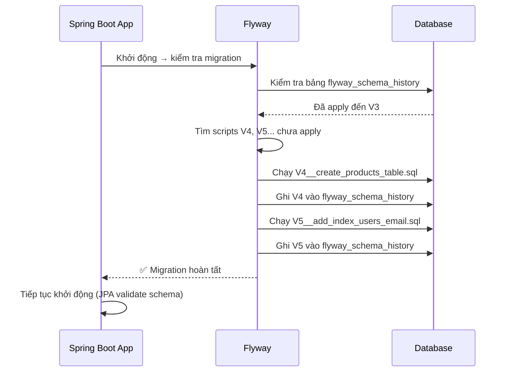

> [!TIP]
> **Flyway vs Liquibase:** Cả hai đều là database migration tool. Flyway dùng SQL thuần (dễ học), Liquibase dùng XML/YAML/JSON (database-agnostic, mạnh hơn). Đa số dự án Java chọn **Flyway** vì đơn giản và Spring Boot hỗ trợ sẵn.

### 💻 Thực hành

- Thêm `flyway-core` dependency
- Xóa `ddl-auto=update`, chuyển sang `ddl-auto=validate`
- Viết các migration scripts cho toàn bộ Entity đã tạo
- Chạy ứng dụng, kiểm tra bảng `flyway_schema_history`

---
---

# 🧪 GIAI ĐOẠN 4: TESTING

> **Mục tiêu giai đoạn:** Viết test chuyên nghiệp cho từng tầng của ứng dụng. Testing xuất hiện ở đây — ngay sau khi bạn đã có đủ Service, Controller, và JPA — để bạn viết test cho những gì đã xây dựng trước khi tiếp tục thêm feature mới.

---

## 📘 Bài 14: Unit Test với JUnit 5 & Mockito

### 🎯 Mục tiêu bài học
- [ ] Hiểu Test Pyramid và chiến lược testing
- [ ] Viết Unit Test cho Service layer với JUnit 5 + Mockito
- [ ] Viết API Test cho Controller layer với `@WebMvcTest` và `MockMvc`
- [ ] Hiểu Given-When-Then pattern (Arrange-Act-Assert)

### 📖 Nội dung lý thuyết

#### 14.1. Test Pyramid

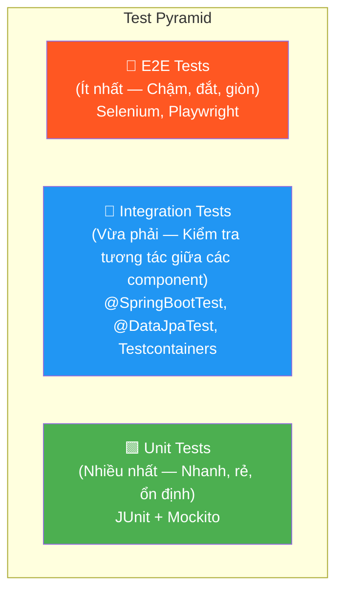

#### 14.2. Unit Test Service Layer

```java
@ExtendWith(MockitoExtension.class)
class UserServiceTest {

    @Mock  // Tạo mock object (giả lập, không gọi DB thật)
    private UserRepository userRepository;

    @InjectMocks  // Tạo instance thật, inject mock vào
    private UserService userService;

    @Test
    @DisplayName("Khi tìm user theo ID tồn tại → trả về UserResponse")
    void getUserById_WhenUserExists_ReturnsUser() {
        // Given (Arrange) — Chuẩn bị dữ liệu
        User user = new User(1L, "Test", "test@gmail.com");
        when(userRepository.findById(1L)).thenReturn(Optional.of(user));

        // When (Act) — Thực hiện hành động
        UserResponse result = userService.getUserById(1L);

        // Then (Assert) — Kiểm tra kết quả
        assertNotNull(result);
        assertEquals("Test", result.getName());
        assertEquals("test@gmail.com", result.getEmail());
        verify(userRepository, times(1)).findById(1L);  // verify mock được gọi
    }

    @Test
    @DisplayName("Khi tìm user theo ID không tồn tại → throw exception")
    void getUserById_WhenUserNotFound_ThrowsException() {
        // Given
        when(userRepository.findById(99L)).thenReturn(Optional.empty());

        // When & Then
        ResourceNotFoundException exception = assertThrows(
            ResourceNotFoundException.class,
            () -> userService.getUserById(99L)
        );
        assertTrue(exception.getMessage().contains("99"));
    }

    @Test
    @DisplayName("Tạo user với email hợp lệ → trả về user đã lưu")
    void createUser_WithValidRequest_ReturnsCreatedUser() {
        // Given
        UserCreateRequest request = new UserCreateRequest("New User", "new@gmail.com", "Pass123!");
        User savedUser = new User(1L, "New User", "new@gmail.com");
        when(userRepository.existsByEmail("new@gmail.com")).thenReturn(false);
        when(userRepository.save(any(User.class))).thenReturn(savedUser);

        // When
        UserResponse result = userService.createUser(request);

        // Then
        assertNotNull(result);
        assertEquals("New User", result.getName());
        verify(userRepository).save(any(User.class));
    }
}
```

#### 14.3. Test Controller Layer với `@WebMvcTest`

```java
@WebMvcTest(UserController.class)  // Chỉ load Controller layer, không load Service/Repo
class UserControllerTest {

    @Autowired
    private MockMvc mockMvc;  // Giả lập HTTP request mà không cần server thật

    @MockBean  // Tạo mock bean trong Spring Context
    private UserService userService;

    @Test
    @DisplayName("GET /api/users → 200 OK với danh sách users")
    void getAllUsers_ReturnsListOfUsers() throws Exception {
        // Given
        List<UserResponse> users = List.of(
            new UserResponse(1L, "User A", "a@gmail.com", LocalDateTime.now()),
            new UserResponse(2L, "User B", "b@gmail.com", LocalDateTime.now())
        );
        when(userService.getAllUsers()).thenReturn(users);

        // When & Then
        mockMvc.perform(get("/api/users")
                .contentType(MediaType.APPLICATION_JSON))
            .andExpect(status().isOk())
            .andExpect(jsonPath("$", hasSize(2)))
            .andExpect(jsonPath("$[0].name").value("User A"))
            .andExpect(jsonPath("$[1].name").value("User B"));
    }

    @Test
    @DisplayName("POST /api/users với body không hợp lệ → 400 Bad Request")
    void createUser_WithInvalidBody_Returns400() throws Exception {
        // Given — gửi body thiếu email
        String invalidJson = """
            {"name": "", "email": "", "password": "short"}
            """;

        // When & Then
        mockMvc.perform(post("/api/users")
                .contentType(MediaType.APPLICATION_JSON)
                .content(invalidJson))
            .andExpect(status().isBadRequest());
    }
}
```

### 💻 Thực hành

Viết đầy đủ Unit Test cho UserService và UserController đã xây dựng. Target: **coverage >= 80%**.

---

## 📘 Bài 15: Integration Test với `@SpringBootTest` & Testcontainers

### 🎯 Mục tiêu bài học
- [ ] Viết Integration Test cho Repository layer với `@DataJpaTest`
- [ ] Viết full Integration Test với `@SpringBootTest`
- [ ] Sử dụng **Testcontainers** để test với database thật (PostgreSQL/MySQL container)
- [ ] Hiểu `@ServiceConnection` (Spring Boot 3.1+) cho Testcontainers

### 📖 Nội dung lý thuyết

#### 15.1. `@DataJpaTest` — Test Repository Layer

```java
@DataJpaTest  // Chỉ load JPA-related beans (Entity, Repository)
              // Mặc định dùng embedded H2, rollback sau mỗi test
class UserRepositoryTest {

    @Autowired
    private UserRepository userRepository;

    @Test
    void findByEmail_WhenEmailExists_ReturnsUser() {
        // Given
        User user = new User(null, "Test", "test@gmail.com");
        userRepository.save(user);

        // When
        Optional<User> found = userRepository.findByEmail("test@gmail.com");

        // Then
        assertTrue(found.isPresent());
        assertEquals("Test", found.get().getName());
    }
}
```

#### 15.2. Testcontainers — Test với Database thật

> [!IMPORTANT]
> **Tại sao cần Testcontainers?** Test với H2 có thể pass nhưng với PostgreSQL/MySQL lại fail do khác biệt SQL dialect. Testcontainers khởi động một **Docker container database thật** để test, đảm bảo test gần giống production nhất.

```java
// === Cấu hình base class cho tất cả integration test ===
@SpringBootTest(webEnvironment = SpringBootTest.WebEnvironment.RANDOM_PORT)
@Testcontainers
abstract class BaseIntegrationTest {

    @Container
    @ServiceConnection  // Spring Boot 3.1+ tự động cấu hình datasource từ container
    static PostgreSQLContainer<?> postgres = new PostgreSQLContainer<>("postgres:16-alpine");
}

// === Integration Test ===
class UserIntegrationTest extends BaseIntegrationTest {

    @Autowired
    private TestRestTemplate restTemplate;  // HTTP client cho test

    @Autowired
    private UserRepository userRepository;

    @BeforeEach
    void setUp() {
        userRepository.deleteAll();
    }

    @Test
    @DisplayName("Full flow: tạo user → lấy user → kiểm tra DB")
    void createAndGetUser_FullFlow() {
        // 1. Tạo user qua API
        UserCreateRequest request = new UserCreateRequest("Test", "test@gmail.com", "Pass123!");
        ResponseEntity<UserResponse> createResponse = restTemplate
            .postForEntity("/api/users", request, UserResponse.class);

        assertEquals(HttpStatus.CREATED, createResponse.getStatusCode());
        assertNotNull(createResponse.getBody().getId());

        // 2. Lấy user qua API
        Long userId = createResponse.getBody().getId();
        ResponseEntity<UserResponse> getResponse = restTemplate
            .getForEntity("/api/users/" + userId, UserResponse.class);

        assertEquals(HttpStatus.OK, getResponse.getStatusCode());
        assertEquals("Test", getResponse.getBody().getName());

        // 3. Kiểm tra database
        assertEquals(1, userRepository.count());
    }
}
```

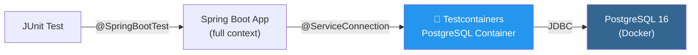

#### 15.3. So sánh các loại Test Annotation

| Annotation | Load gì? | Tốc độ | Dùng khi |
|:---|:---|:---|:---|
| `@ExtendWith(MockitoExtension.class)` | Không load Spring | ⚡ Rất nhanh | Test Service, logic thuần |
| `@WebMvcTest` | Chỉ MVC layer | 🔵 Nhanh | Test Controller, filter |
| `@DataJpaTest` | Chỉ JPA layer | 🟡 Vừa | Test Repository, query |
| `@SpringBootTest` | Toàn bộ context | 🔴 Chậm | Integration test, full flow |

### 💻 Thực hành

- Thêm Testcontainers dependencies
- Tạo `BaseIntegrationTest` với `@ServiceConnection`
- Viết integration test cho User flow (create → get → update → delete)
- Chạy test, xem Docker container tự khởi động và dọn dẹp

---
---

# 🟠 GIAI ĐOẠN 5: GỌI EXTERNAL API & AOP

> **Mục tiêu giai đoạn:** Học cách gọi API bên ngoài (kỹ năng backend thực tế), và hiểu AOP — kỹ thuật tách cross-cutting concerns.

---

## 📘 Bài 16: Gọi External API — RestClient, WebClient & HTTP Service Client

### 🎯 Mục tiêu bài học
- [ ] Phân biệt RestClient (sync), WebClient (async), và HTTP Service Client (declarative)
- [ ] Sử dụng `RestClient` (Spring 6.1+) — thay thế `RestTemplate`
- [ ] Sử dụng `WebClient` cho non-blocking calls
- [ ] Hiểu HTTP Service Client (Spring Boot 3.2+) — khai báo interface, Spring tự tạo implementation
- [ ] Xử lý error, timeout, retry khi gọi API bên ngoài

### 📖 Nội dung lý thuyết

#### 16.1. Các cách gọi External API trong Spring

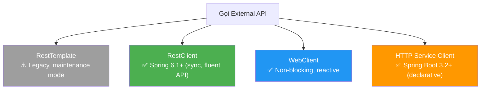

| Cách | Từ phiên bản | Kiểu | Khi nào dùng |
|:---|:---|:---|:---|
| `RestTemplate` | Spring 3.0 | Sync, blocking | ⚠️ Legacy — tránh dùng cho project mới |
| `RestClient` | Spring 6.1 / Boot 3.2 | Sync, fluent API | ✅ Mặc định cho sync calls |
| `WebClient` | Spring 5.0 | Async, non-blocking | ✅ Cần reactive/async |
| HTTP Service Client | Spring 6.0 / Boot 3.0 | Declarative | ✅ Gọi API như gọi method |

#### 16.2. RestClient (Khuyến nghị cho sync calls)

```java
@Configuration
public class ApiClientConfig {

    @Bean
    public RestClient restClient(RestClient.Builder builder) {
        return builder
            .baseUrl("https://jsonplaceholder.typicode.com")
            .defaultHeader(HttpHeaders.CONTENT_TYPE, MediaType.APPLICATION_JSON_VALUE)
            .build();
    }
}

@Service
public class PostApiClient {
    private final RestClient restClient;

    public PostApiClient(RestClient restClient) {
        this.restClient = restClient;
    }

    public List<Post> getAllPosts() {
        return restClient.get()
            .uri("/posts")
            .retrieve()
            .body(new ParameterizedTypeReference<List<Post>>() {});
    }

    public Post getPostById(Long id) {
        return restClient.get()
            .uri("/posts/{id}", id)
            .retrieve()
            .onStatus(HttpStatusCode::is4xxClientError, (request, response) -> {
                throw new ResourceNotFoundException("Post", id);
            })
            .body(Post.class);
    }

    public Post createPost(Post post) {
        return restClient.post()
            .uri("/posts")
            .body(post)
            .retrieve()
            .body(Post.class);
    }
}
```

#### 16.3. HTTP Service Client (Declarative — Spring Boot 3.2+)

```java
// Chỉ cần khai báo interface — Spring tự tạo implementation!
public interface PostApiService {

    @GetExchange("/posts")
    List<Post> getAllPosts();

    @GetExchange("/posts/{id}")
    Post getPostById(@PathVariable Long id);

    @PostExchange("/posts")
    Post createPost(@RequestBody Post post);

    @DeleteExchange("/posts/{id}")
    void deletePost(@PathVariable Long id);
}

// Đăng ký bean
@Configuration
public class ApiClientConfig {
    @Bean
    public PostApiService postApiService(RestClient.Builder builder) {
        RestClient restClient = builder.baseUrl("https://jsonplaceholder.typicode.com").build();
        RestClientAdapter adapter = RestClientAdapter.create(restClient);
        HttpServiceProxyFactory factory = HttpServiceProxyFactory.builderFor(adapter).build();
        return factory.createClient(PostApiService.class);
    }
}

// Sử dụng — gọi API bên ngoài như gọi method thường!
@Service
public class PostService {
    private final PostApiService postApiService;

    public PostService(PostApiService postApiService) {
        this.postApiService = postApiService;
    }

    public List<Post> fetchExternalPosts() {
        return postApiService.getAllPosts();
    }
}
```

> [!TIP]
> **HTTP Service Client giống Spring Data JPA cho API!** Bạn khai báo interface, Spring tự tạo proxy implementation — tương tự cách JpaRepository tự tạo SQL từ method name. Đây là hướng đi mà Spring Boot 4 đẩy mạnh.

### 💻 Thực hành

- Dùng `RestClient` gọi JSONPlaceholder API (https://jsonplaceholder.typicode.com)
- Tạo `PostApiService` declarative với HTTP Service Client
- So sánh code giữa 2 cách
- Xử lý timeout và error handling

---

## 📘 Bài 17: AOP (Aspect-Oriented Programming)

### 🎯 Mục tiêu bài học
- [ ] Hiểu bản chất AOP và tại sao cần tách cross-cutting concerns
- [ ] Nắm các khái niệm: Aspect, Advice, Pointcut, JoinPoint
- [ ] Triển khai logging, performance monitoring bằng AOP
- [ ] Hiểu cơ chế Proxy của Spring AOP (và tại sao self-invocation không hoạt động — liên hệ Bài 12)

### 📖 Nội dung lý thuyết

#### 17.1. Cross-Cutting Concerns — Vấn đề AOP giải quyết

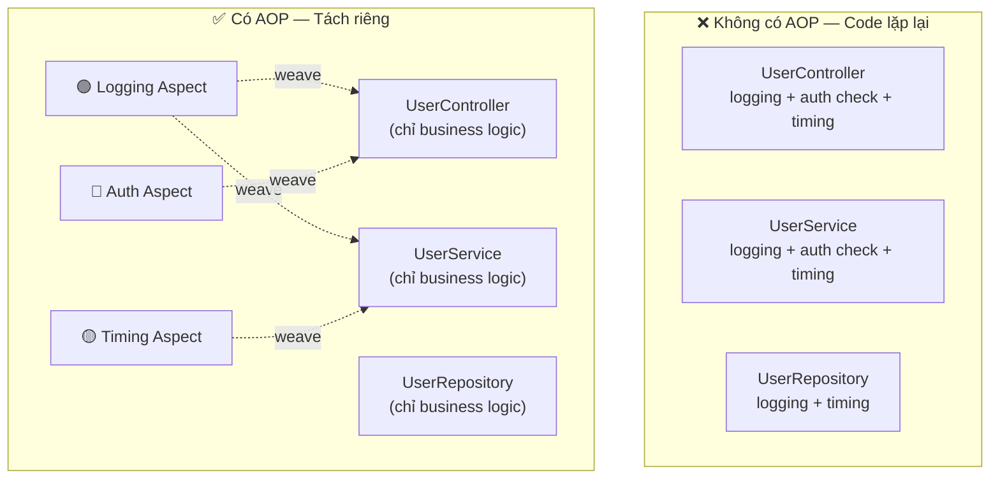

#### 17.2. Các khái niệm cốt lõi

| Khái niệm | Ý nghĩa | Ví dụ |
|:---|:---|:---|
| **Aspect** | Module chứa cross-cutting logic | `LoggingAspect`, `SecurityAspect` |
| **Advice** | Hành động thực hiện (When) | `@Before`, `@After`, `@Around` |
| **Pointcut** | Nơi áp dụng (Where) | "Tất cả method trong package service" |
| **JoinPoint** | Điểm cụ thể trong code | Method `userService.createUser()` |

#### 17.3. Các loại Advice

| Advice | Thời điểm | Use case |
|:---|:---|:---|
| `@Before` | Trước khi method chạy | Logging input, permission check |
| `@After` | Sau khi method chạy (dù thành công hay lỗi) | Cleanup |
| `@AfterReturning` | Sau khi method thành công | Logging output |
| `@AfterThrowing` | Sau khi method throw exception | Error logging |
| `@Around` | Bọc quanh method (trước + sau) | Performance timing, caching |

```java
@Aspect
@Component
public class LoggingAspect {

    private static final Logger log = LoggerFactory.getLogger(LoggingAspect.class);

    // Pointcut: áp dụng cho tất cả method trong package service
    @Around("execution(* com.example.demo.service.*.*(..))")
    public Object logExecutionTime(ProceedingJoinPoint joinPoint) throws Throwable {
        String methodName = joinPoint.getSignature().toShortString();
        Object[] args = joinPoint.getArgs();
        log.info("▶ Calling: {} with args: {}", methodName, Arrays.toString(args));

        long start = System.currentTimeMillis();
        try {
            Object result = joinPoint.proceed();  // Gọi method thật
            long elapsed = System.currentTimeMillis() - start;
            log.info("◀ Completed: {} — {}ms", methodName, elapsed);
            return result;
        } catch (Exception ex) {
            long elapsed = System.currentTimeMillis() - start;
            log.error("💥 Failed: {} — {}ms — Error: {}", methodName, elapsed, ex.getMessage());
            throw ex;
        }
    }
}

// Custom annotation + AOP
@Target(ElementType.METHOD)
@Retention(RetentionPolicy.RUNTIME)
public @interface Audited {
    String action() default "";
}

@Aspect
@Component
public class AuditAspect {
    @Around("@annotation(audited)")
    public Object audit(ProceedingJoinPoint joinPoint, Audited audited) throws Throwable {
        log.info("📋 AUDIT: {} — User: {}", audited.action(), getCurrentUser());
        return joinPoint.proceed();
    }
}

// Sử dụng
@Service
public class UserService {
    @Audited(action = "DELETE_USER")
    public void deleteUser(Long id) { ... }
}
```

#### 17.4. Spring AOP Proxy Mechanism

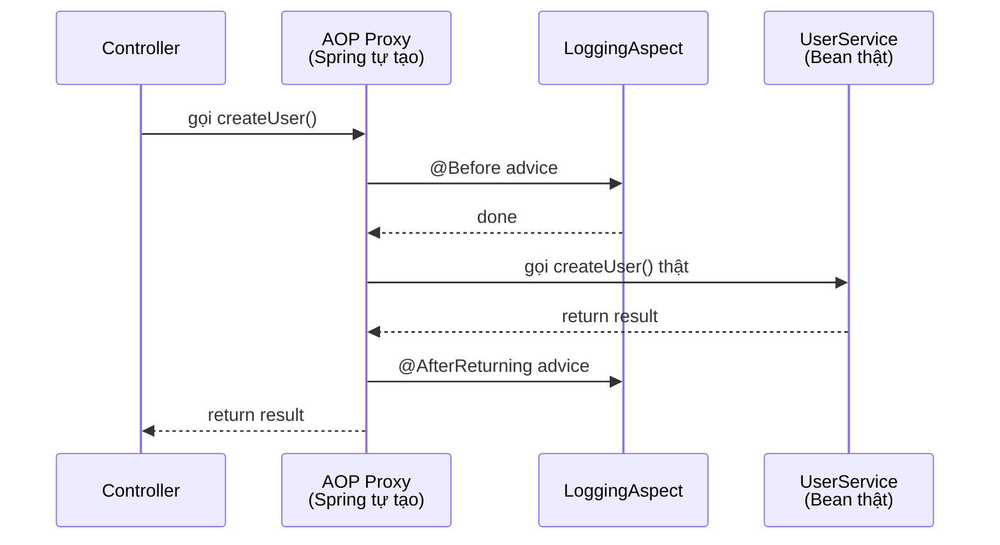

> [!IMPORTANT]
> **Proxy là cơ chế nền tảng** cho cả AOP và `@Transactional`. Khi bạn inject một bean có `@Transactional` hoặc AOP advice, Spring inject một **Proxy** bọc ngoài bean thật. Đây chính là lý do **self-invocation** (gọi method nội bộ trong cùng class bằng `this.method()`) bypass proxy — vì `this` trỏ tới bean thật, không phải proxy. Hiểu điều này giải thích tại sao `@Transactional` trong Bài 12 cũng bị ảnh hưởng.

### 💻 Thực hành

- Tạo `LoggingAspect` (log tất cả service method) và `PerformanceAspect` (đo thời gian)
- Tạo custom annotation `@Audited` + AOP aspect
- Demo self-invocation problem

---
---

# 🔴 GIAI ĐOẠN 6: SECURITY & AUTHENTICATION

> **Mục tiêu giai đoạn:** Bảo mật ứng dụng với Spring Security — từ tự viết JWT filter (để hiểu cơ chế) đến sử dụng OAuth2 Resource Server chuẩn công nghiệp.

---

## 📘 Bài 18: Spring Security Fundamentals

### 🎯 Mục tiêu bài học
- [ ] Hiểu kiến trúc Spring Security và Security Filter Chain
- [ ] Cấu hình `SecurityFilterChain` cơ bản
- [ ] Hiểu Authentication vs Authorization
- [ ] Password Encoding với BCrypt
- [ ] Implement `UserDetailsService` để load user từ database

### 📖 Nội dung lý thuyết

#### 18.1. Security Filter Chain

```mermaid
graph TD
    Request["HTTP Request"]
    FC["Security Filter Chain"]
    F1["CorsFilter"]
    F2["CsrfFilter"]
    F3["Authentication Filter<br/>(xác thực: bạn là ai?)"]
    F4["AuthorizationFilter<br/>(phân quyền: bạn có quyền gì?)"]
    DS["DispatcherServlet<br/>(→ Controller)"]

    Request --> FC
    FC --> F1 --> F2 --> F3 --> F4
    F4 -->|"✅ Authenticated & Authorized"| DS
    F3 -->|"❌ 401 Unauthorized"| Reject1["Reject"]
    F4 -->|"❌ 403 Forbidden"| Reject2["Reject"]
```

```java
@Configuration
@EnableWebSecurity
public class SecurityConfig {

    @Bean
    public SecurityFilterChain securityFilterChain(HttpSecurity http) throws Exception {
        return http
            .csrf(csrf -> csrf.disable())  // Tắt CSRF cho REST API (stateless)
            .authorizeHttpRequests(auth -> auth
                .requestMatchers("/api/auth/**").permitAll()    // Public endpoints
                .requestMatchers("/api/admin/**").hasRole("ADMIN")
                .anyRequest().authenticated()                   // Còn lại phải login
            )
            .sessionManagement(session ->
                session.sessionCreationPolicy(SessionCreationPolicy.STATELESS)
            )
            .build();
    }

    @Bean
    public PasswordEncoder passwordEncoder() {
        return new BCryptPasswordEncoder();
    }
}
```

| Khái niệm | Ý nghĩa |
|:---|:---|
| **Authentication** | Xác thực — "Bạn là AI?" (Login) |
| **Authorization** | Phân quyền — "Bạn có quyền gì?" (Role/Permission) |
| **SecurityFilterChain** | Chuỗi các filter xử lý security theo thứ tự |
| **UserDetailsService** | Interface để Spring Security load thông tin user từ database |
| **PasswordEncoder** | Mã hóa và verify password (BCrypt) |

### 💻 Thực hành

Cấu hình Spring Security cơ bản, tạo User entity với password BCrypt, implement `UserDetailsService`.

---

## 📘 Bài 19: JWT Authentication — Tự Viết Để Hiểu Cơ Chế

### 🎯 Mục tiêu bài học
- [ ] Hiểu JWT (JSON Web Token) là gì và cấu trúc của nó
- [ ] Triển khai Login API trả về JWT token
- [ ] Tạo JWT Filter để xác thực request
- [ ] Implement Refresh Token mechanism
- [ ] Thiết kế User-Role-Permission model (RBAC)

### 📖 Nội dung lý thuyết

#### 19.1. Cấu trúc JWT

```
eyJhbGciOiJIUzI1NiJ9.eyJzdWIiOiJ1c2VyQGdtYWlsLmNvbSIsImlhdCI6MTY5...
|_____HEADER______|._________PAYLOAD_________|.______SIGNATURE______|
```

| Phần | Nội dung |
|:---|:---|
| **Header** | Algorithm (HS256), Token type (JWT) |
| **Payload** | Claims: subject (user email), issuedAt, expiration, roles |
| **Signature** | HMAC-SHA256(base64(header) + "." + base64(payload), secretKey) |

#### 19.2. Luồng JWT Authentication

```mermaid
sequenceDiagram
    participant Client
    participant JWTFilter as JWT Filter
    participant Controller
    participant JWTService as JWT Service
    participant DB

    Note over Client,DB: === ĐĂNG NHẬP ===
    Client->>Controller: POST /api/auth/login<br/>{email, password}
    Controller->>DB: Kiểm tra credentials
    DB-->>Controller: User valid ✅
    Controller->>JWTService: generateToken(user)
    JWTService-->>Client: {accessToken, refreshToken}

    Note over Client,DB: === GỌI API ===
    Client->>JWTFilter: GET /api/users<br/>Header: Authorization: Bearer <token>
    JWTFilter->>JWTService: validateToken(token)
    JWTService-->>JWTFilter: Valid ✅, user info
    JWTFilter->>Controller: Request với Authentication
    Controller-->>Client: Response data
```

#### 19.3. Role-Based Access Control (RBAC)

```mermaid
erDiagram
    USER ||--o{ USER_ROLE : "has"
    ROLE ||--o{ USER_ROLE : "assigned to"
    ROLE ||--o{ ROLE_PERMISSION : "has"
    PERMISSION ||--o{ ROLE_PERMISSION : "assigned to"

    USER {
        Long id
        String email
        String password
    }
    ROLE {
        Long id
        String name
    }
    PERMISSION {
        Long id
        String name
    }
```

```java
@Service
public class AdminService {

    @PreAuthorize("hasRole('ADMIN')")
    public void deleteUser(Long id) { }

    @PreAuthorize("#userId == authentication.principal.id or hasRole('ADMIN')")
    public UserResponse getUser(Long userId) { }
}
```

### 💻 Thực hành

Triển khai đầy đủ: Register → Login → JWT Token → Authenticated API calls → Refresh Token → RBAC.

> [!NOTE]
> **Bài này bạn tự viết JWT filter từ đầu** để hiểu trọn vẹn cơ chế hoạt động. Bài tiếp theo sẽ học cách dùng **OAuth2 Resource Server** — cách chuẩn của Spring Security — thay thế filter tự viết.

---

## 📘 Bài 20: OAuth2 Resource Server & Các Khái Niệm OAuth2/OIDC

### 🎯 Mục tiêu bài học
- [ ] Hiểu tại sao không nên tự viết JWT filter trong mọi project production (so sánh với Bài 19)
- [ ] Sử dụng `spring-boot-starter-oauth2-resource-server` với `JwtDecoder`
- [ ] Hiểu các khái niệm OAuth2: Authorization Server, Resource Server, Client
- [ ] Hiểu OpenID Connect (OIDC) và ID Token
- [ ] Biết khi nào tự viết JWT vs khi nào dùng OAuth2 Provider (Keycloak, Auth0, Google)

### 📖 Nội dung lý thuyết

#### 20.1. Tại sao cần OAuth2 Resource Server?

| | Tự viết JWT Filter (Bài 19) | OAuth2 Resource Server |
|:---|:---|:---|
| **Ưu điểm** | Hiểu sâu cơ chế | Chuẩn hóa, bảo mật hơn, ít code hơn |
| **Nhược điểm** | Phải tự xử lý: validate, extract claims, error handling | Cần hiểu OAuth2 concepts |
| **Dùng khi** | Học tập, project nhỏ | Production, enterprise |

#### 20.2. OAuth2 Roles

```mermaid
graph LR
    User["👤 Resource Owner<br/>(End User)"]
    Client["📱 Client App<br/>(Frontend/Mobile)"]
    AuthServer["🔐 Authorization Server<br/>(Keycloak, Auth0, Google)"]
    ResServer["🖥️ Resource Server<br/>(Your Spring Boot API)"]

    User -->|"1. Login"| Client
    Client -->|"2. Request token"| AuthServer
    AuthServer -->|"3. Return JWT"| Client
    Client -->|"4. API call + Bearer JWT"| ResServer
    ResServer -->|"5. Validate JWT"| AuthServer
    ResServer -->|"6. Return data"| Client
```

| Role | Ý nghĩa | Ví dụ |
|:---|:---|:---|
| **Resource Owner** | Người sở hữu dữ liệu | End user |
| **Client** | App muốn truy cập dữ liệu | React app, Mobile app |
| **Authorization Server** | Phát hành & quản lý token | Keycloak, Auth0, Google |
| **Resource Server** | API bảo vệ tài nguyên | **Your Spring Boot app** |

#### 20.3. Cấu hình OAuth2 Resource Server

```java
@Configuration
@EnableWebSecurity
public class SecurityConfig {

    @Bean
    public SecurityFilterChain securityFilterChain(HttpSecurity http) throws Exception {
        return http
            .authorizeHttpRequests(auth -> auth
                .requestMatchers("/api/public/**").permitAll()
                .anyRequest().authenticated()
            )
            .oauth2ResourceServer(oauth2 -> oauth2
                .jwt(jwt -> jwt.jwtAuthenticationConverter(jwtAuthConverter()))
            )
            .build();
    }

    // Convert JWT claims → Spring Security authorities
    @Bean
    public JwtAuthenticationConverter jwtAuthConverter() {
        JwtGrantedAuthoritiesConverter converter = new JwtGrantedAuthoritiesConverter();
        converter.setAuthoritiesClaimName("roles");  // Claim chứa roles trong JWT
        converter.setAuthorityPrefix("ROLE_");

        JwtAuthenticationConverter authConverter = new JwtAuthenticationConverter();
        authConverter.setJwtGrantedAuthoritiesConverter(converter);
        return authConverter;
    }
}
```

```properties
# application.properties
# Nếu dùng Keycloak:
spring.security.oauth2.resourceserver.jwt.issuer-uri=http://localhost:8180/realms/myrealm

# Hoặc nếu self-signed JWT (dùng symmetric key):
spring.security.oauth2.resourceserver.jwt.jwk-set-uri=http://localhost:8180/realms/myrealm/protocol/openid-connect/certs
```

#### 20.4. OpenID Connect (OIDC)

> **OAuth2** giải quyết vấn đề **Authorization** (ủy quyền truy cập tài nguyên).
> **OIDC** là layer trên OAuth2, thêm **Authentication** (xác thực danh tính user).
> OIDC giới thiệu **ID Token** — JWT chứa thông tin user (name, email, picture).

### 💻 Thực hành

- Chuyển đổi từ JWT filter tự viết (Bài 19) sang `oauth2-resource-server`
- (Optional) Setup Keycloak bằng Docker, tạo realm, user, role
- Cấu hình Spring Boot app là Resource Server validate JWT từ Keycloak

---
---

# 🟣 GIAI ĐOẠN 7: PRODUCTION-READY

> **Mục tiêu giai đoạn:** Chuẩn bị ứng dụng cho môi trường production — quản lý cấu hình, đóng gói Docker, và giám sát (Observability).

---

## 📘 Bài 21: Profiles, Configuration & Environment Management

### 🎯 Mục tiêu bài học
- [ ] Sử dụng Spring Profiles để quản lý nhiều môi trường (dev, staging, prod)
- [ ] Externalized Configuration và thứ tự ưu tiên
- [ ] `@ConfigurationProperties` — Type-safe configuration
- [ ] Environment variables và secrets management

### 📖 Nội dung lý thuyết

#### 21.1. Cấu trúc đa môi trường với Profiles

```
resources/
├── application.properties           ← Cấu hình chung (shared)
├── application-dev.properties       ← Development (H2, debug log)
├── application-staging.properties   ← Staging
└── application-prod.properties      ← Production (PostgreSQL, info log)
```

#### 21.2. Type-Safe Configuration với `@ConfigurationProperties`

```java
// Type-safe configuration binding
@Component
@ConfigurationProperties(prefix = "app.mail")
public class MailProperties {
    private String host;
    private int port;
    private String username;
    private String password;
    private boolean enabled;
    // Getters, Setters
}
```

**Thứ tự ưu tiên cấu hình (từ cao đến thấp):**

| # | Nguồn | Ví dụ |
|:---:|:---|:---|
| 1 | Command-line arguments | `--server.port=9090` |
| 2 | Environment variables | `SERVER_PORT=9090` |
| 3 | `application-{profile}.properties` | `application-prod.properties` |
| 4 | `application.properties` | `application.properties` |

```bash
# Kích hoạt profile khi chạy
java -jar app.jar --spring.profiles.active=prod

# Hoặc qua environment variable
SPRING_PROFILES_ACTIVE=prod java -jar app.jar
```

### 💻 Thực hành

Tạo cấu hình riêng cho dev (H2 in-memory DB, debug log) và prod (PostgreSQL, info log), switch giữa các profile.

---

## 📘 Bài 22: Docker & Deployment

### 🎯 Mục tiêu bài học
- [ ] Viết `Dockerfile` và multi-stage build cho Spring Boot
- [ ] Sử dụng Docker Compose để chạy app + database + Redis
- [ ] Hiểu Spring Boot layered JAR cho Docker cache tối ưu
- [ ] Deploy checklist

### 📖 Nội dung lý thuyết

#### 22.1. Multi-stage Dockerfile

```dockerfile
# Stage 1: Build
FROM eclipse-temurin:21-jdk AS builder
WORKDIR /app
COPY . .
RUN ./mvnw clean package -DskipTests

# Stage 2: Run (image nhỏ hơn)
FROM eclipse-temurin:21-jre
WORKDIR /app
COPY --from=builder /app/target/*.jar app.jar

# Không chạy với root user
RUN addgroup --system appgroup && adduser --system appuser --ingroup appgroup
USER appuser

EXPOSE 8080
ENTRYPOINT ["java", "-jar", "app.jar"]
```

#### 22.2. Docker Compose

```yaml
# docker-compose.yml
version: '3.8'
services:
  app:
    build: .
    ports:
      - "8080:8080"
    environment:
      - SPRING_PROFILES_ACTIVE=prod
      - SPRING_DATASOURCE_URL=jdbc:postgresql://db:5432/myapp
      - SPRING_DATASOURCE_USERNAME=postgres
      - SPRING_DATASOURCE_PASSWORD=secret
    depends_on:
      db:
        condition: service_healthy

  db:
    image: postgres:16-alpine
    environment:
      POSTGRES_DB: myapp
      POSTGRES_USER: postgres
      POSTGRES_PASSWORD: secret
    ports:
      - "5432:5432"
    volumes:
      - postgres_data:/var/lib/postgresql/data
    healthcheck:
      test: ["CMD-SHELL", "pg_isready -U postgres"]
      interval: 5s
      timeout: 5s
      retries: 5

volumes:
  postgres_data:
```

### 💻 Thực hành

Đóng gói project thành Docker image, chạy với Docker Compose (app + PostgreSQL).

---

## 📘 Bài 23: Observability — Actuator, Metrics, Tracing

### 🎯 Mục tiêu bài học
- [ ] Hiểu 3 trụ cột của Observability: Logging, Metrics, Traces
- [ ] Cấu hình Spring Boot Actuator đúng cách (bảo mật endpoint!)
- [ ] Sử dụng Micrometer để export metrics sang Prometheus
- [ ] Hiểu khái niệm Distributed Tracing và OpenTelemetry
- [ ] Setup Grafana dashboard cơ bản

### 📖 Nội dung lý thuyết

#### 23.1. Ba trụ cột của Observability

```mermaid
graph TD
    OBS["🔭 Observability"]
    L["📝 Logging<br/>(SLF4J + Logback)<br/>Ghi lại sự kiện rời rạc<br/>WHO did WHAT at WHEN"]
    M["📊 Metrics<br/>(Micrometer → Prometheus)<br/>Đo lường số liệu theo thời gian<br/>CPU, Memory, Request count, Latency"]
    T["🔗 Traces<br/>(OpenTelemetry → Jaeger/Zipkin)<br/>Theo dõi 1 request xuyên suốt<br/>nhiều service"]

    OBS --> L
    OBS --> M
    OBS --> T

    style L fill:#4CAF50,color:#fff
    style M fill:#2196F3,color:#fff
    style T fill:#FF9800,color:#fff
```

#### 23.2. Spring Boot Actuator — Cấu hình an toàn

> [!CAUTION]
> **CẢNH BÁO BẢO MẬT:** Nhiều Actuator endpoint chứa **thông tin nhạy cảm** (environment variables, database credentials, system properties). Spring Boot mặc định chỉ expose `/actuator/health` qua HTTP. **KHÔNG BAO GIỜ** expose tất cả endpoint ra internet mà không có bảo mật!

```properties
# ===== CẤU HÌNH AN TOÀN CHO PRODUCTION =====
# Chỉ expose những endpoint thực sự cần
management.endpoints.web.exposure.include=health,info,prometheus,metrics
# KHÔNG bao giờ expose: env, configprops, beans, heapdump ra production
# vì chúng có thể chứa passwords, secrets

# Health endpoint — chỉ show details cho authenticated user
management.endpoint.health.show-details=when-authorized
# KHÔNG dùng: show-details=always trong production!

# Thay đổi base path (tránh bị scan bởi bot)
management.endpoints.web.base-path=/internal/manage

# Bảo vệ actuator bằng Spring Security
# (cấu hình trong SecurityConfig)
```

```java
// Bảo vệ Actuator endpoints
@Bean
public SecurityFilterChain securityFilterChain(HttpSecurity http) throws Exception {
    return http
        .authorizeHttpRequests(auth -> auth
            .requestMatchers("/internal/manage/**").hasRole("ADMIN")  // Chỉ admin
            .requestMatchers("/internal/manage/health").permitAll()    // Health public
            // ...
        )
        .build();
}
```

#### 23.3. Micrometer + Prometheus + Grafana

```mermaid
graph LR
    App["Spring Boot App<br/>+ Micrometer"] -->|"expose /actuator/prometheus"| Prom["Prometheus<br/>(Scrape & Store metrics)"]
    Prom -->|"query"| Graf["Grafana<br/>(Dashboard & Alerts)"]

    style App fill:#4CAF50,color:#fff
    style Prom fill:#E6522C,color:#fff
    style Graf fill:#F46800,color:#fff
```

```properties
# Thêm dependency: micrometer-registry-prometheus
management.endpoints.web.exposure.include=health,prometheus
management.metrics.tags.application=my-app
```

```java
// Custom metric — đếm số user được tạo
@Service
public class UserService {
    private final Counter userCreatedCounter;

    public UserService(MeterRegistry registry, UserRepository repo) {
        this.userCreatedCounter = Counter.builder("users.created.total")
            .description("Total users created")
            .register(registry);
    }

    public UserResponse createUser(UserCreateRequest request) {
        User user = // ... save
        userCreatedCounter.increment();  // Tăng counter
        return UserResponse.fromEntity(user);
    }
}
```

#### 23.4. Distributed Tracing — OpenTelemetry (Khái niệm)

```mermaid
sequenceDiagram
    participant Client
    participant Gateway as API Gateway
    participant UserSvc as User Service
    participant OrderSvc as Order Service
    participant DB as Database

    Note over Client,DB: Trace ID: abc-123 (xuyên suốt tất cả service)

    Client->>Gateway: GET /api/orders (traceId=abc-123, spanId=001)
    Gateway->>UserSvc: GET /users/1 (traceId=abc-123, spanId=002)
    UserSvc->>DB: SELECT * FROM users (traceId=abc-123, spanId=003)
    DB-->>UserSvc: User data
    UserSvc-->>Gateway: User response
    Gateway->>OrderSvc: GET /orders?userId=1 (traceId=abc-123, spanId=004)
    OrderSvc->>DB: SELECT * FROM orders (traceId=abc-123, spanId=005)
    OrderSvc-->>Gateway: Orders
    Gateway-->>Client: Response
```

> Distributed tracing gắn một **Trace ID** xuyên suốt tất cả service mà một request đi qua, giúp bạn debug bottleneck và lỗi trong hệ thống phân tán. Spring Boot hỗ trợ OpenTelemetry qua `micrometer-tracing` + `opentelemetry-exporter`.

### 💻 Thực hành

- Thêm Actuator + Micrometer Prometheus registry
- Chạy Prometheus + Grafana bằng Docker Compose
- Tạo dashboard Grafana hiển thị: request count, response time, JVM memory
- Tạo 1 custom metric (business metric)

---
---

# ⚡ GIAI ĐOẠN 8: KỸ THUẬT NÂNG CAO

> **Mục tiêu giai đoạn:** Nắm các kỹ thuật backend nâng cao: Caching, Async, và Message Queue — nền tảng cho kiến trúc Microservices.

---

## 📘 Bài 24: Caching (Redis) & Async/Scheduling

### 🎯 Mục tiêu bài học
- [ ] Hiểu caching strategy và Spring Cache Abstraction
- [ ] Sử dụng `@Cacheable`, `@CacheEvict`, `@CachePut` với Redis
- [ ] Xử lý bất đồng bộ với `@Async` và `CompletableFuture`
- [ ] Lập lịch tác vụ định kỳ với `@Scheduled`

### 📖 Nội dung lý thuyết

#### 24.1. Spring Cache Abstraction

```java
@Service
public class ProductService {

    @Cacheable(value = "products", key = "#id")  // Cache kết quả theo id
    public Product getProductById(Long id) {
        log.info("Fetching from DB...");  // Chỉ log lần đầu, lần sau lấy từ cache
        return productRepository.findById(id).orElseThrow();
    }

    @CachePut(value = "products", key = "#product.id")  // Cập nhật cache
    public Product updateProduct(Product product) {
        return productRepository.save(product);
    }

    @CacheEvict(value = "products", key = "#id")  // Xóa cache
    public void deleteProduct(Long id) {
        productRepository.deleteById(id);
    }

    @CacheEvict(value = "products", allEntries = true)  // Xóa toàn bộ cache
    public void clearCache() { }
}
```

#### 24.2. Redis Configuration

```properties
# application.properties
spring.data.redis.host=localhost
spring.data.redis.port=6379
spring.cache.type=redis
spring.cache.redis.time-to-live=3600000  # 1 hour
```

#### 24.3. Async Processing

```java
@EnableAsync  // Bật tại Application class
@Configuration
public class AsyncConfig {
    @Bean
    public Executor taskExecutor() {
        ThreadPoolTaskExecutor executor = new ThreadPoolTaskExecutor();
        executor.setCorePoolSize(5);
        executor.setMaxPoolSize(10);
        executor.setQueueCapacity(25);
        executor.setThreadNamePrefix("async-");
        executor.initialize();
        return executor;
    }
}

@Service
public class EmailService {

    @Async  // Chạy trên thread riêng
    public CompletableFuture<Void> sendWelcomeEmail(String email) {
        // Giả lập gửi email mất 3 giây
        Thread.sleep(3000);
        log.info("📧 Email sent to: {}", email);
        return CompletableFuture.completedFuture(null);
    }
}

@Component
public class ScheduledTasks {

    @Scheduled(fixedRate = 60000)  // Chạy mỗi 60 giây
    public void cleanExpiredTokens() {
        log.info("🧹 Cleaning expired tokens...");
    }

    @Scheduled(cron = "0 0 2 * * ?")  // Chạy lúc 2:00 AM mỗi ngày
    public void generateDailyReport() {
        log.info("📊 Generating daily report...");
    }
}
```

> [!NOTE]
> **Kiến thức Java cần biết — `CompletableFuture<T>`:** Là class mạnh mẽ trong Java 8+ để xử lý bất đồng bộ. Cho phép chain operations (`thenApply`, `thenCompose`, `thenAccept`), handle errors (`exceptionally`, `handle`), và kết hợp nhiều future (`allOf`, `anyOf`). Rất hay hỏi trong phỏng vấn!

### 💻 Thực hành

- Setup Redis bằng Docker
- Thêm caching cho Product service, đo performance trước và sau
- Gửi email bất đồng bộ khi tạo user mới
- Tạo scheduled task dọn dẹp expired tokens

---

## 📘 Bài 25: Message Queue — Kafka / RabbitMQ Cơ Bản

### 🎯 Mục tiêu bài học
- [ ] Hiểu khái niệm Message Queue, Event-Driven Architecture
- [ ] Phân biệt Kafka (event streaming) vs RabbitMQ (message broker)
- [ ] Triển khai Producer-Consumer đơn giản với Kafka
- [ ] Hiểu use cases thực tế: decouple services, async processing, event sourcing

### 📖 Nội dung lý thuyết

#### 25.1. Tại sao cần Message Queue?

```mermaid
graph TB
    subgraph sync_bad["❌ Synchronous — Tight Coupling"]
        OrderS["Order Service"]
        OrderS -->|"HTTP call<br/>(block & wait)"| EmailS["Email Service"]
        OrderS -->|"HTTP call<br/>(block & wait)"| InventoryS["Inventory Service"]
        OrderS -->|"HTTP call<br/>(block & wait)"| AnalyticsS["Analytics Service"]
    end

    subgraph async_good["✅ Event-Driven — Loose Coupling"]
        OrderS2["Order Service"]
        MQ["📬 Message Queue<br/>(Kafka / RabbitMQ)"]
        EmailS2["Email Service"]
        InventoryS2["Inventory Service"]
        AnalyticsS2["Analytics Service"]

        OrderS2 -->|"publish event<br/>(fire & forget)"| MQ
        MQ -->|"consume"| EmailS2
        MQ -->|"consume"| InventoryS2
        MQ -->|"consume"| AnalyticsS2
    end
```

#### 25.2. Kafka vs RabbitMQ

| Tiêu chí | Kafka | RabbitMQ |
|:---|:---|:---|
| **Mô hình** | Event streaming / log | Message broker / queue |
| **Lưu trữ** | Lưu message vĩnh viễn (configurable) | Xóa sau khi consumed |
| **Throughput** | Cực cao (millions/s) | Cao (thousands/s) |
| **Use case** | Event sourcing, log aggregation, real-time analytics | Task queue, RPC, notifications |
| **Ordering** | Đảm bảo thứ tự trong partition | Đảm bảo trong queue |

#### 25.3. Spring Kafka — Producer & Consumer

```java
// === Producer ===
@Service
public class OrderEventProducer {
    private final KafkaTemplate<String, OrderEvent> kafkaTemplate;

    public OrderEventProducer(KafkaTemplate<String, OrderEvent> kafkaTemplate) {
        this.kafkaTemplate = kafkaTemplate;
    }

    public void publishOrderCreated(Order order) {
        OrderEvent event = new OrderEvent("ORDER_CREATED", order.getId(), order.getUserId());
        kafkaTemplate.send("order-events", order.getId().toString(), event);
        log.info("📤 Published ORDER_CREATED event for order: {}", order.getId());
    }
}

// === Consumer ===
@Component
public class OrderEventConsumer {

    @KafkaListener(topics = "order-events", groupId = "email-service")
    public void handleOrderCreated(OrderEvent event) {
        if ("ORDER_CREATED".equals(event.getType())) {
            log.info("📥 Received ORDER_CREATED event. Sending email for order: {}", event.getOrderId());
            emailService.sendOrderConfirmation(event.getOrderId());
        }
    }
}
```

### 💻 Thực hành

- Setup Kafka bằng Docker Compose (Kafka + Zookeeper hoặc KRaft)
- Tạo Producer trong Order Service
- Tạo Consumer gửi email notification
- Verify message flow

---

## 📘 Bài 26: Microservices — Khái Niệm & Thực Hành Cơ Bản

### 🎯 Mục tiêu bài học
- [ ] Hiểu kiến trúc Microservices vs Monolith
- [ ] Hiểu các thành phần: API Gateway, Service Discovery, Config Server
- [ ] Hiểu các patterns: Circuit Breaker, Service Mesh, Saga
- [ ] Setup một hệ thống 2-3 microservices đơn giản

### 📖 Nội dung lý thuyết

#### 26.1. Monolith vs Microservices

```mermaid
graph LR
    subgraph monolith["Monolith"]
        direction TB
        M_UI["UI"] --> M_BL["Business Logic"]
        M_BL --> M_DB["Database"]
    end

    subgraph micro["Microservices"]
        direction TB
        GW["API Gateway"]
        US["User Service"] --> DB1["DB"]
        OS["Order Service"] --> DB2["DB"]
        PS["Product Service"] --> DB3["DB"]
        MQ["Message Queue"]

        GW --> US
        GW --> OS
        GW --> PS
        US -.->|"event"| MQ
        MQ -.->|"event"| OS
    end
```

| | Monolith | Microservices |
|:---|:---|:---|
| **Deploy** | 1 artifact | Mỗi service deploy riêng |
| **Scale** | Scale toàn bộ app | Scale từng service |
| **Tech stack** | Đồng nhất | Mỗi service có thể khác |
| **Complexity** | Đơn giản | Phức tạp (network, data consistency) |
| **Khi nào dùng** | Project nhỏ-vừa, team nhỏ | Project lớn, nhiều team |

#### 26.2. Các thành phần chính

| Thành phần | Vai trò | Công cụ |
|:---|:---|:---|
| **API Gateway** | Entry point, routing, auth | Spring Cloud Gateway |
| **Service Discovery** | Đăng ký & tìm service | Eureka, Consul |
| **Config Server** | Quản lý cấu hình tập trung | Spring Cloud Config |
| **Circuit Breaker** | Chống cascade failure | Resilience4j |
| **Message Queue** | Giao tiếp bất đồng bộ | Kafka, RabbitMQ |

#### 26.3. Patterns quan trọng

| Pattern | Vấn đề giải quyết | Liên hệ |
|:---|:---|:---|
| **API Gateway** | Single entry point, cross-cutting (auth, rate limit) | Bài 4 (DispatcherServlet mức microservice) |
| **Circuit Breaker** | Service B down → không cascade sang A | Giống fuse điện — ngắt khi quá tải |
| **Saga** | Distributed transaction | Bài 12 (giới hạn của @Transactional) |
| **Outbox** | Reliable event publishing | Bài 12 (event + database atomicity) |
| **CQRS** | Tách read/write model | Tối ưu cho hệ thống đọc nhiều |

### 💻 Thực hành

- Tách monolith thành 2 microservices: User Service + Order Service
- Giao tiếp qua REST (RestClient) và Kafka
- (Optional) Setup API Gateway với Spring Cloud Gateway
- (Optional) Demo Circuit Breaker với Resilience4j

---
---

# ⚫ GIAI ĐOẠN 9: CAPSTONE PROJECT

> **Mục tiêu giai đoạn:** Áp dụng toàn bộ kiến thức đã học để xây dựng 1 project hoàn chỉnh từ A đến Z.

---

## 📘 Bài 27: Thiết Kế & Kiến Trúc Dự Án

### 🎯 Mục tiêu bài học
- [ ] Phân tích yêu cầu và thiết kế database (ERD)
- [ ] Thiết kế kiến trúc dự án theo layer pattern
- [ ] Tạo project skeleton, Flyway migrations, và cấu hình ban đầu
- [ ] Lên danh sách API endpoints (API Documentation)

### Gợi ý đề tài Capstone

| Đề tài | Độ phức tạp | Các module chính |
|:---|:---:|:---|
| **E-Commerce API** | ⭐⭐⭐ | User, Product, Cart, Order, Payment, Review |
| **Blog/CMS Platform** | ⭐⭐ | User, Post, Category, Tag, Comment |
| **Task Management (Trello clone)** | ⭐⭐⭐ | User, Board, List, Card, Label, Comment |
| **Online Learning Platform** | ⭐⭐⭐⭐ | User, Course, Lesson, Enrollment, Quiz, Certificate |
| **Quản lý Trung tâm Ngoại ngữ** | ⭐⭐⭐⭐ | Student, Teacher, Course, Class, Schedule, Enrollment, Payment |

### 💻 Thực hành

Chọn 1 đề tài, thiết kế ERD, liệt kê API, tạo project skeleton.

---

## 📘 Bài 28: Triển Khai & Hoàn Thiện Dự Án

### 🎯 Mục tiêu bài học
- [ ] Implement đầy đủ CRUD cho tất cả entities
- [ ] Database Migration với Flyway
- [ ] Authentication (JWT hoặc OAuth2) + Authorization (RBAC)
- [ ] Validation + Exception Handling + Logging
- [ ] Viết Unit Test + Integration Test (Testcontainers)
- [ ] API Documentation với Swagger/OpenAPI (đã học ở Bài 8)
- [ ] Caching (Redis) cho hot data
- [ ] Deploy với Docker Compose
- [ ] Observability (Actuator + Prometheus + Grafana)

### API Documentation với Swagger

```java
// Thêm dependency: springdoc-openapi-starter-webmvc-ui
// Truy cập: http://localhost:8080/swagger-ui.html

@Tag(name = "User Management", description = "API quản lý người dùng")
@RestController
@RequestMapping("/api/users")
public class UserController {

    @Operation(summary = "Lấy danh sách user", description = "Hỗ trợ phân trang và tìm kiếm")
    @ApiResponses({
        @ApiResponse(responseCode = "200", description = "Thành công"),
        @ApiResponse(responseCode = "401", description = "Chưa xác thực")
    })
    @GetMapping
    public Page<UserResponse> getUsers(Pageable pageable) { ... }
}
```

### Production Checklist

- [ ] Tất cả API endpoint có authentication/authorization phù hợp
- [ ] Validation đầu vào đầy đủ
- [ ] Global Exception Handling
- [ ] Logging đủ chi tiết (INFO cho prod, DEBUG cho dev)
- [ ] Database Migration (Flyway) — KHÔNG dùng ddl-auto=update
- [ ] Unit Test coverage >= 70%
- [ ] Integration Test với Testcontainers
- [ ] API Documentation (Swagger/OpenAPI)
- [ ] Docker + Docker Compose
- [ ] Environment-specific configuration (Profiles)
- [ ] Actuator endpoints **được bảo mật** (không expose thông tin nhạy cảm)
- [ ] Metrics (Micrometer + Prometheus)
- [ ] README.md với hướng dẫn setup & chạy

---
---

# 📚 PHỤ LỤC: Kiến Thức Java Nâng Cao Cần Bổ Sung

> Những kiến thức Java vượt ra ngoài "Java Core cơ bản" mà bạn sẽ gặp xuyên suốt lộ trình và phỏng vấn.

| Chủ đề | Gặp ở bài | Tại sao cần |
|:---|:---|:---|
| **Generics** (`<T>`, `<K,V>`) | Bài 2, 5, 9 | Hiểu `List<User>`, `Optional<T>`, `JpaRepository<T, ID>` |
| **Lambda & Functional Interface** | Bài 2, 10, 11 | `.stream()`, `.map()`, `.filter()`, Specification |
| **Stream API** | Bài 2, 10 | Xử lý collection theo phong cách functional |
| **Optional\<T>** | Bài 2, 9 | Tránh `NullPointerException`, best practice từ JPA |
| **Annotations & Reflection** | Bài 3, 6, 8, 17 | Hiểu cách Spring scan và xử lý annotation |
| **Java Records** (JDK 16+) | Bài 5 | Thay thế DTO boilerplate |
| **Sealed Classes** (JDK 17+) | Bài 7 | Thiết kế exception hierarchy |
| **CompletableFuture** | Bài 24 | Async programming |
| **Collections Framework** (deep) | Xuyên suốt | `Map`, `Set`, `List`, `Queue` và khi nào dùng cái nào |
| **Multi-threading basics** | Bài 24 | Thread safety, `synchronized`, `volatile`, `ThreadPool` |
| **Text Blocks** (JDK 13+) | Bài 13, 14 | SQL migration scripts, JSON test data |

---

# 🎯 Checklist Phỏng Vấn Spring Boot

Sau khi hoàn thành lộ trình, bạn cần trả lời được các câu hỏi sau:

| # | Câu hỏi | Bài |
|:---:|:---|:---:|
| 1 | IoC là gì? DI là gì? Có mấy cách inject? Constructor Injection tốt hơn ở điểm nào? | 2 |
| 2 | Bean Scope có những loại nào? Singleton thread-safe không? | 3 |
| 3 | `@Component` vs `@Bean` khác nhau? Stereotype annotation là gì? | 3 |
| 4 | Spring Boot Auto-Configuration hoạt động như thế nào? | 1 |
| 5 | DispatcherServlet là gì? Luồng request đi qua những đâu? | 4 |
| 6 | DTO pattern là gì? Tại sao không trả Entity trực tiếp? | 5 |
| 7 | Swagger/OpenAPI dùng để làm gì? `springdoc-openapi` hoạt động thế nào? | 8 |
| 8 | JPA vs Hibernate vs Spring Data JPA? | 9 |
| 9 | LAZY vs EAGER loading? N+1 problem và cách giải quyết? | 10 |
| 10 | `@Transactional` hoạt động thế nào? Propagation? Self-invocation? | 12 |
| 11 | Giới hạn của `@Transactional` với external API? Distributed transaction? | 12 |
| 12 | Tại sao không dùng `ddl-auto=update` trong production? | 13 |
| 13 | AOP là gì? Proxy mechanism? Cross-cutting concern? | 17 |
| 14 | Spring Security Filter Chain hoạt động ra sao? | 18 |
| 15 | JWT là gì? OAuth2 là gì? Resource Server vs Authorization Server? | 19, 20 |
| 16 | Viết Unit Test cho Service layer như thế nào? Testcontainers là gì? | 14, 15 |
| 17 | Spring Profiles dùng để làm gì? Thứ tự ưu tiên configuration? | 21 |
| 18 | Observability gồm mấy trụ cột? Actuator endpoint nào cần bảo mật? | 23 |
| 19 | Kafka vs RabbitMQ? Khi nào dùng message queue? | 25 |
| 20 | Monolith vs Microservices? Circuit Breaker? Saga pattern? | 26 |

---

> [!NOTE]
> **Cách học hiệu quả nhất:** Sau khi review lộ trình, hãy yêu cầu tôi **bắt đầu dạy bài cụ thể** (ví dụ: "Dạy Bài 1"). Tôi sẽ trình bày lý thuyết đầy đủ kèm code chạy được, sơ đồ trực quan, và bài tập thực hành. Chúng ta sẽ đi qua từng bài một.

## Open Questions

1. **Bạn muốn bắt đầu từ Bài 1 ngay không?**
2. **Database bạn chọn:** PostgreSQL hay MySQL? (Ảnh hưởng từ Bài 9 trở đi)
3. **Capstone project:** Bạn đã có ý tưởng đề tài chưa, hay muốn thảo luận thêm?
